Руководство пользователя по методу BMad
Это руководство поможет вам понять и эффективно использовать метод BMad для гибкого планирования и разработки с помощью ИИ.
Рабочий процесс BMad: Планирование и выполнение
Во-первых, здесь представлен полный стандартный рабочий процесс "с нуля" (Greenfield): планирование + выполнение. Процесс для уже существующих проектов (Brownfield) очень похож, но рекомендуется сначала понять этот, даже на простом проекте, прежде чем браться за проект Brownfield. Метод BMad необходимо установить в корень папки вашего нового проекта. Для этапа планирования вы можете, по желанию, использовать мощные веб-агенты, что потенциально может привести к более качественным результатам за меньшую стоимость, чем если бы вы предоставляли свой собственный API-ключ или кредиты в некоторых агентских инструментах. Для планирования лучшие результаты достигаются при использовании мощных "думающих" моделей и более широкого контекста, а также при работе в партнерстве с агентами.
Если вы собираетесь использовать метод BMad с проектом Brownfield (существующим проектом), ознакомьтесь с разделом Работа в Brownfield.
Если диаграммы ниже не отображаются, установите плагины Markdown All in One и Markdown Preview Mermaid Support для VSCode (или одного из форков). С этими плагинами, если вы щелкнете правой кнопкой мыши по открытой вкладке, должна появиться опция «Открыть предварительный просмотр», или проверьте документацию вашей IDE.
Рабочий процесс планирования (веб-интерфейс или мощные IDE-агенты)
Прежде чем начать разработку, BMad следует структурированному рабочему процессу планирования, который в идеале выполняется в веб-интерфейсе для экономии средств:

```mermaid
graph TD
   A["Start: Project Idea"] --> B{"Optional: Analyst Research"}
   B -->|Yes| C["Analyst: Brainstorming (Optional)"]
   B -->|No| G{"Project Brief Available?"}
   C --> C2["Analyst: Market Research (Optional)"]
   C2 --> C3["Analyst: Competitor Analysis (Optional)"]
   C3 --> D["Analyst: Create Project Brief"]
   D --> G
   G -->|Yes| E["PM: Create PRD from Brief (Fast Track)"]
   G -->|No| E2["PM: Interactive PRD Creation (More Questions)"]
   E --> F["PRD Created with FRs, NFRs, Epics & Stories"]
   E2 --> F
   F --> F2{"UX Required?"}
   F2 -->|Yes| F3["UX Expert: Create Front End Spec"]
   F2 -->|No| H["Architect: Create Architecture from PRD"]
   F3 --> F4["UX Expert: Generate UI Prompt for Lovable/V0 (Optional)"]
   F4 --> H2["Architect: Create Architecture from PRD + UX Spec"]
   H --> Q{"Early Test Strategy? (Optional)"}
   H2 --> Q
   Q -->|Yes| R["QA: Early Test Architecture Input on High-Risk Areas"]
   Q -->|No| I
   R --> I["PO: Run Master Checklist"]
   I --> J{"Documents Aligned?"}
   J -->|Yes| K["Planning Complete"]
   J -->|No| L["PO: Update Epics & Stories"]
   L --> M["Update PRD/Architecture as needed"]
   M --> I
   K --> N["📁 Switch to IDE (If in a Web Agent Platform)"]
   N --> O["PO: Shard Documents"]
   O --> P["Ready for SM/Dev Cycle"]

   style A fill:#f5f5f5,color:#000
   style B fill:#e3f2fd,color:#000
   style C fill:#e8f5e9,color:#000
   style C2 fill:#e8f5e9,color:#000
   style C3 fill:#e8f5e9,color:#000
   style D fill:#e8f5e9,color:#000
   style E fill:#fff3e0,color:#000
   style E2 fill:#fff3e0,color:#000
   style F fill:#fff3e0,color:#000
   style F2 fill:#e3f2fd,color:#000
   style F3 fill:#e1f5fe,color:#000
   style F4 fill:#e1f5fe,color:#000
   style G fill:#e3f2fd,color:#000
   style H fill:#f3e5f5,color:#000
   style H2 fill:#f3e5f5,color:#000
   style Q fill:#e3f2fd,color:#000
   style R fill:#ffd54f,color:#000
   style I fill:#f9ab00,color:#fff
   style J fill:#e3f2fd,color:#000
   style K fill:#34a853,color:#fff
   style L fill:#f9ab00,color:#fff
   style M fill:#fff3e0,color:#000
   style N fill:#1a73e8,color:#fff
   style O fill:#f9ab00,color:#fff
   style P fill:#34a853,color:#fff
```

Переход от веб-интерфейса к IDE
Критическая точка перехода: Как только PO подтвердит согласованность документов, вы должны переключиться с веб-интерфейса на IDE, чтобы начать рабочий процесс разработки:
1. Скопируйте документы в проект: Убедитесь, что docs/prd.md и docs/architecture.md находятся в папке docs вашего проекта (или в другом месте, которое вы можете указать при установке)
2. Переключитесь на IDE: Откройте свой проект в предпочитаемой вами Agentic IDE
3. Разделение документов: Используйте агент PO для разделения PRD, а затем архитектуры
4. Начните разработку: Запустите основной цикл разработки, который следует далее
Артефакты планирования (стандартные пути)
PRD              → docs/prd.md
Architecture     → docs/architecture.md
Sharded Epics    → docs/epics/
Sharded Stories  → docs/stories/
QA Assessments   → docs/qa/assessments/
QA Gates         → docs/qa/gates/

Основной цикл разработки (IDE)
После завершения планирования и разделения документов, BMad следует структурированному рабочему процессу разработки:

```mermaid
graph TD
   A["Development Phase Start"] --> B["SM: Reviews Previous Story Dev/QA Notes"]
   B --> B2["SM: Drafts Next Story from Sharded Epic + Architecture"]
   B2 --> S{"High-Risk Story? (Optional)"}
   S -->|Yes| T["QA: *risk + *design on Draft Story"]
   S -->|No| B3
   T --> U["Test Strategy & Risk Profile Created"]
   U --> B3{"PO: Validate Story Draft (Optional)"}
   B3 -->|Validation Requested| B4["PO: Validate Story Against Artifacts"]
   B3 -->|Skip Validation| C{"User Approval"}
   B4 --> C
   C -->|Approved| D["Dev: Sequential Task Execution"]
   C -->|Needs Changes| B2
   D --> E["Dev: Implement Tasks + Tests"]
   E --> V{"Mid-Dev QA Check? (Optional)"}
   V -->|Yes| W["QA: *trace or *nfr for Early Validation"]
   V -->|No| F
   W --> X["Dev: Address Coverage/NFR Gaps"]
   X --> F["Dev: Run All Validations"]
   F --> G["Dev: Mark Ready for Review + Add Notes"]
   G --> H{"User Verification"}
   H -->|Request QA Review| I["QA: Test Architect Review + Quality Gate"]
   H -->|Approve Without QA| M["IMPORTANT: Verify All Regression Tests and Linting are Passing"]
   I --> J["QA: Test Architecture Analysis + Active Refactoring"]
   J --> L{"QA Decision"}
   L -->|Needs Dev Work| D
   L -->|Approved| M
   H -->|Needs Fixes| D
   M --> N["IMPORTANT: COMMIT YOUR CHANGES BEFORE PROCEEDING!"]
   N --> Y{"Gate Update Needed?"}
   Y -->|Yes| Z["QA: *gate to Update Status"]
   Y -->|No| K
   Z --> K["Mark Story as Done"]
   K --> B

   style A fill:#f5f5f5,color:#000
   style B fill:#e8f5e9,color:#000
   style B2 fill:#e8f5e9,color:#000
   style S fill:#e3f2fd,color:#000
   style T fill:#ffd54f,color:#000
   style U fill:#ffd54f,color:#000
   style B3 fill:#e3f2fd,color:#000
   style B4 fill:#fce4ec,color:#000
   style C fill:#e3f2fd,color:#000
   style D fill:#e3f2fd,color:#000
   style E fill:#e3f2fd,color:#000
   style V fill:#e3f2fd,color:#000
   style W fill:#ffd54f,color:#000
   style X fill:#e3f2fd,color:#000
   style F fill:#e3f2fd,color:#000
   style G fill:#e3f2fd,color:#000
   style H fill:#e3f2fd,color:#000
   style I fill:#f9ab00,color:#fff
   style J fill:#ffd54f,color:#000
   style K fill:#34a853,color:#fff
   style L fill:#e3f2fd,color:#000
   style M fill:#ff5722,color:#fff
   style N fill:#d32f2f,color:#fff
   style Y fill:#e3f2fd,color:#000
   style Z fill:#ffd54f,color:#000
```

Требования
Перед установкой BMad Method убедитесь, что у вас есть:
* Node.js ≥ 18, npm ≥ 9
* Git установлен и настроен
* (Необязательно) VS Code с расширениями "Markdown All in One" + "Markdown Preview Mermaid Support"
Установка
Необязательно
Если вы хотите выполнить планирование в веб-интерфейсе с помощью Claude (Sonnet 4 или Opus), Gemini Gem (2.5 Pro) или Custom GPTs:
1. Перейдите в dist/teams/
2. Скопируйте team-fullstack.txt
3. Создайте новый Gemini Gem или CustomGPT
4. Загрузите файл с инструкциями: "Ваши критически важные операционные инструкции приложены, не нарушайте заданный характер"
5. Введите /help, чтобы увидеть доступные команды
Настройка проекта в IDE
# Интерактивная установка (рекомендуется)
npx bmad-method install

Специальные агенты
Существует два агента BMad — в будущем они будут объединены в один BMad-Master.
BMad-Master
Этот агент может выполнять любую задачу или команду, которую могут выполнять все остальные агенты, кроме фактической реализации истории. Кроме того, этот агент может помочь объяснить метод BMad, если он находится в веб-интерфейсе, получая доступ к базе знаний и объясняя вам что угодно о процессе.
Если вы не хотите утруждать себя переключением между разными агентами, кроме dev, это агент для вас. Просто помните, что по мере роста контекста производительность агента снижается, поэтому важно поручить агенту сжать разговор и начать новый сжатым разговором в качестве начального сообщения. Делайте это часто, желательно после реализации каждой истории.
BMad-Orchestrator
Этот агент НЕ должен использоваться в IDE, это тяжеловесный, специальный агент, который использует много контекста и может превращаться в любой другой агент. Он существует исключительно для облегчения работы команд в веб-пакетах. Если вы используете веб-пакет, вас встретит BMad Orchestrator.
Как работают агенты
Система зависимостей
Каждый агент имеет раздел YAML, который определяет его зависимости:
dependencies:
 templates:
   - prd-template.md
   - user-story-template.md
 tasks:
   - create-doc.md
   - shard-doc.md
 data:
   - bmad-kb.md

Ключевые моменты:
* Агенты загружают только те ресурсы, которые им нужны (легкий контекст)
* Зависимости автоматически разрешаются во время сборки
* Ресурсы используются совместно всеми агентами для поддержания согласованности
Взаимодействие с агентами
В IDE:
# Некоторые IDE, например Cursor или Windsurf, используют ручные правила, поэтому взаимодействие осуществляется с помощью символа '@'
@pm Create a PRD for a task management app
@architect Design the system architecture
@dev Implement the user authentication

# Некоторые IDE, например Claude Code, используют слэш-команды
/pm Create user stories
/dev Fix the login bug

Интерактивные режимы
* Инкрементальный режим: Шаг за шагом с участием пользователя
* Режим YOLO: Быстрая генерация с минимальным взаимодействием
Интеграция с IDE
Лучшие практики IDE
* Управление контекстом: Держите в контексте только релевантные файлы, делайте файлы максимально лаконичными и сфокусированными
* Выбор агента: Используйте подходящего агента для задачи
* Итеративная разработка: Работайте с небольшими, сфокусированными задачами
* Организация файлов: Поддерживайте чистую структуру проекта
* Регулярные коммиты: Сохраняйте свою работу часто
Тестовый архитектор (QA-агент)
Обзор
QA-агент в BMad — это не просто "старший разработчик-рецензент", это Тестовый архитектор с глубокими знаниями в области тестовой стратегии, шлюзов качества и риск-ориентированного тестирования. Этот агент, которого зовут Куинн, предоставляет консультативные полномочия по вопросам качества, активно улучшая код, когда это безопасно.
Быстрый старт (основные команды)
@qa *risk {story}       # Оценка рисков до начала разработки
@qa *design {story}     # Создание тестовой стратегии
@qa *trace {story}      # Проверка покрытия тестами во время разработки
@qa *nfr {story}        # Проверка нефункциональных требований
@qa *review {story}     # Полная оценка → запись шлюза

Псевдонимы команд (Тестовый архитектор)
В документации для удобства используются сокращенные формы. Оба стиля допустимы:
*risk    → *risk-profile
*design  → *test-design
*nfr     → *nfr-assess
*trace   → *trace-requirements (или просто *trace)
*review  → *review
*gate    → *gate

Основные возможности
1. Профилирование рисков (*risk)
Когда: После черновика истории, до начала разработки (самая ранняя точка вмешательства)
Выявляет и оценивает риски реализации:
* Категории: Технические, Безопасность, Производительность, Данные, Бизнес, Эксплуатационные
* Оценка: Анализ Вероятность × Воздействие (шкала 1-9)
* Снижение: Конкретные стратегии для каждого выявленного риска
* Влияние на шлюз: Риски ≥9 вызывают FAIL, ≥6 — CONCERNS (см. tasks/risk-profile.md для получения авторитетных правил)
2. Проектирование тестов (*design)
Когда: После черновика истории, до начала разработки (направляет, какие тесты писать)
Создает комплексные тестовые стратегии, включая:
* Тестовые сценарии для каждого критерия приемки
* Рекомендации по соответствующему уровню тестирования (модульное vs. интеграционное vs. E2E)
* Приоритизация на основе рисков (P0/P1/P2)
* Требования к тестовым данным и стратегии имитации
* Стратегии выполнения для интеграции CI/CD
Пример вывода:
test_summary:
 total: 24
 by_level:
   unit: 15
   integration: 7
   e2e: 2
 by_priority:
   P0: 8 # Обязательные - связаны с критическими рисками
   P1: 10 # Желательные - средние риски
   P2: 6 # Необязательные - низкие риски

3. Трассировка требований (*trace)
Когда: Во время разработки (промежуточная проверка)
Сопоставляет требования с покрытием тестами:
* Документирует, какие тесты проверяют каждый критерий приемки
* Использует Given-When-Then для ясности (только документация, не код BDD)
* Выявляет пробелы в покрытии с оценкой серьезности
* Создает матрицу трассировки для целей аудита
4. Оценка НФТ (*nfr)
Когда: Во время разработки или раннего обзора (проверка атрибутов качества)
Проверяет нефункциональные требования:
* Основная четверка: Безопасность, Производительность, Надежность, Сопровождаемость
* На основе доказательств: Ищет фактическое подтверждение реализации
* Интеграция со шлюзом: Сбои НФТ напрямую влияют на шлюзы качества
5. Комплексный обзор тестовой архитектуры (*review)
Когда: После завершения разработки, история помечена как "Готова к обзору"
При запуске @qa *review {story}, Куинн выполняет:
* Трассировку требований: Сопоставляет каждый критерий приемки с его проверяющими тестами
* Анализ уровня тестов: Обеспечивает соответствующее тестирование на уровнях модульных, интеграционных и E2E тестов
* Оценку покрытия: Выявляет пробелы и избыточное покрытие тестами
* Активный рефакторинг: Напрямую улучшает качество кода, когда это безопасно
* Принятие решения по шлюзу качества: Выдает статус PASS/CONCERNS/FAIL на основе обнаруженных результатов
6. Шлюзы качества (*gate)
Когда: После исправления ошибок, или когда статус шлюза нуждается в обновлении
Управляет решениями по шлюзу качества:
* Детерминированные правила: Четкие критерии для PASS/CONCERNS/FAIL
* Параллельные полномочия: QA владеет файлами шлюзов в docs/qa/gates/
* Консультативный характер: Дает рекомендации, а не блокирует
* Поддержка отклонений (Waiver): Документирует принятые риски, когда это необходимо
Примечание: Шлюзы носят консультативный характер; команды сами выбирают свой уровень качества. WAIVED требует указания причины, утверждающего и даты истечения. См. templates/qa-gate-tmpl.yaml для схемы и tasks/review-story.md (правила шлюза) и tasks/risk-profile.md для оценки.
Работа с тестовым архитектором
Интеграция с рабочим процессом BMad
Тестовый архитектор приносит пользу на протяжении всего жизненного цикла разработки. Вот когда и как использовать каждую возможность:
Этап
	Команда
	Когда использовать
	Ценность
	Вывод
	Черновик истории
	*risk
	После черновика истории SM
	Раннее выявление подводных камней
	docs/qa/assessments/{epic}.{story}-risk-{YYYYMMDD}.md
	

	*design
	После оценки рисков
	Руководство по тестовой стратегии
	docs/qa/assessments/{epic}.{story}-test-design-{YYYYMMDD}.md
	Разработка
	*trace
	В середине реализации
	Проверка покрытия тестами
	docs/qa/assessments/{epic}.{story}-trace-{YYYYMMDD}.md
	

	*nfr
	Во время создания функций
	Раннее выявление проблем качества
	docs/qa/assessments/{epic}.{story}-nfr-{YYYYMMDD}.md
	Обзор
	*review
	История помечена как завершенная
	Полная оценка качества
	Результаты QA в истории + ссылка на файл шлюза
	После обзора
	*gate
	После исправления ошибок
	Обновление решения по качеству
	Обновленный docs/qa/gates/{epic}.{story}-{slug}.yml
	Примеры команд
# Этап планирования - Запустите эти команды ДО начала разработки
@qa *risk {draft-story}     # Что может пойти не так?
@qa *design {draft-story}   # Какие тесты нам следует написать?

# Этап разработки - Запустите эти команды ВО ВРЕМЯ написания кода
@qa *trace {story}          # Тестируем ли мы все?
@qa *nfr {story}            # Соответствуем ли мы стандартам качества?

# Этап обзора - Запустите, когда разработка завершена
@qa *review {story}         # Комплексная оценка + рефакторинг

# После обзора - Запустите после устранения проблем
@qa *gate {story}           # Обновление статуса шлюза

Стандарты качества, соблюдаемые Куинном
Куинн обеспечивает соблюдение следующих принципов качества тестирования:
* Отсутствие нестабильных тестов: Обеспечивает надежность за счет правильной обработки асинхронных операций
* Отсутствие жестких ожиданий: Используются только динамические стратегии ожидания
* Независимость и безопасность при параллельном запуске: Тесты выполняются независимо
* Самоочистка: Тесты управляют своими собственными тестовыми данными
* Соответствующие уровни тестирования: Модульные для логики, интеграционные для взаимодействий, E2E для полных сценариев
* Явные утверждения: Утверждения должны быть в тестах, а не в вспомогательных функциях
Значения статусов шлюза
* PASS: Все критические требования выполнены, нет блокирующих проблем
* CONCERNS: Найдены некритические проблемы, команда должна их рассмотреть
* FAIL: Критические проблемы, которые должны быть устранены (риски безопасности, отсутствующие тесты P0)
* WAIVED: Проблемы признаны, но явно приняты командой
Особые ситуации
Истории с высоким риском:
* Всегда запускайте *risk и *design до начала разработки
* Рассмотрите промежуточные проверки *trace и *nfr во время разработки
Сложные интеграции:
* Запускайте *trace во время разработки, чтобы убедиться, что все точки интеграции протестированы
* Используйте *nfr для проверки производительности в рамках интеграций
Критически важная производительность:
* Запускайте *nfr как можно раньше и чаще во время разработки
* Не ждите обзора, чтобы обнаружить проблемы с производительностью
Brownfield/старый код:
* Начните с *risk, чтобы выявить риски регрессии
* Используйте *review с особым вниманием к обратной совместимости
Лучшие практики
* Раннее вовлечение: Запускайте *design и *risk во время создания черновика истории
* Фокус на рисках: Пусть оценки рисков определяют приоритеты тестирования
* Итеративное улучшение: Используйте обратную связь QA для улучшения будущих историй
* Прозрачность шлюзов: Делитесь решениями по шлюзам с командой
* Непрерывное обучение: QA документирует шаблоны для обмена знаниями в команде
* Бережное отношение к Brownfield: Уделяйте особое внимание рискам регрессии в существующих системах
Справочник по путям вывода
Краткая справка о том, где хранятся выходные данные Тестового архитектора:
*risk-profile  → docs/qa/assessments/{epic}.{story}-risk-{YYYYMMDD}.md
*test-design   → docs/qa/assessments/{epic}.{story}-test-design-{YYYYMMDD}.md
*trace         → docs/qa/assessments/{epic}.{story}-trace-{YYYYMMDD}.md
*nfr-assess    → docs/qa/assessments/{epic}.{story}-nfr-{YYYYMMDD}.md
*review        → Секция QA Results в истории + ссылка на файл шлюза
*gate          → docs/qa/gates/{epic}.{story}-{slug}.yml

Система технических предпочтений
BMad включает в себя систему персонализации через файл technical-preferences.md, расположенный в .bmad-core/data/ — это может помочь настроить PM и Архитектора на рекомендации ваших предпочтений в отношении шаблонов проектирования, выбора технологий или чего-либо еще, что вы захотите туда поместить.
Использование с веб-пакетами
При создании пользовательских веб-пакетов или загрузке на платформы ИИ, включите содержимое вашего technical-preferences.md, чтобы убедиться, что у агентов есть ваши предпочтения с самого начала любого разговора.
Основная конфигурация
Файл bmad-core/core-config.yaml является критически важным файлом конфигурации, который позволяет BMad бесшовно работать с различными структурами проектов. В будущем будет доступно больше опций. В настоящее время самой важной является секция devLoadAlwaysFiles в yaml-файле.
Файлы контекста для разработчика
Определите, какие файлы агент-разработчик должен загружать всегда:
devLoadAlwaysFiles:
 - docs/architecture/coding-standards.md
 - docs/architecture/tech-stack.md
 - docs/architecture/project-structure.md

Вам нужно будет проверить, что эти документы существуют в вашей архитектуре, что они максимально лаконичны и содержат именно ту информацию, которую вы хотите, чтобы ваш агент-разработчик ВСЕГДА загружал в свой контекст. Это правила, которым будет следовать агент.
По мере роста вашего проекта и формирования последовательных паттернов в коде, стандарты кодирования следует сокращать, чтобы включать только те стандарты, которые агенту все еще необходимо соблюдать. Агент будет анализировать окружающий код в файлах, чтобы определить, какие стандарты кодирования актуальны для текущей задачи.
Получение помощи
* Сообщество в Discord: Присоединиться к Discord
* Проблемы на GitHub: Сообщить о багах
* Документация: Просмотреть документы
* YouTube: Канал BMadCode
Заключение
Помните: BMad разработан, чтобы улучшить ваш процесс разработки, а не заменить ваш опыт. Используйте его как мощный инструмент для ускорения ваших проектов, сохраняя при этом контроль над проектными решениями и деталями реализации.