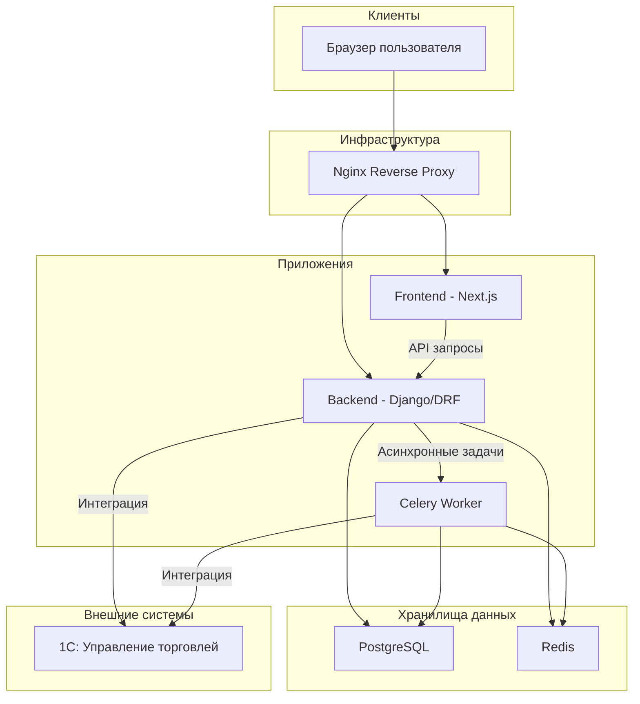

# Архитектура платформы FREESPORT

## 1. Обзор архитектуры

Проект FREESPORT реализован в соответствии с **API-First (Headless)** подходом. Это означает, что backend и frontend являются полностью независимыми приложениями, которые взаимодействуют друг с другом через RESTful API.

- **Backend:** Монолитное приложение на Django, отвечающее за всю бизнес-логику, обработку данных и взаимодействие с базой данных и внешними сервисами (1С).
- **Frontend:** Cовременное веб-приложение на Next.js (React), которое отвечает за пользовательский интерфейс и взаимодействие с API бэкенда.
- **Инфраструктура:** Все сервисы проекта контейнеризированы с помощью Docker и управляются через Docker Compose, что обеспечивает переносимость и консистентность окружения.

## 2. Диаграмма архитектуры

## 3. Структура исходного кода

Проект организован как монорепозиторий со следующей структурой:

- **`/backend`**: Исходный код Django-приложения.
    - **`/apps`**: Основные Django-приложения, разделенные по доменным областям (`users`, `products`, `orders`, `cart` и т.д.).
    - **`/backend`**: Основной конфигурационный модуль Django (`settings.py`, `urls.py`).
    - **`requirements.txt`**: Зависимости Python.
    - **`/tests`**: Директория с тестами для Django-приложений (Pytest). Юнит-тесты располагаются внутри каждого приложения, интеграционные тесты - в этой директории.
- **`/frontend`**: Исходный код Next.js-приложения.
    - **`/src/app`**: Маршрутизация и страницы (используется App Router).
    - **`/src/components`**: Переиспользуемые React-компоненты.
    - **`/src/services`**: Логика взаимодействия с API.
    - **`/src/stores`**: Управление состоянием с помощью Zustand.
    - **`package.json`**: Зависимости JavaScript/TypeScript.
    - **`__tests__`**: Тесты для компонентов и утилит (Jest, Testing Library). Юнит-тесты для компонентов находятся рядом с ними (например, `src/components/__tests__`), а интеграционные тесты - в этой директории.
- **`/docker`**: Конфигурационные файлы Docker и Docker Compose.
- **`/docs`**: Проектная документация.
- **`/scripts`**: Вспомогательные скрипты для автоматизации задач.
- **`/data/import_1c`**: Данные для обмена с 1С.

## 4. Ключевые технические решения

- **Аутентификация:** Используется JWT (JSON Web Tokens) с парой `access` и `refresh` токенов для безопасного взаимодействия с API.
- **Ролевая модель:** В Django реализована гибкая система ролей (`retail`, `wholesale_level1`, `trainer` и т.д.), которая определяет цены, доступный функционал и контент для каждого пользователя.
- **Интеграция с 1С:** Реализована через асинхронные задачи Celery и management-команды Django для импорта каталога, пользователей и синхронизации заказов. Это позволяет избежать блокировки основного веб-процесса во время длительных операций.
- **Кэширование:** Redis используется для кэширования данных, сессий и как брокер сообщений для Celery, что повышает производительность системы.
- **Документация API:** Спецификация API ведется в формате OpenAPI 3 (`api-spec.yaml`) и автоматически генерирует интерактивную документацию (Swagger UI/Redoc), что упрощает разработку и тестирование.