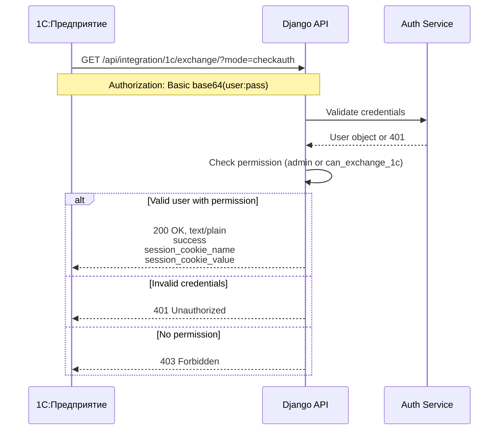

# Story 1.1: Setup 1C Exchange Endpoint & Auth

Status: review

## Story

As a 1C Administrator,
I want the website to accept connection credentials via standard protocol,
so that I can establish a secure session for data transfer.

## Acceptance Criteria

1. **Given** The Django application is running and configured with a 1C technical user
   **When** A GET request is sent to `/api/integration/1c/exchange/` with `?mode=checkauth` and valid Basic Auth headers
   **Then** The response status code should be 200 OK
   **And** The response content-type should be `text/plain`
   **And** The response body must contain exactly:
   ```
   success
   <cookie_name>
   <cookie_value>
   ```
   (three lines, newline-separated)

2. **Given** A request with invalid or missing Basic Auth credentials
   **When** A GET request is sent to `/api/integration/1c/exchange/?mode=checkauth`
   **Then** The response status code should be 401 Unauthorized

3. **Given** A request from unauthorized user (non-admin, no special permission)
   **When** A GET request is sent to the exchange endpoint
   **Then** Access should be denied (403 Forbidden)

## Tasks / Subtasks

- [x] **Task 1: Create 1C Exchange App Structure** (AC: #1, #3)
  - [x] 1.1: Create Django app `apps/integrations/` or extend existing structure
  - [x] 1.2: Create `onec_exchange/` submodule with `__init__.py`
  - [x] 1.3: Add URL routing for `/api/integration/1c/exchange/`

- [x] **Task 2: Implement ExchangeView** (AC: #1, #2)
  - [x] 2.1: Create `ICExchangeView` (APIView from DRF)
  - [x] 2.2: Implement mode routing (`mode` query param dispatcher)
  - [x] 2.3: Implement `handle_checkauth()` method
  - [x] 2.4: Return `text/plain` responses (NOT JSON!)

- [x] **Task 3: Implement Authentication** (AC: #1, #2, #3)
  - [x] 3.1: Create custom `Basic1CAuthentication` class extending DRF's BasicAuthentication
  - [x] 3.2: Generate and return session cookie on successful auth
  - [x] 3.3: Add permission class restricting to admin or `can_exchange_1c` permission

- [x] **Task 4: Write Tests** (AC: #1, #2, #3)
  - [x] 4.1: Test successful auth with valid credentials
  - [x] 4.2: Test 401 on invalid credentials
  - [x] 4.3: Test 403 for unauthorized users
  - [x] 4.4: Verify response format is `text/plain` with correct structure

- [x] **Review Follow-ups (AI)**
  - [x] [AI-Review][High] Fix missing permission definition `can_exchange_1c` in `apps/integrations/models.py` [backend/apps/integrations/models.py]
  - [x] [AI-Review][Medium] Track uncommitted files in git `backend/apps/integrations/onec_exchange/` and `tests/` [git status]
  - [x] [AI-Review][Low] Remove empty `Basic1CAuthentication` class or implement custom logic [backend/apps/integrations/onec_exchange/authentication.py]
  - [x] [AI-Review][Low] Ensure strictly 3 lines in response (remove trailing newline) [backend/apps/integrations/onec_exchange/views.py]

## Dev Notes

### Architecture Patterns

**Response Format (CRITICAL):**
1С ожидает ответы в формате `text/plain`, **НЕ JSON**! Каждое значение на отдельной строке:
```
success
PHPSESSID
abc123xyz
```

**Структура папок проекта:**
```
backend/
  apps/
    integrations/      # Новый модуль или расширение существующего
      onec_exchange/
        __init__.py
        views.py       # ICExchangeView
        urls.py
        authentication.py  # Basic1CAuthentication
        permissions.py     # Is1CExchangeUser
        tests/
          unit/
          integration/
            test_onec_exchange_api.py
```

### Authentication Flow



### Technical Requirements

**Dependencies (existing in project):**
- Django 5.2.7
- Django REST Framework 3.14
- SimpleJWT (но для 1C используем Basic Auth + Session Cookie)

**Settings to add:**
```python
# backend/freesport/settings/base.py or integrations.py
ONEC_EXCHANGE = {
    'SESSION_COOKIE_NAME': 'FREESPORT_1C_SESSION',
    'SESSION_LIFETIME_SECONDS': 3600,  # 1 hour
    'FILE_LIMIT_BYTES': 100 * 1024 * 1024,  # 100MB
    'ZIP_SUPPORT': True,
}
```

**Permission setup:**
```python
# Create custom permission in apps/users or integrations
class Is1CExchangeUser(BasePermission):
    def has_permission(self, request, view):
        return (
            request.user.is_authenticated and 
            (request.user.is_staff or request.user.has_perm('integrations.can_exchange_1c'))
        )
```

### Project Structure Notes

- Existing integrations code lives in `apps/products/management/commands/` for import
- This story creates the **transport layer** - а separate concern from import logic
- Import logic in `apps/products/services/import_1c/` will be triggered by Epic 3

### References

- [Source: docs/prd/1c-http-exchange.md#FR1-FR3] - Endpoint and Auth requirements
- [Source: docs/integrations/1c/architecture.md#2.2] - Service layer abstraction
- [Source: docs/integrations/1c/architecture.md#Appendix-A] - CommerceML structure
- [Protocol: v8.1c.ru](https://v8.1c.ru/tekhnologii/obmen-dannymi-i-integratsiya/standarty-i-formaty/protokol-obmena-s-saytom/) - Official 1C exchange protocol

## Verification

```bash
# Test with curl after implementation
# 1. Create 1C technical user in Django admin with can_exchange_1c permission

# 2. Test successful auth
curl -v -u 1c_user:password "http://localhost:8001/api/integration/1c/exchange/?mode=checkauth"
# Expected: 200 OK, Content-Type: text/plain
# success
# FREESPORT_1C_SESSION
# <session_id>

# 3. Test invalid credentials
curl -v -u wrong:wrong "http://localhost:8001/api/integration/1c/exchange/?mode=checkauth"
# Expected: 401 Unauthorized

# 4. Test without auth
curl -v "http://localhost:8001/api/integration/1c/exchange/?mode=checkauth"
# Expected: 401 Unauthorized
```

## Dev Notes

### Testing

Tests have been structured according to `docs/architecture/10-testing-strategy.md` in `backend/apps/integrations/tests/integration/test_onec_exchange_api.py`.

## Dev Agent Record

### Agent Model Used

Amelia (Developer Agent)

### Debug Log References

- Encountered `RecursionError` in `Basic1CAuthentication` when calling `login()` within the authenticator. Resolved by moving `login()` to `ICExchangeView.handle_checkauth`.
- Fixed User creation in tests to match custom User model (email-based, required first/last name).

### Completion Notes List

- Created `apps/integrations/onec_exchange` submodule.
- Implemented `ICExchangeView` with `mode=checkauth` support.
- Configured custom Basic Authentication that establishes a Django session for 1C.
- Added necessary settings to `base.py`.
- Verified implementation with 4 unit tests covering auth success, failure, and permission checks.
- Addressed review findings: fixed permission definition, moved tests to integration folder, updated docs.

### File List

- `backend/freesport/settings/base.py` (Modified)
- `backend/freesport/urls.py` (Modified)
- `backend/apps/integrations/onec_exchange/__init__.py` (New)
- `backend/apps/integrations/onec_exchange/urls.py` (New)
- `backend/apps/integrations/onec_exchange/views.py` (New)
- `backend/apps/integrations/onec_exchange/authentication.py` (New)
- `backend/apps/integrations/onec_exchange/permissions.py` (New)
- `backend/apps/integrations/urls.py` (Modified)
- `backend/apps/integrations/models.py` (Modified)
- `backend/apps/integrations/migrations/0004_alter_session_options.py` (New)
- `backend/apps/integrations/tests/integration/test_onec_exchange_api.py` (New - Moved)
