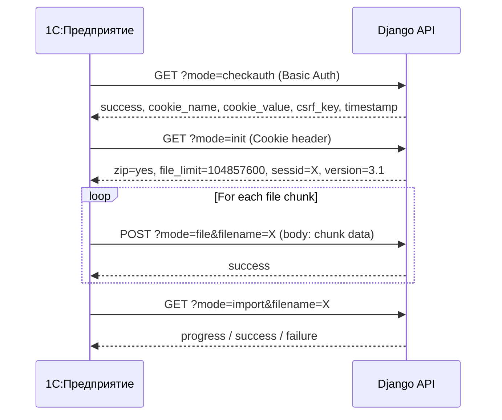

# Story 1.2: Implement Init Mode Configuration

Status: ready-for-dev

## Story

As a 1C Administrator,
I want the site to report its capabilities (zip support, file limits, session key, protocol version),
so that 1C can optimize the data packet size and maintain secure session.

## Acceptance Criteria

1. **Given** An authenticated session with the 1C Exchange Endpoint
   **When** A GET request is sent to `/api/integration/1c/exchange/` with `?mode=init`
   **Then** The response should contain exactly 4 lines in `text/plain` format:
   - Line 1: `zip=yes` (or `zip=no` if disabled)
   - Line 2: `file_limit=<bytes>` (e.g., 104857600 for 100MB)
   - Line 3: `sessid=<CSRF_session_key>`
   - Line 4: `version=3.1` (CommerceML version)
   **And** The response status code should be 200 OK

2. **Given** An unauthenticated request
   **When** A GET request is sent with `?mode=init`
   **Then** The response should be 401 Unauthorized

3. **Given** A request from a user without `can_exchange_1c` permission
   **When** A GET request is sent with `?mode=init`
   **Then** The response should be 403 Forbidden

## Test Cases

| ID  | Scenario | Expected Result |
|-----|----------|-----------------|
| TC1 | Authenticated `?mode=init` | 200 OK, 4-line response with zip, file_limit, sessid, version |
| TC2 | Unauthenticated `?mode=init` | 401 Unauthorized |
| TC3 | User without `can_exchange_1c` | 403 Forbidden |
| TC4 | POST `?mode=init` | 200 OK (same as GET, 1C compatibility) |
| TC5 | Response contains valid `sessid=` | Non-empty session key |
| TC6 | Response contains `version=3.1` | CommerceML version string |
| TC7 | Content-Type header | `text/plain; charset=utf-8` |

## Tasks / Subtasks

- [ ] **Task 1: Implement `handle_init()` method** (AC: #1)
  - [ ] 1.1: Add `handle_init()` method to `ICExchangeView`
  - [ ] 1.2: Read `ZIP_SUPPORT` and `FILE_LIMIT_BYTES` from `settings.ONEC_EXCHANGE`
  - [ ] 1.3: Get session key from `request.session.session_key` (CSRF token)
  - [ ] 1.4: Add `COMMERCEML_VERSION` to settings (default: "3.1")
  - [ ] 1.5: Return 4-line `text/plain` response

- [ ] **Task 2: Add mode routing for `init`** (AC: #1)
  - [ ] 2.1: Update `get()` to route `mode=init` → `handle_init()`
  - [ ] 2.2: Update `post()` to route `mode=init` → `handle_init()` (1C compatibility)

- [ ] **Task 3: Update Settings** (AC: #1)
  - [ ] 3.1: Add `COMMERCEML_VERSION: "3.1"` to `ONEC_EXCHANGE` dict in `base.py`

- [ ] **Task 4: Write Tests** (AC: #1, #2, #3)
  - [ ] 4.1: Test successful init with 4-line response format
  - [ ] 4.2: Test 401 on unauthenticated request
  - [ ] 4.3: Test 403 for user without permission
  - [ ] 4.4: Verify `sessid=` contains valid session key
  - [ ] 4.5: Verify `version=3.1` is present
  - [ ] 4.6: Test POST method works same as GET
  - [ ] 4.7: Verify Content-Type is `text/plain`

## Dev Notes

### Response Format (CRITICAL - Updated from Official Docs)

> [!IMPORTANT]
> **Source:** [1С-Битрикс официальная документация](https://dev.1c-bitrix.ru/api_help/sale/algorithms/data_2_site.php)

1С ожидает **4 строки** в формате `text/plain`:
```
zip=yes
file_limit=104857600
sessid=abc123xyz
version=3.1
```

| Поле | Описание |
|------|----------|
| `zip` | `yes` если сайт принимает ZIP-архивы, иначе `no` |
| `file_limit` | Максимальный размер одного **чанка** в байтах |
| `sessid` | CSRF ключ сессии для последующих запросов |
| `version` | Версия CommerceML (текущая: 3.1) |

### Implementation Pattern (Updated)

```python
def handle_init(self, request):
    """
    Returns server capabilities for 1C data exchange.
    Protocol: https://dev.1c-bitrix.ru/api_help/sale/algorithms/data_2_site.php
    """
    zip_support = settings.ONEC_EXCHANGE.get('ZIP_SUPPORT', True)
    file_limit = settings.ONEC_EXCHANGE.get('FILE_LIMIT_BYTES', 100 * 1024 * 1024)
    version = settings.ONEC_EXCHANGE.get('COMMERCEML_VERSION', '3.1')
    
    # Ensure session exists
    if not request.session.session_key:
        request.session.save()
    sessid = request.session.session_key
    
    zip_value = 'yes' if zip_support else 'no'
    response_text = f"zip={zip_value}\nfile_limit={file_limit}\nsessid={sessid}\nversion={version}"
    return HttpResponse(response_text, content_type="text/plain")
```

### Settings Update Required

В `backend/freesport/settings/base.py` добавить:
```python
ONEC_EXCHANGE = {
    'SESSION_COOKIE_NAME': 'FREESPORT_1C_SESSION',
    'SESSION_LIFETIME_SECONDS': 3600,
    'FILE_LIMIT_BYTES': 100 * 1024 * 1024,  # 100MB per chunk
    'ZIP_SUPPORT': True,
    'COMMERCEML_VERSION': '3.1',  # ← NEW
}
```

### Protocol Flow Context



### Existing Code Context

**Файл:** `backend/apps/integrations/onec_exchange/views.py`

Session уже создаётся в `handle_checkauth()`:
```python
login(request._request, request.user)
# session.session_key доступен после login()
```

### References

- [Source: 1C-Bitrix Official Docs](https://dev.1c-bitrix.ru/api_help/sale/algorithms/data_2_site.php) - Protocol specification
- [Source: epics.md#Story-1.2] - Init mode requirements
- [Source: 1-1-setup-1c-exchange-endpoint-and-auth.md] - Previous story patterns
- [Source: settings/base.py#L272-277] - ONEC_EXCHANGE configuration

## Verification

```bash
# 1. Run tests
docker compose exec backend pytest apps/integrations/tests/integration/test_onec_exchange_api.py -v -k init

# 2. Manual verification
curl -v -u 1c_user:password "http://localhost:8001/api/integration/1c/exchange/?mode=init"
# Expected: 200 OK, Content-Type: text/plain
# zip=yes
# file_limit=104857600
# sessid=<session_key>
# version=3.1
```

## Dev Agent Record

### Agent Model Used

{{agent_model_name_version}}

### Debug Log References

### Completion Notes List

### File List
