# FREESPORT Platform - Архитектурная Документация

## Оглавление

1. [Введение](#1-введение)
2. [Модели Данных](#2-модели-данных)
3. [Спецификация API](#3-спецификация-api)
4. [Структура Компонентов](#4-структура-компонентов)
5. [Технологический Стек](#5-технологический-стек)
6. [Высокоуровневая Архитектура](#6-высокоуровневая-архитектура)
7. [Внешние API](#7-внешние-api)
8. [Основные Рабочие Процессы](#8-основные-рабочие-процессы)
9. [Схема Базы Данных](#9-схема-базы-данных)
10. [Стратегия Тестирования](#10-стратегия-тестирования)
11. [Безопасность и Производительность](#11-безопасность-и-производительность)
12. [Стратегия Обработки Ошибок](#12-стратегия-обработки-ошибок)
13. [Мониторинг и Наблюдаемость](#13-мониторинг-и-наблюдаемость)
14. [CI/CD Стратегия](#14-cicd-стратегия)

---

## 1. Введение

# Введение

## Обзор проекта

**FREESPORT** - современная API-First платформа электронной коммерции, объединяющая 5 торговых марок в единой экосистеме B2B/B2C продаж. Проект реализует полнофункциональный интернет-магазин с акцентом на оптовые продажи для тренеров, спортивных федераций и дистрибьюторов.

## Технический контекст

**Architecture Pattern:** API-First (Headless) архитектура с SSR/SSG
**Primary Technology Stack:** Django REST Framework + Next.js
**Database:** PostgreSQL с поддержкой партиционирования
**Integration Layer:** REST API + WebHooks + BFF (Backend for Frontend)
**Authentication:** JWT токены с refresh стратегией

## Соответствие бизнес-требованиям

- **B2B Functionality:** 3-уровневая оптовая система ценообразования с поддержкой ролей: тренер и представитель федерации спорта
- **B2C Integration:** Полный цикл розничных продаж с ЮКасса интеграцией  
- **ERP Integration:** Двусторонний обмен данными с 1С (остатки, заказы, статусы)
- **Multi-Brand Support:** 5 торговых марок в едином каталоге с возможностью расширения
- **Scalability:** Монорепо структура для будущего расширения

## Ключевые технические решения

1. **API-First + SSR/SSG Approach:** Обеспечивает SEO оптимизацию, производительность и независимость разработки
2. **Next.js Hybrid Rendering:** SSG для статических страниц, SSR для динамических, ISR для каталогов
3. **BFF Layer:** Next.js API Routes как прослойка для агрегации данных и безопасности
4. **Monorepo Structure:** Упрощает управление общими компонентами между брендами
5. **PostgreSQL Choice:** Поддержка JSONB, full-text search, партиционирование для больших объемов данных
4. **Django + DRF:** Зрелая экосистема с встроенной админ-панелью и ORM

---

## 2. Модели Данных

### Основные связи сущностей

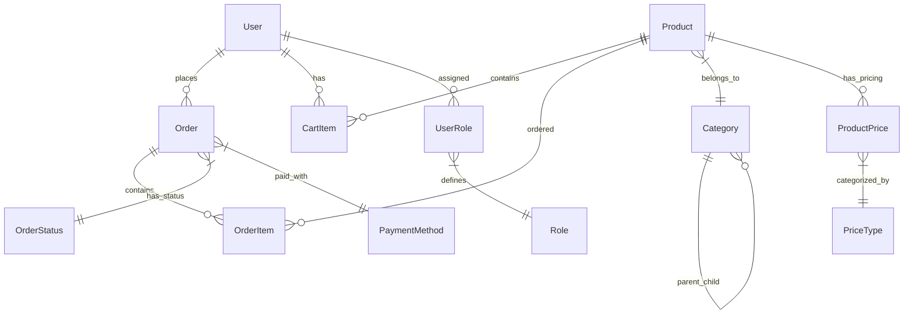

### Модели управления пользователями

```python
# Модель пользователя с ценообразованием на основе ролей
class User(AbstractUser):
    email = models.EmailField(unique=True)
    phone = models.CharField(max_length=20, blank=True)
    role = models.CharField(max_length=20, choices=USER_ROLES, default='retail')
    company_name = models.CharField(max_length=200, blank=True)
    tax_id = models.CharField(max_length=50, blank=True)  # ИНН для B2B
    is_verified = models.BooleanField(default=False)
    verification_token = models.CharField(max_length=100, blank=True)
    created_at = models.DateTimeField(auto_now_add=True)
    updated_at = models.DateTimeField(auto_now=True)

USER_ROLES = [
    ('retail', 'Розничный покупатель'),
    ('wholesale_level1', 'Оптовик уровень 1'),
    ('wholesale_level2', 'Оптовик уровень 2'), 
    ('wholesale_level3', 'Оптовик уровень 3'),
    ('trainer', 'Тренер'),
    ('federation_rep', 'Представитель федерации'),
    ('admin', 'Администратор'),
]

class UserProfile(models.Model):
    user = models.OneToOneField(User, on_delete=models.CASCADE)
    birth_date = models.DateField(blank=True, null=True)
    avatar = models.ImageField(upload_to='avatars/', blank=True)
    delivery_address = models.TextField(blank=True)
    billing_address = models.TextField(blank=True)
    preferred_delivery_method = models.CharField(max_length=50, blank=True)
```

### Модели каталога товаров

```python
class Category(models.Model):
    name = models.CharField(max_length=200)
    slug = models.SlugField(unique=True)
    parent = models.ForeignKey('self', null=True, blank=True, on_delete=models.CASCADE)
    description = models.TextField(blank=True)
    image = models.ImageField(upload_to='categories/', blank=True)
    is_active = models.BooleanField(default=True)
    sort_order = models.PositiveIntegerField(default=0)
    seo_title = models.CharField(max_length=200, blank=True)
    seo_description = models.TextField(blank=True)

class Brand(models.Model):
    name = models.CharField(max_length=100, unique=True)
    slug = models.SlugField(unique=True)
    logo = models.ImageField(upload_to='brands/', blank=True)
    description = models.TextField(blank=True)
    website = models.URLField(blank=True)
    is_active = models.BooleanField(default=True)

class Product(models.Model):
    name = models.CharField(max_length=300)
    slug = models.SlugField(unique=True)
    brand = models.ForeignKey(Brand, on_delete=models.CASCADE)
    category = models.ForeignKey(Category, on_delete=models.CASCADE)
    description = models.TextField()
    short_description = models.CharField(max_length=500, blank=True)
    
    # Ценообразование для различных ролей пользователей
    retail_price = models.DecimalField(max_digits=10, decimal_places=2)
    opt1_price = models.DecimalField(max_digits=10, decimal_places=2, null=True, blank=True)
    opt2_price = models.DecimalField(max_digits=10, decimal_places=2, null=True, blank=True)
    opt3_price = models.DecimalField(max_digits=10, decimal_places=2, null=True, blank=True)
    trainer_price = models.DecimalField(max_digits=10, decimal_places=2, null=True, blank=True)
    federation_price = models.DecimalField(max_digits=10, decimal_places=2, null=True, blank=True)
    
    # Информационные цены для B2B пользователей (отображаются, но не используются для покупки)
    recommended_retail_price = models.DecimalField(max_digits=10, decimal_places=2, null=True, blank=True)  # RRP
    max_suggested_retail_price = models.DecimalField(max_digits=10, decimal_places=2, null=True, blank=True)  # MSRP
    
    # Инвентаризация
    sku = models.CharField(max_length=100, unique=True)
    stock_quantity = models.PositiveIntegerField(default=0)
    min_order_quantity = models.PositiveIntegerField(default=1)
    
    # Изображения
    main_image = models.ImageField(upload_to='products/')
    gallery_images = models.JSONField(default=list, blank=True)
    
    # SEO & Meta
    seo_title = models.CharField(max_length=200, blank=True)
    seo_description = models.TextField(blank=True)
    
    # Flags
    is_active = models.BooleanField(default=True)
    is_featured = models.BooleanField(default=False)
    
    # Временные метки и интеграция с 1С
    created_at = models.DateTimeField(auto_now_add=True)
    updated_at = models.DateTimeField(auto_now=True)
    onec_id = models.CharField(max_length=100, blank=True, null=True)  # 1C reference
    last_sync_at = models.DateTimeField(null=True, blank=True)
```

### Модели управления заказами

```python
class Order(models.Model):
    # Идентификация заказа
    order_number = models.CharField(max_length=50, unique=True)
    user = models.ForeignKey(User, on_delete=models.CASCADE, null=True, blank=True)
    
    # Информация о клиенте (для гостевых заказов)
    customer_name = models.CharField(max_length=200, blank=True)
    customer_email = models.EmailField(blank=True)
    customer_phone = models.CharField(max_length=20, blank=True)
    
    # Детали заказа
    status = models.CharField(max_length=50, choices=ORDER_STATUSES, default='pending')
    total_amount = models.DecimalField(max_digits=10, decimal_places=2)
    discount_amount = models.DecimalField(max_digits=10, decimal_places=2, default=0)
    delivery_cost = models.DecimalField(max_digits=10, decimal_places=2, default=0)
    
    # Информация о доставке
    delivery_address = models.TextField()
    delivery_method = models.CharField(max_length=50, choices=DELIVERY_METHODS)
    delivery_date = models.DateField(null=True, blank=True)
    
    # Payment Information
    payment_method = models.CharField(max_length=50, choices=PAYMENT_METHODS)
    payment_status = models.CharField(max_length=50, choices=PAYMENT_STATUSES, default='pending')
    payment_id = models.CharField(max_length=100, blank=True)  # YuKassa payment ID
    
    # Поля для B2B
    company_name = models.CharField(max_length=200, blank=True)
    tax_id = models.CharField(max_length=50, blank=True)
    purchase_order_number = models.CharField(max_length=100, blank=True)
    
    # Интеграция и аудит
    onec_id = models.CharField(max_length=100, blank=True, null=True)
    created_at = models.DateTimeField(auto_now_add=True)
    updated_at = models.DateTimeField(auto_now=True)
    notes = models.TextField(blank=True)

ORDER_STATUSES = [
    ('pending', 'Ожидает обработки'),
    ('confirmed', 'Подтвержден'),
    ('processing', 'В обработке'),
    ('shipped', 'Отгружен'),
    ('delivered', 'Доставлен'),
    ('cancelled', 'Отменен'),
    ('returned', 'Возвращен'),
]

class OrderItem(models.Model):
    order = models.ForeignKey(Order, related_name='items', on_delete=models.CASCADE)
    product = models.ForeignKey(Product, on_delete=models.CASCADE)
    quantity = models.PositiveIntegerField()
    unit_price = models.DecimalField(max_digits=10, decimal_places=2)
    total_price = models.DecimalField(max_digits=10, decimal_places=2)
    
    # Снимок данных о продукте на момент заказа
    product_name = models.CharField(max_length=300)
    product_sku = models.CharField(max_length=100)
```

### Продвинутые модели данных

```python
class Cart(models.Model):
    user = models.OneToOneField(User, on_delete=models.CASCADE, null=True, blank=True)
    session_key = models.CharField(max_length=100, blank=True)  # For guest users
    created_at = models.DateTimeField(auto_now_add=True)
    updated_at = models.DateTimeField(auto_now=True)

class CartItem(models.Model):
    cart = models.ForeignKey(Cart, related_name='items', on_delete=models.CASCADE)
    product = models.ForeignKey(Product, on_delete=models.CASCADE)
    quantity = models.PositiveIntegerField(default=1)
    added_at = models.DateTimeField(auto_now_add=True)
    
    class Meta:
        unique_together = ('cart', 'product')

# Аудиторский журнал для соответствия требованиям B2B
class AuditLog(models.Model):
    user = models.ForeignKey(User, on_delete=models.SET_NULL, null=True)
    action = models.CharField(max_length=100)
    resource_type = models.CharField(max_length=50)
    resource_id = models.CharField(max_length=100)
    changes = models.JSONField(default=dict)
    ip_address = models.GenericIPAddressField()
    user_agent = models.TextField()
    timestamp = models.DateTimeField(auto_now_add=True)

# Отслеживание интеграции в 1С
class SyncLog(models.Model):
    sync_type = models.CharField(max_length=50, choices=[
        ('products', 'Товары'),
        ('orders', 'Заказы'), 
        ('stocks', 'Остатки'),
    ])
    status = models.CharField(max_length=20, choices=[
        ('started', 'Начата'),
        ('completed', 'Завершена'),
        ('failed', 'Ошибка'),
    ])
    records_processed = models.PositiveIntegerField(default=0)
    errors_count = models.PositiveIntegerField(default=0)
    error_details = models.JSONField(default=list)
    started_at = models.DateTimeField(auto_now_add=True)
    completed_at = models.DateTimeField(null=True, blank=True)
```

---

## 3. Спецификация API

### Структура схемы OpenAPI 3.1

```yaml
openapi: 3.1.0
info:
  title: FREESPORT API
  description: Comprehensive e-commerce API supporting B2B/B2C operations
  version: "1.0.0"
  contact:
    name: FREESPORT Development Team
    email: dev@freesport.com

servers:
  - url: https://api.freesport.com/v1
    description: Production server
  - url: https://staging-api.freesport.com/v1
    description: Staging server

security:
  - BearerAuth: []
  - ApiKeyAuth: []

paths:
  # Authentication Endpoints
  /auth/login/:
    post:
      tags: [Authentication]
      summary: User login
      requestBody:
        required: true
        content:
          application/json:
            schema:
              type: object
              properties:
                email:
                  type: string
                  format: email
                password:
                  type: string
                  format: password
              required: [email, password]
      responses:
        '200':
          description: Login successful
          content:
            application/json:
              schema:
                type: object
                properties:
                  access_token:
                    type: string
                  refresh_token:
                    type: string
                  user:
                    $ref: '#/components/schemas/User'

  /auth/refresh/:
    post:
      tags: [Authentication]
      summary: Refresh access token
      requestBody:
        required: true
        content:
          application/json:
            schema:
              type: object
              properties:
                refresh_token:
                  type: string
              required: [refresh_token]

  # Product Catalog Endpoints  
  /products/:
    get:
      tags: [Products]
      summary: List products with filtering and pagination
      parameters:
        - name: category
          in: query
          schema:
            type: string
        - name: brand
          in: query
          schema:
            type: string
        - name: min_price
          in: query
          schema:
            type: number
        - name: max_price
          in: query
          schema:
            type: number
        - name: search
          in: query
          schema:
            type: string
        - name: page
          in: query
          schema:
            type: integer
            default: 1
        - name: page_size
          in: query
          schema:
            type: integer
            default: 20
            maximum: 100
      responses:
        '200':
          description: Products list
          content:
            application/json:
              schema:
                type: object
                properties:
                  count:
                    type: integer
                  next:
                    type: string
                    nullable: true
                  previous:
                    type: string
                    nullable: true
                  results:
                    type: array
                    items:
                      $ref: '#/components/schemas/Product'

  /products/{id}/:
    get:
      tags: [Products]
      summary: Get product details
      parameters:
        - name: id
          in: path
          required: true
          schema:
            type: integer
      responses:
        '200':
          description: Product details
          content:
            application/json:
              schema:
                $ref: '#/components/schemas/ProductDetail'

  # Cart Management
  /cart/:
    get:
      tags: [Cart]
      summary: Get current user's cart
      security:
        - BearerAuth: []
      responses:
        '200':
          description: Cart contents
          content:
            application/json:
              schema:
                $ref: '#/components/schemas/Cart'
    
    post:
      tags: [Cart]
      summary: Add item to cart
      security:
        - BearerAuth: []
      requestBody:
        required: true
        content:
          application/json:
            schema:
              type: object
              properties:
                product_id:
                  type: integer
                quantity:
                  type: integer
                  minimum: 1
              required: [product_id, quantity]

  # Order Management
  /orders/:
    get:
      tags: [Orders]
      summary: List user orders
      security:
        - BearerAuth: []
      parameters:
        - name: status
          in: query
          schema:
            type: string
            enum: [pending, confirmed, processing, shipped, delivered, cancelled]
        - name: page
          in: query
          schema:
            type: integer
      responses:
        '200':
          description: Orders list
          content:
            application/json:
              schema:
                $ref: '#/components/schemas/OrderList'
    
    post:
      tags: [Orders]
      summary: Create new order
      security:
        - BearerAuth: []
      requestBody:
        required: true
        content:
          application/json:
            schema:
              $ref: '#/components/schemas/OrderCreate'
      responses:
        '201':
          description: Order created
          content:
            application/json:
              schema:
                $ref: '#/components/schemas/Order'

# Webhooks for YuKassa Integration (OpenAPI 3.1 feature)
webhooks:
  payment-notification:
    post:
      tags: [Webhooks]
      summary: YuKassa payment notification
      requestBody:
        required: true
        content:
          application/json:
            schema:
              $ref: '#/components/schemas/PaymentWebhook'
      responses:
        '200':
          description: Webhook processed successfully

components:
  securitySchemes:
    BearerAuth:
      type: http
      scheme: bearer
      bearerFormat: JWT
    ApiKeyAuth:
      type: apiKey
      in: header
      name: X-API-Key

  schemas:
    User:
      type: object
      properties:
        id:
          type: integer
        email:
          type: string
          format: email
        first_name:
          type: string
        last_name:
          type: string
        role:
          type: string
          enum: [retail, wholesale_level1, wholesale_level2, wholesale_level3, trainer, federation_rep, admin]
        company_name:
          type: string
        phone:
          type: string
        is_verified:
          type: boolean

    Product:
      type: object
      properties:
        id:
          type: integer
        name:
          type: string
        slug:
          type: string
        brand:
          $ref: '#/components/schemas/Brand'
        category:
          $ref: '#/components/schemas/Category'
        current_price:
          type: number
          format: decimal
          description: Цена актуальная для текущего пользователя
        retail_price:
          type: number
          format: decimal
        price_type:
          type: string
          enum: [retail, wholesale_level1, wholesale_level2, wholesale_level3, trainer, federation]
        recommended_retail_price:
          type: number
          format: decimal
          description: RRP - отображается только для B2B пользователей (оптовики, тренеры, федералы)
          nullable: true
        max_suggested_retail_price:
          type: number
          format: decimal  
          description: MSRP - максимальная рекомендуемая цена, только для B2B пользователей
          nullable: true
        main_image:
          type: string
          format: uri
        stock_quantity:
          type: integer
        min_order_quantity:
          type: integer
        is_available:
          type: boolean

    ProductDetail:
      allOf:
        - $ref: '#/components/schemas/Product'
        - type: object
          properties:
            description:
              type: string
            short_description:
              type: string
            gallery_images:
              type: array
              items:
                type: string
                format: uri
            seo_title:
              type: string
            seo_description:
              type: string

    Order:
      type: object
      properties:
        id:
          type: integer
        order_number:
          type: string
        status:
          type: string
          enum: [pending, confirmed, processing, shipped, delivered, cancelled]
        total_amount:
          type: number
          format: decimal
        items:
          type: array
          items:
            $ref: '#/components/schemas/OrderItem'
        delivery_address:
          type: string
        payment_method:
          type: string
        payment_status:
          type: string
        created_at:
          type: string
          format: date-time

    PaymentWebhook:
      type: object
      properties:
        type:
          type: string
          enum: [notification]
        event:
          type: string
          enum: [payment.succeeded, payment.canceled]
        object:
          type: object
          properties:
            id:
              type: string
            status:
              type: string
            amount:
              type: object
              properties:
                value:
                  type: string
                currency:
                  type: string
            metadata:
              type: object
              properties:
                order_id:
                  type: string
```

### Слой BFF (Backend for Frontend)

Next.js API Routes служат как прослойка между frontend приложением и Django API, обеспечивая:

#### Преимущества BFF:
- **Агрегация данных**: Объединение данных от нескольких Django API endpoints
- **Безопасность**: Скрытие sensitive API keys и tokens от клиента  
- **Кэширование**: Server-side кэширование для улучшения производительности
- **Трансформация данных**: Адаптация данных под нужды frontend компонентов

#### BFF API Routes Structure:

```typescript
// /app/api/products/route.ts - Aggregated products with pricing
import { NextRequest, NextResponse } from 'next/server';

export async function GET(request: NextRequest) {
  try {
    const { searchParams } = new URL(request.url);
    const brand = searchParams.get('brand');
    const category = searchParams.get('category');
    
    // Aggregate data from multiple Django endpoints
    const [productsRes, pricingRes, inventoryRes] = await Promise.all([
      fetch(`${process.env.DJANGO_API_URL}/products/?brand=${brand}&category=${category}`, {
        headers: { 'Authorization': `Bearer ${process.env.API_TOKEN}` }
      }),
      fetch(`${process.env.DJANGO_API_URL}/pricing/?brand=${brand}`),
      fetch(`${process.env.DJANGO_API_URL}/inventory/`)
    ]);

    const products = await productsRes.json();
    const pricing = await pricingRes.json();
    const inventory = await inventoryRes.json();

    // Transform and combine data with RRP/MSRP for B2B users
    const enrichedProducts = products.map(product => ({
      ...product,
      price: pricing[product.id] || product.base_price,
      in_stock: inventory[product.id]?.quantity > 0,
      estimated_delivery: calculateDelivery(product.warehouse_location),
      // ✅ Include RRP/MSRP for B2B users only (FR5)
      ...(isB2BUser(request) && {
        recommendedRetailPrice: product.recommended_retail_price,
        maxSuggestedRetailPrice: product.max_suggested_retail_price
      })
    }));

    return NextResponse.json({
      products: enrichedProducts,
      total: products.length,
      has_more: products.length === 20
    });

  } catch (error) {
    console.error('BFF Products API Error:', error);
    return NextResponse.json(
      { error: 'Failed to fetch products' },
      { status: 500 }
    );
  }
}
```

```typescript
// /app/api/auth/login/route.ts - Secure authentication
import { NextRequest, NextResponse } from 'next/server';
import { cookies } from 'next/headers';

export async function POST(request: NextRequest) {
  try {
    const body = await request.json();
    
    // Authenticate with Django API
    const authResponse = await fetch(`${process.env.DJANGO_API_URL}/auth/login/`, {
      method: 'POST',
      headers: { 'Content-Type': 'application/json' },
      body: JSON.stringify(body)
    });

    if (!authResponse.ok) {
      return NextResponse.json(
        { error: 'Invalid credentials' },
        { status: 401 }
      );
    }

    const { access_token, refresh_token, user } = await authResponse.json();

    // Set secure HTTP-only cookies
    cookies().set('access_token', access_token, {
      httpOnly: true,
      secure: process.env.NODE_ENV === 'production',
      sameSite: 'lax',
      maxAge: 15 * 60 // 15 minutes
    });

    cookies().set('refresh_token', refresh_token, {
      httpOnly: true,
      secure: process.env.NODE_ENV === 'production',
      sameSite: 'lax',
      maxAge: 7 * 24 * 60 * 60 // 7 days
    });

    // Return user data (without tokens)
    return NextResponse.json({ user });

  } catch (error) {
    console.error('BFF Auth Error:', error);
    return NextResponse.json(
      { error: 'Authentication failed' },
      { status: 500 }
    );
  }
}
```

### BFF Middleware для аутентификации:

```typescript
// middleware.ts - Server-side authentication
import { NextRequest, NextResponse } from 'next/server';
import { verifyToken } from '@/lib/auth';

export async function middleware(request: NextRequest) {
  // Protect API routes
  if (request.nextUrl.pathname.startsWith('/api/protected')) {
    const accessToken = request.cookies.get('access_token');
    
    if (!accessToken) {
      return NextResponse.json({ error: 'Unauthorized' }, { status: 401 });
    }

    try {
      const isValid = await verifyToken(accessToken.value);
      if (!isValid) {
        return NextResponse.json({ error: 'Token expired' }, { status: 401 });
      }
    } catch (error) {
      return NextResponse.json({ error: 'Invalid token' }, { status: 401 });
    }
  }

  // Protect dashboard pages
  if (request.nextUrl.pathname.startsWith('/dashboard')) {
    const accessToken = request.cookies.get('access_token');
    
    if (!accessToken) {
      return NextResponse.redirect(new URL('/login', request.url));
    }
  }

  return NextResponse.next();
}

export const config = {
  matcher: [
    '/api/protected/:path*',
    '/dashboard/:path*',
    '/api/cart/:path*',
    '/api/orders/:path*'
  ]
};

// Вспомогательная функция для определения B2B пользователей (требование FR5)
function isB2BUser(request: NextRequest): boolean {
  // Извлекаем роль пользователя из JWT токена или сессии
  const authHeader = request.headers.get('authorization');
  if (!authHeader) return false;
  
  try {
    const token = authHeader.replace('Bearer ', '');
    const decoded = jwt.verify(token, process.env.JWT_SECRET);
    const userRole = decoded.role;
    
    // B2B роли которые должны видеть RRP/MSRP
    const b2bRoles = ['wholesale_level1', 'wholesale_level2', 'wholesale_level3', 'trainer', 'federation_rep'];
    return b2bRoles.includes(userRole);
  } catch (error) {
    return false;
  }
}
```

### Реализация безопасности API

```python
# JWT Authentication with Refresh Tokens
from rest_framework_simplejwt.authentication import JWTAuthentication
from rest_framework_simplejwt.tokens import RefreshToken

class CustomJWTAuthentication(JWTAuthentication):
    def get_user(self, validated_token):
        user = super().get_user(validated_token)
        # Add custom user role validation
        if not user.is_active:
            raise AuthenticationFailed('User account is disabled.')
        return user

# API Rate Limiting
from django_ratelimit.decorators import ratelimit

@ratelimit(key='ip', rate='100/h', method='POST')
@ratelimit(key='user', rate='1000/h', method='POST')  
def create_order(request):
    # Order creation logic
    pass

# Input Validation & Serialization
class ProductFilterSerializer(serializers.Serializer):
    category = serializers.CharField(max_length=100, required=False)
    brand = serializers.CharField(max_length=100, required=False)
    min_price = serializers.DecimalField(max_digits=10, decimal_places=2, required=False)
    max_price = serializers.DecimalField(max_digits=10, decimal_places=2, required=False)
    search = serializers.CharField(max_length=200, required=False)
    
    def validate(self, data):
        if 'min_price' in data and 'max_price' in data:
            if data['min_price'] > data['max_price']:
                raise serializers.ValidationError("min_price cannot be greater than max_price")
        return data
```

---

## 4. Структура Компонентов

TODO: Component Structure section will be added here...

---

## 5. Технологический Стек

### Backend технологии

| Компонент | Технология | Версия | Обоснование |
|-----------|------------|---------|---------------|
| **Веб-фреймворк** | Django | 4.2 LTS | Зрелый фреймворк, встроенная админ-панель, ORM, функции безопасности |
| **API фреймворк** | Django REST Framework | 3.14+ | Отраслевой стандарт для Django API, комплексная сериализация |
| **База данных** | PostgreSQL | 15+ | Поддержка JSONB, полнотекстовый поиск, производительность, надежность |
| **Кеш** | Redis | 7.0+ | Хранение сессий, кеширование, брокер Celery |
| **Очередь задач** | Celery | 5.3+ | Асинхронная обработка задач, запланированные задания |
| **Веб-сервер** | Nginx | 1.24+ | Статические файлы, обратный прокси, балансировка нагрузки |
| **WSGI сервер** | Gunicorn | 21.0+ | Готовый к продакшену Python WSGI сервер |

### Frontend технологии

| Компонент | Технология | Версия | Обоснование |
|-----------|------------|---------|---------------|
| **Фреймворк** | Next.js | 14+ | SSR/SSG/ISR, SEO оптимизация, производительность |
| **Стратегия рендеринга** | Гибридный SSR/SSG/CSR | - | SSG для статических, SSR для динамических, CSR для интерактивных |
| **Язык** | TypeScript | 5.0+ | Типобезопасность, лучший опыт разработчика |
| **Управление состоянием** | Zustand | 4.4+ | Легковесный, простой, совместим с SSR |
| **UI фреймворк** | Tailwind CSS | 3.3+ | Utility-first подход, совместим с SSR |
| **Формы** | React Hook Form | 7.45+ | Производительность, минимальные ре-рендеры |
| **API слой** | Next.js API Routes | Встроенный | BFF слой, серверная логика, безопасные API вызовы |

### Инфраструктура и DevOps

| Компонент | Технология | Назначение |
|-----------|------------|---------|
| **Контейнеризация** | Docker | Среда разработки, развертывание |
| **Оркестрация** | Docker Compose (dev/staging) / Docker Swarm (prod) | Управление контейнерами и процессами |
| **Мониторинг** | Sentry + Grafana + Prometheus | Error tracking + performance monitoring |
| **Обработка изображений** | next/image (оптимизация) + Pillow (загрузка) | Django хранит оригиналы, Next.js оптимизирует на лету |
| **Хранилище файлов** | S3-Compatible (MinIO/AWS) | Медиа файлы, совместимо с Docker Swarm |

### Безопасность

| Компонент | Технология | Назначение |
|-----------|------------|---------|
| **SSL/TLS** | Let's Encrypt | HTTPS шифрование |
| **Аутентификация** | JWT (Simple JWT) | Stateless аутентификация |
| **Хеширование паролей** | Argon2 | Безопасное хранение паролей |
| **Фаервол** | UFW | Сетевая безопасность |

---

## 6. Высокоуровневая Архитектура

### Диаграмма развертывания инфраструктуры

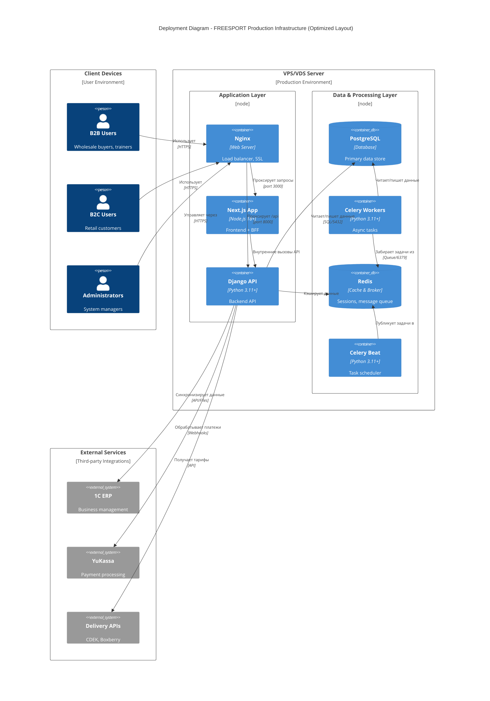

### Схема сетевого взаимодействия

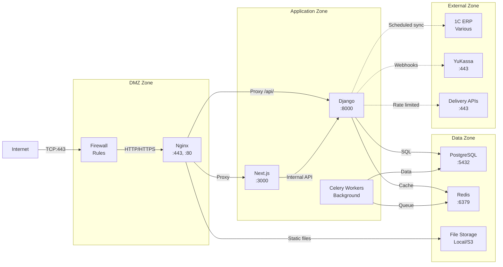

### Диаграмма компонентов с портами и интерфейсами

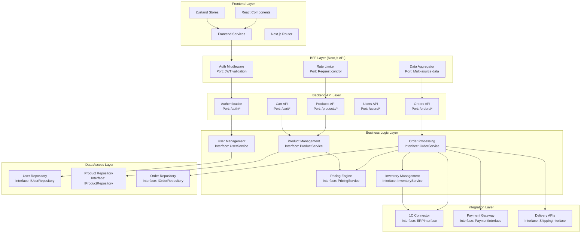

### Обзор системной архитектуры

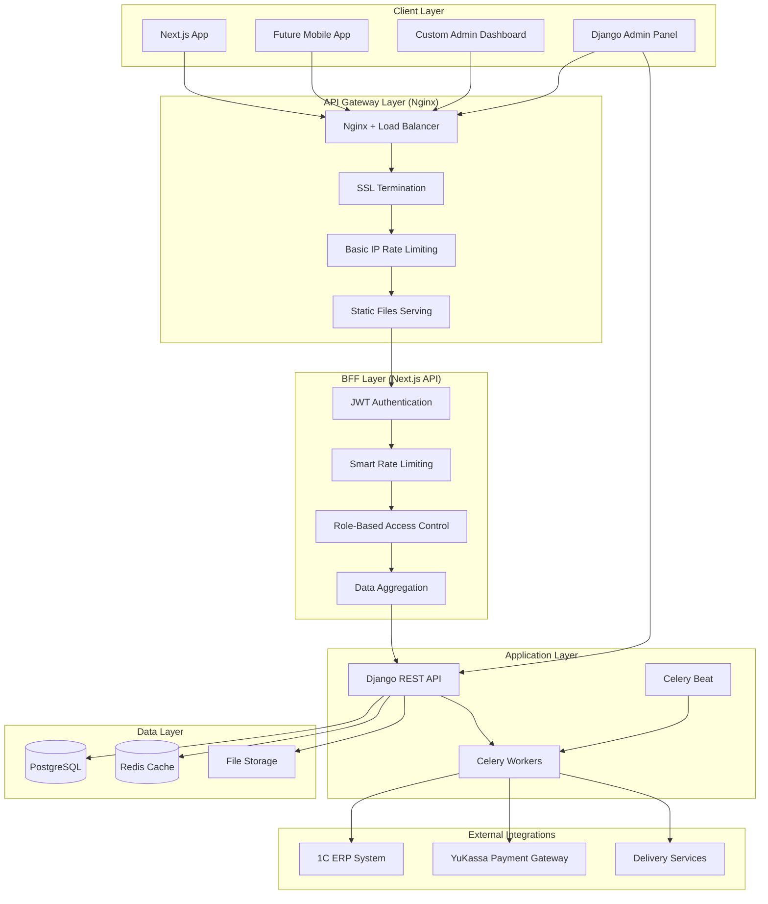

### Разграничение ответственности по слоям

#### Nginx Gateway Layer:
- **SSL Termination**: Let's Encrypt сертификаты
- **Базовое Rate Limiting**: 1000 запросов/минуту с IP
- **Static Files**: Раздача медиа файлов и статики
- **Load Balancing**: Распределение между инстансами Django
- **DDoS Protection**: Базовая защита от атак

#### Next.js BFF Layer:
- **JWT Authentication**: Валидация токенов и refresh logic
- **Интеллектуальное Rate Limiting**: 
  - 5 попыток логина/минуту для пользователя
  - 10 заказов/день для розничных клиентов
  - Разные лимиты для B2B пользователей
- **Role-Based Access Control**: Проверка ролей и прав доступа
- **Data Aggregation**: Объединение данных от нескольких API endpoints
- **Request/Response трансформация**: Адаптация под frontend нужды

#### Django API Layer:
- **Business Logic**: Основная логика приложения
- **Data Management**: CRUD операции с БД
- **External Integrations**: 1C, платежи, доставка
- **Admin Interface**: Django Admin для контент-менеджмента

### Стратегия админ-панели (гибридный подход)

```
┌─────────────────────────────────────────────────────────┐
│                    ADMIN STRATEGY                       │
├─────────────────────┬───────────────────────────────────┤
│    Django Admin     │      Next.js Custom Admin        │
├─────────────────────┼───────────────────────────────────┤
│ • CRUD товары       │ • Дашборды продаж                │
│ • CRUD категории    │ • Аналитика клиентов              │
│ • Модерация заказов │ • Управление ценами/акциями       │
│ • Управление юзерами│ • Отчеты и визуализация           │
│ • Системные         │ • Мониторинг интеграций           │
│   настройки         │ • UX-критичные операции           │
├─────────────────────┼───────────────────────────────────┤
│ Быстрая разработка  │ Качественный UX                   │
│ Готовые компоненты  │ Кастомная бизнес-логика           │
└─────────────────────┴───────────────────────────────────┘
```

**Обоснование решения:**
- Django Admin для рутинных операций и быстрого прототипирования
- Custom Admin для критичного UX и сложной бизнес-логики
- Единое API, разные интерфейсы

### Механизмы отказоустойчивости

**1С Integration Resilience:**
- **Circuit Breaker Pattern**: Автоматическое переключение на файловый обмен
- **File-based Fallback**: Экспорт заказов в XML/JSON для ручной обработки
- **Retry Logic**: Экспоненциальная задержка для повторных попыток

**Payment Gateway Resilience:**
- **Webhook Validation**: Криптографическая подпись YuKassa
- **Idempotency Keys**: Предотвращение дублирования платежей
- **Status Reconciliation**: Периодическая сверка статусов

**Database Resilience:**
- **Connection Pooling**: pgBouncer для оптимизации подключений
- **Read Replicas**: Масштабирование чтения каталога товаров
- **Backup Strategy**: Ежедневные инкрементальные бэкапы + WAL

### Масштабируемость

**Горизонтальное масштабирование:**
- Django API servers (stateless)
- Celery workers (по типам задач)  
- Read-only replicas PostgreSQL
- Redis Cluster для сессий и кэша

**Вертикальное масштабирование:**
- CPU для обработки изображений
- RAM для кэширования товаров
- Storage для медиа файлов

---

## 7. Внешние API

### Интеграция с 1С ERP

#### Архитектура с Circuit Breaker Pattern

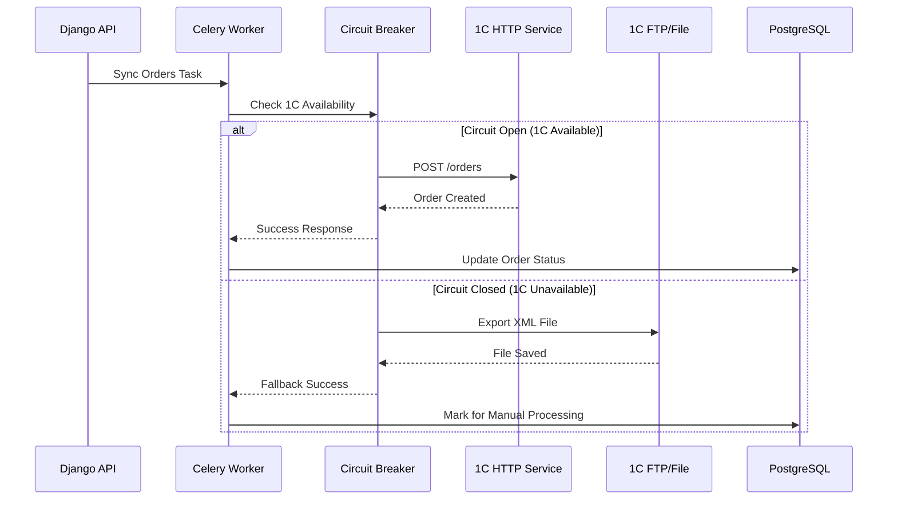

#### Реализация с отказоустойчивостью

```python
# apps/integrations/onec/client.py
import requests
from circuit_breaker import CircuitBreaker
from datetime import datetime
import xml.etree.ElementTree as ET

class OneCIntegrationService:
    def __init__(self):
        self.circuit_breaker = CircuitBreaker(
            failure_threshold=5,
            recovery_timeout=300,  # 5 minutes
            expected_exception=requests.RequestException
        )
        self.base_url = settings.ONEC_API_URL
        self.credentials = (settings.ONEC_USERNAME, settings.ONEC_PASSWORD)
        self.fallback_path = settings.ONEC_FALLBACK_PATH
    
    @circuit_breaker
    def export_order(self, order: Order) -> dict:
        """Export order to 1C via HTTP API"""
        payload = self._prepare_order_payload(order)
        
        response = requests.post(
            f"{self.base_url}/orders/",
            json=payload,
            auth=self.credentials,
            timeout=30,
            headers={'Content-Type': 'application/json'}
        )
        response.raise_for_status()
        
        result = response.json()
        
        # Update order with 1C reference
        order.onec_id = result['id']
        order.save(update_fields=['onec_id'])
        
        return result
    
    def export_order_fallback(self, order: Order) -> str:
        """Fallback: Export order to XML file"""
        xml_content = self._generate_order_xml(order)
        filename = f"order_{order.order_number}_{datetime.now().strftime('%Y%m%d_%H%M%S')}.xml"
        filepath = os.path.join(self.fallback_path, filename)
        
        with open(filepath, 'w', encoding='utf-8') as f:
            f.write(xml_content)
        
        # Mark order for manual processing
        order.notes = f"Exported to file: {filename} (1C API unavailable)"
        order.save(update_fields=['notes'])
        
        return filepath
```

### Интеграция с ЮКасса

#### Обработка платежей с идемпотентностью

```python
# apps/payments/yukassa.py
import hashlib
import hmac
from yookassa import Configuration, Payment, Webhook

class YuKassaService:
    def __init__(self):
        Configuration.account_id = settings.YUKASSA_ACCOUNT_ID
        Configuration.secret_key = settings.YUKASSA_SECRET_KEY
        self.webhook_secret = settings.YUKASSA_WEBHOOK_SECRET
    
    def create_payment(self, order: Order) -> dict:
        """Create payment in YuKassa"""
        idempotency_key = self._generate_idempotency_key(order)
        
        payment_data = {
            "amount": {
                "value": str(order.total_amount),
                "currency": "RUB"
            },
            "confirmation": {
                "type": "redirect",
                "return_url": f"{settings.FRONTEND_URL}/orders/{order.id}/success"
            },
            "capture": True,
            "description": f"Заказ №{order.order_number}",
            "metadata": {
                "order_id": str(order.id),
                "order_number": order.order_number
            }
        }
        
        payment = Payment.create(payment_data, idempotency_key)
        
        # Update order with payment info
        order.payment_id = payment.id
        order.payment_status = 'pending'
        order.save(update_fields=['payment_id', 'payment_status'])
        
        return {
            'payment_id': payment.id,
            'confirmation_url': payment.confirmation.confirmation_url,
            'status': payment.status
        }
    
    def process_webhook(self, request_body: str, signature: str) -> bool:
        """Process YuKassa webhook with signature validation"""
        # Validate webhook signature
        if not self._validate_signature(request_body, signature):
            raise ValueError("Invalid webhook signature")
        
        webhook_data = json.loads(request_body)
        payment_id = webhook_data['object']['id']
        
        # Process payment update
        try:
            order = Order.objects.get(payment_id=payment_id)
            self._update_order_from_payment(order, webhook_data)
            return True
        except Order.DoesNotExist:
            logger.error(f"Order not found for payment_id: {payment_id}")
            return False
```

### Интеграция служб доставки

#### CDEK API Integration

```python
# apps/integrations/delivery/services.py
class CDEKService:
    def __init__(self):
        self.base_url = 'https://api.cdek.ru/v2/'
        self.client_id = settings.CDEK_CLIENT_ID
        self.client_secret = settings.CDEK_CLIENT_SECRET
        self.access_token = None
    
    def calculate_delivery_cost(self, order_data: dict) -> dict:
        """Calculate delivery cost and time"""
        self._ensure_token()
        
        payload = {
            "type": 1,  # Delivery to door
            "from_location": {"code": order_data['warehouse_city_code']},
            "to_location": {"code": order_data['delivery_city_code']},
            "packages": [{
                "weight": order_data['total_weight'],
                "length": order_data['package_length'],
                "width": order_data['package_width'],
                "height": order_data['package_height']
            }]
        }
        
        response = requests.post(
            f"{self.base_url}calculator/tariff",
            json=payload,
            headers={"Authorization": f"Bearer {self.access_token}"}
        )
        
        return response.json()
```

### Стратегии отказоустойчивости для внешних API

#### Circuit Breaker Configuration

```python
# settings/base.py
CIRCUIT_BREAKER_SETTINGS = {
    'ONEC_INTEGRATION': {
        'failure_threshold': 5,
        'recovery_timeout': 300,  # 5 minutes
        'monitor_requests': True
    },
    'YUKASSA_PAYMENTS': {
        'failure_threshold': 3,
        'recovery_timeout': 180,  # 3 minutes
        'monitor_requests': True
    },
    'DELIVERY_SERVICES': {
        'failure_threshold': 5,
        'recovery_timeout': 600,  # 10 minutes
        'monitor_requests': False  # Not critical for order processing
    }
}
```

#### Retry Logic with Exponential Backoff

```python
# core/utils.py
import time
import random
from functools import wraps

def retry_with_backoff(retries=3, backoff_in_seconds=1):
    def decorator(func):
        @wraps(func)
        def wrapper(*args, **kwargs):
            for attempt in range(retries):
                try:
                    return func(*args, **kwargs)
                except Exception as e:
                    if attempt == retries - 1:
                        raise e
                    
                    # Exponential backoff with jitter
                    wait_time = backoff_in_seconds * (2 ** attempt) + random.uniform(0, 1)
                    time.sleep(wait_time)
                    
            return func(*args, **kwargs)
        return wrapper
    return decorator
```

---

## 8. Основные Рабочие Процессы

### Процесс регистрации пользователя

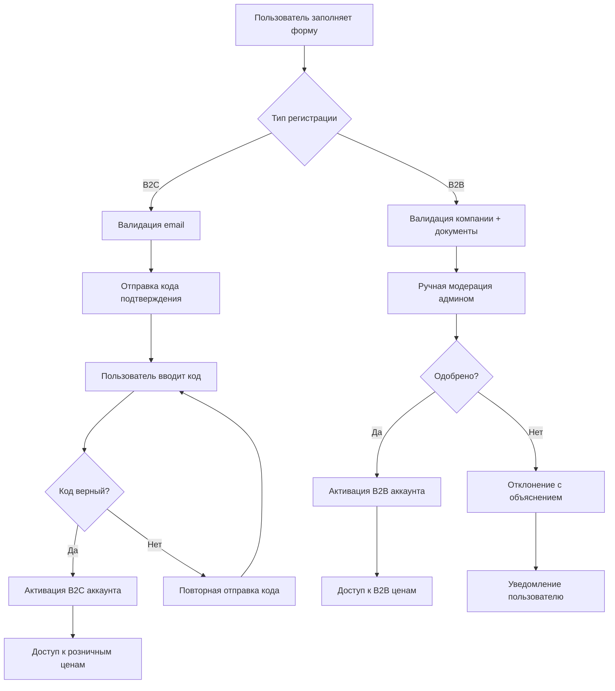

### Процесс создания заказа

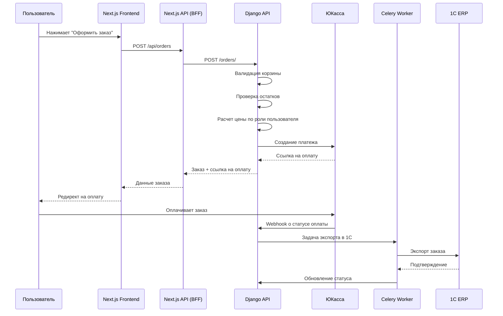

### Процесс синхронизации с 1С

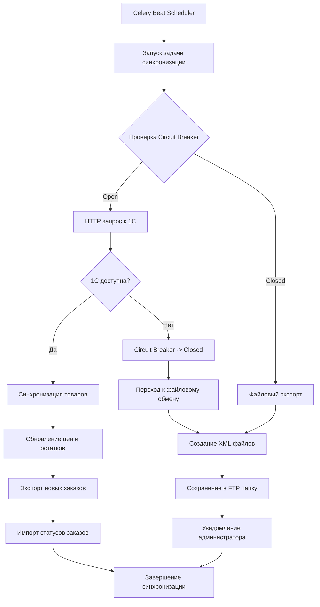

### Workflow управления ценами

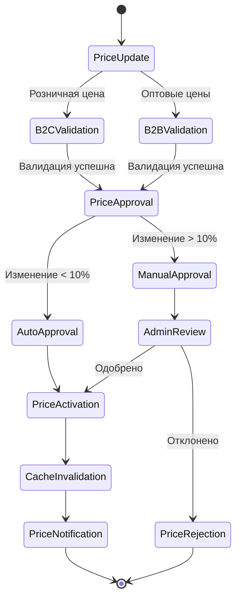

### Процесс обработки возвратов

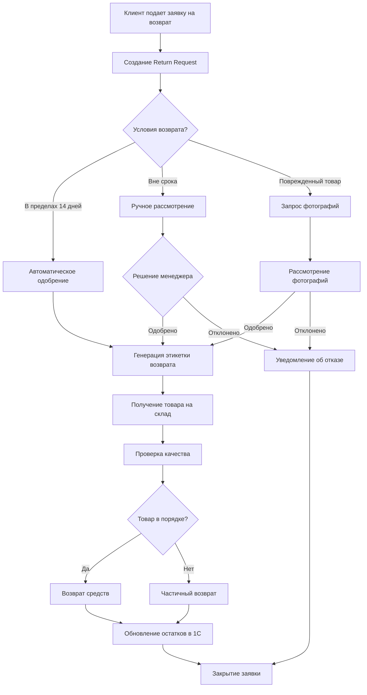

---

## 9. Схема Базы Данных

### Дизайн базы данных PostgreSQL

#### Основные таблицы

```sql
-- Users and Authentication
CREATE TABLE users_user (
    id SERIAL PRIMARY KEY,
    email VARCHAR(254) UNIQUE NOT NULL,
    first_name VARCHAR(150),
    last_name VARCHAR(150),
    phone VARCHAR(20),
    role VARCHAR(20) DEFAULT 'retail',
    company_name VARCHAR(200),
    tax_id VARCHAR(50),
    is_active BOOLEAN DEFAULT FALSE,
    is_verified BOOLEAN DEFAULT FALSE,
    verification_token VARCHAR(100),
    created_at TIMESTAMP WITH TIME ZONE DEFAULT NOW(),
    updated_at TIMESTAMP WITH TIME ZONE DEFAULT NOW()
);

CREATE INDEX idx_users_email ON users_user(email);
CREATE INDEX idx_users_role ON users_user(role);
CREATE INDEX idx_users_company ON users_user(company_name) WHERE company_name IS NOT NULL;

-- Brands
CREATE TABLE products_brand (
    id SERIAL PRIMARY KEY,
    name VARCHAR(100) UNIQUE NOT NULL,
    slug VARCHAR(100) UNIQUE NOT NULL,
    logo VARCHAR(255),
    description TEXT,
    website VARCHAR(200),
    is_active BOOLEAN DEFAULT TRUE,
    created_at TIMESTAMP WITH TIME ZONE DEFAULT NOW(),
    updated_at TIMESTAMP WITH TIME ZONE DEFAULT NOW()
);

-- Categories with hierarchical structure
CREATE TABLE products_category (
    id SERIAL PRIMARY KEY,
    name VARCHAR(200) NOT NULL,
    slug VARCHAR(100) UNIQUE NOT NULL,
    parent_id INTEGER REFERENCES products_category(id),
    description TEXT,
    image VARCHAR(255),
    is_active BOOLEAN DEFAULT TRUE,
    sort_order INTEGER DEFAULT 0,
    seo_title VARCHAR(200),
    seo_description TEXT,
    created_at TIMESTAMP WITH TIME ZONE DEFAULT NOW(),
    updated_at TIMESTAMP WITH TIME ZONE DEFAULT NOW()
);

-- Products table with partitioning by brand_id
CREATE TABLE products_product (
    id SERIAL PRIMARY KEY,
    name VARCHAR(300) NOT NULL,
    slug VARCHAR(100) UNIQUE NOT NULL,
    brand_id INTEGER NOT NULL REFERENCES products_brand(id),
    category_id INTEGER NOT NULL REFERENCES products_category(id),
    description TEXT,
    short_description VARCHAR(500),
    
    -- Multi-tier pricing structure
    retail_price DECIMAL(10,2) NOT NULL,
    opt1_price DECIMAL(10,2),
    opt2_price DECIMAL(10,2), 
    opt3_price DECIMAL(10,2),
    trainer_price DECIMAL(10,2),
    federation_price DECIMAL(10,2),
    
    -- RRP/MSRP для B2B пользователей (FR5)
    recommended_retail_price DECIMAL(10,2),
    max_suggested_retail_price DECIMAL(10,2),
    
    -- Inventory
    sku VARCHAR(100) UNIQUE NOT NULL,
    stock_quantity INTEGER DEFAULT 0,
    min_order_quantity INTEGER DEFAULT 1,
    
    -- Images stored as JSONB for flexibility
    main_image VARCHAR(255),
    gallery_images JSONB DEFAULT '[]',
    
    -- SEO & Search
    seo_title VARCHAR(200),
    seo_description TEXT,
    search_vector TSVECTOR, -- Full-text search
    
    -- Status flags
    is_active BOOLEAN DEFAULT TRUE,
    is_featured BOOLEAN DEFAULT FALSE,
    
    -- Integration & Timestamps
    onec_id VARCHAR(100),
    last_sync_at TIMESTAMP WITH TIME ZONE,
    created_at TIMESTAMP WITH TIME ZONE DEFAULT NOW(),
    updated_at TIMESTAMP WITH TIME ZONE DEFAULT NOW(),
    
    CONSTRAINT chk_positive_prices CHECK (
        retail_price > 0 AND
        (opt1_price IS NULL OR opt1_price > 0) AND
        (opt2_price IS NULL OR opt2_price > 0) AND
        (opt3_price IS NULL OR opt3_price > 0) AND
        (trainer_price IS NULL OR trainer_price > 0) AND
        (federation_price IS NULL OR federation_price > 0)
    ),
    CONSTRAINT chk_stock_non_negative CHECK (stock_quantity >= 0)
) PARTITION BY HASH (brand_id);

-- Orders with time-based partitioning
CREATE TABLE orders_order (
    id SERIAL,
    order_number VARCHAR(50) UNIQUE NOT NULL,
    user_id INTEGER REFERENCES users_user(id),
    
    -- Customer info for guest orders
    customer_name VARCHAR(200),
    customer_email VARCHAR(254),
    customer_phone VARCHAR(20),
    
    -- Order details
    status VARCHAR(50) DEFAULT 'pending',
    total_amount DECIMAL(10,2) NOT NULL,
    discount_amount DECIMAL(10,2) DEFAULT 0,
    delivery_cost DECIMAL(10,2) DEFAULT 0,
    
    -- Delivery
    delivery_address TEXT NOT NULL,
    delivery_method VARCHAR(50),
    delivery_date DATE,
    
    -- Payment
    payment_method VARCHAR(50),
    payment_status VARCHAR(50) DEFAULT 'pending',
    payment_id VARCHAR(100),
    
    -- B2B specific
    company_name VARCHAR(200),
    tax_id VARCHAR(50),
    purchase_order_number VARCHAR(100),
    
    -- Integration & audit
    onec_id VARCHAR(100),
    notes TEXT,
    created_at TIMESTAMP WITH TIME ZONE DEFAULT NOW(),
    updated_at TIMESTAMP WITH TIME ZONE DEFAULT NOW(),
    
    PRIMARY KEY (id, created_at)
) PARTITION BY RANGE (created_at);

-- Order Items с композитным FOREIGN KEY для секционированных таблиц
CREATE TABLE orders_orderitem (
    id SERIAL PRIMARY KEY,
    order_id INTEGER NOT NULL,
    order_created_at TIMESTAMP WITH TIME ZONE NOT NULL, -- Обязательно для FOREIGN KEY
    product_id INTEGER NOT NULL REFERENCES products_product(id),
    quantity INTEGER NOT NULL,
    unit_price DECIMAL(10,2) NOT NULL,
    total_price DECIMAL(10,2) NOT NULL,
    
    -- Snapshot of product data at time of order
    product_name VARCHAR(300) NOT NULL,
    product_sku VARCHAR(100) NOT NULL,
    
    -- Композитный FOREIGN KEY включающий partition key
    FOREIGN KEY (order_id, order_created_at) REFERENCES orders_order(id, created_at) ON DELETE CASCADE,
    
    CONSTRAINT chk_positive_quantity CHECK (quantity > 0),
    CONSTRAINT chk_positive_prices CHECK (unit_price > 0 AND total_price > 0)
);

-- Shopping Cart
CREATE TABLE cart_cart (
    id SERIAL PRIMARY KEY,
    user_id INTEGER UNIQUE REFERENCES users_user(id),
    session_key VARCHAR(100),  -- For guest users
    created_at TIMESTAMP WITH TIME ZONE DEFAULT NOW(),
    updated_at TIMESTAMP WITH TIME ZONE DEFAULT NOW()
);

CREATE TABLE cart_cartitem (
    id SERIAL PRIMARY KEY,
    cart_id INTEGER NOT NULL REFERENCES cart_cart(id) ON DELETE CASCADE,
    product_id INTEGER NOT NULL REFERENCES products_product(id),
    quantity INTEGER NOT NULL DEFAULT 1,
    added_at TIMESTAMP WITH TIME ZONE DEFAULT NOW(),
    
    UNIQUE(cart_id, product_id),
    CONSTRAINT chk_positive_quantity CHECK (quantity > 0)
);
```

#### Индексы для производительности

```sql
-- Product search and filtering indexes
CREATE INDEX idx_products_brand ON products_product(brand_id);
CREATE INDEX idx_products_category ON products_product(category_id);
CREATE INDEX idx_products_active ON products_product(is_active) WHERE is_active = true;
CREATE INDEX idx_products_featured ON products_product(is_featured) WHERE is_featured = true;
CREATE INDEX idx_products_stock ON products_product(stock_quantity) WHERE stock_quantity > 0;
CREATE INDEX idx_products_price_retail ON products_product(retail_price);
CREATE INDEX idx_products_search ON products_product USING gin(search_vector);
CREATE INDEX idx_products_onec ON products_product(onec_id) WHERE onec_id IS NOT NULL;

-- Order indexes
CREATE INDEX idx_orders_user ON orders_order(user_id);
CREATE INDEX idx_orders_status ON orders_order(status);
CREATE INDEX idx_orders_payment ON orders_order(payment_id) WHERE payment_id IS NOT NULL;
CREATE INDEX idx_orders_created ON orders_order(created_at);
CREATE INDEX idx_orders_onec ON orders_order(onec_id) WHERE onec_id IS NOT NULL;

-- Order items indexes (включая order_created_at для эффективного JOIN)
CREATE INDEX idx_orderitems_order_composite ON orders_orderitem(order_id, order_created_at);
CREATE INDEX idx_orderitems_product ON orders_orderitem(product_id);

-- Cart indexes
CREATE INDEX idx_cart_user ON cart_cart(user_id) WHERE user_id IS NOT NULL;
CREATE INDEX idx_cart_session ON cart_cart(session_key) WHERE session_key IS NOT NULL;
CREATE INDEX idx_cartitems_cart ON cart_cartitem(cart_id);
CREATE INDEX idx_cartitems_product ON cart_cartitem(product_id);

-- Category hierarchy indexes
CREATE INDEX idx_categories_parent ON products_category(parent_id) WHERE parent_id IS NOT NULL;
CREATE INDEX idx_categories_active ON products_category(is_active) WHERE is_active = true;
```

#### Полнотекстовый поиск

```sql
-- Full-Text Search Configuration
CREATE TEXT SEARCH CONFIGURATION russian_products (COPY = russian);

-- Update search vector trigger
CREATE OR REPLACE FUNCTION update_product_search_vector() 
RETURNS TRIGGER AS $$
BEGIN
    NEW.search_vector := 
        setweight(to_tsvector('russian_products', COALESCE(NEW.name, '')), 'A') ||
        setweight(to_tsvector('russian_products', COALESCE(NEW.description, '')), 'B') ||
        setweight(to_tsvector('russian_products', COALESCE(NEW.short_description, '')), 'C');
    RETURN NEW;
END;
$$ LANGUAGE plpgsql;

CREATE TRIGGER trigger_update_product_search
    BEFORE INSERT OR UPDATE ON products_product
    FOR EACH ROW EXECUTE FUNCTION update_product_search_vector();
```

#### Секционирование для масштабируемости

```sql
-- Create partitions for products table (by brand hash)
CREATE TABLE products_product_0 PARTITION OF products_product
    FOR VALUES WITH (modulus 4, remainder 0);
CREATE TABLE products_product_1 PARTITION OF products_product
    FOR VALUES WITH (modulus 4, remainder 1);
CREATE TABLE products_product_2 PARTITION OF products_product
    FOR VALUES WITH (modulus 4, remainder 2);
CREATE TABLE products_product_3 PARTITION OF products_product
    FOR VALUES WITH (modulus 4, remainder 3);

-- Create partitions for orders table (by month)
CREATE TABLE orders_order_2024_01 PARTITION OF orders_order
    FOR VALUES FROM ('2024-01-01') TO ('2024-02-01');
CREATE TABLE orders_order_2024_02 PARTITION OF orders_order
    FOR VALUES FROM ('2024-02-01') TO ('2024-03-01');
-- ... continue for other months

-- Automatic partition creation function
CREATE OR REPLACE FUNCTION create_monthly_partition()
RETURNS void AS $$
DECLARE
    start_date DATE;
    end_date DATE;
    partition_name TEXT;
BEGIN
    start_date := date_trunc('month', NOW());
    end_date := start_date + INTERVAL '1 month';
    partition_name := 'orders_order_' || to_char(start_date, 'YYYY_MM');
    
    EXECUTE format('CREATE TABLE IF NOT EXISTS %I PARTITION OF orders_order
                    FOR VALUES FROM (%L) TO (%L)',
                   partition_name, start_date, end_date);
END;
$$ LANGUAGE plpgsql;
```

#### Специальные таблицы для ФЗ-152 соответствия

```sql
-- Personal data audit log (ФЗ-152 compliance)
CREATE TABLE compliance_personaldatalog (
    id SERIAL PRIMARY KEY,
    user_id INTEGER REFERENCES users_user(id) ON DELETE SET NULL,
    action VARCHAR(100) NOT NULL,
    data_type VARCHAR(100) NOT NULL,
    processed_data JSONB,
    purpose VARCHAR(200),
    legal_basis VARCHAR(200),
    ip_address INET,
    user_agent TEXT,
    processed_at TIMESTAMP WITH TIME ZONE DEFAULT NOW(),
    
    CONSTRAINT chk_required_fields CHECK (
        action IS NOT NULL AND 
        data_type IS NOT NULL AND
        processed_at IS NOT NULL
    )
);

-- Consent management for GDPR/ФЗ-152
CREATE TABLE compliance_consent (
    id SERIAL PRIMARY KEY,
    user_id INTEGER NOT NULL REFERENCES users_user(id) ON DELETE CASCADE,
    consent_type VARCHAR(100) NOT NULL,
    is_given BOOLEAN NOT NULL DEFAULT false,
    given_at TIMESTAMP WITH TIME ZONE,
    withdrawn_at TIMESTAMP WITH TIME ZONE,
    ip_address INET,
    user_agent TEXT,
    created_at TIMESTAMP WITH TIME ZONE DEFAULT NOW(),
    updated_at TIMESTAMP WITH TIME ZONE DEFAULT NOW(),
    
    UNIQUE(user_id, consent_type)
);

-- Sync logs for 1C integration monitoring
CREATE TABLE integrations_synclog (
    id SERIAL PRIMARY KEY,
    sync_type VARCHAR(50) NOT NULL,
    status VARCHAR(20) NOT NULL,
    records_processed INTEGER DEFAULT 0,
    errors_count INTEGER DEFAULT 0,
    error_details JSONB DEFAULT '[]',
    started_at TIMESTAMP WITH TIME ZONE DEFAULT NOW(),
    completed_at TIMESTAMP WITH TIME ZONE,
    
    CONSTRAINT chk_status CHECK (status IN ('started', 'completed', 'failed'))
);

CREATE INDEX idx_synclog_type_status ON integrations_synclog(sync_type, status);
CREATE INDEX idx_synclog_started ON integrations_synclog(started_at);
```

#### Хранимые процедуры для бизнес-логики

```sql
-- Function to get price by user role
CREATE OR REPLACE FUNCTION get_user_price(
    p_product_id INTEGER,
    p_user_role VARCHAR(20)
) RETURNS DECIMAL(10,2) AS $$
DECLARE
    product_record RECORD;
    result_price DECIMAL(10,2);
BEGIN
    SELECT * INTO product_record 
    FROM products_product 
    WHERE id = p_product_id AND is_active = true;
    
    IF NOT FOUND THEN
        RAISE EXCEPTION 'Product not found or inactive: %', p_product_id;
    END IF;
    
    result_price := CASE p_user_role
        WHEN 'retail' THEN product_record.retail_price
        WHEN 'wholesale_level1' THEN COALESCE(product_record.opt1_price, product_record.retail_price)
        WHEN 'wholesale_level2' THEN COALESCE(product_record.opt2_price, product_record.retail_price)
        WHEN 'wholesale_level3' THEN COALESCE(product_record.opt3_price, product_record.retail_price)
        WHEN 'trainer' THEN COALESCE(product_record.trainer_price, product_record.retail_price)
        WHEN 'federation_rep' THEN COALESCE(product_record.federation_price, product_record.retail_price)
        ELSE product_record.retail_price
    END;
    
    RETURN result_price;
END;
$$ LANGUAGE plpgsql STABLE;

-- Function to calculate order total with user-specific pricing
CREATE OR REPLACE FUNCTION calculate_order_total(
    p_user_id INTEGER,
    p_cart_items JSONB
) RETURNS DECIMAL(10,2) AS $$
DECLARE
    user_role VARCHAR(20);
    item JSONB;
    total_amount DECIMAL(10,2) := 0;
    item_price DECIMAL(10,2);
BEGIN
    -- Get user role
    SELECT role INTO user_role FROM users_user WHERE id = p_user_id;
    
    -- Calculate total for each item
    FOR item IN SELECT * FROM jsonb_array_elements(p_cart_items)
    LOOP
        item_price := get_user_price(
            (item->>'product_id')::INTEGER,
            user_role
        );
        
        total_amount := total_amount + (item_price * (item->>'quantity')::INTEGER);
    END LOOP;
    
    RETURN total_amount;
END;
$$ LANGUAGE plpgsql STABLE;
```

#### Важные архитектурные решения

**1. Композитный FOREIGN KEY для секционированных таблиц:**
- `orders_orderitem` включает `order_created_at` для корректной работы с секционированной `orders_order`
- Это обеспечивает referential integrity на уровне БД

**2. Секционирование:**
- `products_product` - по hash от `brand_id` для равномерного распределения
- `orders_order` - по range от `created_at` для эффективного архивирования

**3. Ценообразование:**
- Multi-tier pricing с поддержкой всех типов пользователей
- RRP/MSRP поля для B2B пользователей (требование FR5)

**4. Соответствие ФЗ-152:**
- Audit log с `ON DELETE SET NULL` для сохранения аудита
- Система согласий (consent management)

---

## 10. Стратегия Тестирования

### Пирамида тестирования

```
                  E2E Tests
                 /        \
            Integration Tests
               /            \
          Frontend Unit  Backend Unit
```

**Testing Philosophy:** Стратегия тестирования FREESPORT основана на классической пирамиде тестирования с упором на быстрые unit-тесты в основании и критически важные E2E тесты на вершине.

### Организация тестов

#### Frontend Tests

```
frontend/
├── __tests__/                     # Jest unit tests
│   ├── components/               # Component tests
│   │   ├── ProductCard.test.tsx
│   │   ├── Cart.test.tsx
│   │   └── UserProfile.test.tsx
│   ├── hooks/                    # Custom hooks tests
│   │   ├── useAuth.test.ts
│   │   ├── useCart.test.ts
│   │   └── useProducts.test.ts
│   ├── services/                 # API service tests
│   │   ├── authService.test.ts
│   │   ├── productService.test.ts
│   │   └── orderService.test.ts
│   └── utils/                    # Utility function tests
│       ├── formatPrice.test.ts
│       ├── validation.test.ts
│       └── api-client.test.ts
├── __mocks__/                    # Mock implementations
│   ├── api-responses/
│   └── localStorage.js
└── jest.config.js                # Jest configuration
```

**Frontend Testing Stack:**
- **Jest**: Unit testing framework
- **React Testing Library**: Component testing
- **MSW (Mock Service Worker)**: API mocking
- **Jest Environment**: jsdom для браузерной среды

#### Backend Tests

```
backend/
├── tests/                        # Django tests
│   ├── unit/                     # Unit tests
│   │   ├── models/              # Model tests
│   │   │   ├── test_user.py
│   │   │   ├── test_product.py
│   │   │   └── test_order.py
│   │   ├── serializers/         # Serializer tests
│   │   │   ├── test_user_serializers.py
│   │   │   └── test_product_serializers.py
│   │   └── services/            # Business logic tests
│   │       ├── test_auth_service.py
│   │       ├── test_cart_service.py
│   │       └── test_order_service.py
│   ├── integration/              # Integration tests
│   │   ├── test_api_endpoints.py
│   │   ├── test_1c_integration.py
│   │   └── test_yukassa_integration.py
│   └── fixtures/                 # Test data fixtures
│       ├── products.json
│       ├── users.json
│       └── orders.json
├── conftest.py                   # pytest configuration
└── pytest.ini                   # pytest settings
```

**Backend Testing Stack:**
- **pytest**: Primary testing framework
- **pytest-django**: Django integration
- **Factory Boy**: Test data generation
- **pytest-mock**: Mocking utilities
- **Django Test Database**: Isolated test database

#### E2E Tests

```
e2e/
├── tests/                        # Playwright E2E tests
│   ├── auth/                     # Authentication flows
│   │   ├── b2b-registration.spec.ts
│   │   ├── b2c-login.spec.ts
│   │   └── password-recovery.spec.ts
│   ├── catalog/                  # Product catalog tests
│   │   ├── product-search.spec.ts
│   │   ├── product-filtering.spec.ts
│   │   └── product-details.spec.ts
│   ├── checkout/                 # Order placement tests
│   │   ├── b2b-checkout.spec.ts
│   │   ├── b2c-checkout.spec.ts
│   │   └── payment-flow.spec.ts
│   └── admin/                    # Admin panel tests
│       ├── order-management.spec.ts
│       └── user-management.spec.ts
├── fixtures/                     # Test data
├── page-objects/                 # Page Object Pattern
│   ├── HomePage.ts
│   ├── ProductPage.ts
│   └── CheckoutPage.ts
├── utils/                        # Test utilities
└── playwright.config.ts          # Playwright configuration
```

**E2E Testing Stack:**
- **Playwright**: Primary E2E framework
- **TypeScript**: Type-safe test scripts
- **Page Object Model**: Maintainable test structure
- **Multiple Browsers**: Chrome, Firefox, Safari testing

### Примеры тестов

#### Frontend Component Test с ценообразованием по ролям

```typescript
// ProductCard.test.tsx
import { render, screen, fireEvent } from '@testing-library/react';
import { ProductCard } from '../ProductCard';
import { CartProvider } from '../../contexts/CartContext';

const mockProduct = {
  id: 1,
  name: 'Test Product',
  retail_price: 1200,
  opt1_price: 1000,
  trainer_price: 950,
  recommended_retail_price: 1300, // RRP для B2B
  max_suggested_retail_price: 1400, // MSRP для B2B
  main_image: '/test-image.jpg',
  stock_quantity: 50
};

describe('ProductCard', () => {
  it('displays retail pricing for B2C users', () => {
    render(
      <CartProvider>
        <ProductCard product={mockProduct} userRole="retail" />
      </CartProvider>
    );

    expect(screen.getByText('1 200 ₽')).toBeInTheDocument();
    expect(screen.queryByText('РРЦ:')).not.toBeInTheDocument(); // RRP не показывается B2C
    expect(screen.queryByText('Макс. цена:')).not.toBeInTheDocument(); // MSRP не показывается B2C
  });

  it('displays wholesale pricing and RRP/MSRP for B2B users', () => {
    render(
      <CartProvider>
        <ProductCard product={mockProduct} userRole="wholesale_level1" showRRP={true} showMSRP={true} />
      </CartProvider>
    );

    // Показывает оптовую цену как основную
    expect(screen.getByText('1 000 ₽')).toBeInTheDocument();
    
    // Показывает RRP и MSRP для B2B пользователей (FR5)
    expect(screen.getByText('РРЦ: 1 300 ₽')).toBeInTheDocument();
    expect(screen.getByText('Макс. цена: 1 400 ₽')).toBeInTheDocument();
  });

  it('displays trainer pricing for trainers', () => {
    render(
      <CartProvider>
        <ProductCard product={mockProduct} userRole="trainer" />
      </CartProvider>
    );

    expect(screen.getByText('950 ₽')).toBeInTheDocument();
    expect(screen.getByText('Цена для тренеров')).toBeInTheDocument();
  });
});
```

#### Backend API Test с тестированием ролевого ценообразования

```python
# test_api_endpoints.py
import pytest
from rest_framework.test import APIClient
from rest_framework import status
from django.contrib.auth import get_user_model
from apps.products.models import Product, Category, Brand

User = get_user_model()

@pytest.fixture
def api_client():
    return APIClient()

@pytest.fixture 
def sample_product(db):
    brand = Brand.objects.create(name='Test Brand', slug='test-brand')
    category = Category.objects.create(name='Test Category', slug='test-category')
    return Product.objects.create(
        name='Test Product',
        slug='test-product',
        brand=brand,
        category=category,
        retail_price=1200,
        opt1_price=1000,
        opt2_price=950,
        opt3_price=900,
        trainer_price=950,
        federation_price=800,
        # RRP/MSRP для B2B пользователей (FR5)
        recommended_retail_price=1300,
        max_suggested_retail_price=1400,
        stock_quantity=100
    )

@pytest.fixture
def users(db):
    return {
        'retail': User.objects.create_user(
            email='retail@test.com', 
            password='test123', 
            role='retail',
            is_active=True
        ),
        'wholesale': User.objects.create_user(
            email='wholesale@test.com', 
            password='test123', 
            role='wholesale_level1',
            is_active=True,
            is_verified=True
        ),
        'trainer': User.objects.create_user(
            email='trainer@test.com', 
            password='test123', 
            role='trainer',
            is_active=True,
            is_verified=True
        ),
        'federation': User.objects.create_user(
            email='federation@test.com', 
            password='test123', 
            role='federation_rep',
            is_active=True,
            is_verified=True
        )
    }

class TestPricingByUserRole:
    """Тестирование ценообразования по ролям пользователей"""
    
    def test_retail_user_gets_retail_price(self, api_client, users, sample_product):
        """B2C пользователь получает розничную цену без RRP/MSRP"""
        api_client.force_authenticate(user=users['retail'])
        response = api_client.get(f'/api/v1/products/{sample_product.id}/')
        
        assert response.status_code == status.HTTP_200_OK
        assert response.data['current_price'] == 1200  # retail_price
        assert response.data['price_type'] == 'retail'
        # RRP/MSRP не отображаются для B2C пользователей (FR5)
        assert response.data['recommended_retail_price'] is None
        assert response.data['max_suggested_retail_price'] is None

    def test_b2b_user_gets_wholesale_price_with_rrp_msrp(self, api_client, users, sample_product):
        """B2B пользователь получает оптовую цену + RRP/MSRP"""
        api_client.force_authenticate(user=users['wholesale'])
        response = api_client.get(f'/api/v1/products/{sample_product.id}/')
        
        assert response.status_code == status.HTTP_200_OK
        assert response.data['current_price'] == 1000  # opt1_price
        assert response.data['price_type'] == 'wholesale_level1'
        # RRP/MSRP отображаются для B2B пользователей (FR5)
        assert response.data['recommended_retail_price'] == 1300
        assert response.data['max_suggested_retail_price'] == 1400

    def test_trainer_gets_trainer_price(self, api_client, users, sample_product):
        """Тренер получает специальную цену для тренеров"""
        api_client.force_authenticate(user=users['trainer'])
        response = api_client.get(f'/api/v1/products/{sample_product.id}/')
        
        assert response.status_code == status.HTTP_200_OK
        assert response.data['current_price'] == 950  # trainer_price
        assert response.data['price_type'] == 'trainer'
        # Тренеры тоже B2B пользователи, видят RRP/MSRP (FR5)
        assert response.data['recommended_retail_price'] == 1300
        assert response.data['max_suggested_retail_price'] == 1400

    def test_federation_gets_federation_price(self, api_client, users, sample_product):
        """Представитель федерации получает самую низкую цену"""
        api_client.force_authenticate(user=users['federation'])
        response = api_client.get(f'/api/v1/products/{sample_product.id}/')
        
        assert response.status_code == status.HTTP_200_OK
        assert response.data['current_price'] == 800  # federation_price
        assert response.data['price_type'] == 'federation'
        # Федералы тоже B2B пользователи, видят RRP/MSRP (FR5) 
        assert response.data['recommended_retail_price'] == 1300
        assert response.data['max_suggested_retail_price'] == 1400

class TestOrderCreationWithPricing:
    """Тестирование создания заказов с правильным ценообразованием"""
    
    def test_b2c_order_uses_retail_pricing(self, api_client, users, sample_product):
        """B2C заказ использует розничное ценообразование"""
        api_client.force_authenticate(user=users['retail'])
        
        order_data = {
            'items': [{'product_id': sample_product.id, 'quantity': 2}],
            'delivery_address': 'Test Address',
            'payment_method': 'yukassa'
        }
        
        response = api_client.post('/api/v1/orders/', order_data, format='json')
        
        assert response.status_code == status.HTTP_201_CREATED
        assert response.data['total_amount'] == 2400  # 2 * 1200 (retail_price)
        
    def test_b2b_order_uses_wholesale_pricing(self, api_client, users, sample_product):
        """B2B заказ использует оптовое ценообразование"""
        api_client.force_authenticate(user=users['wholesale'])
        
        order_data = {
            'items': [{'product_id': sample_product.id, 'quantity': 10}],
            'delivery_address': 'Business Address',
            'payment_method': 'invoice',
            'company_name': 'Test Company LLC',
            'tax_id': '1234567890',
            'purchase_order_number': 'PO-2024-001'
        }
        
        response = api_client.post('/api/v1/orders/', order_data, format='json')
        
        assert response.status_code == status.HTTP_201_CREATED
        assert response.data['total_amount'] == 10000  # 10 * 1000 (opt1_price)
        assert response.data['company_name'] == 'Test Company LLC'
        assert response.data['purchase_order_number'] == 'PO-2024-001'
```

#### E2E Test для B2B функциональности

```typescript
// b2b-checkout.spec.ts
import { test, expect } from '@playwright/test';

test.describe('B2B Pricing and Checkout', () => {
  test.beforeEach(async ({ page }) => {
    // Login as B2B user
    await page.goto('/login');
    await page.fill('[data-testid="email-input"]', 'wholesale@test.com');
    await page.fill('[data-testid="password-input"]', 'test123');
    await page.click('[data-testid="login-button"]');
    await expect(page).toHaveURL('/dashboard');
  });

  test('displays B2B pricing with RRP/MSRP information', async ({ page }) => {
    await page.goto('/products/test-product');
    
    // Проверяем оптовую цену
    await expect(page.locator('[data-testid="current-price"]')).toContainText('1 000 ₽');
    await expect(page.locator('[data-testid="price-type"]')).toContainText('Оптовая цена');
    
    // Проверяем отображение RRP/MSRP для B2B пользователей (FR5)
    await expect(page.locator('[data-testid="rrp-price"]')).toContainText('РРЦ: 1 300 ₽');
    await expect(page.locator('[data-testid="msrp-price"]')).toContainText('Макс. цена: 1 400 ₽');
  });

  test('completes B2B checkout with company information', async ({ page }) => {
    // Add product to cart
    await page.goto('/products/test-product');
    await page.fill('[data-testid="quantity-input"]', '10');
    await page.click('[data-testid="add-to-cart"]');
    
    // Go to checkout
    await page.click('[data-testid="cart-icon"]');
    await page.click('[data-testid="checkout-button"]');
    
    // Verify B2B pricing in cart
    await expect(page.locator('[data-testid="line-total"]')).toContainText('10 000 ₽'); // 10 * 1000
    
    // Fill B2B-specific checkout form
    await page.selectOption('[data-testid="payment-method"]', 'invoice');
    await page.fill('[data-testid="company-name"]', 'Test Company LLC');
    await page.fill('[data-testid="tax-id"]', '1234567890');
    await page.fill('[data-testid="po-number"]', 'PO-2024-001');
    await page.fill('[data-testid="delivery-address"]', 'Business Address');
    
    // Submit order
    await page.click('[data-testid="place-order-button"]');
    
    // Verify order confirmation with B2B details
    await expect(page.locator('[data-testid="order-success"]')).toBeVisible();
    await expect(page.locator('[data-testid="order-total"]')).toContainText('10 000 ₽');
    await expect(page.locator('[data-testid="company-name"]')).toContainText('Test Company LLC');
    await expect(page.locator('[data-testid="po-number"]')).toContainText('PO-2024-001');
  });

  test('prevents retail users from seeing RRP/MSRP', async ({ page }) => {
    // Logout and login as retail user
    await page.click('[data-testid="logout-button"]');
    await page.fill('[data-testid="email-input"]', 'retail@test.com');
    await page.fill('[data-testid="password-input"]', 'test123');
    await page.click('[data-testid="login-button"]');
    
    await page.goto('/products/test-product');
    
    // Проверяем розничную цену
    await expect(page.locator('[data-testid="current-price"]')).toContainText('1 200 ₽');
    
    // RRP/MSRP НЕ должны отображаться для B2C пользователей (FR5)
    await expect(page.locator('[data-testid="rrp-price"]')).not.toBeVisible();
    await expect(page.locator('[data-testid="msrp-price"]')).not.toBeVisible();
  });
});
```

### Конфигурация тестирования

#### Frontend Test Configuration

```javascript
// jest.config.js
module.exports = {
  testEnvironment: 'jsdom',
  setupFilesAfterEnv: ['<rootDir>/src/setupTests.ts'],
  moduleNameMapping: {
    '^@/(.*)$': '<rootDir>/src/$1',
    '^@shared/(.*)$': '<rootDir>/../packages/shared/src/$1'
  },
  collectCoverageFrom: [
    'src/**/*.{ts,tsx}',
    '!src/**/*.d.ts',
    '!src/main.tsx'
  ],
  coverageThreshold: {
    global: {
      branches: 70,
      functions: 70,
      lines: 70,
      statements: 70
    }
  }
};
```

#### Backend Test Configuration

```ini
# pytest.ini
[tool:pytest]
DJANGO_SETTINGS_MODULE = config.settings.test
addopts = 
    --tb=short
    --cov=apps
    --cov-report=term-missing
    --cov-report=xml
    --cov-fail-under=70
markers =
    slow: marks tests as slow
    integration: marks tests as integration tests
    unit: marks tests as unit tests
```

### Команды выполнения тестов

```bash
# Frontend Tests
npm run test:frontend              # Run all frontend tests
npm run test:frontend:watch        # Watch mode for development  
npm run test:frontend:coverage     # With coverage report

# Backend Tests  
pytest                            # Run all backend tests
pytest -m unit                    # Only unit tests
pytest -m integration            # Only integration tests
pytest --cov                     # With coverage

# E2E Tests
npx playwright test               # All E2E tests
npx playwright test --headed     # With browser UI
npx playwright test --project=chromium  # Specific browser

# All Tests
npm run test:all                  # Run complete test suite
```

### Контрольные точки качества

**Code Coverage Requirements:**
- Frontend: минимум 70% line coverage
- Backend: минимум 70% line coverage  
- Critical paths (ценообразование, заказы, платежи): минимум 90% coverage

**Performance Requirements:**
- Unit tests: < 5 минут общее время выполнения
- Integration tests: < 10 минут
- E2E tests: < 15 минут для полного набора

**Test Quality Metrics:**
- Все тесты детерминированные
- Критические user journeys покрыты E2E тестами
- Ценообразование по ролям протестировано на всех уровнях

---

## 11. Безопасность и Производительность

### Архитектура безопасности

**Authentication & Authorization:**
```python
# JWT Token Configuration
SIMPLE_JWT = {
    'ACCESS_TOKEN_LIFETIME': timedelta(minutes=60),
    'REFRESH_TOKEN_LIFETIME': timedelta(days=7),
    'ROTATE_REFRESH_TOKENS': True,
    'BLACKLIST_AFTER_ROTATION': True,
}

# Role-Based Access Control (RBAC)
ROLE_PERMISSIONS = {
    'admin': ['*'],
    'wholesale_level1': ['view_wholesale_prices', 'create_order'],
    'wholesale_level2': ['view_wholesale_prices', 'create_order'],
    'wholesale_level3': ['view_wholesale_prices', 'create_order'],
    'trainer': ['view_trainer_prices', 'create_order', 'manage_team'],
    'federation_rep': ['view_federation_prices', 'manage_federation'],
    'retail': ['view_retail_prices', 'create_order'],
}
```

**Rate Limiting по ролям:**
- Admin: 10000/час
- B2B users: 5000/час
- Trainers: 3000/час
- Retail: 1000/час
- Anonymous: 100/час

### Производительность и SLA/SLO метрики

**Service Level Agreements (SLA):**
- **Доступность системы:** 99.9% uptime (8.76 часов downtime в год)
- **Время отклика API:** 95 percentile < 200ms
- **Время отклика страниц:** 95 percentile < 2 секунды
- **PageSpeed Insights:** > 85 для всех ключевых страниц
- **Пропускная способность:** минимум 1000 RPS

**Service Level Objectives (SLO):**
- **API Response Time:**
  - GET endpoints: < 100ms (95 percentile)
  - POST endpoints: < 200ms (95 percentile)
  - Сложные запросы (поиск, фильтры): < 500ms (95 percentile)
  
- **Database Performance:**
  - Простые SELECT: < 10ms
  - Сложные JOIN: < 50ms
  - Индексированные поиски: < 25ms
  
- **Frontend Performance:**
  - First Contentful Paint (FCP): < 1.2s
  - Largest Contentful Paint (LCP): < 2.5s
  - Cumulative Layout Shift (CLS): < 0.1
  - First Input Delay (FID): < 100ms
  
- **Cache Hit Rates:**
  - Redis cache: > 85%
  - Browser cache: > 90%
  - CDN cache: > 95%

**Error Rate Targets:**
- API errors: < 0.1% (4xx и 5xx ошибки)
- Payment failures: < 0.5%
- 1C integration failures: < 1% (с retry механизмом)

**Capacity Planning:**
- Concurrent users: до 500 одновременных пользователей
- Daily orders: до 1000 заказов в день
- Product catalog: до 100,000 товаров
- Storage growth: 50GB в год

### ФЗ-152 Compliance

**Обработка персональных данных:**
- Явное согласие пользователя на обработку ПД
- Логирование всех операций с персональными данными
- Возможность отзыва согласия и удаления данных
- Шифрование чувствительных данных в БД

**Категории данных:**
- Общие ПД: имя, email, телефон
- Коммерческие: компания, ИНН для B2B
- Согласия: маркетинг, аналитика, передача третьим лицам

### Инфраструктурная безопасность

**Docker Security:**
- Non-root users во всех контейнерах
- Read-only файловые системы
- Сети изолированы (frontend/backend/database)
- Secrets через Docker Swarm secrets

**Firewall Configuration:**
- UFW с точными правилами для портов
- Блокировка опасных портов (Telnet, RDP, SMB)
- Rate limiting на уровне сети
- Доступ SSH только из корпоративных сетей

**Nginx Security Headers:**
- Strict-Transport-Security (HSTS)
- Content-Security-Policy
- X-Frame-Options: DENY
- X-Content-Type-Options: nosniff

### Оптимизация производительности

**Database Performance:**
- Connection pooling через pgBouncer
- Query optimization с select_related/prefetch_related
- Redis caching с TTL стратегиями
- Partitioning для orders по времени

**Frontend Performance:**
- Next.js Image optimization с WebP/AVIF
- Bundle splitting и tree shaking
- Virtual scrolling для больших списков
- Client-side caching с stale-while-revalidate

**Cache Strategy:**
- Product list: 5 минут TTL
- Product detail: 10 минут TTL
- Category tree: 30 минут TTL
- User sessions: 1 час TTL

**CDN & Image Optimization:**
- Multi-size image generation (thumbnail/medium/large)
- WebP с JPEG fallback
- Nginx image serving с proper caching headers

---

## 12. Стратегия Обработки Ошибок

### Frontend Error Handling

**React Error Boundaries:**
- Global ErrorBoundary для перехвата React ошибок
- Component-level fallbacks для graceful degradation
- Automatic error reporting to monitoring service

**API Error Handling:**
```typescript
interface ApiError {
  message: string;
  code: string;
  details?: Record<string, any>;
  status: number;
}

// User-friendly error messages
const getErrorMessage = (error: ApiError): string => {
  switch (error.code) {
    case 'NETWORK_ERROR': return 'Проблемы с подключением к интернету';
    case 'VALIDATION_ERROR': return 'Проверьте правильность заполнения полей';
    case 'INSUFFICIENT_STOCK': return 'Товара нет в наличии';
    case 'PAYMENT_FAILED': return 'Ошибка при обработке платежа';
    default: return error.message || 'Произошла неизвестная ошибка';
  }
};
```

**Next.js Error Pages:**
- Custom error.tsx для глобальных ошибок
- not-found.tsx для 404 ошибок
- API route error handling с proper HTTP codes

### Backend Error Handling

**Custom Exception Classes:**
```python
class FreeSportException(Exception):
    default_message = "An error occurred"
    default_code = "FREESPORT_ERROR"
    default_status = status.HTTP_500_INTERNAL_SERVER_ERROR

class ValidationException(FreeSportException):
    default_code = "VALIDATION_ERROR"
    default_status = status.HTTP_400_BAD_REQUEST

class InsufficientStockException(FreeSportException):
    default_code = "INSUFFICIENT_STOCK"
    default_status = status.HTTP_409_CONFLICT

class PaymentException(FreeSportException):
    default_code = "PAYMENT_FAILED"
    default_status = status.HTTP_402_PAYMENT_REQUIRED
```

**Global Exception Handler:**
- Standardized error response format
- Automatic logging for all exceptions
- Different handling for custom vs system exceptions
- Database error fallbacks

**Service Layer Error Handling:**
- Transactional integrity для критических операций
- Graceful fallbacks для external service failures
- Retry logic с exponential backoff

### Circuit Breaker Pattern

**External Service Protection:**
- Circuit breaker для 1C интеграции
- Failure threshold: 5 неудач
- Recovery timeout: 60 секунд
- Fallback to file export при недоступности API

### Error Monitoring

**Error Aggregation:**
- Группировка одинаковых ошибок по hash
- Count tracking для частоты ошибок
- Resolution tracking для bug fixing

**Alert System:**
- Email alerts для critical errors
- Slack integration для development team
- Error rate monitoring и thresholds

**Error Categories:**
- Frontend errors (JavaScript/React)
- Backend errors (Django/API)
- Integration errors (1C/YuKassa)
- Database errors (PostgreSQL)

### Retry Strategies

**Celery Tasks:**
- Max 3 retries с exponential backoff
- Different retry delays по типу ошибки
- Final fallback mechanisms
- Admin notifications при complete failure

**API Calls:**
- Network timeout: 30 секунд
- Retry on 5xx errors (не на 4xx)
- Client-side retry с user feedback

---

## 13. Мониторинг и Наблюдаемость

### System Health Monitoring

**Key Metrics:**
- API response time (SLA: < 2 секунды)
- Database query time (SLA: < 1 секунда)
- Error rate (SLA: < 5%)
- System uptime (SLA: 99.9%)
- Resource utilization (CPU < 75%, Memory < 80%, Disk < 85%)

**Health Check Endpoints:**
```python
# /api/v1/health/ - comprehensive health status
{
  "status": "healthy|unhealthy",
  "version": "1.0.0",
  "environment": "production",
  "api": {
    "database": {"healthy": true, "response_time": 0.05},
    "cache": {"healthy": true, "response_time": 0.01},
    "data": {"products_count": 15000, "orders_24h": 45}
  },
  "system": {
    "cpu": {"usage_percent": 35.2, "healthy": true},
    "memory": {"usage_percent": 68.5, "healthy": true},
    "disk": {"usage_percent": 45.1, "healthy": true}
  }
}
```

### Business Metrics

**Sales Analytics:**
- Daily/weekly/monthly revenue tracking
- B2B vs B2C performance breakdown
- Average order value (AOV) trends
- Top performing products and categories
- Customer acquisition and retention metrics

**Operational Metrics:**
- Cart abandonment rate
- User registration trends
- Active sessions monitoring
- Integration health (1C sync success rate)
- Payment processing success rate

### Alert Management

**Alert Levels and Thresholds:**
- **Info**: General information (CPU > 50%)
- **Warning**: Attention needed (Response time > 1.5s)
- **Error**: Service degradation (Error rate > 2%)
- **Critical**: Service outage (Database down)

**Notification Channels:**
- Email alerts для error/critical levels
- Slack integration для critical alerts
- Dashboard notifications для all levels
- SMS alerts для critical infrastructure failures

**Auto-escalation Rules:**
- Critical alerts → immediate notification
- Unacknowledged alerts → escalate after 15 minutes
- Repeat alerts → suppress duplicates within 1 hour

### Monitoring Stack

**Infrastructure:**
- Prometheus для metrics collection
- Grafana для visualization и dashboards
- Custom Django health checks
- WebSocket real-time updates

**Application Monitoring:**
```python
class MetricsCollector:
    @staticmethod
    def get_system_metrics():
        return {
            'cpu_percent': psutil.cpu_percent(),
            'memory': psutil.virtual_memory()._asdict(),
            'disk': psutil.disk_usage('/')._asdict(),
            'timestamp': time.time()
        }
    
    @staticmethod
    def get_business_metrics():
        return {
            'daily_orders': Order.objects.filter(created_at__date=today).count(),
            'daily_revenue': Order.objects.filter(
                created_at__date=today, payment_status='completed'
            ).aggregate(Sum('total_amount'))['total_amount__sum'] or 0
        }
```

### Real-time Dashboard

**WebSocket Integration:**
- Live system metrics updates
- Real-time business KPIs
- Alert notifications
- Connection status monitoring

**Dashboard Features:**
- System resource utilization charts
- Business performance graphs
- Alert history и acknowledgment
- Integration status monitoring
- User activity heatmaps

### Automated Reporting

**Daily Reports:**
- System health summary
- Business performance overview
- Error rate analysis
- Integration status

**Weekly Reports:**
- Performance trends
- Business growth metrics
- System utilization patterns
- Alert frequency analysis

**Business Intelligence:**
- Revenue forecasting
- Customer behavior analysis
- Product performance insights
- Operational efficiency metrics

---

## 14. CI/CD Стратегия

### Deployment Strategy

**Environment-Specific Orchestration:**
- **Development/Staging**: Docker Compose (standalone)
- **Production**: Docker Swarm Mode (orchestrated cluster)

**Deployment Pipeline:**
1. **Feature branches** → код validation и security scan
2. **Develop branch** → полные тесты + staging deploy
3. **Main branch** → production deployment

### Container Orchestration

**Docker Swarm Configuration (Production):**
```yaml
# Multi-service deployment with scaling
django:
  deploy:
    replicas: 3
    update_config:
      parallelism: 1
      delay: 30s
      order: start-first
      failure_action: rollback
    resources:
      limits:
        memory: 512M
        cpus: '0.5'
```

**Secrets Management:**
- Docker Swarm external secrets
- Environment-specific configuration
- Secure credential handling

### GitHub Actions CI/CD

**Pipeline Phases:**
1. **Code Quality**: Linting, formatting, type checking
2. **Testing**: Unit tests, integration tests, coverage reports
3. **Security**: Vulnerability scanning (Trivy, Safety, Semgrep)
4. **Build**: Multi-platform Docker images (AMD64/ARM64)
5. **Deploy**: Environment-specific deployment strategies

**Branch-based Triggers:**
- Feature branches → validation tests only
- Develop → full test suite + staging deploy
- Main → production deployment
- Pull requests → comprehensive validation

### Deployment Automation

**Smart Health Checks:**
```bash
wait_for_health_check() {
  local max_attempts=${1:-30}
  local attempt=1
  
  while [[ $attempt -le $max_attempts ]]; do
    if curl -f "$HEALTH_CHECK_URL" >/dev/null 2>&1; then
      echo "✅ Health check passed (attempt $attempt)"
      return 0
    fi
    sleep 10
    ((attempt++))
  done
  
  echo "❌ Health check failed after $max_attempts attempts"
  return 1
}
```

**Rolling Updates:**
- Zero-downtime deployments
- Automatic rollback on failure
- Progressive deployment (start-first strategy)
- Service-specific update parallelism

### Environment Management

**Configuration Strategy:**
- Environment-specific .env files (.env.dev, .env.staging, .env.prod)
- Validation of required environment variables
- Secure secrets handling via Docker secrets

**Database Migration Strategy:**
- Automated migrations during deployment
- Backward-compatible schema changes
- Rollback-safe migration design

### Monitoring & Observability

**Deployment Monitoring:**
- Real-time deployment status tracking
- Automated health check validation
- Service logs aggregation
- Resource utilization monitoring

**Status Dashboard:**
```bash
# Deployment status utility
./scripts/deployment-status.sh production
# Shows: services status, health checks, resource usage, logs
```

### Rollback Strategy

**Automated Rollback:**
- Health check failures trigger automatic rollback
- Version-specific rollback capability
- Service-by-service rollback support
- State preservation during rollback

**Manual Rollback:**
```bash
./scripts/rollback.sh production v1.2.3
# Smart rollback with health validation
```

### Security Integration

**CI/CD Security:**
- Dependency vulnerability scanning
- SAST (Static Application Security Testing)
- Container image security scanning
- Secrets scanning prevention

**Production Security:**
- Network isolation между services
- Non-root container execution
- Security headers enforcement
- SSL/TLS termination

### Performance Optimization

**Build Optimization:**
- Docker layer caching
- Multi-stage builds
- Parallel test execution
- Efficient artifact management

**Runtime Optimization:**
- Resource limits и reservations
- Service scaling based on demand
- Connection pooling
- Cache strategies

---

*Этот документ объединяет всю архитектурную документацию FREESPORT платформы в едином месте для упрощения навигации и сопровождения.*