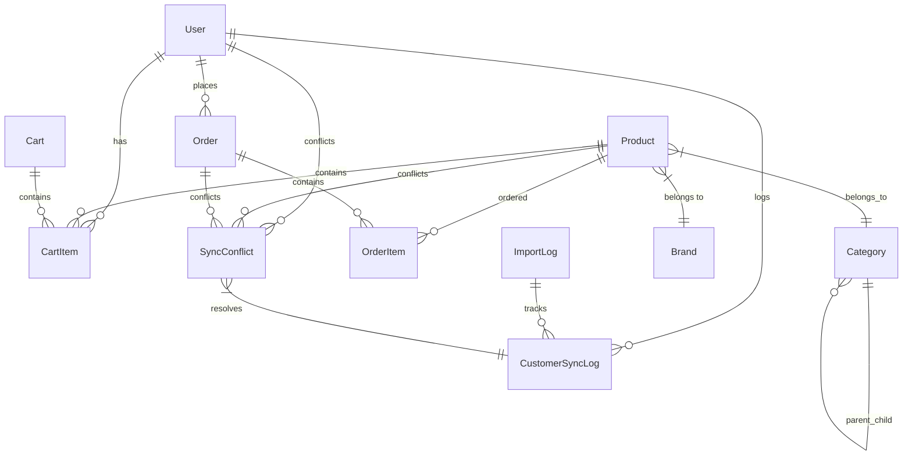

# 2. Модели Данных

## Основные связи сущностей



### Модели управления пользователями

```python
class User(AbstractUser):
    """
    Расширенная модель пользователя с поддержкой B2B/B2C и интеграции с 1С
    """
    # Основные поля
    email = models.EmailField(unique=True)  # Primary identifier
    phone = models.CharField(max_length=20, blank=True)
    
    # B2B поля
    company_name = models.CharField(max_length=255, blank=True)
    tax_id = models.CharField(max_length=20, blank=True)
    legal_address = models.TextField(blank=True)
    contact_person = models.CharField(max_length=100, blank=True)
    
    # Статус и верификация
    is_verified_b2b = models.BooleanField(default=False)
    verification_status = models.CharField(
        max_length=20,
        choices=[('pending', 'На проверке'), ('verified', 'Верифицирован'), ('rejected', 'Отклонен')],
        default='pending'
    )
    
    # Интеграция с 1С
    onec_id = models.CharField(max_length=50, blank=True, unique=True, null=True)
    onec_guid = models.UUIDField(blank=True, null=True, unique=True)
    created_in_1c = models.BooleanField(default=False)  # True если клиент импортирован из 1С
    last_sync_from_1c = models.DateTimeField(blank=True, null=True)
    last_sync_to_1c = models.DateTimeField(blank=True, null=True)
    sync_conflicts = models.JSONField(default=dict, blank=True)  # Храним конфликты синхронизации
    
    # Роль пользователя
    role = models.CharField(
        max_length=20,
        choices=[
            ('retail', 'Розничный покупатель'),
            ('wholesale_level1', 'Мелкий опт'),        ('wholesale_level2', 'Средний опт'),        ('wholesale_level3', 'Крупный опт'),        ('trainer', 'Тренер'),        ('federation_rep', 'Представитель федерации'),        ('admin', 'Администратор'),
        ],
        default='retail'
    )
    
    created_at = models.DateTimeField(auto_now_add=True)
    updated_at = models.DateTimeField(auto_now=True)
```

### Модели каталога товаров

```python
class Category(models.Model):
    """
    Иерархические категории товаров с поддержкой интеграции 1С
    """
    name = models.CharField(max_length=255)
    slug = models.SlugField(max_length=255, unique=True)
    parent = models.ForeignKey('self', on_delete=models.CASCADE, null=True, blank=True)
    description = models.TextField(blank=True)
    is_active = models.BooleanField(default=True)
    
    # Интеграция с 1С
    onec_id = models.CharField(max_length=50, blank=True, unique=True, null=True)
    last_sync_from_1c = models.DateTimeField(blank=True, null=True)

class Product(models.Model):
    """
    Единая модель товара, агрегирующая данные из goods.xml и offers.xml.
    Каждая запись представляет собой уникальное торговое предложение (SKU).
    """
    # Основная информация
    name = models.CharField(max_length=255) # Наименование из offers.xml
    slug = models.SlugField(max_length=255, unique=True)
    sku = models.CharField(max_length=100, unique=True) # Артикул из offers.xml
    description = models.TextField(blank=True) # Описание из goods.xml
    specifications = models.JSONField(default=dict)  # Характеристики из offers.xml
    
    # Категории и бренды
    category = models.ForeignKey(Category, on_delete=models.PROTECT)
    brand = models.ForeignKey(Brand, on_delete=models.PROTECT)
    
    # Ценообразование (розничные и оптовые цены)
    retail_price = models.DecimalField(max_digits=10, decimal_places=2)
    opt1_price = models.DecimalField(max_digits=10, decimal_places=2, null=True, blank=True)
    opt2_price = models.DecimalField(max_digits=10, decimal_places=2, null=True, blank=True)
    opt3_price = models.DecimalField(max_digits=10, decimal_places=2, null=True, blank=True)
    trainer_price = models.DecimalField(max_digits=10, decimal_places=2, null=True, blank=True)
    federation_price = models.DecimalField(max_digits=10, decimal_places=2, null=True, blank=True)
    
    # Складские остатки
    stock_quantity = models.PositiveIntegerField(default=0)  # Общее количество на складе
    reserved_quantity = models.PositiveIntegerField(default=0) # Количество в корзинах и незавершенных заказах
    
    # Статусы
    is_active = models.BooleanField(default=True)
    
    # Интеграция с 1С
    onec_id = models.CharField(max_length=100, blank=True, unique=True, null=True) # ID из offers.xml
    parent_onec_id = models.CharField(max_length=50, blank=True, null=True) # ID из goods.xml для связи
    last_sync_from_1c = models.DateTimeField(blank=True, null=True)
    
    # Системные поля
    created_at = models.DateTimeField(auto_now_add=True)
    updated_at = models.DateTimeField(auto_now=True)

    def get_price_for_user(self, user):
        # ... логика получения цены ...
        pass
```

### Модели заказов и корзины

```python
class Cart(models.Model):
    """
    Корзина покупок для авторизованных и гостевых пользователей
    """
    user = models.OneToOneField(User, on_delete=models.CASCADE, null=True, blank=True)
    session_key = models.CharField(max_length=40, null=True, blank=True)  # Для гостей
    created_at = models.DateTimeField(auto_now_add=True)
    updated_at = models.DateTimeField(auto_now=True)

class CartItem(models.Model):
    """
    Товары в корзине. При создании/удалении изменяет `reserved_quantity` у товара.
    """
    cart = models.ForeignKey(Cart, on_delete=models.CASCADE, related_name='items')
    product = models.ForeignKey(Product, on_delete=models.CASCADE)
    quantity = models.PositiveIntegerField(default=1)
    created_at = models.DateTimeField(auto_now_add=True)

class Order(models.Model):
    """
    Заказы с поддержкой B2B/B2C и интеграции с 1С
    """
    # Основная информация
    order_number = models.CharField(max_length=50, unique=True)
    user = models.ForeignKey(User, on_delete=models.PROTECT)
    
    # Статусы заказа
    status = models.CharField(
        max_length=20,
        choices=[
            ('draft', 'Черновик'),        ('pending', 'Ожидает обработки'),        ('processing', 'В обработке'),        ('shipped', 'Отгружен'),        ('delivered', 'Доставлен'),        ('cancelled', 'Отменен'),        ('returned', 'Возвращен'),
        ],
        default='pending'
    )
    
    # Суммы заказа
    subtotal = models.DecimalField(max_digits=12, decimal_places=2)
    tax_amount = models.DecimalField(max_digits=10, decimal_places=2, default=0)
    shipping_cost = models.DecimalField(max_digits=10, decimal_places=2, default=0)
    discount_amount = models.DecimalField(max_digits=10, decimal_places=2, default=0)
    total_amount = models.DecimalField(max_digits=12, decimal_places=2)
    
    # Адреса доставки и платежная информация
    shipping_address = models.JSONField()  # Полный адрес доставки
    billing_address = models.JSONField(blank=True, null=True)  # Адрес плательщика
    payment_method = models.CharField(max_length=50)
    payment_status = models.CharField(
        max_length=20,
        choices=[
            ('pending', 'Ожидает оплаты'),        ('paid', 'Оплачен'),        ('failed', 'Ошибка оплаты'),        ('refunded', 'Возвращен'),
        ],
        default='pending'
    )
    
    # Интеграция с 1С
    onec_id = models.CharField(max_length=50, blank=True, unique=True, null=True)
    exported_to_1c = models.BooleanField(default=False)
    export_to_1c_at = models.DateTimeField(blank=True, null=True)
    last_sync_from_1c = models.DateTimeField(blank=True, null=True)
    
    # Системные поля
    created_at = models.DateTimeField(auto_now_add=True)
    updated_at = models.DateTimeField(auto_now=True)

### Логика резервирования товаров

Для предотвращения перепродаж (overselling) в системе реализован механизм атомарного резервирования товаров. Это гарантирует, что товар, добавленный в корзину, не может быть куплен другим пользователем до истечения сессии или оформления заказа.

**Ключевые принципы:**

1.  **Источник правды:**
    - `stock_quantity`: Общее физическое количество товара на складе.
    - `reserved_quantity`: Количество товара, находящееся в активных корзинах пользователей.
    - `available_quantity`: Расчетное свойство в модели `Product` (`stock_quantity - reserved_quantity`), показывающее, сколько единиц товара доступно для добавления в корзину.

2.  **Реализация через сигналы Django:**
    - Логика инкапсулирована не в методах модели, а в сигналах `pre_save` и `post_delete` для модели `CartItem`. Этот подход гарантирует срабатывание логики даже при массовых операциях (`bulk_create`, `bulk_update`).
    - **`pre_save` на `CartItem`**: При добавлении или изменении количества товара в корзине, сигнал атомарно обновляет поле `product.reserved_quantity`.
    - **`post_delete` на `CartItem`**: При удалении товара из корзины (включая очистку корзины после создания заказа), сигнал атомарно уменьшает `product.reserved_quantity`.

3.  **Жизненный цикл резерва:**
    - **Резерв создается:** Пользователь добавляет товар в корзину.
    - **Резерв освобождается:**
        - Пользователь удаляет товар из корзины.
        - Заказ успешно оформлен (элементы `CartItem` удаляются).
        - Истекает время жизни сессии/корзины (требуется фоновая задача для очистки "зависших" резервов).

Этот механизм обеспечивает целостность данных об остатках на всех этапах до оформления заказа.

Подробное обоснование и детали реализации описаны в соответствующем архитектурном решении:
- **ADR:** [Логика резервирования товаров при добавлении в корзину](../decisions/story-3.x-product-reservation-logic.md)

class OrderItem(models.Model):
    """
    Товары в заказе со снимком данных на момент заказа
    """
    order = models.ForeignKey(Order, on_delete=models.CASCADE, related_name='items')
    product = models.ForeignKey(Product, on_delete=models.PROTECT)
    
    # Снимок данных товара на момент заказа
    product_name = models.CharField(max_length=255)
    product_article = models.CharField(max_length=100)
    product_specifications = models.JSONField(default=dict)
    
    # Количество и цены
    quantity = models.PositiveIntegerField()
    unit_price = models.DecimalField(max_digits=10, decimal_places=2)
    total_price = models.DecimalField(max_digits=12, decimal_places=2)
    
    # Интеграция с 1С
    onec_product_id = models.CharField(max_length=50, blank=True)
```

### Модели интеграции с 1С

```python
class CustomerSyncLog(models.Model):
    """
    Лог синхронизации покупателей с 1С
    """
    operation_type = models.CharField(
        max_length=20,
        choices=[
            ('import_from_1c', 'Импорт из 1С'),        ('export_to_1c', 'Экспорт в 1С'),        ('sync_changes', 'Синхронизация изменений'),
        ]
    )
    customer = models.ForeignKey(User, on_delete=models.CASCADE, related_name='sync_logs')
    
    # Статус операции
    status = models.CharField(
        max_length=10,
        choices=[
            ('success', 'Успешно'),        ('error', 'Ошибка'),        ('skipped', 'Пропущено'),        ('conflict', 'Конфликт данных'),
        ]
    )
    
    # Детали операции
    details = models.JSONField(default=dict)  # Детали синхронизации
    changes_made = models.JSONField(default=dict)  # Какие изменения были внесены
    conflict_resolution = models.JSONField(default=dict)  # Как был разрешен конфликт
    error_message = models.TextField(blank=True)
    
    # Системные поля
    created_at = models.DateTimeField(auto_now_add=True)
    processed_by = models.CharField(max_length=100)  # Management command или пользователь

class ImportLog(models.Model):
    """
    Общий лог импорта данных из 1С
    """
    import_type = models.CharField(
        max_length=20,
        choices=[
            ('products', 'Товары'),        ('customers', 'Покупатели'),        ('orders', 'Заказы'),        ('stock', 'Остатки'),        ('prices', 'Цены'),
        ]
    )
    
    # Статистика импорта
    total_records = models.PositiveIntegerField(default=0)
    processed_records = models.PositiveIntegerField(default=0)
    successful_records = models.PositiveIntegerField(default=0)
    failed_records = models.PositiveIntegerField(default=0)
    skipped_records = models.PositiveIntegerField(default=0)
    
    # Статус импорта
    status = models.CharField(
        max_length=20,
        choices=[
            ('running', 'Выполняется'),        ('completed', 'Завершен'),        ('failed', 'Ошибка'),        ('cancelled', 'Отменен'),
        ],
        default='running'
    )
    
    # Детали импорта
    file_path = models.CharField(max_length=500, blank=True)  # Путь к обрабатываемому файлу
    error_details = models.JSONField(default=dict)
    summary_report = models.JSONField(default=dict)  # Итоговый отчет
    
    # Системные поля
    started_at = models.DateTimeField(auto_now_add=True)
    finished_at = models.DateTimeField(blank=True, null=True)
    initiated_by = models.CharField(max_length=100)  # Management command или пользователь

class SyncConflict(models.Model):
    """
    Модель для управления конфликтами синхронизации
    """
    conflict_type = models.CharField(
        max_length=20,
        choices=[
            ('customer_data', 'Данные покупателя'),        ('product_data', 'Данные товара'),        ('order_status', 'Статус заказа'),        ('pricing', 'Ценообразование'),
        ]
    )
    
    # Связанные объекты
    customer = models.ForeignKey(User, on_delete=models.CASCADE, null=True, blank=True)
    product = models.ForeignKey(Product, on_delete=models.CASCADE, null=True, blank=True)
    order = models.ForeignKey(Order, on_delete=models.CASCADE, null=True, blank=True)
    
    # Данные конфликта
    platform_data = models.JSONField()  # Данные в платформе
    onec_data = models.JSONField()       # Данные в 1С
    conflicting_fields = models.JSONField()  # Список конфликтующих полей
    
    # Управление конфликтом
    resolution_strategy = models.CharField(
        max_length=20,
        choices=[
            ('manual', 'Ручное разрешение'),        ('platform_wins', 'Приоритет платформы'),
            ('onec_wins', 'Приоритет 1С'),        ('merge', 'Объединение данных'),
        ],
        default='manual'
    )
    
    is_resolved = models.BooleanField(default=False)
    resolution_details = models.JSONField(default=dict)
    resolved_at = models.DateTimeField(blank=True, null=True)
    resolved_by = models.CharField(max_length=100, blank=True)
    
    # Системные поля
    created_at = models.DateTimeField(auto_now_add=True)
    updated_at = models.DateTimeField(auto_now=True)
```

### Обновленная диаграмма связей

Диаграмма связей обновлена для включения новых моделей интеграции с 1С:


