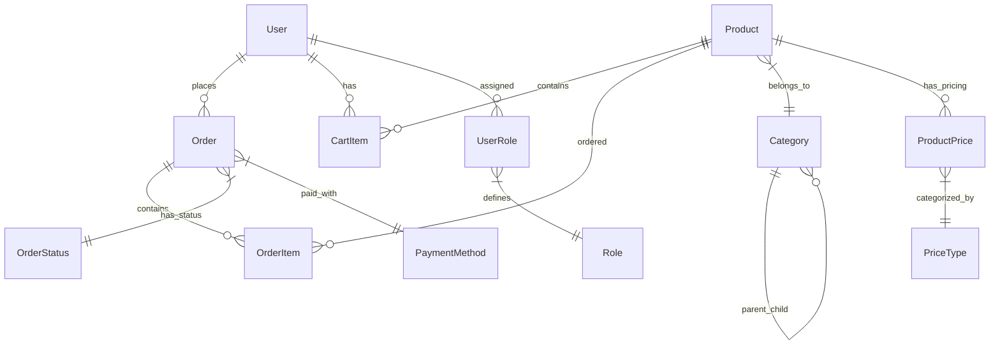

# 2. Модели Данных

### Основные связи сущностей


```mermaid
erDiagram
    User ||--o{ Order : places
    User ||--o{ CartItem : has
    User ||--o{ UserRole : assigned
    
    Product ||--o{ CartItem : contains
    Product ||--o{ OrderItem : ordered
    Product }|--|| Category : belongs_to
    Product ||--o{ ProductPrice : has_pricing
    
    Order ||--o{ OrderItem : contains
    Order }|--|| OrderStatus : has_status
    Order }|--|| PaymentMethod : paid_with
    
    Category ||--o{ Category : parent_child
    
    UserRole }|--|| Role : defines
    ProductPrice }|--|| PriceType : categorized_by
```

### Модели управления пользователями

```python
