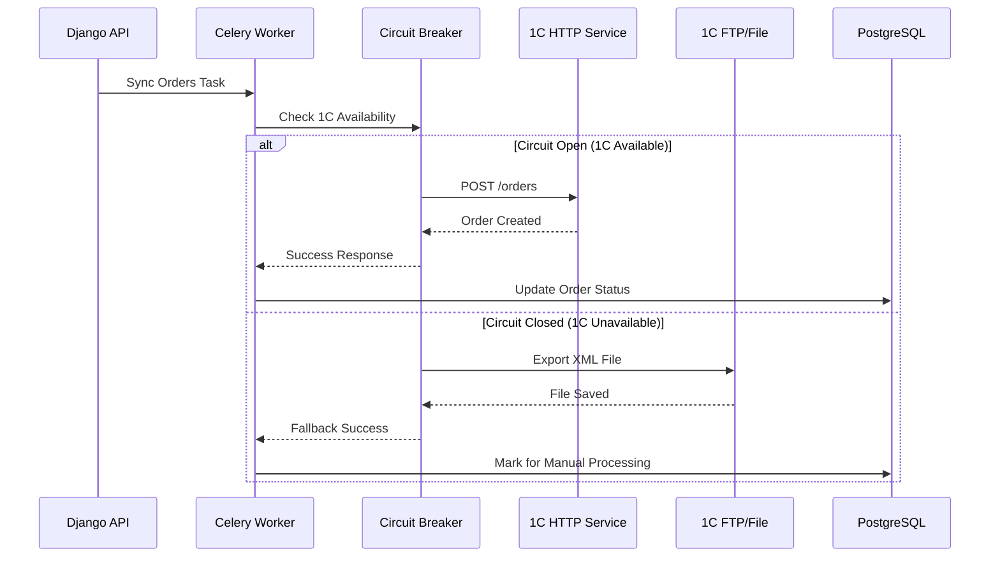

# 7. Внешние API

### Интеграция с 1С ERP

#### Архитектура с Circuit Breaker Pattern


```mermaid
sequenceDiagram
    participant Django as Django API
    participant Celery as Celery Worker
    participant CB as Circuit Breaker
    participant OneCHTTP as 1C HTTP Service
    participant OneFTP as 1C FTP/File
    participant DB as PostgreSQL

    Django->>Celery: Sync Orders Task
    Celery->>CB: Check 1C Availability
    
    alt Circuit Open (1C Available)
        CB->>OneCHTTP: POST /orders
        OneCHTTP-->>CB: Order Created
        CB-->>Celery: Success Response
        Celery->>DB: Update Order Status
    else Circuit Closed (1C Unavailable)
        CB->>OneFTP: Export XML File
        OneFTP-->>CB: File Saved
        CB-->>Celery: Fallback Success
        Celery->>DB: Mark for Manual Processing
    end
```

#### Реализация с отказоустойчивостью

```python
