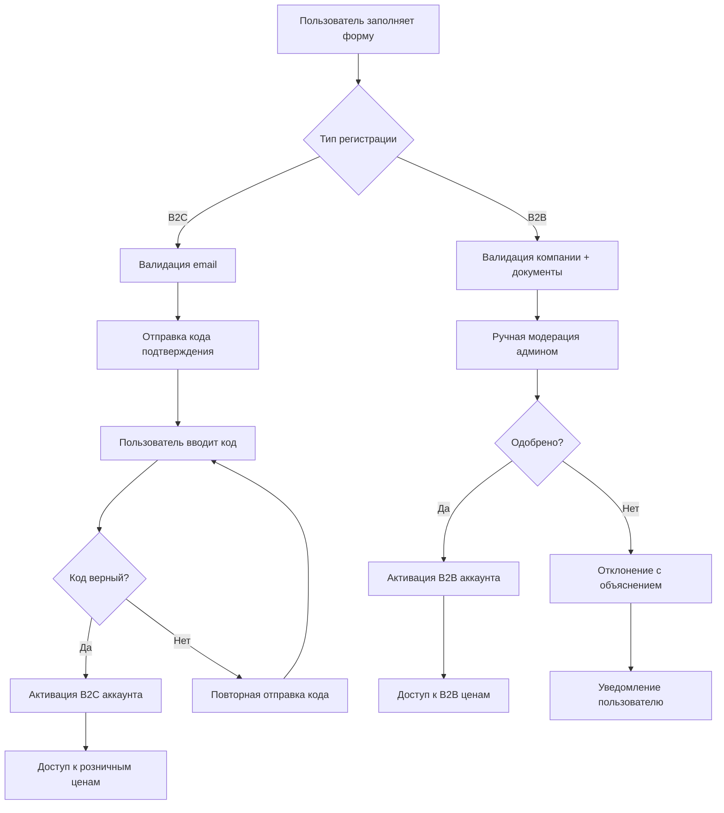
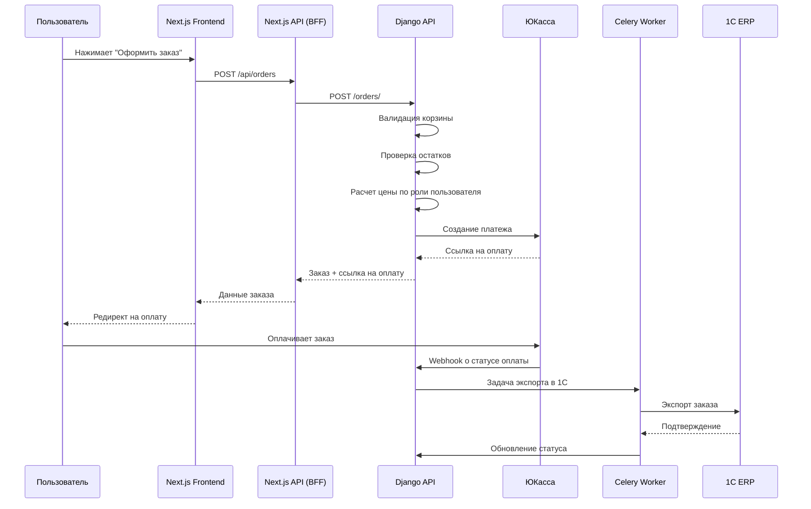
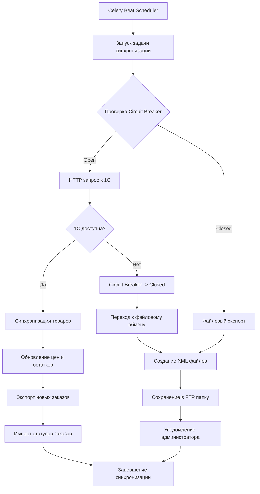
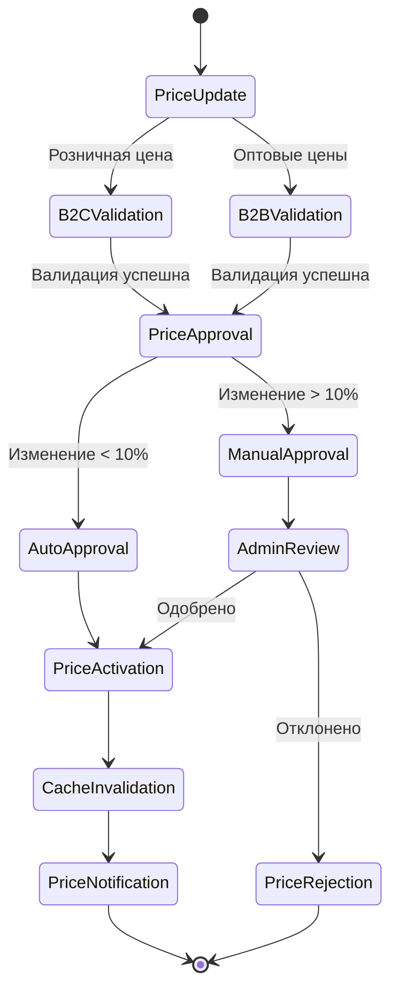
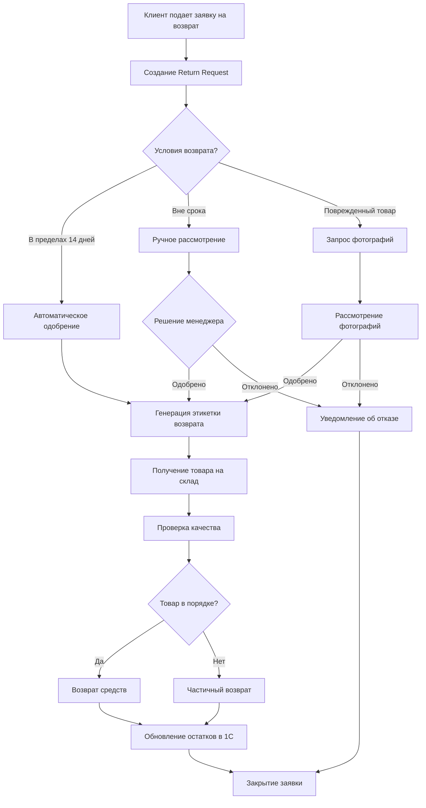

# 8. Основные Рабочие Процессы

### Процесс регистрации пользователя

### Процесс создания заказа

### Процесс синхронизации с 1С

### Workflow управления ценами

### Процесс обработки возвратов

---

