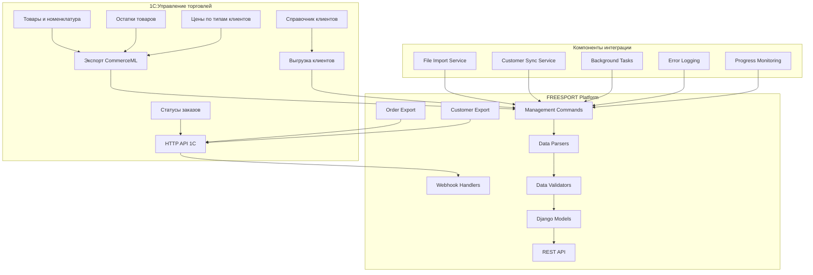
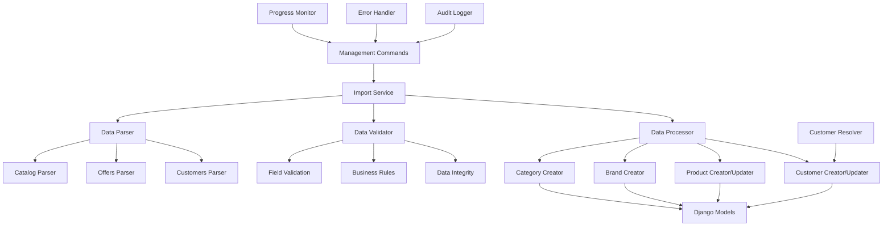
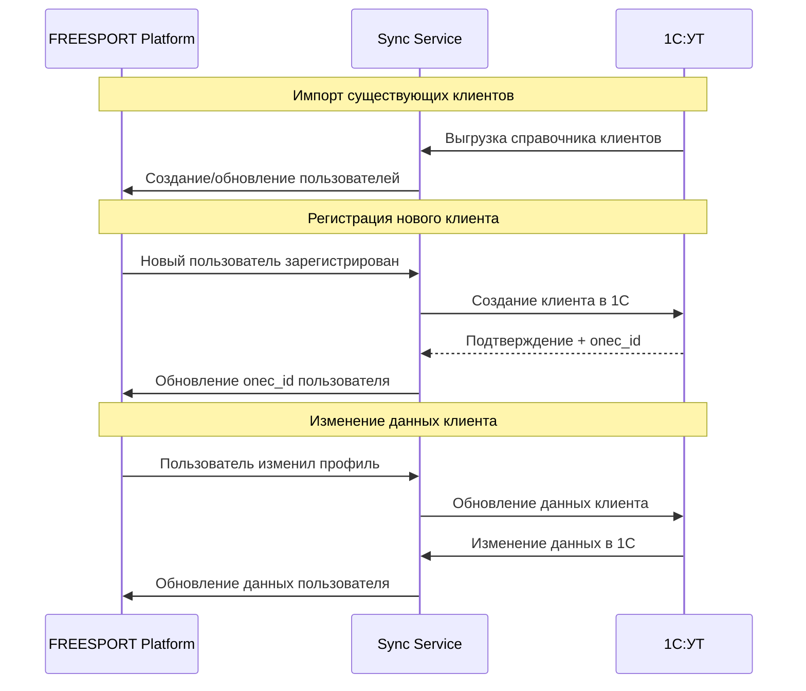

# Архитектура интеграции с 1С для FREESPORT Platform

## Оглавление

1. [Обзор интеграции](#1-обзор-интеграции)
2. [Архитектурные принципы](#2-архитектурные-принципы)
3. [Форматы данных и протоколы](#3-форматы-данных-и-протоколы) *(будет дополнен после ответа 1С)*
4. [Схемы маппинга данных](#4-схемы-маппинга-данных) *(будет дополнен после ответа 1С)*
5. [Компоненты системы интеграции](#5-компоненты-системы-интеграции)
6. [Процессы синхронизации](#6-процессы-синхронизации)
7. [Синхронизация покупателей](#7-синхронизация-покупателей)
8. [Обработка ошибок и мониторинг](#8-обработка-ошибок-и-мониторинг)
9. [Безопасность и производительность](#9-безопасность-и-производительность)
10. [Техническое задание для разработки](#10-техническое-задание-для-разработки)

---

## 1. Обзор интеграции

### 1.1 Бизнес-требования

**FREESPORT Platform** интегрируется с **1С:Управление торговлей** для обеспечения:

- **Синхронизации товаров:** Загрузка каталога, цен, характеристик
- **Управления остатками:** Актуальная информация о наличии товаров  
- **Синхронизации покупателей:** Двусторонняя синхронизация клиентской базы
- **Обработки заказов:** Экспорт заказов из веб-платформы в 1С
- **Синхронизации статусов:** Обновление статусов заказов из 1С

### 1.2 Архитектурная схема интеграции



### 1.3 Трехсторонняя синхронизация

**Импорт в FREESPORT (1С → Platform):**
- Товары и номенклатура
- Остатки и цены
- Справочник существующих клиентов
- Статусы заказов

**Экспорт из FREESPORT (Platform → 1С):**
- Заказы клиентов
- Новые покупатели
- Обновления данных клиентов

**Двусторонняя синхронизация клиентов:**
- Загрузка существующих клиентов из 1С
- Передача новых регистраций с сайта в 1С
- Синхронизация изменений клиентских данных

---

## 2. Архитектурные принципы

### 2.1 Принципы проектирования

1. **Idempotency:** Повторная обработка данных не должна нарушать целостность
2. **Fault Tolerance:** Система устойчива к временным сбоям интеграции
3. **Data Consistency:** Приоритет целостности данных над скоростью синхронизации
4. **Incremental Sync:** Поддержка инкрементальных обновлений
5. **Audit Trail:** Полное логирование всех операций импорта/экспорта
6. **Customer Identity Resolution:** Надежное сопоставление клиентов между системами

### 2.2 Выбор технологий

**Формат данных:** *Будет определен после ответа от 1С программиста*
**Протокол передачи:** *Будет определен после ответа от 1С программиста*  
**Обработка данных:** Django Management Commands + Celery
**Хранение состояния:** PostgreSQL + Redis для кэширования
**Мониторинг:** Structured logging + Django Admin interface

---

## 3. Форматы данных и протоколы

> **ПРИМЕЧАНИЕ:** Этот раздел будет детально проработан после получения ответов от программиста 1С на запрос в `docs/architecture/request-to-1c-developer.md`

### 3.1 Ожидаемые форматы данных

**Возможные варианты:**
- CommerceML 2.0 (XML стандарт для 1С)
- JSON через HTTP API
- CSV файлы
- Собственный XML формат

### 3.2 Методы передачи данных

**Варианты для согласования:**
- HTTP/HTTPS API endpoints
- FTP/SFTP файловый обмен  
- Веб-сервисы SOAP
- Файлы в общую сетевую папку

---

## 4. Схемы маппинга данных

> **ПРИМЕЧАНИЕ:** Детальные схемы маппинга будут созданы после получения примеров реальных данных от 1С программиста

### 4.1 Базовые принципы маппинга

**Товары:**
- `onec_id` как основной ключ связи
- Маппинг ценовых групп 1С → роли платформы
- Обработка технических характеристик в JSONB

**Покупатели:**
- `email` + `onec_id` как составной ключ  
- Маппинг типов клиентов 1С → роли платформы
- Разделение данных физ.лиц и юр.лиц

---

## 5. Компоненты системы интеграции

### 5.1 Архитектура компонентов



### 5.2 Структура Management Commands

```python
# apps/products/management/commands/
class ImportFrom1CCommand(BaseCommand):
    """Базовая команда для импорта из 1С"""
    
    def add_arguments(self, parser):
        parser.add_argument('--file', required=True, help='Путь к файлу данных')
        parser.add_argument('--type', choices=['catalog', 'offers', 'customers'], required=True)
        parser.add_argument('--dry-run', action='store_true')
        parser.add_argument('--chunk-size', type=int, default=100)

class ImportCustomersCommand(ImportFrom1CCommand):
    """Импорт справочника клиентов из 1С"""
    help = "Импорт клиентов из 1С (customers)"

class SyncCustomersCommand(BaseCommand):
    """Двусторонняя синхронизация клиентов"""
    help = "Синхронизация клиентов между платформой и 1С"

class ExportNewCustomersCommand(BaseCommand):
    """Экспорт новых клиентов в 1С"""
    help = "Экспорт новых регистраций с платформы в 1С"
```

### 5.3 Модели для интеграции с клиентами

```python
# apps/users/models.py
class User(AbstractUser):
    # ... существующие поля
    
    # Добавить поля для интеграции с 1С
    onec_id = models.CharField('ID в 1С', max_length=100, blank=True, null=True, unique=True)
    sync_status = models.CharField(
        'Статус синхронизации',
        max_length=20,
        choices=[
            ('pending', 'Ожидает синхронизации'),
            ('synced', 'Синхронизирован'),
            ('error', 'Ошибка синхронизации'),
            ('conflict', 'Конфликт данных'),
        ],
        default='pending'
    )
    sync_error_message = models.TextField('Ошибка синхронизации', blank=True)
    last_sync_at = models.DateTimeField('Последняя синхронизация', null=True, blank=True)
    
    # Флаги источника данных
    created_in_1c = models.BooleanField('Создан в 1С', default=False)
    needs_1c_export = models.BooleanField('Требует экспорта в 1С', default=False)

class CustomerSyncLog(models.Model):
    """Лог синхронизации клиентов"""
    
    OPERATION_TYPES = [
        ('import_from_1c', 'Импорт из 1С'),
        ('export_to_1c', 'Экспорт в 1С'),
        ('sync_changes', 'Синхронизация изменений'),
    ]
    
    operation_type = models.CharField('Тип операции', max_length=20, choices=OPERATION_TYPES)
    customer = models.ForeignKey(User, on_delete=models.CASCADE, null=True, blank=True)
    customer_email = models.EmailField('Email клиента', blank=True)
    
    status = models.CharField('Статус', max_length=20, choices=[
        ('success', 'Успешно'),
        ('error', 'Ошибка'),
        ('skipped', 'Пропущено'),
    ])
    
    details = models.JSONField('Детали операции', default=dict)
    error_message = models.TextField('Сообщение об ошибке', blank=True)
    
    created_at = models.DateTimeField('Дата операции', auto_now_add=True)
    
    class Meta:
        verbose_name = 'Лог синхронизации клиентов'
        verbose_name_plural = 'Логи синхронизации клиентов'
        db_table = 'customer_sync_logs'
        ordering = ['-created_at']
```

---

## 6. Процессы синхронизации

### 6.1 Алгоритм импорта каталога

```python
def import_catalog_workflow():
    """Workflow импорта каталога товаров"""
    
    # Шаг 1: Валидация файла
    validate_file_structure()
    
    # Шаг 2: Парсинг категорий
    categories = parse_categories()
    
    # Шаг 3: Создание/обновление категорий с учетом иерархии
    process_categories_with_hierarchy(categories)
    
    # Шаг 4: Парсинг товаров
    products = parse_products()
    
    # Шаг 5: Создание/обновление брендов
    brands = extract_unique_brands(products)
    process_brands(brands)
    
    # Шаг 6: Создание/обновление товаров
    for product_chunk in chunk_products(products):
        process_products_chunk(product_chunk)
    
    # Шаг 7: Деактивация отсутствующих товаров
    deactivate_missing_products()
    
    # Шаг 8: Генерация отчета
    generate_import_report()
```

### 6.2 Алгоритм импорта цен и остатков

```python
def import_offers_workflow():
    """Workflow импорта коммерческих предложений"""
    
    # Шаг 1: Валидация файла offers
    validate_offers_file()
    
    # Шаг 2: Парсинг типов цен
    price_types = parse_price_types()
    validate_price_types_mapping(price_types)
    
    # Шаг 3: Парсинг предложений
    offers = parse_offers()
    
    # Шаг 4: Обновление цен и остатков
    for offer_chunk in chunk_offers(offers):
        update_products_prices_and_stock(offer_chunk)
    
    # Шаг 5: Проверка целостности данных
    validate_data_integrity()
    
    # Шаг 6: Кэш инвалидация
    invalidate_product_cache()
```

---

## 7. Синхронизация покупателей

### 7.1 Архитектура синхронизации клиентов



### 7.2 Стратегии разрешения конфликтов

```python
class CustomerConflictResolver:
    """Разрешение конфликтов данных клиентов"""
    
    RESOLUTION_STRATEGIES = {
        'email_conflict': 'merge_by_email',
        'data_mismatch': 'latest_wins',
        'role_conflict': 'manual_review',
        'duplicate_customer': 'merge_customers',
    }
    
    def resolve_customer_conflict(self, platform_customer, onec_customer):
        """Разрешение конфликта данных клиента"""
        
        conflicts = self.detect_conflicts(platform_customer, onec_customer)
        
        for conflict_type, conflict_data in conflicts.items():
            strategy = self.RESOLUTION_STRATEGIES.get(conflict_type)
            
            if strategy == 'merge_by_email':
                return self.merge_customers_by_email(platform_customer, onec_customer)
            elif strategy == 'latest_wins':
                return self.apply_latest_changes(platform_customer, onec_customer)
            elif strategy == 'manual_review':
                self.create_manual_review_task(conflict_data)
                return None
```

### 7.3 Workflow синхронизации клиентов

```python
def sync_customers_workflow():
    """Полный цикл синхронизации клиентов"""
    
    # Шаг 1: Импорт новых клиентов из 1С
    new_1c_customers = import_customers_from_1c()
    for customer_data in new_1c_customers:
        create_or_update_platform_customer(customer_data)
    
    # Шаг 2: Экспорт новых регистраций в 1С
    new_platform_customers = get_customers_needing_export()
    for customer in new_platform_customers:
        export_customer_to_1c(customer)
    
    # Шаг 3: Синхронизация изменений
    updated_customers = get_updated_customers_since_last_sync()
    for customer in updated_customers:
        sync_customer_changes(customer)
    
    # Шаг 4: Разрешение конфликтов
    conflicts = detect_customer_conflicts()
    resolve_customer_conflicts(conflicts)
    
    # Шаг 5: Отчет о синхронизации
    generate_customer_sync_report()

def create_or_update_platform_customer(customer_data_from_1c):
    """Создание или обновление клиента на платформе"""
    
    # Поиск существующего клиента
    existing_customer = find_customer_by_identifiers(
        email=customer_data_from_1c.get('email'),
        onec_id=customer_data_from_1c.get('onec_id'),
        phone=customer_data_from_1c.get('phone')
    )
    
    if existing_customer:
        # Обновляем данные существующего клиента
        update_customer_from_1c_data(existing_customer, customer_data_from_1c)
    else:
        # Создаем нового клиента
        create_customer_from_1c_data(customer_data_from_1c)

def export_customer_to_1c(platform_customer):
    """Экспорт клиента с платформы в 1С"""
    
    # Подготовка данных для экспорта
    export_data = prepare_customer_export_data(platform_customer)
    
    # Отправка в 1С
    result = send_customer_to_1c(export_data)
    
    if result.success:
        # Обновляем onec_id и статус синхронизации
        platform_customer.onec_id = result.onec_id
        platform_customer.sync_status = 'synced'
        platform_customer.needs_1c_export = False
        platform_customer.last_sync_at = timezone.now()
        platform_customer.save()
        
        # Логируем успех
        CustomerSyncLog.objects.create(
            operation_type='export_to_1c',
            customer=platform_customer,
            status='success',
            details={'onec_id': result.onec_id}
        )
    else:
        # Обрабатываем ошибку
        handle_customer_export_error(platform_customer, result.error)
```

### 7.4 Сервисы идентификации клиентов

```python
class CustomerIdentityResolver:
    """Сервис для идентификации клиентов между системами"""
    
    def find_customer_by_identifiers(self, **identifiers):
        """Поиск клиента по множественным идентификаторам"""
        
        # Приоритет поиска: onec_id > email > phone + name
        if identifiers.get('onec_id'):
            customer = User.objects.filter(onec_id=identifiers['onec_id']).first()
            if customer:
                return customer
        
        if identifiers.get('email'):
            customer = User.objects.filter(email=identifiers['email']).first()
            if customer:
                return customer
        
        # Поиск по телефону + ФИО (для надежности)
        if identifiers.get('phone') and identifiers.get('full_name'):
            # Сложная логика поиска по нескольким полям
            return self.fuzzy_search_customer(identifiers)
        
        return None
    
    def fuzzy_search_customer(self, identifiers):
        """Нечеткий поиск клиента по частичным данным"""
        # Реализация алгоритма нечеткого поиска
        pass

class CustomerDataMapper:
    """Маппинг данных клиентов между форматами 1С и платформы"""
    
    def map_1c_to_platform(self, customer_data_1c):
        """Маппинг данных клиента из 1С в формат платформы"""
        return {
            'email': customer_data_1c.get('email'),
            'first_name': customer_data_1c.get('first_name'),
            'last_name': customer_data_1c.get('last_name'),
            'phone': customer_data_1c.get('phone'),
            'company_name': customer_data_1c.get('company_name'),
            'tax_id': customer_data_1c.get('inn'),
            'role': self.map_1c_customer_type_to_platform_role(
                customer_data_1c.get('customer_type')
            ),
            'is_verified': customer_data_1c.get('is_verified', False),
            'onec_id': customer_data_1c.get('id'),
            'created_in_1c': True,
            'sync_status': 'synced',
        }
    
    def map_platform_to_1c(self, platform_customer):
        """Маппинг данных клиента из платформы в формат 1С"""
        customer_type = 'individual' if not platform_customer.company_name else 'legal_entity'
        
        base_data = {
            'email': platform_customer.email,
            'phone': platform_customer.phone,
            'customer_type': customer_type,
            'platform_id': platform_customer.id,
        }
        
        if customer_type == 'individual':
            base_data.update({
                'first_name': platform_customer.first_name,
                'last_name': platform_customer.last_name,
            })
        else:
            base_data.update({
                'company_name': platform_customer.company_name,
                'tax_id': platform_customer.tax_id,
                'contact_person': f"{platform_customer.first_name} {platform_customer.last_name}",
            })
        
        return base_data
```

---

## 8. Обработка ошибок и мониторинг

### 8.1 Стратегии обработки ошибок

```python
class IntegrationErrorHandler:
    """Обработчик ошибок интеграции"""
    
    ERROR_STRATEGIES = {
        'validation_error': 'skip_and_log',
        'database_error': 'retry_with_backoff',
        'file_parse_error': 'stop_and_report',
        'customer_conflict': 'queue_for_manual_review',
        'duplicate_customer': 'attempt_merge',
        '1c_api_error': 'retry_with_exponential_backoff',
    }
    
    def handle_customer_sync_error(self, error_type, error_data, context):
        """Специализированная обработка ошибок синхронизации клиентов"""
        
        if error_type == 'customer_conflict':
            return self.queue_conflict_for_review(error_data, context)
        elif error_type == 'duplicate_customer':
            return self.attempt_customer_merge(error_data, context)
        else:
            return self.handle_generic_error(error_type, error_data, context)

class CustomerSyncMonitor:
    """Мониторинг синхронизации клиентов"""
    
    def generate_sync_dashboard_data(self):
        """Генерация данных для дашборда синхронизации"""
        
        return {
            'customers_synced_today': self.get_customers_synced_today(),
            'pending_conflicts': self.get_pending_conflicts_count(),
            'sync_errors_last_24h': self.get_recent_errors(),
            'export_queue_size': self.get_export_queue_size(),
            'last_successful_import': self.get_last_successful_import(),
        }
```

### 8.2 Система логирования

```python
class CustomerSyncLogger:
    """Специализированное логирование синхронизации клиентов"""
    
    def log_customer_import(self, customer_data, result):
        """Логирование импорта клиента"""
        CustomerSyncLog.objects.create(
            operation_type='import_from_1c',
            customer_email=customer_data.get('email'),
            customer=result.customer if result.success else None,
            status='success' if result.success else 'error',
            details={
                '1c_customer_id': customer_data.get('id'),
                'import_timestamp': timezone.now().isoformat(),
                'data_source': '1c_export'
            },
            error_message=result.error_message if not result.success else ''
        )
    
    def log_customer_export(self, platform_customer, result):
        """Логирование экспорта клиента"""
        CustomerSyncLog.objects.create(
            operation_type='export_to_1c',
            customer=platform_customer,
            customer_email=platform_customer.email,
            status='success' if result.success else 'error',
            details={
                'platform_customer_id': platform_customer.id,
                'export_timestamp': timezone.now().isoformat(),
                '1c_response': result.response_data
            },
            error_message=result.error_message if not result.success else ''
        )
```

---

## 9. Безопасность и производительность

### 9.1 Безопасность синхронизации клиентов

```python
class CustomerDataSecurity:
    """Обеспечение безопасности данных клиентов"""
    
    SENSITIVE_FIELDS = ['phone', 'tax_id', 'passport_data', 'birth_date']
    
    def sanitize_customer_data(self, customer_data):
        """Санитизация данных клиента перед обработкой"""
        
        sanitized = {}
        for field, value in customer_data.items():
            if field in self.SENSITIVE_FIELDS:
                # Валидация и очистка чувствительных данных
                sanitized[field] = self.validate_sensitive_field(field, value)
            else:
                sanitized[field] = self.clean_general_field(field, value)
        
        return sanitized
    
    def validate_sensitive_field(self, field_name, value):
        """Валидация чувствительных полей"""
        if field_name == 'phone':
            return self.validate_phone_number(value)
        elif field_name == 'tax_id':
            return self.validate_tax_id(value)
        # ... другие поля
        return value

class CustomerDataEncryption:
    """Шифрование чувствительных данных клиентов"""
    
    def encrypt_customer_export_data(self, customer_data):
        """Шифрование данных для экспорта"""
        # Шифрование чувствительных полей перед передачей в 1С
        pass
```

### 9.2 Оптимизация производительности

```python
class CustomerSyncOptimizer:
    """Оптимизация производительности синхронизации"""
    
    def bulk_import_customers(self, customers_data):
        """Массовый импорт клиентов"""
        
        # Группировка операций для оптимизации
        new_customers = []
        existing_customers_updates = []
        
        for customer_data in customers_data:
            if self.customer_exists(customer_data):
                existing_customers_updates.append(customer_data)
            else:
                new_customers.append(customer_data)
        
        # Bulk операции
        if new_customers:
            self.bulk_create_customers(new_customers)
        
        if existing_customers_updates:
            self.bulk_update_customers(existing_customers_updates)
    
    def optimize_customer_queries(self):
        """Оптимизация запросов для поиска клиентов"""
        # Создание индексов для быстрого поиска
        # Кэширование часто используемых запросов
        pass
```

---

## 10. Техническое задание для разработки

### 10.1 Story 3.1: Анализ требований к интеграции с 1С ✅

**Статус:** Завершено  
**Deliverables:**
- ✅ Документ архитектуры интеграции с 1С (данный документ)
- ✅ Запрос к программисту 1С с детальными вопросами
- ✅ Архитектура синхронизации покупателей
- ⏳ Схемы маппинга данных (ожидаем ответ от 1С)

---

### 10.2 Story 3.2: Разработка структуры для импорта данных из 1С

**Техническое задание для Dev Agent (James):**

#### **Создать Django management commands:**

```python
# apps/products/management/commands/import_catalog_from_1c.py
class Command(BaseCommand):
    help = "Импорт каталога товаров из файла 1С"
    
    def add_arguments(self, parser):
        parser.add_argument('--file', required=True, help='Путь к файлу данных')
        parser.add_argument('--dry-run', action='store_true', help='Тестовый запуск')
        parser.add_argument('--chunk-size', type=int, default=100, help='Размер пакета')

# apps/products/management/commands/import_offers_from_1c.py
class Command(BaseCommand):
    help = "Импорт цен и остатков из файла 1С"

# apps/users/management/commands/import_customers_from_1c.py  
class Command(BaseCommand):
    help = "Импорт справочника клиентов из 1С"

# apps/users/management/commands/sync_customers_with_1c.py
class Command(BaseCommand):
    help = "Двусторонняя синхронизация клиентов с 1С"
```

#### **Создать сервисы обработки данных:**

```python
# apps/products/services/data_parser.py
class DataParser:
    """Базовый класс для парсинга данных из 1С"""
    
# apps/users/services/customer_sync_service.py
class CustomerSyncService:
    """Сервис синхронизации клиентов"""
    
# apps/common/services/import_validator.py
class ImportDataValidator:
    """Валидатор импортируемых данных"""
```

#### **Обновить модели:**

```python
# Добавить поля в User model для интеграции с 1С
onec_id = models.CharField('ID в 1С', max_length=100, blank=True, null=True, unique=True)
sync_status = models.CharField('Статус синхронизации', ...)
created_in_1c = models.BooleanField('Создан в 1С', default=False)
needs_1c_export = models.BooleanField('Требует экспорта в 1С', default=False)

# Создать модель CustomerSyncLog для логирования
```

---

### 10.3 Acceptance Criteria для всех Stories

**Story 3.2 - Разработка структуры:**
- [ ] Создана команда `import_catalog_from_1c`
- [ ] Создана команда `import_customers_from_1c`
- [ ] Реализован базовый парсер данных (будет доработан после ответа 1С)
- [ ] Добавлена валидация импортируемых данных
- [ ] Настроено логирование процесса импорта
- [ ] Обновлены модели User и Product для интеграции с 1С
- [ ] Создана модель CustomerSyncLog
- [ ] Созданы unit тесты для базовых компонентов

**Story 3.3 - Создание скриптов:**
- [ ] Создана команда `load_test_catalog`
- [ ] Создана команда `sync_customers_with_1c`
- [ ] Реализована загрузка категорий и брендов
- [ ] Добавлена обработка связей между сущностями
- [ ] Созданы скрипты backup/restore данных
- [ ] Добавлена поддержка batch операций

**Story 3.4 - Тестовая загрузка каталога:**
- [ ] Загружено минимум 500 товаров
- [ ] Установлены цены для всех 7 ролей пользователей
- [ ] Созданы категории с иерархией
- [ ] Проверена корректность связей
- [ ] Запущены тесты на загруженных данных

**Story 3.5 - Загрузка остатков:**
- [ ] Создана команда `load_product_stocks`
- [ ] Загружены остатки для всех товаров
- [ ] Протестирована логика `is_in_stock`
- [ ] Проверена работа `can_be_ordered`
- [ ] API возвращает корректные данные о наличии

---

## Заключение

Данная архитектурная документация предоставляет полную спецификацию для реализации интеграции с 1С в рамках Epic 3, включая критически важный компонент **синхронизации покупателей**.

**Ключевые особенности архитектуры:**

✅ **Трехсторонняя синхронизация:** товары + клиенты + заказы  
✅ **Разрешение конфликтов:** автоматическое + ручная модерация  
✅ **Identity Resolution:** надежная идентификация клиентов между системами  
✅ **Audit Trail:** полное логирование всех операций синхронизации  
✅ **Performance:** batch операции и оптимизированные запросы  
✅ **Security:** валидация и защита чувствительных данных клиентов  

**Следующие шаги:**
1. **Отправить запрос программисту 1С** - получить ответы на технические вопросы
2. **Доработать разделы 3-4** - форматы данных и схемы маппинга
3. **Передать Dev Agent (James)** - для реализации Stories 3.2-3.5

**Готово к передаче для разработки! 🚀**