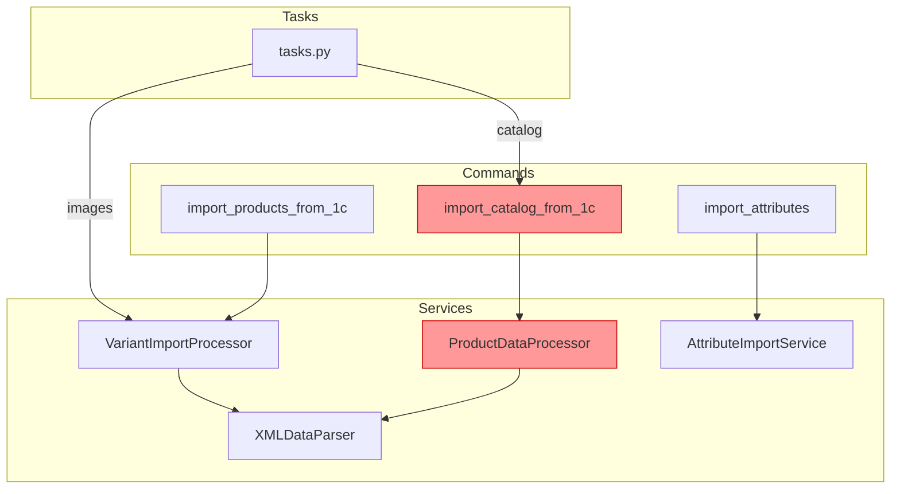
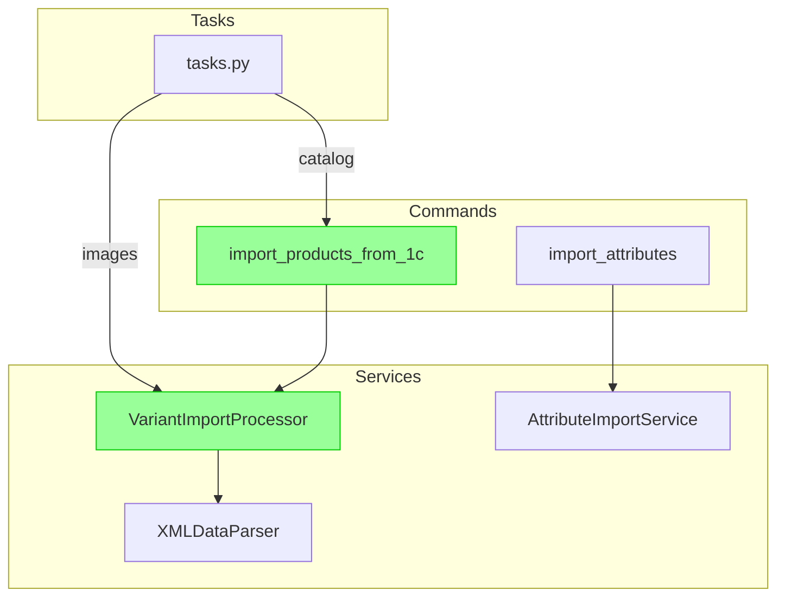

# Epic 27: Import Modules Refactoring PRD

## Change Log

| Date | Version | Description | Author |
|------|---------|-------------|--------|
| 2024-12-09 | 1.0 | Initial PRD draft | John (PM) |
| 2024-12-09 | 1.1 | Added comparison table, architecture diagrams, Story 27.6 | John (PM) |

---

## Goals

- Устранить дублирование кода между `ProductDataProcessor` и `VariantImportProcessor`
- Унифицировать стандарт обработки путей к изображениям во всех модулях импорта
- Упростить архитектуру: оставить один процессор вместо двух
- Сохранить полную обратную совместимость существующих workflow импорта
- Улучшить поддерживаемость и тестируемость кода импорта

## Background Context

В текущей реализации системы импорта из 1С существует значительное дублирование:

- **Два процессора** (`ProductDataProcessor` и `VariantImportProcessor`) выполняют практически идентичные функции
- **Две management-команды** (`import_catalog_from_1c` и `import_products_from_1c`) решают одну задачу с разными подходами
- **Два метода импорта изображений** работают с путями по-разному, что приводит к ошибкам

Новый `VariantImportProcessor` был создан для поддержки архитектуры Product + ProductVariant (Epic 13/14), однако legacy `ProductDataProcessor` остался в коде.

### Impact Analysis Insights

- Production workflow (`full_import.sh`) уже использует новую архитектуру
- Admin Panel требует обновления для использования новой команды
- При удалении legacy кода освободится ~1100 строк (processor.py)

---

## Methods Comparison: ProductDataProcessor vs VariantImportProcessor

| Функционал | ProductDataProcessor (LEGACY) | VariantImportProcessor (NEW) | Статус |
|------------|-------------------------------|------------------------------|--------|
| Создание Product из goods.xml | `create_product_placeholder()` | `process_product_from_goods()` | ✅ Дублирование |
| Импорт изображений Product | `_import_base_images_simple()` | `_import_base_images()` | ⚠️ Разная реализация |
| Обработка offers.xml | `enrich_product_from_offer()` | `process_variant_from_offer()` | ✅ Дублирование |
| Обновление цен | `update_product_prices()` | `update_variant_prices()` | ✅ Дублирование |
| Обновление остатков | `update_product_stock()` | `update_variant_stock()` | ✅ Дублирование |
| Связывание атрибутов | `_link_product_attributes()` | `_link_variant_attributes()` | ✅ Дублирование |
| Обработка категорий | `process_categories()` | ❌ Отсутствует | 🔄 Требует переноса |
| Обработка брендов | `process_brands()` | ❌ Отсутствует | 🔄 Требует переноса |
| Обработка типов цен | `process_price_types()` | ❌ Отсутствует | 🔄 Требует переноса |
| `normalize_image_path()` | ❌ Не использует | ✅ Использует | ⚠️ Критично |

---

## Architecture Diagrams

### Current Architecture (Before)

### Target Architecture (After)

---

## Requirements

### Functional Requirements

- **FR1:** Удалить legacy-команду `import_catalog_from_1c.py` после подтверждения полного покрытия функционала в `import_products_from_1c.py`
- **FR2:** Удалить legacy-процессор `ProductDataProcessor` (processor.py) после переноса уникальной логики
- **FR3:** Обновить Celery задачи в `tasks.py` — заменить вызовы `import_catalog_from_1c` на `import_products_from_1c`
- **FR4:** Добавить функцию `normalize_image_path()` во все методы импорта изображений для единообразия
- **FR5:** Перенести метод `process_categories()` из `ProductDataProcessor` в `VariantImportProcessor` (если отсутствует)
- **FR6:** Перенести метод `process_brands()` из `ProductDataProcessor` в `VariantImportProcessor` (если отсутствует)
- **FR7:** Обновить Admin Panel views для использования новой команды импорта
- **FR8:** Провести аудит и обновить всю документацию проекта, связанную с импортом

### Non-Functional Requirements

- **NFR1:** Сохранить 100% обратную совместимость существующих workflow импорта
- **NFR2:** Покрытие тестами критических путей импорта ≥ 80%
- **NFR3:** Время выполнения full import не должно увеличиться более чем на 5%
- **NFR4:** Логирование всех операций импорта должно сохраниться на текущем уровне детализации
- **NFR5:** Документация (CLAUDE.md, GEMINI.md) должна быть обновлена после завершения рефакторинга
- **NFR6:** Все inline-комментарии и docstrings в изменённых файлах должны быть актуализированы

---

## Technical Assumptions

### Repository Structure

Monorepo с backend (Django) и frontend (Next.js)

### Service Architecture

- **Backend:** Django 4.2 LTS + DRF 3.14+
- **Database:** PostgreSQL 15+
- **Cache:** Redis 7.0+
- **Async:** Celery + Celery Beat

### Testing Requirements

- **Unit Tests:** pytest с markers `@pytest.mark.unit`
- **Integration Tests:** pytest с markers `@pytest.mark.integration`
- **Coverage:** ≥ 70% общее, ≥ 90% для критических модулей
- **Factory:** Factory Boy для тестовых данных

### Additional Technical Assumptions

- Python 3.12+ используется в Docker контейнерах
- No breaking changes в сигнатурах публичных методов VariantImportProcessor
- Celery tasks backwards compatible
- XML parsing (defusedxml) не затрагивается
- Все пути к изображениям нормализуются через `normalize_image_path()`

---

## Epic 27: Import Modules Refactoring

### Goal

Консолидировать архитектуру импорта из 1С, устранив дублирование между `ProductDataProcessor` и `VariantImportProcessor`. После рефакторинга останется единственный процессор с унифицированной логикой обработки путей к изображениям, а legacy код будет удалён.

---

### Story 27.1: Migrate Missing Methods to VariantImportProcessor

**As a** developer,  
**I want** to ensure VariantImportProcessor contains all methods from ProductDataProcessor,  
**so that** the legacy processor can be safely removed.

#### Acceptance Criteria

1. Метод `process_categories()` присутствует в VariantImportProcessor или перенесён из ProductDataProcessor
2. Метод `process_brands()` (обработка Brand1CMapping) присутствует или перенесён
3. Метод `process_price_types()` присутствует или перенесён
4. Все перенесённые методы покрыты unit-тестами
5. Существующие тесты ProductDataProcessor адаптированы для нового процессора

---

### Story 27.2: Unify Image Path Normalization

**As a** developer,  
**I want** all image import methods to use `normalize_image_path()`,  
**so that** paths are handled consistently across all import scenarios.

#### Acceptance Criteria

1. Функция `normalize_image_path()` используется в `_import_base_images()`
2. Функция `normalize_image_path()` используется в `_import_variant_images()`
3. Legacy метод `_import_base_images_simple()` в processor.py помечен как deprecated или удалён
4. Тесты подтверждают корректную обработку путей вида `import_files/xx/file.jpg` и `xx/file.jpg`

---

### Story 27.3: Update Celery Tasks Integration

**As a** system administrator,  
**I want** Admin Panel to use the new import command,  
**so that** all import methods work through unified architecture.

#### Acceptance Criteria

1. Функция `_execute_import_type()` в tasks.py вызывает `import_products_from_1c` для типа "catalog"
2. Параметры `--celery-task-id` передаются корректно для трекинга сессий
3. Все типы импорта (catalog, stocks, prices, images) работают через Admin UI
4. Интеграционный тест подтверждает работу всех типов импорта

---

### Story 27.4: Deprecate Legacy Import Command

**As a** developer,  
**I want** to mark `import_catalog_from_1c` as deprecated,  
**so that** codebase has clear migration path.

#### Acceptance Criteria

1. Команда `import_catalog_from_1c` выводит deprecation warning при запуске
2. Документация CLAUDE.md обновлена: указано использовать `import_products_from_1c`
3. Тесты для legacy команды помечены как `@pytest.mark.skip(reason="deprecated")`
4. README или CONTRIBUTING содержит инструкцию по миграции

---

### Story 27.5: Remove Legacy Code

**As a** developer,  
**I want** to remove deprecated code after verification period,  
**so that** codebase is clean and maintainable.

#### Acceptance Criteria

1. Файл `processor.py` удалён (после подтверждения от DevOps что production использует новый код)
2. Файл `import_catalog_from_1c.py` удалён
3. Все импорты и ссылки на удалённые модули очищены
4. CI/CD pipeline успешно проходит без legacy кода
5. Документация обновлена — удалены упоминания legacy команд

---

### Story 27.6: Documentation Audit and Update

**As a** developer,  
**I want** all project documentation to reflect the new import architecture,  
**so that** future developers understand the current system.

#### Acceptance Criteria

1. CLAUDE.md обновлён — раздел "1C Integration" содержит актуальные команды и workflow
2. GEMINI.md обновлён — раздел импорта синхронизирован с CLAUDE.md
3. Inline docstrings в `variant_import.py` актуализированы
4. Удалены все упоминания `ProductDataProcessor` и `import_catalog_from_1c` из документации
5. Добавлен раздел "Import Architecture" в docs/architecture/ с Mermaid-диаграммой
6. README.md содержит quick start для запуска импорта

---

## Next Steps

### Architect Prompt

> Review this PRD for Epic 27: Import Modules Refactoring. Analyze the current codebase structure in `backend/apps/products/services/` and `backend/apps/products/management/commands/`. Create detailed technical stories with implementation guidance for each story, focusing on safe migration path for legacy code removal.
