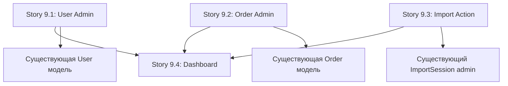

# Epic 9: Advanced Admin Panel

**Тип проекта:** Brownfield Enhancement (доработка существующей Django Admin)  
**Epic Status:** Draft → Ready for Implementation  
**Epic Owner:** Product Owner  
**Tech Lead:** Backend Team Lead

---

## Summary

Создание комплексной админ-панели для управления ключевыми аспектами платформы: импорт данных 1С, пользователи, каталог товаров и аналитика. Доработка существующей Django Admin с добавлением кастомных действий, виджетов мониторинга и дашборда.

---

## Business Justification

**Цель:** Снижение операционных затрат, повышение скорости реакции на проблемы, предоставление менеджерам инструментов для самостоятельного управления платформой без привлечения разработчиков.

**Метрики успеха:**
- Снижение времени на запуск импорта 1С с 30 мин → 2 мин (через админку)
- Время реакции на проблемы импорта: с 4 часов → 15 минут
- Уменьшение обращений к разработчикам на 60%

**Alignment с PRD:**
- **FR8:** Портал должен иметь базовую административную панель для управления заказами и пользователями
- **PRD UI/UX:** Административная панель (дашборд, мониторинг 1С, управление)

---

## Current State Analysis (Gap Analysis)

### ✅ Уже реализовано в Django Admin:

**Зарегистрированные модели:**
- `Product` - полная кастомизация с fieldsets, фильтрами, поиском
- `Brand` - базовая регистрация
- `Category` - с поддержкой иерархии (parent field)
- `ImportSession` - readonly мониторинг сессий импорта
- `Cart` и `CartItem` - с inlines и custom displays

**Инфраструктура:**
- Django Admin UI доступна по `/admin/`
- Аутентификация через встроенную User модель
- Permissions и groups настроены

### ❌ Отсутствует (требуется реализация):

**Критичные модели БЕЗ admin регистрации:**
- `User` (CustomUser) - управление пользователями, B2B верификация
- `Order` и `OrderItem` - управление заказами (admin.py пустой)
- `CustomerSyncLog`, `SyncConflict` - мониторинг синхронизации 1С

**Отсутствующая функциональность:**
- Кастомное действие для запуска импорта 1С из админки
- Виджет мониторинга текущего статуса импорта
- Дашборд с KPI метриками
- Разрешение конфликтов синхронизации через UI
- Bulk actions для управления пользователями

---

## MVP Scope Definition

### ✅ В SCOPE (MVP):

1. **User Management Admin**
   - Регистрация User модели с кастомизацией
   - Фильтры по ролям (B2B/B2C), статусу верификации
   - Inline для Company данных
   - Actions: approve_b2b, reject_b2b, block_user

2. **Order Management Admin**
   - Регистрация Order и OrderItem
   - Фильтры по статусам, датам
   - Readonly fields для 1С интеграции
   - Inline для OrderItem

3. **1C Import Management**
   - Custom admin action: "Запустить импорт каталога"
   - Мониторинг статуса ImportSession
   - Отображение ошибок импорта

4. **Basic Dashboard Widget**
   - Виджет на главной странице админки
   - Метрики: активные пользователи, заказы за период, статус последнего импорта
   - Ссылки на критичные разделы

### ❌ OUT OF SCOPE (Post-MVP):

- Advanced аналитика с графиками
- Экспорт отчетов в Excel/PDF
- Модерация B2B заявок через отдельный UI (будет в другом Epic)
- Circuit Breaker UI для 1С (требует отдельной проработки)
- Email нотификации из админки
- Кастомная тема оформления Django Admin

---

## Acceptance Criteria (Epic Level)

1. ✅ Администратор может запустить импорт каталога из 1С через admin action (одним кликом)
2. ✅ Администратор может отследить статус текущего и прошлых импортов
3. ✅ Администратор может управлять пользователями:
   - Создавать, редактировать, блокировать
   - Назначать роли (retail, wholesale, trainer, federation)
   - Верифицировать B2B пользователей (approve/reject)
4. ✅ Администратор может управлять заказами:
   - Просматривать детали заказа
   - Изменять статусы
   - Видеть статус синхронизации с 1С
5. ✅ Администратор может редактировать товары, категории, бренды, цены через существующую админку (уже реализовано, требуется только проверка)
6. ✅ На главной странице админ-панели отображается виджет с ключевыми метриками:
   - Активные пользователи (сегодня, неделя)
   - Заказы (сегодня, неделя, статусы)
   - Статус последнего импорта 1С
   - Ошибки импорта (если есть)

---

## Stories

### Story 9.1: User Management Admin Configuration

**Описание:** Регистрация и кастомизация User модели в Django Admin для управления пользователями и B2B верификации.

**Acceptance Criteria:**
- [ ] User модель зарегистрирована в `backend/apps/users/admin.py`
- [ ] Кастомный UserAdmin с fieldsets:
  - Основная информация (email, имя, телефон)
  - B2B данные (company_name, tax_id, legal_address)
  - Статус и верификация (is_verified_b2b, verification_status, role)
  - Интеграция 1С (onec_id, onec_guid, sync timestamps)
- [ ] Фильтры: role, is_verified_b2b, verification_status, created_at
- [ ] Поиск: email, phone, company_name, tax_id
- [ ] Custom admin actions:
  - `approve_b2b_users` - массовая верификация B2B пользователей
  - `reject_b2b_users` - массовый отказ
  - `block_users` - массовая блокировка
- [ ] Inline для Company (если есть отдельная модель)
- [ ] Readonly fields: onec_id, sync timestamps, created_at

**Technical Details:**
- Файл: `backend/apps/users/admin.py` (создать)
- Используемые библиотеки: django.contrib.admin
- Permissions: только superuser и staff с permission `users.change_user`

**Admin Coding Standards (применяется ко всем Stories 9.1-9.4):**

1. **Conventions:**
   - Используйте `@admin.register()` декоратор
   - Readonly fields для integration данных (onec_id, timestamps)
   - `select_related()`/`prefetch_related()` для оптимизации N+1 queries
   - Custom display methods вместо lambda
   - Permissions check в admin actions: `@admin.action(permissions=['app.change_model'])`
   - AuditLog для критичных действий (approve, block, delete)

2. **Example Pattern:**
   ```python
   @admin.register(User)
   class UserAdmin(admin.ModelAdmin):
       list_display = ['email', 'role', 'verification_status_display']
       list_select_related = ['company']  # Оптимизация N+1
       readonly_fields = ['onec_id', 'created_at', 'synced_at']
       
       @admin.display(description='Verification Status')
       def verification_status_display(self, obj):
           # Custom display вместо lambda
           if obj.is_verified:
               return format_html('<span style="color: green;">✓ Verified</span>')
           return format_html('<span style="color: orange;">⏳ Pending</span>')
       
       @admin.action(permissions=['users.change_user'], description='Approve B2B users')
       def approve_b2b_users(self, request, queryset):
           # AuditLog для критичных действий
           count = queryset.update(is_verified=True)
           AuditLog.objects.create(
               user=request.user,
               action='approve_b2b',
               resource_type='User',
               changes={'count': count}
           )
           self.message_user(request, f'{count} users approved')
   ```

**Definition of Done:**
- [ ] Code написан и прошел code review
- [ ] Unit тесты для admin actions (покрытие >80%)
- [ ] Протестировано вручную в локальной админке
- [ ] Документация обновлена (добавить раздел в docs)
- [ ] **Security Review для bulk actions:**
  - [ ] CSRF protection enabled (Django Admin встроенный)
  - [ ] Permissions check на уровне action (`@admin.action(permissions=['users.change_user'])`)
  - [ ] AuditLog запись для всех критичных действий (approve_b2b, reject_b2b, block_users)
  - [ ] Input validation для mass actions
  - [ ] Rate limiting проверен (опционально для MVP, документировать если нет)

**Зависимости:** Нет (User модель уже существует)

**Estimated Effort:** 1 день (6 часов)

---

### Story 9.2: Order Management Admin Configuration

**Описание:** Регистрация Order и OrderItem моделей в Django Admin с поддержкой мониторинга интеграции 1С.

**Acceptance Criteria:**
- [ ] Order модель зарегистрирована в `backend/apps/orders/admin.py`
- [ ] OrderItem как inline в Order admin
- [ ] Кастомный OrderAdmin с fieldsets:
  - Основная информация (order_number, user, status, created_at)
  - Суммы (subtotal, tax, shipping, discount, total)
  - Доставка и оплата (shipping_address, payment_method, payment_status)
  - Интеграция 1С (onec_id, exported_to_1c, sync timestamps)
- [ ] Фильтры: status, payment_status, exported_to_1c, created_at
- [ ] Поиск: order_number, user__email, onec_id
- [ ] Custom display methods:
  - `customer_email` - email покупателя
  - `items_count` - количество позиций
  - `sync_status_display` - статус синхронизации с иконкой
- [ ] Readonly fields: order_number, onec_id, exported_to_1c, sync timestamps, totals
- [ ] OrderItemInline: product_name, quantity, unit_price, total_price

**Technical Details:**
- Файл: `backend/apps/orders/admin.py` (обновить существующий пустой файл)
- Оптимизация: `select_related('user')`, `prefetch_related('items')`
- JSONField rendering для shipping_address

**Definition of Done:**
- [ ] Code написан и прошел code review
- [ ] Unit тесты для custom displays
- [ ] Протестировано с реальными заказами
- [ ] Проверена производительность (n+1 queries отсутствуют)

**Зависимости:** Нет (Order модель существует)

**Estimated Effort:** 1 день (6 часов)

---

### Story 9.3: 1C Import Admin Action & Monitoring

**Описание:** Создание кастомного admin action для запуска импорта 1С и улучшение мониторинга ImportSession.

**Acceptance Criteria:**
- [ ] Custom admin action в `ImportSessionAdmin`: `trigger_catalog_import`
- [ ] Action запускает импорт каталога (синхронно через call_command)
- [ ] После завершения импорта показывается сообщение об успехе/ошибке
- [ ] Улучшен ImportSessionAdmin:
  - Добавлен custom display `duration` (finished_at - started_at)
  - Добавлен custom display `progress_display` с progress bar (если status=running)
  - Добавлен colored status display (green/yellow/red)
- [ ] Фильтр по статусу с цветными иконками
- [ ] Auto-refresh для страницы со списком ImportSession (JavaScript, каждые 10 сек)

**Technical Details:**
- Файлы:
  - `backend/apps/products/admin.py` - обновить ImportSessionAdmin
- **Подход:** Синхронный запуск через `call_command('import_catalog_from_1c')`
- **Обоснование:** Один админ, редкие запуски (1-2/день), приемлемое время ожидания (2-5 мин)
- JavaScript для auto-refresh: `admin/products/importsession/change_list.html` template

**Distributed Lock Implementation (критично для безопасности):**

```python
# backend/apps/products/admin.py
from django_redis import get_redis_connection
from django.core.management import call_command

def trigger_catalog_import(self, request, queryset):
    """Запуск импорта с защитой от concurrent runs"""
    redis_conn = get_redis_connection("default")
    lock_key = "import_catalog_lock"
    lock = redis_conn.lock(lock_key, timeout=3600)  # 1 час TTL
    
    # Пытаемся захватить блокировку
    if not lock.acquire(blocking=False):
        self.message_user(
            request,
            "⚠️ Импорт уже запущен! Дождитесь завершения текущего импорта.",
            level='WARNING'
        )
        return
    
    try:
        data_dir = settings.ONEC_DATA_DIR
        call_command('import_catalog_from_1c', '--data-dir', data_dir)
        self.message_user(request, "✅ Импорт завершен успешно!")
    except Exception as e:
        self.message_user(request, f"❌ Ошибка импорта: {e}", level='ERROR')
    finally:
        lock.release()  # Всегда освобождаем lock
```

**Зачем нужен Distributed Lock:**
- Предотвращает запуск двух импортов одновременно (data corruption)
- Защищает от race conditions при обновлении Product/Category
- Автоматически освобождается через 1 час (если процесс упал)

**Definition of Done:**
- [ ] Admin action работает корректно
- [ ] Distributed Lock реализован и предотвращает concurrent imports
- [ ] При попытке запустить второй импорт показывается предупреждение
- [ ] Импорт выполняется синхронно через call_command()
- [ ] После завершения импорта админ видит результат (success/error)
- [ ] Мониторинг отображает реальный статус
- [ ] Auto-refresh работает без багов
- [ ] Integration тест: запуск импорта через admin action
- [ ] Integration тест: concurrent import prevention (Redis lock)

**Зависимости:**
- Management command `import_catalog_from_1c` уже существует и работает
- **Epic 3 Story 3.2.2:** Модель `SyncConflict` должна быть создана (для мониторинга конфликтов синхронизации)
- Redis должен быть доступен (для distributed lock)
- **Не требуется:** Celery tasks.py (используем синхронный подход для MVP)

**Estimated Effort:** 1.5 дня (10 часов)

**Post-MVP Enhancement (опционально):**
- Добавить Celery task wrapper для async выполнения (если импорт станет >10 мин)
- Scheduled imports через Celery Beat
- Возможность отмены running импорта
- Estimated Effort: +4 часа

---

### Story 9.4: Admin Dashboard Widget with Key Metrics

**Описание:** Создание виджета на главной странице Django Admin с ключевыми метриками платформы.

**Acceptance Criteria:**
- [ ] Custom template `admin/index.html` создан (extends original)
- [ ] Виджет отображает метрики:
  - **Пользователи:** активные сегодня, новые за неделю, на верификации B2B
  - **Заказы:** сегодня, за неделю, со статусами (pending/processing/shipped)
  - **Импорт 1С:** статус последнего импорта, время, ошибки (если есть)
  - **Проблемы:** незавершенные импорты, неразрешенные конфликты синхронизации
- [ ] Каждая метрика - ссылка на соответствующий раздел админки
- [ ] Адаптивная верстка (работает на мобильных)
- [ ] Кэширование метрик (Redis, TTL 5 минут)

**Technical Details:**
- Файлы:
  - `backend/templates/admin/index.html` - custom template
  - `backend/apps/common/admin.py` - AdminSite customization
  - `backend/apps/common/admin_dashboard.py` - функции для расчета метрик
- Используется: `django.contrib.admin.AdminSite.index`
- CSS framework: Bootstrap (уже в Django Admin)

**Definition of Done:**
- [ ] Дашборд отображается на `/admin/`
- [ ] Метрики рассчитываются корректно
- [ ] Кэширование работает
- [ ] Верстка не ломается на мобильных
- [ ] Unit тесты для функций расчета метрик
- [ ] Performance: загрузка дашборда < 500ms
- [ ] **Performance & Load Testing:**
  - [ ] Load test: 10 concurrent admin users → dashboard <500ms (locust или artillery)
  - [ ] Cache hit rate >90% после 5 минут работы (Redis monitoring)
  - [ ] Query count <20 для dashboard rendering (Django Debug Toolbar / django-silk)
  - [ ] Memory usage <100MB для dashboard cache
  - [ ] APM мониторинг включен (Django Debug Toolbar для dev, Sentry для prod)
  - [ ] Performance regression tests добавлены в CI/CD
- [ ] **📄 `docs/admin-guide.md` создан и заполнен:**
  - [ ] Раздел 1: Вход в админ-панель (credentials, permissions)
  - [ ] Раздел 2: Управление пользователями (верификация B2B, блокировка)
  - [ ] Раздел 3: Управление заказами (просмотр, изменение статусов)
  - [ ] Раздел 4: Запуск импорта 1С (admin action, мониторинг, troubleshooting)
  - [ ] Раздел 5: Интерпретация дашборда (что означают метрики)
  - [ ] Раздел 6: Troubleshooting (частые ошибки и решения)
  - [ ] Screenshots для ключевых операций
  - [ ] FAQ секция (минимум 10 вопросов)

**Зависимости:** Stories 9.1-9.3 должны быть завершены (для screenshots и описания функций в admin-guide.md)

**Estimated Effort:** 2 дня (12 часов)

---

## Technical Implementation Details

### Architecture Decisions

1. **Использование встроенного Django Admin**
   - ✅ Pros: быстрая разработка, встроенная безопасность, permissions
   - ⚠️ Cons: ограниченная кастомизация UI (принимаем для MVP)

2. **Синхронный запуск импорта для MVP**
   - Запуск через admin action → call_command() → отслеживание через ImportSession
   - Обоснование: один админ, редкие запуски (1-2/день), приемлемое время ожидания (2-5 мин)
   - Post-MVP: можно добавить Celery для async, если импорт станет >10 минут

3. **Кэширование метрик дашборда**
   - Redis cache, TTL 5 минут
   - Invalidation при создании заказа/пользователя

### File Structure

```
backend/apps/
├── users/
│   └── admin.py          # NEW: UserAdmin
├── orders/
│   └── admin.py          # UPDATE: OrderAdmin (сейчас пустой)
├── products/
│   └── admin.py          # UPDATE: ImportSessionAdmin action + distributed lock
└── common/
    ├── admin.py          # AdminSite customization
    └── admin_dashboard.py # Функции метрик
backend/templates/
└── admin/
    └── index.html        # Custom dashboard

# НЕ требуется для MVP:
# └── products/tasks.py  # (опционально Post-MVP для async)
```

### Dependencies

**Новые зависимости:** Нет (все уже установлено)

**Существующие:**
- Django Admin (встроено)
- Celery + Redis (настроено)
- PostgreSQL (работает)

---

## Risk Management & Mitigation

### 🔴 HIGH Risks

| Risk | Impact | Probability | Mitigation |
|------|--------|-------------|------------|
| Изменение существующих admin регистраций нарушит workflow админов | High | Medium | Feature flags, постепенный rollout, training |
| Admin action для импорта создаст race conditions при одновременных запусках | High | Low | Distributed lock (Redis), проверка running imports |
| Медленная загрузка дашборда из-за тяжелых запросов | Medium | High | Кэширование, оптимизация запросов, мониторинг |

### ⚠️ MEDIUM Risks

| Risk | Impact | Probability | Mitigation |
|------|--------|-------------|------------|
| Конфликт кастомных admin templates с будущими обновлениями Django | Medium | Low | Минимальное переопределение, использование blocks |
| Недостаточные permissions для bulk actions | Low | Medium | Декораторы проверки permissions, аудит лог |

---

## Rollback Strategy

### Feature Flags

Использовать Django settings для постепенного включения функций:

```python
# settings/development.py
ADMIN_FEATURES = {
    'ENABLE_IMPORT_ACTION': True,  # Story 9.3
    'ENABLE_DASHBOARD': True,       # Story 9.4
    'ENABLE_BULK_ACTIONS': True,    # Story 9.1
}
```

### Pre-Deployment Backup (MANDATORY)

**Перед каждым deployment Epic 9:**

1. **Database Backup:**
   ```bash
   python manage.py backup_db
   # Создает: backend/backup_db/freesport_YYYYMMDD_HHMMSS.sql
   ```

2. **Configuration Backup:**
   - Export admin permissions: `python manage.py dumpdata auth.Permission > admin_permissions.json`
   - Backup .env файлов
   - Screenshot текущего состояния админки

3. **Redis Cache Snapshot (опционально):**
   ```bash
   redis-cli SAVE
   # Создает: dump.rdb
   ```

4. **Verification:**
   - [ ] Backup файлы созданы
   - [ ] Размер backup > 0 bytes
   - [ ] Backup файлы доступны для restore

### Rollback Procedures

**Per Story:**

1. **Story 9.1-9.2 (Admin registrations):**
   - Rollback: Закомментировать `@admin.register()` декораторы
   - Риск: минимальный (только админка, не влияет на API)
   - Restore: `python manage.py migrate users <previous_migration>`

2. **Story 9.3 (Import action):**
   - Rollback: Удалить admin action, вернуться к management command
   - Trigger: если >3 failed imports подряд
   - Restore: `python manage.py restore_db --backup-file <latest_backup>`

3. **Story 9.4 (Dashboard):**
   - Rollback: Удалить custom template, вернуться к default Django Admin
   - Trigger: если загрузка >3 секунд
   - Restore: удалить `templates/admin/index.html`

### Monitoring & Alerts

- Slack alerts при failed imports
- Django Admin access logs
- Performance мониторинг admin страниц (APM)

---

## Testing Strategy

### Unit Tests

**Locations:**
- `backend/apps/users/tests/test_admin.py`
- `backend/apps/orders/tests/test_admin.py`
- `backend/apps/products/tests/test_admin_actions.py`
- `backend/apps/common/tests/test_admin_dashboard.py`

**Coverage Target:** >80%

**Key Tests:**
```python
# Story 9.1
def test_approve_b2b_users_action()
def test_bulk_block_users()
def test_user_admin_filters()

# Story 9.2
def test_order_admin_displays_sync_status()
def test_order_item_inline_readonly()

# Story 9.3
def test_trigger_import_action_starts_celery_task()
def test_import_action_prevents_concurrent_runs()

# Story 9.4
def test_dashboard_metrics_calculation()
def test_dashboard_cache_invalidation()
```

### Integration Tests

**Location:** `backend/tests/integration/test_admin_workflows.py`

**Scenarios:**
1. Full user approval workflow через админку
2. Import запуск → мониторинг → завершение
3. Dashboard метрики отражают реальные данные

### Manual Testing Checklist

**Story 9.1:**
- [ ] Создать нового B2B пользователя через админку
- [ ] Bulk approve 5 пользователей
- [ ] Проверить фильтры по ролям

**Story 9.2:**
- [ ] Открыть Order в админке, проверить inline
- [ ] Проверить colored status display

**Story 9.3:**
- [ ] Запустить импорт через admin action
- [ ] Проверить, что нельзя запустить второй параллельный импорт
- [ ] Проверить auto-refresh ImportSession list

**Story 9.4:**
- [ ] Открыть /admin/ и проверить виджет
- [ ] Проверить все ссылки на разделы
- [ ] Проверить на мобильном экране

---

## Dependencies & Sequencing

### Cross-Story Dependencies



### Recommended Implementation Order

1. **Week 1:** Story 9.1 + Story 9.2 (параллельно, разные разработчики)
2. **Week 2:** Story 9.3 (требует testing с реальными импортами)
3. **Week 3:** Story 9.4 (зависит от 9.1-9.3 для метрик)

---

## Documentation Requirements

### Developer Documentation

**Обновить:**
- `docs/architecture/04-component-structure.md` - добавить раздел Django Admin
  - Перечислить все admin registrations (User, Order, ImportSession)
  - Описать custom actions и их назначение
  - Документировать security considerations
  - Архитектурная диаграмма admin flow
- `docs/admin-guide.md` - **СОЗДАТЬ** новый файл с инструкциями для админов

### User Documentation

**Создать:** `docs/admin-guide.md`

**Содержание:**
1. Вход в админ-панель (credentials, permissions)
2. Управление пользователями (верификация B2B, блокировка)
3. Управление заказами (просмотр, изменение статусов)
4. Запуск импорта 1С (admin action, мониторинг)
5. Интерпретация дашборда (что означают метрики)
6. Troubleshooting (частые ошибки)

---

## User Communication & Training Plan

### Timeline: За неделю до deployment

**Week -1: Announcement**
- [ ] Email всем admin users с описанием новых функций
- [ ] Приглашение на demo session
- [ ] Список изменений (changelog)

**Week 0: Training (перед deployment)**
- [ ] Demo session (30 мин): walkthrough новых features
  - User management (approve/reject B2B)
  - Order management (статусы, 1C sync)
  - Import action (запуск, мониторинг)
  - Dashboard interpretation
- [ ] Q&A session (15 мин)
- [ ] Доступ к admin-guide.md
- [ ] Sandbox environment для практики

**Deployment Day: Phased Rollout**
- Day 1: Включить для 1 админа (тестирование)
- Day 2: Feedback сбор + quick fixes
- Day 3: Включить для всех админов

**Week 1 Post-Deployment: Support**
- [ ] Daily check-ins с админами
- [ ] Quick fixes для критичных issues
- [ ] FAQ обновление на основе вопросов
- [ ] User satisfaction survey (SUS score)

---

## Post-MVP Enhancements (Out of Scope)

**Потенциальные улучшения для следующих итераций:**

1. **Advanced Analytics Dashboard**
   - Графики продаж по датам (Chart.js)
   - Топ товары, топ клиенты
   - Конверсия воронки заказов

2. **Export Capabilities**
   - Экспорт отчетов в Excel/CSV
   - Scheduled reports (email)

3. **B2B Moderation UI**
   - Отдельная страница для модерации заявок
   - Просмотр сканов документов
   - Comments и история решений

4. **Custom Admin Theme**
   - django-admin-interface или django-jazzmin
   - Branding с логотипом FREESPORT

5. **Audit Log**
   - django-simple-history для отслеживания изменений
   - Кто, когда, что изменил

---

## Technical Debt & Future Improvements

**Known Limitations (принято для MVP):**

### 1. Django Admin UI Customization
- **Limitation:** Ограниченная кастомизация встроенного UI Django Admin
- **Impact:** Менее гибкий UX для complex workflows (например, multi-step B2B approval)
- **Mitigation Path:** 
  - Фаза 2 (Эпик 6): Миграция critical admin features → Next.js Custom Admin
  - Django Admin остается для CRUD operations и quick fixes
- **Timeline:** Фаза 2 (~6 месяцев после MVP)

### 2. Synchronous Import Execution
- **Limitation:** Админ должен ждать 2-5 минут во время импорта (UI блокируется)
- **Impact:** UX неоптимален, но приемлем для редких операций (1-2/день)
- **Mitigation Path:**
  - Post-MVP: Добавить Celery task wrapper для async execution
  - Scheduled imports через Celery Beat (автоматический импорт ночью)
  - WebSocket для real-time progress updates
- **Timeline:** Post-MVP +1 месяц (если импорт станет >10 минут или частота >5/день)
- **Estimated Effort:** +4 часа (Celery task wrapper уже спроектирован в Story 9.3)

### 3. Manual Import Trigger Only
- **Limitation:** Нет scheduled/automatic imports, админ запускает вручную
- **Impact:** Админ должен помнить запускать импорт регулярно
- **Mitigation Path:**
  - Celery Beat schedule для auto-import (например, каждую ночь в 2:00)
  - Email notification после завершения импорта
- **Timeline:** Post-MVP +1 месяц
- **Estimated Effort:** +6 часов

### 4. Basic Dashboard Metrics Only
- **Limitation:** Только базовые метрики (counts, simple aggregations), нет графиков
- **Impact:** Ограниченная бизнес-аналитика
- **Mitigation Path:**
  - Эпик 6: Advanced Analytics Dashboard с Chart.js
  - Grafana/Metabase integration для deep dive analytics
- **Timeline:** Фаза 2
- **Estimated Effort:** Story в Эпик 6

### 5. No Performance Degradation Monitoring
- **Current State:** Performance targets (<500ms) определены, но нет automated monitoring
- **Impact:** Регресс производительности может остаться незамеченным
- **Mitigation Path:**
  - Добавить performance regression tests в CI/CD (Story 9.4 DoD)
  - Sentry/APM integration для production monitoring
- **Timeline:** Завершить в Story 9.4
- **Estimated Effort:** Уже включено в Story 9.4 DoD

---

## Timeline & Effort Estimation

| Story | Effort | Developer | Week |
|-------|--------|-----------|------|
| Story 9.1: User Admin | 6h | Backend Dev 1 | Week 1 |
| Story 9.2: Order Admin | 6h | Backend Dev 2 | Week 1 |
| Story 9.3: Import Action | 10h | Backend Dev 1 | Week 2 |
| Story 9.4: Dashboard | 12h | Backend Dev 1 | Week 3 |
| Testing & QA | 6h | QA + Devs | Week 3 |
| Documentation | 4h | Tech Writer | Week 3 |
| **TOTAL** | **44h** (~5.5 дней) | 2 developers | 3 weeks |

**Буфер:** +20% (9h) для непредвиденных проблем  
**Итого:** ~53h или 7 рабочих дней (1.5 недели с учетом параллельной работы)

**Уменьшение усилий:** -2h от original estimate благодаря синхронному подходу (не нужен Celery task wrapper)

---

## Success Metrics

**Measurement Period:** 2 недели после деплоя

| Metric | Baseline | Target | Measurement |
|--------|----------|--------|-------------|
| Время запуска импорта 1С | 30 мин (manual) | <2 мин (admin action) | Time tracking |
| Время реакции на проблемы импорта | 4 часа | <15 минут | Support tickets |
| Обращения к разработчикам | 20/неделя | <8/неделя (-60%) | Ticket count |
| Admin page load time | N/A | <500ms (dashboard) | APM monitoring |
| User satisfaction (админы) | N/A | >4/5 | Survey |

---

## Approval & Sign-off

**Prepared by:** Product Owner (Sarah)  
**Reviewed by:**
- [ ] Tech Lead (Backend)
- [ ] QA Lead
- [ ] DevOps Engineer (rollback strategy review)

**Approval Status:** ⏳ Pending Review → Ready for Implementation

**Date:** 2025-10-28

---

## Change Log

| Date | Author | Changes |
|------|--------|---------|
| 2025-10-28 | PO (Sarah) | Initial draft expansion based on validation report |
| | | Added gap analysis, detailed stories, risks, rollback strategy |
