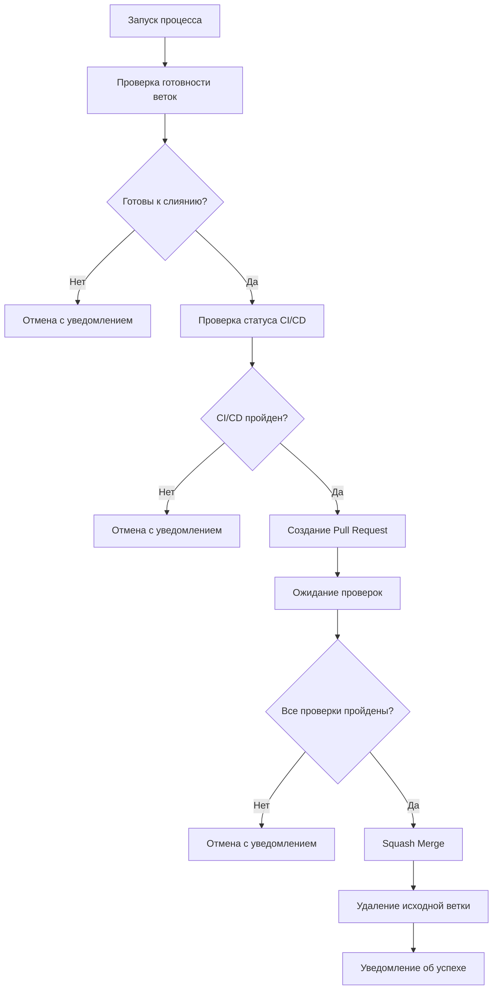

# 🔄 Процесс слияния веток develop и main

## 📋 Обзор

В проекте реализован автоматизированный процесс слияния веток `develop` и `main` с использованием GitHub Actions и стратегии **Squash Merge** для поддержания чистой истории коммитов.

## 🏗️ Архитектура процесса

### Основные компоненты

1. **[Автоматическое слияние веток](../../.github/workflows/merge-branches.yml)** - основной workflow для слияния
2. **[Настройка правил защиты веток](../../.github/workflows/setup-branch-protection.yml)** - автоматическая настройка branch protection
3. **[Проверки перед слиянием](../../.github/workflows/pre-merge-checks.yml)** - комплексная проверка качества кода
4. **[Скрипт настройки](../../.github/scripts/setup-branch-protection.sh)** - скрипт для настройки правил защиты

## 🔄 Стратегия слияния

### Squash Merge

Мы используем стратегию **Squash Merge** по следующим причинам:

- ✅ **Чистая история коммитов** в основной ветке
- ✅ **Логическое группирование изменений** в один осмысленный коммит
- ✅ **Упрощение отката изменений** при необходимости
- ✅ **Соответствие лучшим практикам** для production веток

## 📊 Процесс слияния

### Автоматическое слияние

Процесс слияния может быть запущен:

1. **По расписанию** - ежедневно в 9:00 UTC
2. **Вручную** - через GitHub Actions UI

### Этапы процесса



## 🔒 Правила защиты веток

### Ветка `main`

- 🔒 **Защищена от прямого пуша**
- ✅ **Требуется Pull Request** для изменений
- 👥 **Минимум 1 одобрение** для слияния
- 🔄 **Строгие проверки статуса** CI/CD
- 🗑️ **Отклонение устаревших PR**
- 👑 **Применение правил к администраторам**

### Ветка `develop`

- 🔒 **Защищена от прямого пуша**
- ✅ **Требуется Pull Request** для изменений
- 👥 **Минимум 1 одобрение** для слияния
- 🔄 **Строгие проверки статуса** CI/CD
- 🗑️ **Отклонение устаревших PR**
- 👑 **Применение правил к администраторам**

## 🧪 Проверки перед слиянием

### Автоматические проверки

1. **Анализ изменений**
   - Определение типов изменений (бэкенд, фронтенд, Docker, CI/CD)
   - Проверка размера Pull Request

2. **Качество кода**
   - Проверка наличия тестов для изменений в исходном коде
   - Проверка обновления документации для изменений в API
   - Сканирование на наличие потенциальных секретов

3. **Безопасность**
   - Проверка зависимостей на уязвимости
   - Сканирование кода на секреты и пароли

4. **CI/CD проверки**
   - Прохождение всех тестов
   - Успешная сборка Docker образов
   - Валидация конфигурации

## 🚀 Ручной запуск слияния

### Через GitHub Actions UI

1. Перейдите в раздел **Actions** в репозитории
2. Выберите workflow **"Автоматическое слияние веток"**
3. Нажмите **"Run workflow"**
4. Укажите параметры:
   - **Исходная ветка** (по умолчанию: `develop`)
   - **Целевая ветка** (по умолчанию: `main`)
   - **Принудительное слияние** (опционально)

### Через GitHub CLI

```bash
# Запуск workflow с параметрами по умолчанию
gh workflow run "Автоматическое слияние веток"

# Запуск с указанием веток
gh workflow run "Автоматическое слияние веток" \
  --field source_branch=develop \
  --field target_branch=main
```

## 📝 Рекомендации

### Для разработчиков

1. **Размер Pull Request**
   - Идеально: < 1000 строк изменений
   - Приемлемо: 1000-2000 строк
   - Требуется разбить: > 2000 строк

2. **Тесты**
   - Добавляйте тесты для изменений в бизнес-логике
   - Покрывайте новые функции тестами
   - Обновляйте существующие тесты при рефакторинге

3. **Документация**
   - Обновляйте документацию при изменениях API
   - Добавляйте комментарии для сложного кода
   - Обновляйте README при изменении процессов

### Для DevOps инженеров

1. **Мониторинг**
   - Следите за успешностью слияний
   - Анализируйте причины неудач
   - Оптимизируйте процесс при необходимости

2. **Безопасность**
   - Регулярно проверяйте правила защиты веток
   - Обновляйте проверки безопасности
   - Мониторьте зависимости на уязвимости

3. **Производительность**
   - Оптимизируйте время выполнения проверок
   - Используйте кэширование зависимостей
   - Параллелизуйте проверки где возможно

## 🔧 Устранение неполадок

### Частые проблемы

1. **Конфликты слияния**
   ```
   Причина: Несовместимые изменения в одних и тех же файлах
   Решение: Разрешите конфликты локально и отправьте изменения
   ```

2. **Провал CI/CD проверок**
   ```
   Причина: Неудачные тесты или ошибки сборки
   Решение: Исправьте ошибки в исходной ветке
   ```

3. **Отсутствие одобрений**
   ```
   Причина: Требуется минимум 1 одобрение для слияния
   Решение: Запросите ревью у коллеги
   ```

4. **Устаревший Pull Request**
   ```
   Причина: В ветке появились новые коммиты после создания PR
   Решение: Обновите ветку или создайте новый PR
   ```

### Логирование и отладка

Все процессы слияния логируются в GitHub Actions:

1. **Детальные логи** каждого шага
2. **Артефакты** с отчетами о проверках
3. **Уведомления** о статусе процесса

## 📚 Дополнительные ресурсы

- [GitHub Branch Protection](https://docs.github.com/en/repositories/configuring-branches-and-merges-in-your-repository/defining-the-mergeability-of-pull-requests/about-protected-branches)
- [GitHub Actions Documentation](https://docs.github.com/en/actions)
- [Squash Merge Best Practices](https://www.atlassian.com/git/tutorials/merging-vs-rebasing)

---

*Документация обновлена: $(date +%Y-%m-%d)*
*Версия процесса: 1.0*