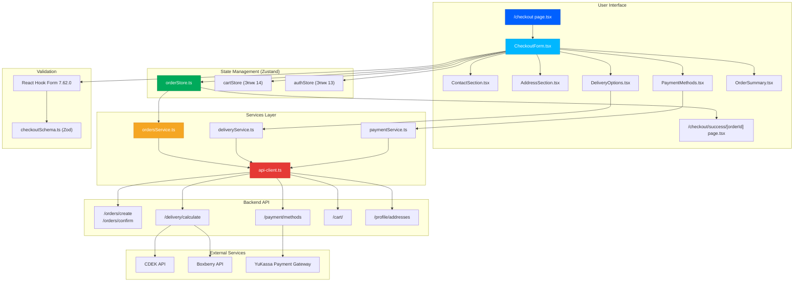
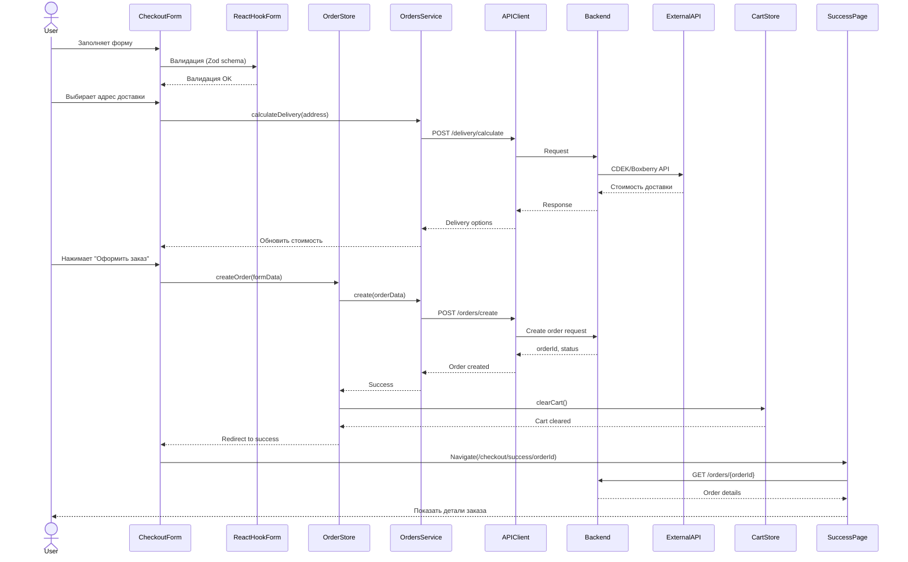
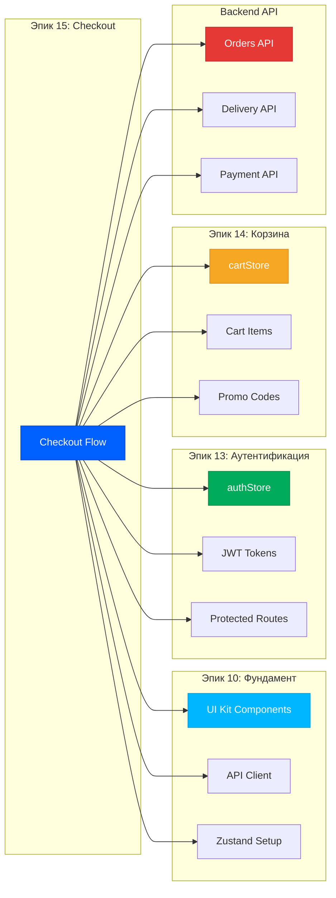
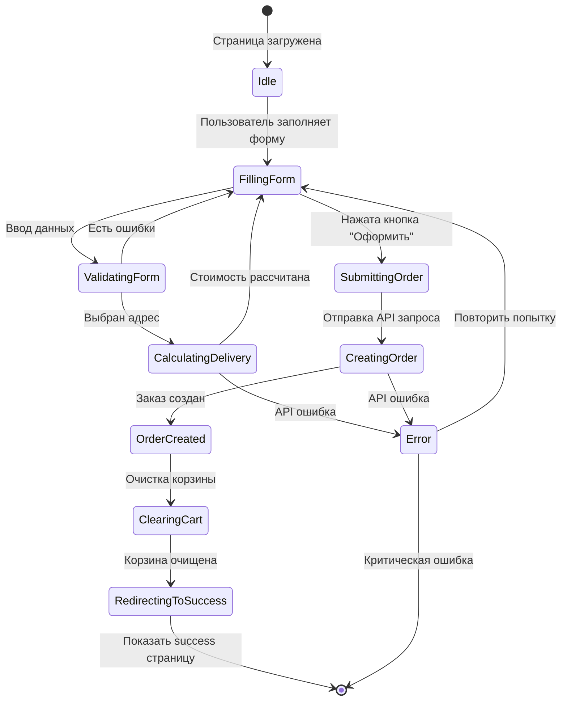
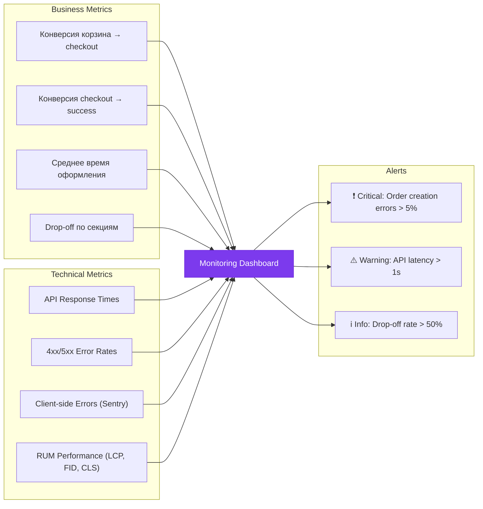

# Эпик 15: Checkout - Архитектурная диаграмма

**Версия:** 1.0.0
**Дата:** 2025-12-14

---

## Архитектура компонентов



---

## Data Flow диаграмма



---

## Интеграционная карта



---

## Component Hierarchy

```
CheckoutPage (page.tsx)
└── CheckoutForm
    ├── ContactSection
    │   ├── Input (firstName, lastName)
    │   ├── Input (email, phone)
    │   └── ValidationMessages
    │
    ├── AddressSection
    │   ├── Select (saved addresses)
    │   ├── Input (street, city, zip)
    │   └── Button (save new address)
    │
    ├── DeliveryOptions
    │   ├── RadioGroup
    │   │   ├── CourierOption
    │   │   ├── PickupOption
    │   │   └── PostOption
    │   ├── DeliveryCostCalculator
    │   └── DeliveryTimeEstimate
    │
    ├── PaymentMethods
    │   ├── RadioGroup
    │   │   ├── CardOption (YuKassa)
    │   │   ├── CashOption
    │   │   └── B2BInvoiceOption (только для B2B)
    │   └── PaymentMethodsLoader
    │
    ├── OrderSummary
    │   ├── CartItemsList (из cartStore)
    │   ├── PromoCodeInput
    │   ├── DeliveryPriceDisplay
    │   └── TotalPriceDisplay
    │
    └── SubmitButton
        ├── LoadingSpinner
        └── SuccessRedirect
```

---

## State Management Flow



---

## File Structure Tree

```
src/
├── app/
│   └── checkout/
│       ├── page.tsx                           # Главная checkout страница (Story 15.1)
│       ├── layout.tsx                         # Layout с защитой (требует auth)
│       ├── success/
│       │   └── [orderId]/
│       │       └── page.tsx                   # Success страница (Story 15.5)
│       └── __tests__/
│           ├── page.test.tsx                  # Unit-тесты checkout page
│           └── success.test.tsx               # Unit-тесты success page
│
├── components/
│   └── checkout/
│       ├── CheckoutForm.tsx                   # Главная форма (Story 15.1)
│       ├── ContactSection.tsx                 # Контактные данные
│       ├── AddressSection.tsx                 # Адрес доставки
│       ├── DeliveryOptions.tsx                # Способы доставки (Story 15.3)
│       ├── PaymentMethods.tsx                 # Способы оплаты (Story 15.4)
│       ├── OrderSummary.tsx                   # Итоговая сумма
│       └── __tests__/
│           ├── CheckoutForm.test.tsx
│           ├── ContactSection.test.tsx
│           ├── AddressSection.test.tsx
│           ├── DeliveryOptions.test.tsx
│           ├── PaymentMethods.test.tsx
│           └── OrderSummary.test.tsx
│
├── services/
│   ├── ordersService.ts                       # API orders (Story 15.2)
│   │   ├── createOrder()
│   │   ├── confirmOrder()
│   │   └── getOrderById()
│   ├── deliveryService.ts                     # API delivery (Story 15.3)
│   │   ├── calculateDelivery()
│   │   └── getDeliveryOptions()
│   ├── paymentService.ts                      # API payment (Story 15.4)
│   │   ├── getPaymentMethods()
│   │   └── initializePayment()
│   └── __tests__/
│       ├── ordersService.test.ts              # MSW моки
│       ├── deliveryService.test.ts
│       └── paymentService.test.ts
│
├── stores/
│   └── orderStore.ts                          # Zustand store (Story 15.2)
│       ├── currentOrder
│       ├── isSubmitting
│       ├── error
│       ├── createOrder()
│       ├── confirmOrder()
│       └── clearOrder()
│
├── schemas/
│   └── checkoutSchema.ts                      # Zod валидация (Story 15.1)
│       ├── contactSchema
│       ├── addressSchema
│       ├── deliverySchema
│       ├── paymentSchema
│       └── checkoutFormSchema
│
├── types/
│   ├── order.ts                               # TypeScript типы
│   │   ├── Order
│   │   ├── OrderItem
│   │   └── OrderStatus
│   ├── delivery.ts
│   │   ├── DeliveryOption
│   │   ├── DeliveryMethod
│   │   └── DeliveryCalculation
│   └── payment.ts
│       ├── PaymentMethod
│       ├── PaymentStatus
│       └── PaymentProvider
│
├── __mocks__/
│   └── handlers/
│       ├── ordersHandlers.ts                  # MSW моки для orders
│       ├── deliveryHandlers.ts                # MSW моки для delivery
│       └── paymentHandlers.ts                 # MSW моки для payment
│
└── tests/
    └── e2e/
        └── checkout.spec.ts                   # Playwright E2E (Story 15.6)
            ├── Add to cart flow
            ├── Checkout form filling
            ├── Order creation
            └── Success page display
```

---

## API Integration Map

| Service | Endpoint | Method | Purpose | Story |
|---------|----------|--------|---------|-------|
| **ordersService** | `/orders/create` | POST | Создание заказа | 15.2 |
| **ordersService** | `/orders/confirm` | POST | Подтверждение заказа | 15.2 |
| **ordersService** | `/orders/{id}` | GET | Получение деталей | 15.5 |
| **deliveryService** | `/delivery/calculate` | POST | Расчёт доставки | 15.3 |
| **deliveryService** | `/delivery/options` | GET | Способы доставки | 15.3 |
| **paymentService** | `/payment/methods` | GET | Способы оплаты | 15.4 |
| **paymentService** | `/payment/initialize` | POST | Инициализация платежа | 15.4 |
| **cartService** | `/cart/` | GET | Получение корзины | 15.1 |
| **profileService** | `/profile/addresses` | GET | Адреса пользователя | 15.1 |

---

## Performance Optimization Strategy

```mermaid
graph TB
    subgraph "Code Splitting"
        LazyLoad["Lazy Load Delivery/Payment Components"]
        DynamicImport["Dynamic Import для тяжёлых библиотек"]
    end

    subgraph "Caching"
        DeliveryCache["Cache delivery options (5 min)"]
        PaymentCache["Cache payment methods (session)"]
        AddressCache["Cache user addresses (10 min)"]
    end

    subgraph "Debouncing"
        DeliveryDebounce["Debounce delivery calculation (500ms)"]
        ValidationDebounce["Debounce form validation (300ms)"]
    end

    subgraph "Bundle Optimization"
        TreeShaking["Tree Shaking unused code"]
        Minification["Minification & Compression"]
        ImageOptimization["Next.js Image optimization"]
    end

    LazyLoad --> Performance[Target: PageSpeed > 70]
    DynamicImport --> Performance
    DeliveryCache --> Performance
    PaymentCache --> Performance
    AddressCache --> Performance
    DeliveryDebounce --> Performance
    ValidationDebounce --> Performance
    TreeShaking --> Performance
    Minification --> Performance
    ImageOptimization --> Performance

    style Performance fill:#00AA5B,stroke:#008A47,color:#fff
```



---

## Security Architecture

```mermaid
graph TB
    subgraph "Client Security"
        HTTPS["HTTPS Only"]
        CSP["Content Security Policy"]
        CSRF["CSRF Tokens"]
        ZodValidation["Zod Input Validation"]
    end

    subgraph "Authentication"
        JWTAuth["JWT в HttpOnly Cookies"]
        RefreshToken["Refresh Token Strategy"]
        RouteGuard["Protected Route Middleware"]
    end

    subgraph "Payment Security"
        PCI["PCI DSS Compliance (YuKassa)"]
        Tokenization["Payment Tokenization"]
        NoCardStorage["No Card Data Storage"]
    end

    subgraph "API Security"
        RateLimit["Rate Limiting"]
        InputSanitization["Input Sanitization"]
        APIValidation["Backend Validation"]
    end

    HTTPS --> Secure[Secure Checkout]
    CSP --> Secure
    CSRF --> Secure
    ZodValidation --> Secure
    JWTAuth --> Secure
    RefreshToken --> Secure
    RouteGuard --> Secure
    PCI --> Secure
    Tokenization --> Secure
    NoCardStorage --> Secure
    RateLimit --> Secure
    InputSanitization --> Secure
    APIValidation --> Secure

    style Secure fill:#E53935,stroke:#C62828,color:#fff
```



---

## Testing Pyramid

```mermaid
graph TB
    subgraph "E2E Tests (Playwright)"
        E2E1["Critical Flow: Cart → Checkout → Success"]
        E2E2["Delivery Calculation"]
        E2E3["Payment Method Selection"]
        E2E4["B2B/B2C Scenarios"]
    end

    subgraph "Integration Tests (MSW)"
        INT1["ordersService API calls"]
        INT2["deliveryService API calls"]
        INT3["paymentService API calls"]
        INT4["Error handling & Retry"]
    end

    subgraph "Unit Tests (Vitest + RTL)"
        UNIT1["CheckoutForm component"]
        UNIT2["Zod validation schemas"]
        UNIT3["orderStore (Zustand)"]
        UNIT4["All sections (Contact, Address, etc.)"]
        UNIT5["Services logic"]
    end

    E2E1 --> Coverage[Target: 80%+ Coverage]
    E2E2 --> Coverage
    E2E3 --> Coverage
    E2E4 --> Coverage
    INT1 --> Coverage
    INT2 --> Coverage
    INT3 --> Coverage
    INT4 --> Coverage
    UNIT1 --> Coverage
    UNIT2 --> Coverage
    UNIT3 --> Coverage
    UNIT4 --> Coverage
    UNIT5 --> Coverage

    style Coverage fill:#00AA5B,stroke:#008A47,color:#fff
```



---

## Monitoring Dashboard



---

**Автор:** John (PM Agent) 📋
**Дата:** 2025-12-14
**Версия:** 1.0.0
