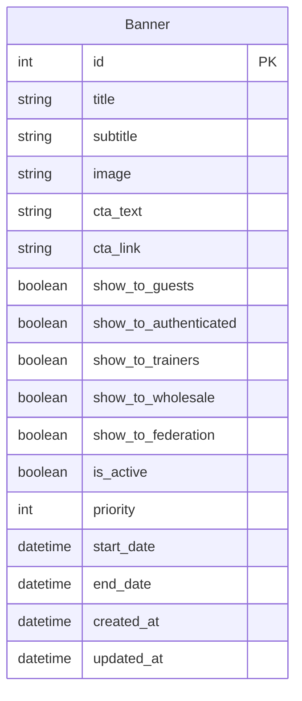

# Epic 17: Banner Management System

**Создан:** 2025-12-19
**Статус:** Запланирован
**Приоритет:** P0 (критичный)
**Длительность:** 1.5 недели
**Зависимости:** Epic 11 (Hero-секция реализована), Epic 28 (Аутентификация)

---

## Epic Goal

Реализовать систему управления баннерами Hero-секции с таргетингом по группам пользователей (гости, авторизованные, тренеры, оптовики, федералы), обеспечив динамическое управление контентом через Django Admin и API-driven отображение на фронтенде.

---

## Epic Description

### Existing System Context

**Текущая функциональность:**
- ✅ Hero-секция реализована в Epic 11 с захардкоженными баннерами
- ✅ Текущий компонент `HeroSection.tsx` переключает контент на основе `authStore.user.role`
- ✅ Три типа баннеров (B2B/B2C/Universal) определены статически в коде
- ✅ Ролевая система пользователей готова (`User.ROLE_CHOICES`)
- ✅ Django Admin функционирует для управления другими сущностями

**Технологический стек:**
- Backend: Django 4.2 LTS + Django REST Framework 3.14+
- Frontend: Next.js 15+ с TypeScript, Zustand
- Database: PostgreSQL 15+ с JSONB поддержкой
- Cache: Redis 7.0+ (для кэширования баннеров)

**Точки интеграции:**
- Модель `User` с полем `role` (`apps/users/models.py`)
- Компонент `HeroSection.tsx` (`frontend/src/components/home/HeroSection.tsx`)
- Zustand `authStore` для определения роли пользователя
- Django Admin для управления контентом

### Enhancement Details

**Что добавляется:**

1. **Backend модели баннеров:**
   - `Banner` модель с полями для контента (title, subtitle, image, CTA)
   - Система таргетинга по группам пользователей (ManyToMany или Boolean поля)
   - Поддержка приоритета и активности баннеров
   - Планирование публикации (start_date, end_date)

2. **API эндпоинты:**
   - `GET /api/banners/active/` — получение активных баннеров для текущего пользователя
   - Фильтрация на бекенде по роли из JWT токена или гостевому статусу

3. **Django Admin интерфейс:**
   - CRUD для баннеров с preview изображений
   - Чекбоксы для выбора целевых групп
   - Фильтрация по статусу активности

4. **Frontend интеграция:**
   - Рефакторинг `HeroSection.tsx` для загрузки баннеров из API
   - Fallback на статические баннеры при ошибке API
   - Кэширование на стороне клиента

**Целевые группы пользователей:**

| Группа | Описание | Условие отображения |
|--------|----------|---------------------|
| `show_to_guests` | Неавторизованные пользователи | `user === null` |
| `show_to_authenticated` | Любой авторизованный пользователь | `user !== null` |
| `show_to_trainers` | Тренеры/Фитнес-клубы | `user.role === 'trainer'` |
| `show_to_wholesale` | Оптовики (все уровни) | `user.role.startsWith('wholesale')` |
| `show_to_federation` | Представители федераций | `user.role === 'federation_rep'` |

> [!IMPORTANT]
> Один баннер может быть нацелен на несколько групп одновременно. Например: баннер "Скидка 10%" показывается и неавторизованным, и авторизованным B2C пользователям.

**Критерии успеха:**
- ✅ Баннеры управляются через Django Admin без изменения кода
- ✅ Таргетинг работает корректно для всех 5 групп пользователей
- ✅ API возвращает только релевантные баннеры для текущего пользователя
- ✅ Frontend отображает баннеры из API с fallback на статику
- ✅ Время загрузки баннеров < 200ms
- ✅ Unit-тесты покрытие 80%+
- ✅ Integration-тесты для API эндпоинтов

---

## User Stories

### Story 17.1: Backend модели и Admin для баннеров
**Описание:** Создать модель `Banner` с поддержкой таргетинга по группам пользователей и базовый Django Admin интерфейс.

**Acceptance Criteria:**
- Создана модель `Banner` в новом приложении `apps/banners/`
- Поля контента: `title`, `subtitle`, `image`, `cta_text`, `cta_link`
- Поля таргетинга: `show_to_guests`, `show_to_authenticated`, `show_to_trainers`, `show_to_wholesale`, `show_to_federation`
- Поля управления: `is_active`, `priority`, `start_date`, `end_date`
- Django Admin с list_display, list_filter, fieldsets
- Миграции созданы и применены
- Unit-тесты для модели (валидация, ordering, queryset filtering)

**Референсные документы:**
- `backend/apps/users/models.py` (User.ROLE_CHOICES)
- `docs/architecture/coding-standards.md`
- `docs/architecture/10-testing-strategy.md`

---

### Story 17.2: API эндпоинты для баннеров
**Описание:** Реализовать REST API для получения активных баннеров с фильтрацией по роли текущего пользователя.

**Acceptance Criteria:**
- `GET /api/banners/active/` — возвращает баннеры для текущего пользователя
- Фильтрация по `is_active=True` и дате публикации
- Фильтрация по роли из JWT токена (или гость если не авторизован)
- Сортировка по `priority` (DESC)
- Сериализатор с полями: `id`, `title`, `subtitle`, `image_url`, `cta_text`, `cta_link`
- OpenAPI документация (drf-spectacular)
- Integration-тесты для всех сценариев (гость, retail, wholesale, trainer, federation)

**Референсные документы:**
- `docs/architecture/03-api-specification.md`
- `docs/api-spec.yaml`
- `backend/apps/products/views.py` (пример ViewSet)

---

### Story 17.3: Frontend интеграция с API баннеров
**Описание:** Рефакторить компонент `HeroSection.tsx` для загрузки баннеров из API с fallback на статические баннеры.

**Acceptance Criteria:**
- Создан `bannersService.ts` для запросов к API
- `HeroSection.tsx` загружает баннеры из `GET /api/banners/active/`
- При ошибке API или пустом ответе — fallback на текущие статические баннеры
- Loading state с skeleton loader
- Поддержка нескольких баннеров в карусели (если API возвращает > 1)
- Unit-тесты с MSW моками
- Обновлены E2E тесты (если есть)

**Референсные документы:**
- `frontend/src/components/home/HeroSection.tsx`
- `frontend/src/services/` (существующие сервисы)
- `frontend/docs/testing-standards.md`

---

### Story 17.4: Обновление документации
**Описание:** Обновить проектную документацию для отражения нового функционала Banner Management System.

**Acceptance Criteria:**
- Обновлён `docs/api-spec.yaml` — добавлен endpoint `/api/banners/active/` с полной схемой
- Обновлён `docs/architecture/source-tree.md` — добавлен `apps/banners/` в структуру
- Обновлён `docs/architecture/02-data-models.md` — добавлена модель `Banner` и ER-диаграмма
- Обновлён `docs/architecture/03-api-specification.md` — добавлен раздел Banners API
- Обновлён `docs/architecture/09-database-schema.md` — добавлена таблица `banners`
- Обновлён `GEMINI.md` — добавлено описание нового приложения `apps/banners/`
- Все ссылки internal docs проверены и валидны

**Референсные документы:**
- `docs/api-spec.yaml` (OpenAPI 3.0.3 спецификация)
- `docs/architecture/source-tree.md` (структура кода)
- `docs/architecture/02-data-models.md` (модели данных)
- `docs/architecture/03-api-specification.md` (описание API)
- `docs/architecture/09-database-schema.md` (схема БД)

---

## Documentation Updates Required

> [!IMPORTANT]
> При реализации Epic 17 необходимо обновить следующие документы:

### Обязательные обновления

| Документ | Что добавить | Приоритет |
|----------|-------------|-----------|
| [api-spec.yaml](file:///c:/Users/tkachenko/DEV/FREESPORT/docs/api-spec.yaml) | Endpoint `/api/banners/active/`, схема `Banner` | HIGH |
| [source-tree.md](file:///c:/Users/tkachenko/DEV/FREESPORT/docs/architecture/source-tree.md) | Директория `apps/banners/` в структуре backend | HIGH |
| [02-data-models.md](file:///c:/Users/tkachenko/DEV/FREESPORT/docs/architecture/02-data-models.md) | Модель `Banner` с ER-диаграммой | HIGH |
| [03-api-specification.md](file:///c:/Users/tkachenko/DEV/FREESPORT/docs/architecture/03-api-specification.md) | Раздел "Banners API" с описанием эндпоинтов | MEDIUM |
| [09-database-schema.md](file:///c:/Users/tkachenko/DEV/FREESPORT/docs/architecture/09-database-schema.md) | Таблица `banners` со всеми полями | MEDIUM |
| [GEMINI.md](file:///c:/Users/tkachenko/DEV/FREESPORT/GEMINI.md) | Описание `apps/banners/` в разделе "Django App Structure" | LOW |

### Пример изменений для api-spec.yaml

```yaml
# Добавить в paths:
/banners/active/:
  get:
    tags: [Banners]
    summary: Получить активные баннеры для текущего пользователя
    description: |
      Возвращает список активных баннеров, отфильтрованных по роли пользователя.
      Для неавторизованных пользователей возвращаются баннеры с show_to_guests=true.
    security: []  # Опциональная авторизация
    responses:
      '200':
        description: Список баннеров
        content:
          application/json:
            schema:
              $ref: '#/components/schemas/BannerList'

# Добавить в components/schemas:
Banner:
  type: object
  properties:
    id:
      type: integer
    title:
      type: string
    subtitle:
      type: string
    image_url:
      type: string
      format: uri
    cta_text:
      type: string
    cta_link:
      type: string

BannerList:
  type: object
  properties:
    count:
      type: integer
    results:
      type: array
      items:
        $ref: '#/components/schemas/Banner'
```

### Пример изменений для 02-data-models.md



---


### Banner Model

```python
# apps/banners/models.py

from django.db import models
from django.utils import timezone


class Banner(models.Model):
    """
    Модель баннера для Hero-секции главной страницы.
    Поддерживает таргетинг по группам пользователей.
    """
    
    # Контент
    title = models.CharField("Заголовок", max_length=200)
    subtitle = models.CharField("Подзаголовок", max_length=500, blank=True)
    image = models.ImageField(
        "Изображение",
        upload_to="banners/%Y/%m/",
        help_text="Рекомендуемый размер: 1920x600px"
    )
    cta_text = models.CharField("Текст кнопки", max_length=50)
    cta_link = models.CharField("Ссылка кнопки", max_length=200)
    
    # Таргетинг по группам
    show_to_guests = models.BooleanField(
        "Показывать гостям",
        default=False,
        help_text="Неавторизованные пользователи"
    )
    show_to_authenticated = models.BooleanField(
        "Показывать авторизованным",
        default=False,
        help_text="Любые авторизованные пользователи (включая B2C retail)"
    )
    show_to_trainers = models.BooleanField(
        "Показывать тренерам",
        default=False,
        help_text="Роль: trainer"
    )
    show_to_wholesale = models.BooleanField(
        "Показывать оптовикам",
        default=False,
        help_text="Роли: wholesale_level1, wholesale_level2, wholesale_level3"
    )
    show_to_federation = models.BooleanField(
        "Показывать федералам",
        default=False,
        help_text="Роль: federation_rep"
    )
    
    # Управление
    is_active = models.BooleanField("Активен", default=True)
    priority = models.IntegerField(
        "Приоритет",
        default=0,
        help_text="Чем выше число, тем выше приоритет отображения"
    )
    start_date = models.DateTimeField(
        "Дата начала показа",
        null=True,
        blank=True,
        help_text="Оставьте пустым для немедленного показа"
    )
    end_date = models.DateTimeField(
        "Дата окончания показа",
        null=True,
        blank=True,
        help_text="Оставьте пустым для бессрочного показа"
    )
    
    # Метаданные
    created_at = models.DateTimeField("Дата создания", auto_now_add=True)
    updated_at = models.DateTimeField("Дата обновления", auto_now=True)
    
    class Meta:
        verbose_name = "Баннер"
        verbose_name_plural = "Баннеры"
        db_table = "banners"
        ordering = ["-priority", "-created_at"]
    
    def __str__(self) -> str:
        return f"{self.title} (priority: {self.priority})"
    
    @property
    def is_scheduled_active(self) -> bool:
        """Проверка активности с учётом дат публикации"""
        now = timezone.now()
        if not self.is_active:
            return False
        if self.start_date and now < self.start_date:
            return False
        if self.end_date and now > self.end_date:
            return False
        return True
    
    @classmethod
    def get_for_user(cls, user=None):
        """
        Получить баннеры для пользователя с учётом его роли.
        
        Args:
            user: User instance или None для гостя
        
        Returns:
            QuerySet баннеров, отсортированных по приоритету
        """
        from django.db.models import Q
        
        now = timezone.now()
        base_qs = cls.objects.filter(is_active=True).filter(
            Q(start_date__isnull=True) | Q(start_date__lte=now)
        ).filter(
            Q(end_date__isnull=True) | Q(end_date__gte=now)
        )
        
        if user is None or not user.is_authenticated:
            # Гость
            return base_qs.filter(show_to_guests=True)
        
        # Авторизованный пользователь
        role = user.role
        
        filters = Q(show_to_authenticated=True)
        
        if role == "trainer":
            filters |= Q(show_to_trainers=True)
        elif role in ("wholesale_level1", "wholesale_level2", "wholesale_level3"):
            filters |= Q(show_to_wholesale=True)
        elif role == "federation_rep":
            filters |= Q(show_to_federation=True)
        
        return base_qs.filter(filters)
```

---

## API Design

### Endpoints

| Method | Endpoint | Description | Auth |
|--------|----------|-------------|------|
| GET | `/api/banners/active/` | Получить активные баннеры для текущего пользователя | Optional |

### Response Schema

```json
// GET /api/banners/active/
// Response 200 OK
{
  "count": 2,
  "results": [
    {
      "id": 1,
      "title": "Новая коллекция 2025",
      "subtitle": "Эксклюзивные новинки уже в продаже",
      "image_url": "/media/banners/2025/01/hero-b2c.webp",
      "cta_text": "Перейти в каталог",
      "cta_link": "/catalog"
    },
    {
      "id": 2,
      "title": "Скидка 15% на первый заказ",
      "subtitle": "Только для новых клиентов",
      "image_url": "/media/banners/2025/01/promo.webp",
      "cta_text": "Получить скидку",
      "cta_link": "/register"
    }
  ]
}
```

---

## Compatibility Requirements

- [ ] Существующий `HeroSection.tsx` сохраняет обратную совместимость (fallback)
- [ ] API не требует авторизации (работает для гостей)
- [ ] Изображения баннеров оптимизированы (WebP, < 300KB)
- [ ] Django Admin UI не ломает существующие админ-страницы
- [ ] Миграции безопасны для production (нет удаления данных)

---

## Risk Mitigation

**Риск 1:** Поломка Hero-секции при ошибке API баннеров.

**Митигация:**
- Fallback на статические баннеры при ошибке API
- Локальный кэш в localStorage (5 минут)
- Мониторинг ошибок через Sentry

**Риск 2:** Неправильная фильтрация баннеров по ролям.

**Митигация:**
- 100% покрытие тестами для всех ролей
- Логирование запросов с ролью пользователя
- QA тестирование на staging

**Rollback Plan:**
- Feature flag для переключения между API и статическими баннерами
- Быстрый откат через переменную окружения `USE_STATIC_BANNERS=true`

---

## Definition of Done

- [ ] Все 4 user stories завершены с acceptance criteria выполнены
- [ ] Модель `Banner` создана с миграциями
- [ ] Django Admin интерфейс функционирует
- [ ] API `GET /api/banners/active/` работает с фильтрацией по ролям
- [ ] Frontend загружает баннеры из API с fallback
- [ ] Unit-тесты покрытие 80%+ (backend)
- [ ] Integration-тесты для API эндпоинтов
- [ ] Component-тесты для HeroSection (frontend)
- [ ] ESLint/Black/Flake8 проверки пройдены
- [ ] Code review завершён
- [ ] Документация проекта обновлена (api-spec.yaml, source-tree.md, data-models, etc.)
- [ ] CI/CD pipeline зелёный

---

## Technical Notes

### Файловая структура (Backend):

```
backend/apps/banners/
├── __init__.py
├── admin.py           # Django Admin конфигурация
├── apps.py            # AppConfig
├── models.py          # Banner модель
├── serializers.py     # DRF сериализаторы
├── views.py           # ViewSet/APIView
├── urls.py            # URL маршруты
├── migrations/
│   └── 0001_initial.py
└── tests/
    ├── __init__.py
    ├── test_models.py
    └── test_views.py
```

### Файловая структура (Frontend):

```
frontend/src/
├── services/
│   └── bannersService.ts    # API клиент для баннеров
├── types/
│   └── banners.ts           # TypeScript типы
└── components/home/
    └── HeroSection.tsx      # Рефакторинг для API
```

### Django Admin Configuration:

```python
# apps/banners/admin.py

from django.contrib import admin
from django.utils.html import format_html
from .models import Banner


@admin.register(Banner)
class BannerAdmin(admin.ModelAdmin):
    list_display = [
        "title", 
        "image_preview", 
        "is_active", 
        "priority", 
        "target_groups_display",
        "start_date", 
        "end_date"
    ]
    list_filter = [
        "is_active", 
        "show_to_guests", 
        "show_to_authenticated",
        "show_to_trainers",
        "show_to_wholesale",
        "show_to_federation"
    ]
    search_fields = ["title", "subtitle"]
    ordering = ["-priority", "-created_at"]
    
    fieldsets = (
        ("Контент", {
            "fields": ("title", "subtitle", "image", "cta_text", "cta_link")
        }),
        ("Таргетинг", {
            "fields": (
                "show_to_guests",
                "show_to_authenticated", 
                "show_to_trainers",
                "show_to_wholesale",
                "show_to_federation"
            ),
            "description": "Выберите группы пользователей для показа баннера"
        }),
        ("Управление", {
            "fields": ("is_active", "priority", "start_date", "end_date")
        }),
    )
    
    def image_preview(self, obj):
        if obj.image:
            return format_html(
                '', 
                obj.image.url
            )
        return "-"
    image_preview.short_description = "Превью"
    
    def target_groups_display(self, obj):
        groups = []
        if obj.show_to_guests:
            groups.append("Гости")
        if obj.show_to_authenticated:
            groups.append("Авторизованные")
        if obj.show_to_trainers:
            groups.append("Тренеры")
        if obj.show_to_wholesale:
            groups.append("Оптовики")
        if obj.show_to_federation:
            groups.append("Федералы")
        return ", ".join(groups) or "Никому"
    target_groups_display.short_description = "Целевые группы"
```

---

## Dependencies

**Блокирующие зависимости:**
- ✅ Epic 11: Hero-секция реализована (компонент `HeroSection.tsx`)
- ✅ Epic 28: Аутентификация (authStore, JWT)

**Разблокирует:**
- Маркетинговые кампании с таргетированными баннерами
- A/B тестирование баннеров (будущее расширение)

---

## Референсные документы

1. **Epic 11:** `docs/epics/epic-11/epic-11.home-page.md`
2. **Story 11.1:** `docs/stories/epic-11/11.1.hero-section-layout.story.md`
3. **User Model:** `backend/apps/users/models.py` (ROLE_CHOICES)
4. **Coding Standards:** `docs/architecture/coding-standards.md`
5. **Testing Strategy:** `docs/architecture/10-testing-strategy.md`
6. **API Specification:** `docs/architecture/03-api-specification.md`

---

## Change Log

| Date       | Version | Description                  | Author     |
|------------|---------|------------------------------|------------|
| 2025-12-19 | 1.0     | Initial epic creation        | Sarah (PO) |
| 2025-12-19 | 1.1     | Added Story 17.4 for documentation updates, added Documentation Updates Required section | Sarah (PO) |

---

**Статус:** 📋 Готов к ревью
**Последнее обновление:** 2025-12-19
**Автор:** Sarah (PO Agent)
