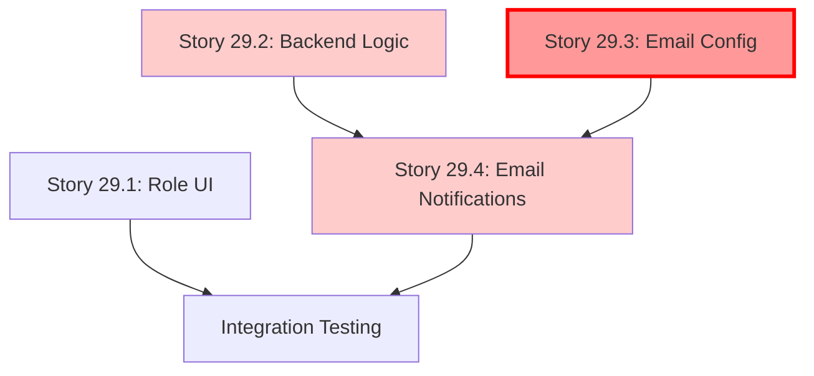

# Epic 29: Рекомендуемая Последовательность Выполнения Историй

**Epic:** Role-Based Registration & User Verification  
**Total Stories:** 4  
**Estimated Duration:** 9 дней (включая regression testing)

---

## 📋 Правильная Последовательность Историй

### Story 29.1: Role Selection UI & Warnings

**Duration:** 2 дня  
**Dependencies:** Нет (Epic 28 завершён)  
**Team:** Frontend Developer

**Key Deliverables:**

- [ ] Role selector component (4 опции)
- [ ] Conditional warning panel для B2B ролей
- [ ] Form validation для role field
- [ ] Unit тесты для компонента

**Validation Checkpoint:**

- UI следует Design System
- "Розничный покупатель" selected по умолчанию
- Warning появляется при выборе B2B роли

**Blocking Next Story:** Нет (можно параллельно с 29.2)

---

### Story 29.2: Backend Verification Logic & Access Control

**Duration:** 2.5 дня  
**Dependencies:** Нет (Epic 28 завершён)  
**Team:** Backend Developer

**Key Deliverables:**

- [ ] Обновлённый `RegisterView` с role handling
- [ ] Login endpoint проверяет `verification_status='pending'`
- [ ] Frontend HTTP 403 обработка "Account pending"
- [ ] **REGRESSION TESTS для Epic 28** ⚠️
- [ ] Unit + Integration тесты

**Critical Notes:**

- ✅ Использовать EXISTING `verification_status` field (НЕ создавать миграцию!)
- ✅ Retail: `is_active=True`, `verification_status='verified'`
- ✅ B2B: `is_active=False`, `verification_status='pending'`

**Validation Checkpoint:**

- [ ] Retail registration → immediate login works
- [ ] B2B registration → login blocked with clear message
- [ ] **ALL Epic 28 regression tests PASS**

**Blocking Next Story:** БЛОКИРУЕТ Story 29.4 (email notifications требуют user creation logic)

---

### Story 29.3: Email Server Configuration ⚡ CRITICAL FIRST

**Duration:** 1 день  
**Dependencies:** Нет  
**Team:** DevOps / Backend Developer

> [!IMPORTANT]
> **BLOCKING DEPENDENCY:** Эта история ДОЛЖНА быть завершена ПЕРЕД Story 29.4

**User Actions REQUIRED (Before Development):**

1. **Создать SMTP аккаунт:**
   - Development: Gmail App Password
   - Production: Yandex Mail для freesport.ru domain

2. **Получить credentials:**
   - Gmail: 16-digit App Password
   - Yandex: password + SMTP settings

3. **Обновить .env файл:**

   ```bash
   EMAIL_HOST=smtp.yandex.ru
   EMAIL_PORT=587
   EMAIL_HOST_USER=noreply@freesport.ru
   EMAIL_HOST_PASSWORD=your-password
   ADMIN_EMAILS=admin1@freesport.ru,admin2@freesport.ru
   ```

**Key Deliverables:**

- [ ] Django settings для SMTP настроены
- [ ] `settings.ADMINS` парсятся из `ADMIN_EMAILS` env var
- [ ] `.env.example` обновлён
- [ ] Test email отправляется успешно (manual verification)

**Validation Checkpoint:**

```python
# Test via Django shell
python manage.py shell
>>> from django.core.mail import send_mail
>>> send_mail('Test', 'Message', 'noreply@freesport.ru', ['admin@freesport.ru'])
# Should return: 1 (success)
```

**Blocking Next Story:** БЛОКИРУЕТ Story 29.4 (Celery tasks требуют SMTP config)

---

### Story 29.4: Email Notification System

**Duration:** 2.5 дня  
**Dependencies:**

- ✅ Story 29.2 (user creation logic)
- ✅ Story 29.3 (SMTP configuration)

**Team:** Backend Developer

**Key Deliverables:**

- [ ] Celery task: `send_admin_verification_email(user_id)`
- [ ] Celery task: `send_user_pending_email(user_id)`
- [ ] Email templates (HTML):
  - `emails/admin_new_verification_request.html`
  - `emails/user_registration_pending.html`
- [ ] Integration в `RegisterView`
- [ ] **MONITORING:** Task failure logging, email delivery tracking
- [ ] Unit + Integration тесты

**Critical Notes:**

- ✅ Retry logic: max 3 retries, exponential backoff
- ✅ Use `settings.ADMINS` (from Story 29.3)
- ✅ Логировать все email delivery success/failures

**Validation Checkpoint:**

- [ ] Admin email получен после B2B registration
- [ ] User confirmation email получен
- [ ] Retail registration НЕ отправляет emails (или welcome email)
- [ ] Celery task failures логируются correctly
- [ ] Email delivery tracked в logs

**Blocking Next Story:** Нет (последняя история)

---

## 🔗 Dependency Graph



**Legend:**

- 🔴 Red: CRITICAL PATH (Story 29.3 MUST go first)
- 🟠 Orange: Blocking stories

---

## ⚡ Parallel Execution Opportunities

**Week 1:**

- **Day 1-2:** Story 29.1 (Frontend) || Story 29.3 (DevOps/Backend)
- **Day 3-4:** Story 29.2 (Backend) - ПОСЛЕ завершения 29.3
- **Day 5:** Story 29.2 regression testing

**Week 2:**

- **Day 6-7:** Story 29.4 (Backend) - ТРЕБУЕТ 29.2 + 29.3
- **Day 8:** Integration testing всех историй
- **Day 9:** Bug fixes + final validation

**Critical Path:** 29.3 → 29.4 (нельзя инвертировать!)

---

## ✅ Validation Checklist (After All Stories)

### Functionality

- [ ] Retail users регистрируются и входят немедленно
- [ ] B2B users видят "На модерации" и НЕ могут войти
- [ ] Admins получают email о новых B2B заявках
- [ ] B2B users получают confirmation email

### Regression (Epic 28)

- [ ] Retail registration работает (без role selection)
- [ ] Login для retail users работает
- [ ] Password reset работает для всех ролей
- [ ] B2B registration из Epic 28 работает

### Technical

- [ ] НЕТ новых database migrations
- [ ] Email delivery rate > 95%
- [ ] Celery tasks НЕ fail (или retry успешно)
- [ ] Monitoring логи присутствуют

### Documentation

- [ ] `README.md` обновлён (Optional)
- [ ] `GEMINI.md` обновлён (Epic 29 упомянут)
- [ ] API Spec (Swagger) обновлён с `role` parameter

---

## 🚨 Common Pitfalls to Avoid

1. **DON'T start Story 29.4 before 29.3**
   - Celery tasks провалятся без SMTP config
   - Waste 1+ день на debugging

2. **DON'T create migration for `verification_status`**
   - Field уже существует!
   - Use existing field из models.py

3. **DON'T forget regression testing**
   - Epic 28 flows должны работать после изменений
   - Run full regression suite перед merge

4. **DON' T skip User Actions в Story 29.3**
   - DevOps должен создать SMTP аккаунт ПЕРЕД началом development
   - Без credentials email отправка не работает

---

## 📊 Story Completion Tracking

| Story | Status | Start Date | End Date | Blockers | Notes |
|-------|--------|------------|----------|----------|-------|
| 29.1 | ⬜ Not Started | - | - | - | Can start immediately |
| 29.2 | ⬜ Not Started | - | - | - | Can start immediately |
| 29.3 | ⬜ Not Started | - | - | **⚠️ User Actions required** | MUST complete before 29.4 |
| 29.4 | ⬜ Not Started | - | - | Requires 29.2 + 29.3 | Last story |

**Legend:**

- ⬜ Not Started
- 🔄 In Progress
- ✅ Done
- ⚠️ Blocked

---

**Document Version:** 1.0  
**Last Updated:** 2025-12-12  
**Contact:** Product Owner - Sarah (PO Agent)
