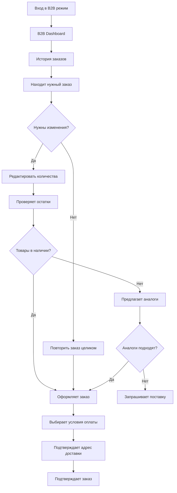

# Спецификация UI/UX FREESPORT

Данный документ определяет цели пользовательского опыта, информационную архитектуру, пользовательские потоки и спецификации визуального дизайна для пользовательского интерфейса FREESPORT. Он служит основой для визуального дизайна и frontend-разработки, обеспечивая целостный и ориентированный на пользователя опыт.

## Общие цели и принципы UX

На основе анализа конкурентов (prime-sport.ru, newarmor.ru) и специфики B2B платформы FREESPORT определены следующие цели и принципы UX:

### Целевые персоны

**Оптовый покупатель (3 уровня):**
- Уровень 1: Небольшие магазины, минимальные заказы 30,000₽
- Уровень 2: Средние сети, регулярные объемные закупки
- Уровень 3: Крупные ритейлеры, максимальные скидки и приоритет

**Тренер (Фитнес-клуб):**
- Руководители спортивных секций и фитнес-клубов
- Нужда в качественной экипировке для групповых занятий
- Фокус на соотношении цена-качество и долговечности

**Представитель федерации:**
- Закупщики для спортивных федераций
- Требования к сертификации и соответствию стандартам
- Особые условия и эксклюзивные предложения

### Цели удобства использования

- **Быстрота доступа к ценам**: Авторизованные пользователи видят персональные цены сразу
- **Прозрачность условий**: Четкое понимание системы скидок и уровней лояльности
- **Минимизация времени повторных заказов**: Быстрое оформление на основе истории

### Принципы дизайна

1. **Функциональность превыше эстетики** - B2B пользователи ценят эффективность
2. **Ролевая персонализация** - контент адаптируется под тип клиента
3. **Прозрачность ценообразования** - всегда понятные условия и скидки
4. **Минимизация шагов до заказа** - упрощенные процессы для повторных покупок
5. **Масштабируемость операций** - поддержка больших объемов данных и заказов

### Журнал изменений

| Date | Version | Description | Author |
|------|---------|-------------|---------|
| 2025-08-16 | 1.0 | Создание спецификации на основе анализа конкурентов | Sally (UX Expert) |

## Информационная архитектура (IA)

### Карта сайта / перечень экранов

```text
🏠 Главная B2B
├── 📦 Каталог товаров
│   ├── 🏃 СПОРТ
│   │   ├── 🥾 Туризм
│   │   │   ├── Палки для скандинавской ходьбы
│   │   │   └── Инвентарь для туризма и отдыха на природе
│   │   ├── 💪 Фитнес и атлетика
│   │   │   ├── 🏋️ Тяжелая атлетика
│   │   │   │   ├── Грифы
│   │   │   │   ├── Гантели
│   │   │   │   ├── Гири
│   │   │   │   ├── Бандажи
│   │   │   │   ├── Бинты
│   │   │   │   └── Пояса для тяжелой атлетики
│   │   │   ├── 💪 Фитнес
│   │   │   │   ├── Мячи для фитнеса
│   │   │   │   ├── Обручи
│   │   │   │   ├── Ролики для пресса
│   │   │   │   ├── Скакалки
│   │   │   │   ├── Степплатформы, бодибары и твистеры
│   │   │   │   ├── Эспандеры
│   │   │   │   ├── Утяжелители
│   │   │   │   └── Коврики, кариматы и маты
│   │   │   ├── 🏃 Легкая атлетика
│   │   │   ├── 🏆 Турники, брусья, упоры для отжимания
│   │   │   └── 🎒 Аксессуары для фитнеса и атлетики
│   │   │       ├── Перчатки
│   │   │       ├── Пояса для похудения
│   │   │       ├── Одежда для похудения
│   │   │       ├── Сумки и рюкзаки
│   │   │       ├── Шейкеры и бутылочки для питья
│   │   │       └── Прочее
│   │   ├── 🏊 Плавание
│   │   │   ├── Купальники для плавания
│   │   │   ├── Плавки для плавания
│   │   │   ├── Ласты
│   │   │   ├── Очки для плавания
│   │   │   ├── Шапочки для плавания
│   │   │   └── Бассейны, пляж, аксессуары
│   │   │       └── Бассейны
│   │   ├── ⚽ Спортивные игры
│   │   │   ├── 🏀 Баскетбол
│   │   │   │   ├── Мячи баскетбольные
│   │   │   │   └── Оборудование баскетбольное
│   │   │   ├── 🏓 Настольный теннис
│   │   │   │   ├── Мячи для настольного тенниса
│   │   │   │   ├── Ракетки
│   │   │   │   └── Сетки
│   │   │   ├── 🏐 Волейбол
│   │   │   │   ├── Мячи волейбольные
│   │   │   │   └── Защита волейбольная
│   │   │   ├── ⚽ Футбол
│   │   │   │   ├── Мячи футбольные (№3, №4, №5)
│   │   │   │   ├── Бутсы
│   │   │   │   ├── Гетры футбольные
│   │   │   │   ├── Защита для футбола
│   │   │   │   ├── Форма футбольная
│   │   │   │   └── Судейская атрибутика
│   │   │   ├── 🏸 Бадминтон и большой теннис
│   │   │   ├── 🤾 Гандбол
│   │   │   ├── 🎯 Дартс
│   │   │   ├── Классические настольные
│   │   │   └── Аксессуары
│   │   ├── 🥊 Единоборства
│   │   │   ├── 👘 Одежда для единоборств
│   │   │   │   ├── Кимоно
│   │   │   │   ├── Пояса для единоборств
│   │   │   │   ├── Форма боксерская
│   │   │   │   ├── Форма для борьбы
│   │   │   │   ├── Форма для кикбоксинга и тайского бокса
│   │   │   │   └── Форма для смешанных единоборств
│   │   │   ├── 👟 Обувь для единоборств
│   │   │   │   ├── Обувь для бокса
│   │   │   │   ├── Обувь для борьбы
│   │   │   │   └── Обувь для тхеквондо, кикбоксинга, рукопашного боя, самбо
│   │   │   ├── 🥊 Перчатки и накладки на руки
│   │   │   │   ├── Боксерские
│   │   │   │   ├── Для карате
│   │   │   │   ├── Для ММА
│   │   │   │   ├── Для рукопашного боя
│   │   │   │   ├── Для тхэквондо
│   │   │   │   └── Снарядные, тренировочные
│   │   │   ├── 🛡️ Защита для единоборств
│   │   │   │   ├── Бинты боксёрские
│   │   │   │   ├── Защита корпуса
│   │   │   │   ├── Защита ног
│   │   │   │   ├── Капы
│   │   │   │   ├── Шлема
│   │   │   │   └── Специальная защита
│   │   │   └── 🥅 Снаряжение
│   │   │       ├── Лапы и макивары
│   │   │       └── Мешки, груши, манекены
│   │   ├── 🤸 Гимнастика и танцы
│   │   │   ├── Одежда для гимнастики
│   │   │   │   └── Купальники
│   │   │   ├── Обувь для гимнастики и танцев
│   │   │   ├── Предметы для гимнастики
│   │   │   └── Наколенники гимнастические
│   │   └── 👕 Одежда спортивная
│   ├── 🚲 ДЕТСКИЙ ТРАНСПОРТ
│   │   ├── 🚲 Велосипеды
│   │   ├── ⛸️ Ролики
│   │   ├── 🛴 Самокаты
│   │   │   ├── Самокаты детские
│   │   │   ├── Самокаты городские
│   │   │   └── Трюковые самокаты
│   │   ├── 🛹 Скейты
│   │   └── 🛡️ Защита и аксессуары
│   ├── 🏋️ ОБОРУДОВАНИЕ
│   │   ├── 🏟️ Для спортивных залов
│   │   └── 🏗️ Спортивные комплексы и батуты
│   │       └── Аксессуары к детским комплексам
│   ├── 🎁 СУВЕНИРНАЯ ПРОДУКЦИЯ
│   └── 🔍 Поиск и фильтры
├── 👤 Личный кабинет B2B
│   ├── 📊 История заказов
│   ├── 🛒 Корзина
│   │   ├── 📋 Оформление заказа
│   │   ├── ✅ Подтверждение заказа
│   │   └── 📧 Уведомление менеджера
│   ├── 🏢 Профиль компании
│   ├── 📋 Выгрузки PDF/Excel
│   ├── 💰 Персональные цены
│   └── 🔄 Повторные заказы
├── ℹ️ О компании
├── 📞 Контакты
├── 🔧 Административная панель (только для админов)
│   ├── 📊 Дашборд и аналитика
│   ├── 👥 Управление пользователями
│   │   ├── Модерация B2B заявок
│   │   ├── Присвоение статусов
│   │   └── Управление ролями
│   ├── 📦 Управление заказами
│   │   ├── Обработка заказов
│   │   ├── Изменение статусов
│   │   └── История операций
│   ├── 🔄 Интеграция с 1С
│   │   ├── Статус синхронизации
│   │   ├── Логи операций
│   │   ├── Ручной экспорт/импорт
│   │   └── Мониторинг Circuit Breaker
│   ├── 📈 Аналитика и отчеты
│   │   ├── Статистика продаж
│   │   ├── Отчеты по клиентам
│   │   └── Финансовые отчеты
│   └── ⚙️ Системные настройки
│       ├── Управление контентом
│       ├── Настройки цен
│       └── Конфигурация системы
└── 📝 Заявка на доступ (для неавторизованных)
```

### Структура навигации

**Главная навигация (Header):**
- Логотип FREESPORT
- Каталог (мега-меню по видам спорта)
- Личный кабинет / Войти
- Корзина с индикатором количества
- Контакты менеджера

**Вторичная навигация (для авторизованных):**
- Навигационные цепочки (Breadcrumbs) для каталога
- Фильтры в боковой панели (Бренд, Размер, Цвет, Цена, Наличие)
- Быстрые ссылки в ЛК: "Повторить последний заказ", "Выгрузить прайс"

### Стратегия навигационных цепочек (Breadcrumbs)

- Главная > Вид спорта > Категория > Товар
- Личный кабинет > Раздел
- Поддержка возврата на любой уровень

## UX Рекомендации для B2B FREESPORT

### 2. Система навигации

- **Каталог по категориям**: Виды спорта → Подкатегории → SKU
  - **Фильтры**: Бренд, Размер, Цвет, Цена, Наличие на складе
- **Бизнес-инструменты**:
  - История заказов
  - Выгрузка заказа в PDF

### Ключевые функциональные блоки

**Регистрация и онбординг:**

- **Типизация клиентов**:
  - Оптовый покупатель (Уровень 1, 2, 3 - по объемам закупок)
  - Тренер (Фитнес-клуб или студия)
  - Представитель федерации
- **Верификация**: ИНН, ОГРН проверка

**Каталог и поиск:**

- SKU товаров
- Остатки на складе в реальном времени
- Bulk операции: массовое добавление по списку артикулов
- Прайс-листы с экспортом в Excel/PDF

**Корзина и заказ:**

- Калькулятор финальной стоимости с учетом скидок
- Быстрое оформление повторного заказа

### 💎 **Уникальные UX решения для MVP**

**1. Ролевая система баннеров:**

- Динамическое содержимое главной страницы
- Персонализированные предложения по типу клиента
- Адаптивная навигация под роли пользователей

**2. Упрощенная система лояльности:**

- Прозрачные уровни скидок для оптовых покупателей
- Специальные условия для тренеров и федераций
- Четкие критерии перехода между уровнями

## 📋 Функции отложенные на ФАЗУ 2

### **Аналитика и BI:**

- Аналитика продаж для клиентов
- Аналитический дашборд с метриками
- Прогнозирование потребностей на основе истории

### **Автоматизация и интеграции:**

- Проверка ИНН/ОГРН через API ФНС
- Быстрое автоматическое одобрение заявок (scoring)
- Интеграция с системами клиента (API/EDI)

### **Расширенная функциональность заказов:**

- Выгрузка заказов в CSV
- Сохранение шаблонов заказов
- Предложение аналогов при отсутствии товара

### **Документооборот:**

- Электронный документооборот (ЭДО)
- Автоматическое формирование счетов, накладных, актов сверки
- Система согласования заказов (workflow approval)

### **Коммуникации:**

- Коммуникационный хаб с историей взаимодействий
- Интеграция чата с CRM
- Уведомления о поступлениях интересующих товаров
- Push-уведомления в мобильном приложении

### **Продвинутая лояльность:**

- Прогрессивная система лояльности с накопительными баллами
- Программа раннего доступа к новинкам
- Персональные рекомендации на основе ML

## Пользовательские потоки

### 1. B2B Клиент: Процесс верификации

```mermaid
flowchart TD
    A[Регистрация B2B аккаунта] --> B[Ввод базовых данных]
    B --> C[Выбор типа клиента]
    C --> D[Заполнение профиля]
    D --> E[Подтверждение email]
    E --> F[Уведомление на email администратора]
    F --> G[Уведомление на email "Статус: На модерации"]
    G --> H[Администратор: Модерация + присвоение статуса]
    H --> I[Уведомление на email об одобрении]
    I --> J[Доступ к B2B функциям]
```

### 2. B2B Оптовик: Повторный заказ экипировки



### Метрики успеха пользовательских потоков

- Время от поиска до покупки: **< 1 минуты** (повтор B2B)
- Конверсия корзина→заказ: **> 70%**
- Bounce rate на карточке товара: **< 40%**

## Каркасы и макеты

### 1. Административная панель - Дашборд

#### Главный экран админ-панели

```text
┌─────────────────────────────────────────────────────────────────────────┐
│ [FREESPORT ADMIN] [👤Admin] [🔔Уведомления] [⚙️Настройки] [🚪Выйти]   │
├─────────────────────────────────────────────────────────────────────────┤
│ [📊Дашборд] [👥Пользователи] [📦Заказы] [🔄1С] [📈Отчеты] [⚙️Система]│
├─────────────────────────────────────────────────────────────────────────┤
│ ┌─ КПЭ (за сегодня) ──────────────────────────────────────────────────┐ │
│ │ 📋 Новых заявок   📦 Заказов      💰 Продаж     🔄 Синхронизация  │ │
│ │ [8] на модерации  [24] сегодня    [450,000₽]      [✅ Активна]     │ │
│ └─────────────────────────────────────────────────────────────────────┘ │
├─────────────────────────────────────────────────────────────────────────┤
│ ┌─ ТРЕБУЮТ ВНИМАНИЯ ───────────────────┐ ┌─ ИНТЕГРАЦИЯ 1С ────────────┐ │
│ │ 🔴 Заявки на модерации: [8]         │ │ Статус: ✅ Работает        │ │
│ │ 🟡 Проблемные заказы: [2]           │ │ Последняя синхронизация:    │ │
│ │ 🟠 Низкие остатки: [15 товаров]     │ │ 15:30 сегодня               │ │
│ │ [ПЕРЕЙТИ К МОДЕРАЦИИ]                │ │ Товары: ✅ | Заказы: ✅   │ │
│ └──────────────────────────────────────┘ │ Остатки: ✅ | Цены: ✅    │ │
│                                         │ [ПОСМОТРЕТЬ ЛОГИ]           │ │
│ ┌─ ГРАФИК ЗАКАЗОВ (7 дней) ───────────┐ │ [РУЧНАЯ СИНХРОНИЗАЦИЯ]      │ │
│ │     [График линейный]               │ └─────────────────────────────┘ │
│ │ 50 │    /\        /\                │                                 │
│ │ 40 │   /  \      /  \               │ ┌─ АКТИВНОСТЬ СИСТЕМЫ ────────┐ │
│ │ 30 │  /    \    /    \              │ │ 👥 Онлайн: 45 пользователей │ │
│ │ 20 │ /      \  /      \             │ │ 📊 Нагрузка CPU: 23%        │ │
│ │ 10 │/        \/        \            │ │ 💾 Память: 1.2GB/8GB        │ │
│ │  0 └──────────────────────────      │ │ 📶 Ответов API: 98.5%       │ │
│ │    Пн  Вт  Ср  Чт  Пт  Сб  Вс       │ │ [ПОДРОБНАЯ СТАТИСТИКА]      │ │
│ └─────────────────────────────────────┘ └─────────────────────────────┘ │
└─────────────────────────────────────────────────────────────────────────┘
```

### 2. Модерация B2B заявок

```text
┌─────────────────────────────────────────────────────────────────────────────┐
│ [🔙 Назад] МОДЕРАЦИЯ B2B ЗАЯВОК                               [🔄 Обновить]│
├─────────────────────────────────────────────────────────────────────────────┤
│ Фильтры: [Все ▼] [Дата ▼] [Тип клиента ▼]     [Поиск_______________] [🔍]   │
├─────────────────────────────────────────────────────────────────────────────┤
│ ┌─────────────────────────────────────────────────────────────────────────┐ |
│ │ 📅 16.08.2025 | 🏢 ОПТОВИК | Иванов Иван Иванович               [🔴●]  │ │ 
│ │ ООО "СпортСнаб" | ИНН: 7712345678 | 📞 +7-495-123-45-67                 │ │
│ │ 📧 info@sportsnab.ru                                                    │ │
│ │ 📄 Документы: [Устав.pdf] [Справка.pdf] [Паспорт.pdf] [СМОТРЕТЬ]        │ │
│ │ 💬 Комментарий: "Работаем уже 5 лет в сфере спорттоваров... "           │ │
│ │ [❌ ОТКЛОНИТЬ] [✅ ОДОБРИТЬ КАК ОПТОВИК1] [⚡ ОПТОВИК2] [🔥 ОПТОВИК3] │ │
│ └─────────────────────────────────────────────────────────────────────────┘ │
│ ┌─────────────────────────────────────────────────────────────────────────┐ │
│ │ 📅 16.08.2025 | 💪 ТРЕНЕР | Петров Петр Петрович               [🟡●]   │ │
│ │ Фитнес-клуб "Титан" | 📞 +7-925-987-65-43                               │ │ 
│ │ 📧 trainer@titan-gym.ru                                                 │ │
│ │ 📄 Документы: [Справка_работы.pdf] [Сертификат.pdf] [СМОТРЕТЬ]          │ │
│ │ 💬 Комментарий: "Персональный тренер, веду групповые занятия...         │ │ 
│ │ [❌ ОТКЛОНИТЬ] [✅ ОДОБРИТЬ КАК ТРЕНЕР]                                │ │
│ └─────────────────────────────────────────────────────────────────────────┘ │
│ Всего заявок: 8 | На странице: 2                                [1] 2 3 [→] │
└─────────────────────────────────────────────────────────────────────────────┘
```

### 3. Мониторинг интеграции с 1С

```text
┌─────────────────────────────────────────────────────────────────────────┐
│ [🔙 Назад] ИНТЕГРАЦИЯ С 1С                                [🔄 Обновить]│
├─────────────────────────────────────────────────────────────────────────┤
│ ┌─ СТАТУС СИСТЕМЫ ────────────────────────────────────────────────────┐ │
│ │ Circuit Breaker: [🟢 CLOSED - Система работает]                    │ │
│ │ Последний сбой: 15.08.2025 14:23 (восстановлено через 2 мин)        │ │
│ │ Успешных операций подряд: 1,247                                     │ │
│ │ [ПРИНУДИТЕЛЬНО ОТКРЫТЬ] [СБРОСИТЬ СЧЕТЧИКИ]                         │ │
│ └─────────────────────────────────────────────────────────────────────┘ │
├─────────────────────────────────────────────────────────────────────────┤
│ ┌─ СТАТИСТИКА СИНХРОНИЗАЦИИ ──────────────────────────────────────────┐ │
│ │ ТОВАРЫ      │ ОСТАТКИ     │ ЗАКАЗЫ      │ ЦЕНЫ         │            │ │
│ │ ✅ 15:30    │ ✅ 15:30   │ ✅ 15:28    │ ✅ 14:00    │            │ │
│ │ 1,240 шт    │ 1,240 шт    │ 8 заказов   │ 1,240 позиций│            │ │
│ │ [ЗАПУСТИТЬ] │ [ЗАПУСТИТЬ] │ [ЗАПУСТИТЬ] │ [ЗАПУСТИТЬ] │             │ │
│ └─────────────────────────────────────────────────────────────────────┘ │
├─────────────────────────────────────────────────────────────────────────┤
│ ┌─ ЖУРНАЛ ОПЕРАЦИЙ (последние 20) ──────────────[ЭКСПОРТ] [ФИЛЬТРЫ]──┐ │
│ │ 📅 Время     │ Тип      │ Статус │ Записей │ Действие              │ │
│ │ 15:30:15     │ Товары   │ ✅ OK  │ 1,240   │ [Детали]              │ │
│ │ 15:30:12     │ Остатки  │ ✅ OK  │ 1,240   │ [Детали]              │ │
│ │ 15:28:45     │ Заказы   │ ✅ OK  │ 8       │ [Детали]              │ │
│ │ 14:00:00     │ Цены     │ ✅ OK  │ 1,240   │ [Детали]              │ │
│ │ 13:45:23     │ Заказы   │ ❌ ERR │ 0       │ [Ошибка] [Повторить]  │ │
│ │ 13:30:15     │ Товары   │ ⚠️ WARN│ 1,238   │ [Детали]              │ │
│ └────────────────────────────────────────────────────────────────────┘  │
│ [ПОКАЗАТЬ ВСЕ ЛОГИ] [ОЧИСТИТЬ СТАРЫЕ]                                   │
└─────────────────────────────────────────────────────────────────────────┘
```

### 4. Главная страница B2B

#### Десктопный макет

```text
┌─────────────────────────────────────────────────────────────────────────┐
│ [FREESPORT] [ПОИСК________________] [👤Вход] [🛒Корзина] [📞Менеджер] │
├─────────────────────────────────────────────────────────────────────────┤
│ [СПОРТ▼]  [ДЕТСКИЙ▼]  [ОБОРУДОВАНИЕ▼]  [СУВЕНИРЫ▼] [Каталог]            │
├─────────────────────────────────────────────────────────────────────────┤
│ ┌─ HERO БАННЕР (4 карусели сообщений) ──────────────────────┐           │
│ │  1. "Стать партнером" | 2. "Новые поступления"           │           │
│ │  3. "Персональные условия" | 4. "Эксклюзивные предложения"│           │
│ │  [ПОСМОТРЕТЬ НОВИНКИ]   [ЛИЧНЫЙ КАБИНЕТ]                  │           │
│ └───────────────────────────────────────────────────────────┘           │
├─────────────────────────────────────────────────────────────────────────┤
│ ✨ НОВИНКИ                                            [← →]            │
│ [Товар 1] [Товар 2] [Товар 3] [Товар 4] [Посмотреть все]                │
├─────────────────────────────────────────────────────────────────────────┤
│ 🏷️ БРЕНДЫ И ПРОИЗВОДИТЕЛИ                           [← →]              │
│ [Nike] [Adidas] [Puma] [Reebok] [Собственные бренды] [Еще...]           │
├─────────────────────────────────────────────────────────────────────────┤
│ 🔥 ПОПУЛЯРНЫЕ КАТЕГОРИИ                               [← →]            │
│ [Футбол] [Фитнес] [Единоборства] [Плавание] [Еще...]                    │
├─────────────────────────────────────────────────────────────────────────┤
│ 🏃 ВИДЫ СПОРТА                                        [← →]            │
│ [Туризм] [Атлетика] [Игры] [Единоборства] [Гимнастика]                  │
├─────────────────────────────────────────────────────────────────────────┤
│ ┌─ПРЕИМУЩЕСТВА─┐ ┌─ЭТАПЫ РАБОТЫ─┐ ┌─УСЛОВИЯ──┐ ┌─КОНТАКТЫ────┐          │
│ │ Собственные  │ │ 1. Заявка    │ │ Мин заказ│ │ Персональный│          │
│ │ бренды       │ │ 2. Доступ    │ │ 30 000₽  │ │ менеджер    │          │
│ │ ──────────── │ │ 3. Заказ     │ │ Скидки   │ │ +7 xxx-xx-xx│          │
│ └──────────────┘ └──────────────┘ └──────────┘ └─────────────┘          │
├─────────────────────────────────────────────────────────────────────────┤
│ 📰 НОВОСТИ ИЗ МИРА СПОРТА                            [← →]             │
│ [Новость 1] [Новость 2] [Новость 3] [Все новости]                       │
├─────────────────────────────────────────────────────────────────────────┤
│ 📝 СТАТЬИ ИЗ БЛОГА                                   [← →]             │
│ [Статья 1] [Статья 2] [Статья 3] [Читать блог]                          │        
└─────────────────────────────────────────────────────────────────────────┘
```

### 2. Карточка товара B2B

#### B2B версия

```text
┌──────────────────┐
│ [IMG]            │
│ Nike Air Max     │ ← Название  
│ Кроссовки для    │ ← Краткое описание
│ бега и спорта    │
│ Арт: NK-AM-001   │ ← Артикул
│ 📦 47 шт         │ ← Остатки
│ Мин: 10 шт       │ ← Минимальное количество
│ от 4 590₽        │ ← Оптовая цена
│ [QTY: ▼] [ADD]   │ ← Количество + добавить
└──────────────────┘
```

## Библиотека компонентов

### 1. Основные UI Компоненты

#### Кнопки (Buttons)

```typescript
interface ButtonProps {
  variant: 'primary' | 'secondary' | 'outline' | 'ghost' | 'b2b-bulk' | 'danger'
  size: 'xs' | 'sm' | 'md' | 'lg' | 'xl'
  mode: 'b2c' | 'b2b' | 'universal'
  disabled?: boolean
  loading?: boolean
  icon?: ReactNode
  fullWidth?: boolean
}

// Варианты кнопок для B2B:
B2B Primary:    [ДОБАВИТЬ В ЗАКАЗ]  ← Деловая, функциональная (#2E3440)
B2B Bulk:       [BULK ORDER (50+)]  ← Специальная для оптовиков
Universal:      [ПОДРОБНЕЕ]         ← Нейтральные действия
Danger:         [УДАЛИТЬ]           ← Критические действия
```

#### Поля ввода (Input Fields)

```typescript
interface InputProps {
  type: 'text' | 'email' | 'password' | 'number' | 'tel' | 'search'
  placeholder: string
  label?: string
  error?: string
  icon?: 'search' | 'user' | 'lock' | 'phone'
  autoComplete?: boolean
  required?: boolean
}

// Поиск товаров (B2B):
┌─────────────────────────────────────┐
│ 🔍 Артикул, название, SKU...       │ ← Технический
└─────────────────────────────────────┘
```

#### Карточки товаров (Product Cards)

```typescript
interface ProductCardProps {
  mode: 'b2c' | 'b2b'
  layout: 'grid' | 'list' | 'compact'
  product: Product
  onAddToCart: (product: Product, quantity: number) => void
  onToggleFavorite: (productId: string) => void
  showDescription?: boolean
  showStock?: boolean
}

// B2B карточка:
┌──────────────────┐
│ [IMG]            │
│ Nike Air Max     │ ← Название  
│ Кроссовки для    │ ← Краткое описание
│ бега и спорта    │
│ Арт: NK-AM-001   │ ← Артикул
│ 📦 47 шт         │ ← Остатки
│ Мин: 10 шт       │ ← Минимальное количество
│ от 4 590₽        │ ← Оптовая цена
│ [QTY: ▼] [ADD]   │ ← Количество + добавить
└──────────────────┘
```

### 2. Навигационные Компоненты

#### Навигационные цепочки (Breadcrumbs)

```typescript
interface BreadcrumbsProps {
  items: BreadcrumbItem[]
  separator?: '/' | '>' | '→'
  maxItems?: number
}

// Пример:
Главная > Спорт > Футбол > Мячи > Мяч футбольный Nike
```

#### Пагинация (Pagination)

```typescript
interface PaginationProps {
  currentPage: number
  totalPages: number
  onPageChange: (page: number) => void
  showFirstLast?: boolean
  maxVisiblePages?: number
}

// Стандартная пагинация:
[←] [1] [2] [3] ... [10] [→]

```

### 3. Формы и Интерактивные Элементы

#### Фильтры (Filters)

```typescript
interface FilterGroupProps {
  title: string
  collapsible?: boolean
  defaultExpanded?: boolean
  children: ReactNode
}

// Боковые фильтры:
┌─────────────────┐
│ КАТЕГОРИЯ    [▼]│
│ ☑ Мячи          │
│ ☐ Бутсы         │
│ ☐ Форма         │
│                 │
│ БРЕНД        [▼]│
│ ☑ Nike          │
│ ☐ Adidas        │
│ ☐ Puma          │
│                 │
│ ЦЕНА         [▼]│
│ От: [____] ₽    │
│ До: [____] ₽    │
│ ────────────────│
│ [СБРОСИТЬ]      │
└─────────────────┘
```

#### Сортировка товаров (Product Sorting)

```typescript
interface SortOptionsProps {
  options: SortOption[]
  currentSort: string
  onSortChange: (sort: string) => void
  mode: 'b2c' | 'b2b'
}

interface SortOption {
  value: string
  label: string
  direction: 'asc' | 'desc'
}

// B2B сортировка:
const B2B_SORT_OPTIONS: SortOption[] = [
  { value: 'price_asc', label: 'Цена: по возрастанию', direction: 'asc' },
  { value: 'price_desc', label: 'Цена: по убыванию', direction: 'desc' },
  { value: 'stock_desc', label: 'По наличию', direction: 'desc' },
  { value: 'brand_asc', label: 'По бренду (А-Я)', direction: 'asc' },
  { value: 'name_asc', label: 'По названию (А-Я)', direction: 'asc' },
  { value: 'created_desc', label: 'Новинки', direction: 'desc' }
]

// Компонент сортировки:
┌─────────────────────────────────────────┐
│ Сортировать: [Цена: по возрастанию ▼]   │
│ ┌─────────────────────────────────────┐ │
│ │ ○ Цена: по возрастанию              │ │
│ │ ○ Цена: по убыванию                 │ │
│ │ ○ По наличию                        │ │
│ │ ○ По бренду (А-Я)                   │ │
│ │ ○ По названию (А-Я)                 │ │
│ │ ○ Новинки                           │ │
│ └─────────────────────────────────────┘ │
└─────────────────────────────────────────┘
```

#### Модальные окна (Modals)

```typescript
interface ModalProps {
  isOpen: boolean
  onClose: () => void
  title: string
  size?: 'sm' | 'md' | 'lg' | 'xl' | 'full'
  closeOnOverlay?: boolean
}

// Модалка размерной сетки:
┌─────────────────────────────────┐
│ ✕ Таблица размеров              │
│ ═══════════════════════════════ │
│ │ RU │ EU │ US │ CM │           │
│ ├────┼────┼────┼────┤           │
│ │ 40 │ 40 │ 7  │25.5│           │
│ │ 41 │ 41 │ 8  │26.0│           │
│ └────┴────┴────┴────┘           │
│                                 │
│ [ЗАКРЫТЬ]                       │
└─────────────────────────────────┘
```

### 4. Административные Компоненты (Гибридный подход)

**Архитектура:** Django Admin + кастомные Next.js компоненты

#### Django Admin (Рутинные операции)

- **Управление пользователями:** Базовые CRUD операции с пользователями
- **Системные настройки:** Конфигурация системы, параметры интеграции
- **Контент-менеджмент:** Управление статическим контентом, страницы

#### Next.js Custom Admin (Бизнес-логика и дашборды)

#### Дашборд админ-панели (Admin Dashboard)

```typescript
interface AdminDashboardProps {
  kpis: KPIData
  alerts: AlertItem[]
  integrationStatus: Integration1CStatus
  systemMetrics: SystemMetrics
}

interface KPIData {
  newApplications: number
  todayOrders: number
  todayRevenue: number
  syncStatus: 'active' | 'warning' | 'error'
}

interface AlertItem {
  id: string
  type: 'applications' | 'orders' | 'stock' | 'system'
  severity: 'high' | 'medium' | 'low'
  count: number
  message: string
  actionUrl: string
}

interface Integration1CStatus {
  circuitBreakerState: 'open' | 'closed' | 'half-open'
  lastSync: Date
  lastError?: Date
  successfulOperations: number
  syncStatuses: {
    products: SyncStatus
    stocks: SyncStatus
    orders: SyncStatus
    prices: SyncStatus
  }
}

// Компонент KPI карточки:
┌─────────────────────────────────────────────────┐
│ 📋 Новых заявок       📦 Заказов сегодня       │
│ [8] на модерации      [24] +12% к вчера         │
│ [СМОТРЕТЬ ЗАЯВКИ]     [СМОТРЕТЬ ЗАКАЗЫ]         │
└─────────────────────────────────────────────────┘
```

#### Модерация B2B заявок (Application Moderation)

```typescript
interface ModerationListProps {
  applications: B2BApplication[]
  filters: ModerationFilters
  onApprove: (id: string, role: UserRole) => void
  onReject: (id: string, reason: string) => void
  onFilterChange: (filters: ModerationFilters) => void
}

interface B2BApplication {
  id: string
  submittedAt: Date
  applicantType: 'wholesale' | 'trainer' | 'federation_rep'
  contactPerson: string
  companyName: string
  phone: string
  email: string
  taxId?: string
  documents: Document[]
  comment: string
  status: 'pending' | 'approved' | 'rejected'
}

interface ModerationFilters {
  status: string
  dateRange: [Date, Date]
  applicantType: string
  searchQuery: string
}

// Статусы заявок:
const APPLICATION_STATUSES = {
  pending: { label: 'На модерации', color: '#FF9800', icon: '🟡' },
  urgent: { label: 'Срочная', color: '#F44336', icon: '🔴' },
  approved: { label: 'Одобрена', color: '#4CAF50', icon: '🟢' },
  rejected: { label: 'Отклонена', color: '#757575', icon: '⚫' }
}
```

#### Мониторинг интеграции с 1С (1C Integration Monitor)

```typescript
interface Integration1CMonitorProps {
  status: CircuitBreakerStatus
  syncHistory: SyncLogEntry[]
  onManualSync: (type: SyncType) => void
  onCircuitBreakerAction: (action: 'open' | 'close' | 'reset') => void
}

interface CircuitBreakerStatus {
  state: 'open' | 'closed' | 'half-open'
  lastFailure?: Date
  successfulOperations: number
  failureThreshold: number
  recoveryTime: number
}

interface SyncLogEntry {
  id: string
  timestamp: Date
  type: 'products' | 'stocks' | 'orders' | 'prices'
  status: 'success' | 'error' | 'warning'
  recordsProcessed: number
  errorMessage?: string
  details?: any
}

// Индикаторы статуса синхронизации:
const SYNC_STATUSES = {
  success: { label: 'Синхронизировано', color: '#4CAF50', icon: '✅' },
  error: { label: 'Ошибка', color: '#F44336', icon: '❌' },
  warning: { label: 'Предупреждение', color: '#FF9800', icon: '⚠️' },
  running: { label: 'Выполняется', color: '#2196F3', icon: '🔄' }
}
```

#### Разделение ответственности

**Django Admin используется для:**
- CRUD пользователей (базовые операции)
- Системные настройки и конфигурация
- Контент-менеджмент статических страниц

**Next.js Custom Admin используется для:**
- Дашборды с KPI метриками и аналитикой
- Модерация B2B заявок
- Мониторинг интеграции с 1С (Circuit Breaker)
- Комплексные бизнес-процессы

**Примечание:** Товары, категории, бренды управляются через интеграцию с 1С и не требуют CRUD интерфейса в админ-панели.

### 5. Специализированные Компоненты

#### Корзина товаров (Shopping Cart)

```typescript
interface CartItemProps {
  item: CartItem
  mode: 'b2c' | 'b2b'
  editable?: boolean
  onUpdateQuantity: (id: string, quantity: number) => void
  onRemove: (id: string) => void
}

// B2B элемент корзины:
┌─────────────────────────────────────────────────┐
│ ☑ [IMG] Nike Air Max, размер 42         [🗑️]   │
│          Арт: NK-AM-001 │ 📦47шт │ -15%         │
│          [−] 25 [+] × 4850₽            =121250₽ │
└─────────────────────────────────────────────────┘
```

#### Статусы заказов (Order Status)

```typescript
interface OrderStatusProps {
  status: OrderStatus
  showProgress?: boolean
  timeline?: TimelineItem[]
}

const OrderStatuses = {
  pending: { label: 'Ожидает обработки', color: '#FFA726', icon: '⏳' },
  confirmed: { label: 'Подтвержден', color: '#4CAF50', icon: '✅' },
  processing: { label: 'В обработке', color: '#2196F3', icon: '📦' },
  shipped: { label: 'Отправлен', color: '#FF9800', icon: '🚚' },
  delivered: { label: 'Доставлен', color: '#4CAF50', icon: '📍' },
  cancelled: { label: 'Отменен', color: '#F44336', icon: '❌' }
}
```

#### Уведомления (Notifications/Toast)

```typescript
interface ToastProps {
  type: 'success' | 'error' | 'warning' | 'info'
  title: string
  message?: string
  duration?: number
  action?: { label: string; onClick: () => void }
}

// Успешное добавление в корзину:
┌─────────────────────────────────┐
│ ✅ Товар добавлен в корзину    │
│ Nike Air Max добавлен           │
│ [ПЕРЕЙТИ В КОРЗИНУ]   [✕]      │
└─────────────────────────────────┘
```

#### Верификация B2B клиентов (Verification Flow)

```typescript
interface VerificationFormProps {
  userType: 'wholesale' | 'trainer' | 'federation_rep'
  onSubmit: (data: VerificationData) => void
  currentStep: number
  totalSteps: number
}

interface VerificationData {
  // Базовые данные
  companyName: string
  contactPerson: string
  phone: string
  email: string
  
  // Специфичные для типа клиента
  taxId?: string        // ИНН для юр.лиц (ИП, Самозанятый)
  orgId?: string        // ОГРН для ООО
  clubName?: string     // Название клуба для тренеров
  federationName?: string // Название федерации (вводится на первом этапе)
  
  // Документы
  documents: File[]
}

// Компонент выбора типа клиента:
┌─────────────────────────────────────────────────┐
│ Выберите тип вашего бизнеса:                    │
│                                                 │
│ ┌─────────────────┐ ┌─────────────────┐         │
│ │ 🏢 ОПТОВИК      │ │ 💪 ТРЕНЕР      │         │
│ │ Торговля        │ │ Фитнес-клуб     │         │
│ │ спорттоварами   │ │ Спортивная      │         │
│ │ [ВЫБРАТЬ]       │ │ секция          │         │
│ └─────────────────┘ │ [ВЫБРАТЬ]       │         │
│                     └─────────────────┘         │
│ ┌─────────────────┐                             │
│ │ 🏆 ФЕДЕРАЦИЯ    │                             │
│ │ Спортивная      │                             │
│ │ федерация       │                             │
│ │ [ВЫБРАТЬ]       │                             │
│ └─────────────────┘                             │
└─────────────────────────────────────────────────┘

// Статусы верификации в ЛК:
┌─────────────────────────────────────────────────┐
│ 📋 Статус верификации                           │
│ ═══════════════════════════════════════════════ │
│ 🕐 На модерации                                 │
│ Ваша заявка проверяется администратором         │
│ Ожидаемое время: 1-2 рабочих дня                │
│                                                 │
│ [ДОБАВИТЬ ДОКУМЕНТ]                             │
└─────────────────────────────────────────────────┘
```

### 5. Адаптивность и Состояния

#### Точки перелома

```scss
$breakpoints: (
  xs: 0,           // Мобильные телефоны
  sm: 576px,       // Большие телефоны
  md: 768px,       // Планшеты
  lg: 992px,       // Небольшие ноутбуки
  xl: 1200px,      // Большие экраны
  xxl: 1400px      // Широкие мониторы
);
```

#### Состояния компонентов

```scss
// Интерактивные состояния
.component {
  // Базовое состояние
  &:hover { /* Наведение */ }
  &:focus { /* Фокус клавиатуры */ }
  &:active { /* Активное нажатие */ }
  &.loading { /* Загрузка */ }
  &.error { /* Ошибка */ }
  &.success { /* Успех */ }
  &.disabled { /* Отключено */ }
}
```

### Семантические иконки — полная структура категорий

```typescript
const CategoryIcons = {
  // Основные категории
  sport: '🏃',                    // СПОРТ
  childTransport: '🚲',           // ДЕТСКИЙ ТРАНСПОРТ
  equipment: '🏋️',               // ОБОРУДОВАНИЕ
  souvenirs: '🎁',               // СУВЕНИРНАЯ ПРОДУКЦИЯ

  // СПОРТ подкатегории
  tourism: '🥾',                  // Туризм
  fitness: '💪',                  // Фитнес и атлетика
  swimming: '🏊',                 // Плавание
  sportGames: '⚽',              // Спортивные игры
  martialArts: '🥊',             // Единоборства
  gymnastics: '🤸',              // Гимнастика и танцы
  sportClothing: '👕',           // Одежда спортивная

  // Детальные подкатегории
  weightLifting: '🏋️',           // Тяжелая атлетика
  fitnessGeneral: '🤸‍♀️',         // Фитнес
  trackField: '🏃‍♂️',             // Легкая атлетика
  basketball: '🏀',              // Баскетбол
  tableTennis: '🏓',            // Настольный теннис
  volleyball: '🏐',             // Волейбол
  football: '⚽',               // Футбол
  badminton: '🏸',              // Бадминтон
  handball: '🤾‍♂️',              // Гандбол
  darts: '🎯',                  // Дартс

  // ДЕТСКИЙ ТРАНСПОРТ
  bicycles: '🚲',               // Велосипеды
  rollerSkates: '⛸️',          // Ролики
  scooters: '🛴',               // Самокаты
  skateboards: '🛹',           // Скейты
  protection_child: '🛡️',      // Защита и аксессуары
}
```

### 3. Технические требования (согласно architecture.md)

#### Технологический стек

```typescript
const TechStack = {
  framework: 'Next.js 14+',           // SSR/SSG/ISR, SEO
  language: 'TypeScript 5.0+',       // Типобезопасность
  forms: 'React Hook Form 7.45+',    // Производительность
  apiLayer: 'Next.js API Routes',    // BFF слой
  imageOptimization: 'next/image',    // WebP/AVIF оптимизация
  testing: 'React Testing Library',   // Component testing
  nodeVersion: 'Node.js 18+'          // Runtime
}
```

#### Поддержка браузеров

```typescript
const BrowserSupport = {
  modern: ['Chrome 90+', 'Firefox 88+', 'Safari 14+', 'Edge 90+'],
  mobile: ['Mobile Safari iOS 14+', 'Chrome Mobile 90+'],
  legacy: 'IE11 через полифиллы (при необходимости)'
}
```

## Руководство по бренд-стилю

### Цветовая палитра

```scss
// Основные цвета
$primary: #1976D2;        // Синий - доверие, профессионализм
$secondary: #FF6B35;      // Оранжевый - энергия, спорт
 $accent: #4CAF50;         // Зеленый - успех, здоровье

 // B2B специфичные цвета  
 $b2b-primary: #2E3440;    // Темно-серый - деловой стиль
$b2b-accent: #5E81AC;     // Приглушенный синий - профессионализм
```

### Типографика

```scss
// Шрифтовая система
$font-primary: 'Inter', sans-serif;      // Основной текст
$font-display: 'Roboto Slab', serif;     // Заголовки
$font-mono: 'Fira Code', monospace;      // Код/артикулы

// Размеры (fluid typography)
$text-xs: clamp(0.75rem, 0.7rem + 0.2vw, 0.8rem);
$text-sm: clamp(0.875rem, 0.8rem + 0.3vw, 0.9rem);
$text-base: clamp(1rem, 0.95rem + 0.25vw, 1.1rem);
$text-lg: clamp(1.125rem, 1rem + 0.5vw, 1.25rem);
```

### Change Log

| Date | Version | Description | Author |
|------|---------|-------------|---------|
| 2025-08-12 | 1.1 | Финальная доработка B2B спецификации с исправлениями | Sally (UX Expert) |
| 2025-08-16 | 1.2 | Добавлены критические компоненты: сортировка товаров, верификация B2B, административная панель | Sally (UX Expert) |