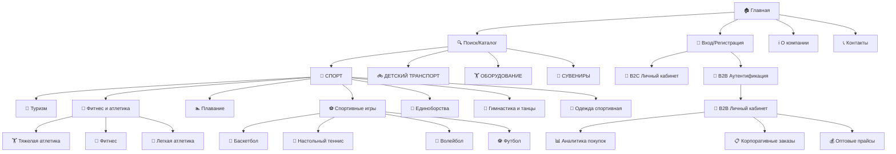
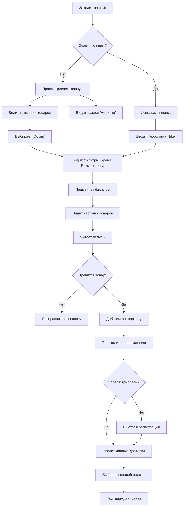
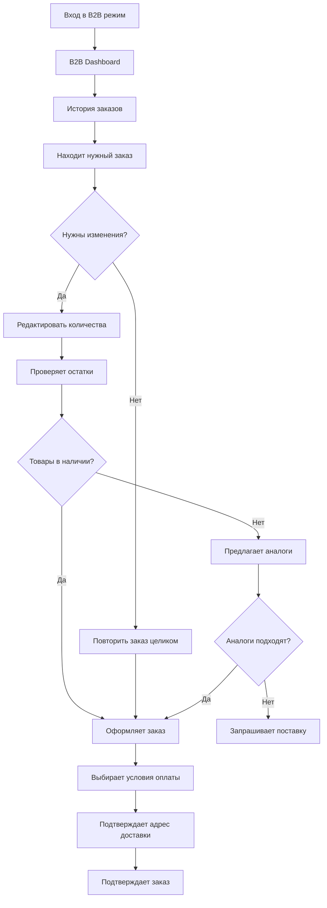

# FREESPORT UI/UX Specification

## Introduction

Этот документ определяет цели пользовательского опыта, информационную архитектуру, пользовательские потоки и визуальные спецификации дизайна для пользовательского интерфейса FREESPORT. Он служит основой для визуального дизайна и frontend разработки, обеспечивая целостный и пользователь-ориентированный опыт.

FREESPORT - это B2B/B2C e-commerce платформа, объединяющая 5 торговых марок спортивных товаров с дифференцированным ценообразованием для разных типов пользователей.

### Overall UX Goals & Principles (Общие цели и принципы UX)

#### Target User Personas (Целевые пользователи)

**Оптовый Покупатель (B2B):**
- Опыт: 5+ лет в спорт-закупках, знает товары и поставщиков
- Болевые точки: Долгое оформление заказов, сложности с остатками, неясные сроки
- Мотивация: Экономия времени, контроль бюджета, надежность поставок
- Tech skills: Средние, предпочитает desktop, использует множество вкладок

**Тренер Команды:**
- Опыт: Фокус на качестве и командных потребностях
- Болевые точки: Согласование заказов с администрацией, ограниченный бюджет
- Мотивация: Качественная экипировка для спортсменов, простота отчетности
- Tech skills: Базовые, часто использует мобильные устройства

**Спортсмен-Любитель (B2C):**
- Опыт: Нерегулярные покупки спорттоваров
- Болевые точки: Выбор правильного размера/модели, неуверенность в качестве
- Мотивация: Найти идеальный товар, доверие к бренду, социальное одобрение
- Tech skills: Хорошие, mobile-first, активны в соцсетях

#### Usability Goals (Цели удобства использования)

- **Efficiency for Experts:** B2B пользователи могут повторить предыдущий заказ за 30 секунд
- **Discovery for Explorers:** B2C пользователи находят нужный товар за 2 минуты поиска
- **Trust Building:** Четкая информация о товаре снижает возвраты на 50%
- **Cross-platform Consistency:** Одинаковый опыт на desktop/mobile для всех ролей

#### Design Principles (Принципы проектирования)

1. **Context-Aware Interface** - UI адаптируется к роли, но сохраняет консистентность
2. **Progressive Disclosure** - простота для новичков, мощность для экспертов
3. **Sports-Driven Emotional Connection** - дизайн вдохновляет на спортивные достижения
4. **Trust Through Transparency** - открытая информация о товарах, ценах, доставке

### Change Log

| Date | Version | Description | Author |
|------|---------|-------------|---------|
| 2025-08-08 | 1.0 | Initial UX specification creation | Sally (UX Expert) |

## Information Architecture (Информационная архитектура)

### Site Map (Карта сайта)



### Navigation Patterns (Паттерны навигации)

#### Основная навигация
- **Search-first подход**: поиск всегда доступен и приоритетен
- **Универсальная категоризация**: адаптивная система для любого количества категорий
- **Масштабируемое брендирование**: поддержка расширения торговых марок
- **Аварийные выходы**: возврат на главную с любой страницы

#### Переключение режимов B2B/B2C
- **Через реаутентификацию**: Переключение только через повторный вход в систему
- **Безопасность**: Явная проверка прав доступа к B2B функциям  
- **Аудит**: Логирование всех переключений режимов
- **Разграничение**: B2C роль `customer`, B2B роль `business` с флагом верификации

#### Адаптивная навигация
- **Mobile**: Сворачиваемое меню-гамбургер
- **Desktop**: Горизонтальное меню + боковые фильтры
- **B2B режим**: Дополнительные пункты (Аналитика, Корпзаказы)

### Information Hierarchy (Иерархия информации)

#### Приоритеты для B2C пользователей:
1. **Поиск и фильтрация** товаров
2. **Визуализация** товара (фото, видео) 
3. **Социальное доказательство** (отзывы, рейтинги)
4. **Ценообразование** и акции

#### Приоритеты для B2B пользователей:
1. **Оптовые цены** и системы скидок
2. **Остатки на складе** и сроки поставки
3. **История заказов** и повторные покупки
4. **Корпоративная отчётность** и аналитика

## User Flows (Пользовательские потоки)

### 1. B2C Спортсмен-любитель: Покупка кроссовок


### 2. B2B Оптовик: Повторный заказ экипировки


### Метрики успеха User Flows:
- Время от поиска до покупки: **< 3 минуты** (B2C), **< 1 минуты** (повтор B2B)
- Конверсия корзина→заказ: **> 70%** 
- Bounce rate на карточке товара: **< 40%**
- Mobile conversion rate: **> 60%** от desktop

## Wireframes & Mockups

### 1. Главная страница (адаптивная для B2B/B2C)

#### Desktop Layout:
```
┌──────────────────────────────────────────────────────────────────┐
│ [LOGO] [ПОИСК________________] [👤Вход] [🛒Корзина] [B2B режим] │
├──────────────────────────────────────────────────────────────────┤
│ [СПОРТ▼]  [ДЕТСКИЙ▼]  [ОБОРУДОВАНИЕ▼]  [СУВЕНИРЫ▼] [Ещё...]      │
├──────────────────────────────────────────────────────────────────┤
│ ┌─ HERO БАННЕР ─────────────────────────────────────────────┐    │
│ │  "Экипировка чемпионов"                                   │    │
│ │  [ВЫБРАТЬ ТОВАРЫ]                                         │    │
│ └───────────────────────────────────────────────────────────┘    │
├──────────────────────────────────────────────────────────────────┤
│ ┌─КАТЕГОРИИ────┐ ┌─БРЕНДЫ─────┐ ┌──НОВИНКИ───┐ ┌─ДЛЯ КОМАНД─┐    │
│ │   🏃 Бег     │ │ [Nike]     │ │ [Товар 1] │ │ Скидки до   │    │
│ │   ⚽ Футбол  │ │ [Adidas]   │ │ [Товар 2] │ │ 30% для     │    │
│ │   🏊 Плавание│ │ [Puma]     │ │ [Товар 3] │ │ тренеров    │    │
│ └──────────────┘ └────────────┘ └───────────┘ └──────────────┘   │
└──────────────────────────────────────────────────────────────────┘
```

### 2. Карточка товара (адаптивная)

#### B2C версия:
```
┌───────────────────────────────────────────────────────────────────┐
│ ┌─────────────┐ │ КРОССОВКИ NIKE AIR MAX            ★★★★★ 4.8  │
│ │             │ │ Кроссовки для бега и спорта       (127 отз.)    │
│ │  [IMG]      │ │ Артикул: NK-AM-001                              │
│ │  [○][○][○]  │ │ ────────────────────────────────────────────────│
│ │             │ │ Цена: 5 400 ₽  (было 6 200₽)    -13%            │
│ │             │ │                                                 │
│ └─────────────┘ │ Размер: [37][38][39][40][41][42]                │
│                 │ Цвет: [●черный][●синий][●красный]               │
│                 │                                                 │
│                 │ Количество: [1] [В КОРЗИНУ] [♥ИЗБРАННОЕ]        │
└───────────────────────────────────────────────────────────────────┘
```

#### B2B версия:
```
┌───────────────────────────────────────────────────────────────────┐
│ ┌─────────────┐ │ КРОССОВКИ NIKE AIR MAX            ★★★★★ 4.8  │
│ │             │ │ Кроссовки для бега и спорта       📦 47 шт     │
│ │  [IMG]      │ │ Артикул: NK-AM-001                              │
│ │  [○][○][○]  │ │ Мин. количество: 10 шт                          │
│ │             │ │ ────────────────────────────────────────────────│
│ │             │ │ Оптовая цена: от 4 590 ₽         (-15%)         │
│ └─────────────┘ │                                                 │
│                 │ Размеры/остатки: 37(5) 38(12) 39(8) 40(15)      │
│                 │                                                 │
│                 │ [BULK ORDER] [ДОБАВИТЬ В КП] [ОБРАЗЦЫ]          │
└───────────────────────────────────────────────────────────────────┘
```

## Component Library

### 1. Основные UI Компоненты

#### Кнопки (Buttons)
```typescript
interface ButtonProps {
  variant: 'primary' | 'secondary' | 'outline' | 'ghost' | 'b2b-bulk' | 'danger'
  size: 'xs' | 'sm' | 'md' | 'lg' | 'xl'
  mode: 'b2c' | 'b2b' | 'universal'
  disabled?: boolean
  loading?: boolean
  icon?: ReactNode
  fullWidth?: boolean
}

// Варианты кнопок по режимам:
B2C Primary:    [КУПИТЬ СЕЙЧАС]     ← Яркая, эмоциональная (#FF6B35)
B2C Secondary:  [В ИЗБРАННОЕ]       ← Второстепенные действия
B2B Primary:    [ДОБАВИТЬ В ЗАКАЗ]  ← Деловая, функциональная (#2E3440)  
B2B Bulk:       [BULK ORDER (50+)]  ← Специальная для оптовиков
Universal:      [ПОДРОБНЕЕ]         ← Нейтральные действия
Danger:         [УДАЛИТЬ]           ← Критические действия
```

#### Поля ввода (Input Fields)
```typescript
interface InputProps {
  type: 'text' | 'email' | 'password' | 'number' | 'tel' | 'search'
  placeholder: string
  label?: string
  error?: string
  icon?: 'search' | 'user' | 'lock' | 'phone'
  autoComplete?: boolean
  required?: boolean
}

// Поиск товаров (B2C):
┌─────────────────────────────────────┐
│ 🔍 Поиск товаров, брендов...        │ ← Дружелюбный
└─────────────────────────────────────┘

// Поиск товаров (B2B):  
┌─────────────────────────────────────┐
│ 🔍 Артикул, название, SKU...        │ ← Технический
└─────────────────────────────────────┘
```

#### Карточки товаров (Product Cards)
```typescript
interface ProductCardProps {
  mode: 'b2c' | 'b2b'
  layout: 'grid' | 'list' | 'compact'
  product: Product
  onAddToCart: (product: Product, quantity: number) => void
  onToggleFavorite: (productId: string) => void
  showDescription?: boolean
  showStock?: boolean
}

// B2C карточка:
┌───────────────────┐
│ [IMG]             │
│ Nike Air Max      │ ← Название
│ Кроссовки для     │ ← Краткое описание 
│ бега и спорта     │
│ ★★★★★ 4.8 (127) │ ← Рейтинг + отзывы
│ 5 400₽            │ ← Розничная цена
│ [В КОРЗИНУ] [♥]   │ ← CTA + избранное
└───────────────────┘

// B2B карточка:
┌──────────────────┐
│ [IMG]            │
│ Nike Air Max     │ ← Название  
│ Кроссовки для    │ ← Краткое описание
│ бега и спорта    │
│ Арт: NK-AM-001   │ ← Артикул
│ 📦 47 шт         │ ← Остатки
│ Мин: 10 шт       │ ← Минимальное количество
│ от 4 590₽        │ ← Оптовая цена
│ [QTY: ▼] [ADD]   │ ← Количество + добавить
└──────────────────┘
```

### 2. Навигационные Компоненты

#### Хлебные крошки (Breadcrumbs)
```typescript
interface BreadcrumbsProps {
  items: BreadcrumbItem[]
  separator?: '/' | '>' | '→'
  maxItems?: number
}

// Пример:
Главная > Спорт > Футбол > Мячи > Мяч футбольный Nike
```

#### Пагинация (Pagination)
```typescript
interface PaginationProps {
  currentPage: number
  totalPages: number
  onPageChange: (page: number) => void
  showFirstLast?: boolean
  maxVisiblePages?: number
}

// Стандартная пагинация:
[←] [1] [2] [3] ... [10] [→]

// Мобильная версия:
[← Назад] Стр. 2 из 10 [Далее →]
```

### 3. Формы и Интерактивные Элементы

#### Фильтры (Filters)
```typescript
interface FilterGroupProps {
  title: string
  collapsible?: boolean
  defaultExpanded?: boolean
  children: ReactNode
}

// Боковые фильтры:
┌─────────────────┐
│ КАТЕГОРИЯ    [▼]│
│ ☑ Мячи          │
│ ☐ Бутсы         │
│ ☐ Форма         │
│                 │
│ БРЕНД        [▼]│
│ ☑ Nike          │
│ ☐ Adidas        │
│ ☐ Puma          │
│                 │
│ ЦЕНА         [▼]│
│ От: [____] ₽    │
│ До: [____] ₽    │
│ ────────────────│
│ [СБРОСИТЬ]      │
└─────────────────┘
```

#### Модальные окна (Modals)
```typescript
interface ModalProps {
  isOpen: boolean
  onClose: () => void
  title: string
  size?: 'sm' | 'md' | 'lg' | 'xl' | 'full'
  closeOnOverlay?: boolean
}

// Модалка размерной сетки:
┌─────────────────────────────────┐
│ ✕ Таблица размеров              │
│ ═══════════════════════════════ │
│ │ RU │ EU │ US │ CM │           │
│ ├────┼────┼────┼────┤           │
│ │ 40 │ 40 │ 7  │25.5│           │
│ │ 41 │ 41 │ 8  │26.0│           │
│ └────┴────┴────┴────┘           │
│                                 │
│ [ЗАКРЫТЬ]                       │
└─────────────────────────────────┘
```

### 4. Специализированные Компоненты

#### Корзина товаров (Shopping Cart)
```typescript
interface CartItemProps {
  item: CartItem
  mode: 'b2c' | 'b2b'
  editable?: boolean
  onUpdateQuantity: (id: string, quantity: number) => void
  onRemove: (id: string) => void
}

// B2C элемент корзины:
┌─────────────────────────────────────────────────┐
│ [IMG] Nike Air Max, размер 42           [🗑️]   │
│       ⭐4.8 │ Есть в наличии                    │  
│       [−] 1 [+] × 5400₽              = 5400₽   │
└─────────────────────────────────────────────────┘

// B2B элемент корзины:
┌─────────────────────────────────────────────────┐
│ ☑ [IMG] Nike Air Max, размер 42         [🗑️]   │
│          Арт: NK-AM-001 │ 📦47шт │ -15%         │
│          [−] 25 [+] × 4850₽            =121250₽ │
└─────────────────────────────────────────────────┘
```

#### Статусы заказов (Order Status)
```typescript
interface OrderStatusProps {
  status: OrderStatus
  showProgress?: boolean
  timeline?: TimelineItem[]
}

const OrderStatuses = {
  pending: { label: 'Ожидает обработки', color: '#FFA726', icon: '⏳' },
  confirmed: { label: 'Подтвержден', color: '#4CAF50', icon: '✅' },
  processing: { label: 'В обработке', color: '#2196F3', icon: '📦' },
  shipped: { label: 'Отправлен', color: '#FF9800', icon: '🚚' },
  delivered: { label: 'Доставлен', color: '#4CAF50', icon: '📍' },
  cancelled: { label: 'Отменен', color: '#F44336', icon: '❌' }
}
```

#### Уведомления (Notifications/Toast)
```typescript
interface ToastProps {
  type: 'success' | 'error' | 'warning' | 'info'
  title: string
  message?: string
  duration?: number
  action?: { label: string; onClick: () => void }
}

// Успешное добавление в корзину:
┌─────────────────────────────────┐
│ ✅ Товар добавлен в корзину     │
│ Nike Air Max добавлен           │
│ [ПЕРЕЙТИ В КОРЗИНУ]   [✕]      │
└─────────────────────────────────┘
```

### 5. Адаптивность и Состояния

#### Responsive Breakpoints
```scss
$breakpoints: (
  xs: 0,           // Мобильные телефоны  
  sm: 576px,       // Большие телефоны
  md: 768px,       // Планшеты
  lg: 992px,       // Небольшие ноутбуки
  xl: 1200px,      // Большие экраны
  xxl: 1400px      // Широкие мониторы
);
```

#### Состояния компонентов
```scss
// Интерактивные состояния
.component {
  // Базовое состояние
  &:hover { /* Наведение */ }
  &:focus { /* Фокус клавиатуры */ }  
  &:active { /* Активное нажатие */ }
  &.loading { /* Загрузка */ }
  &.error { /* Ошибка */ }  
  &.success { /* Успех */ }
  &.disabled { /* Отключено */ }
}
```

### 6. Semantic Icons - полная структура категорий

```typescript
const CategoryIcons = {
  // Основные категории
  sport: '🏃',                    // СПОРТ
  childTransport: '🚲',           // ДЕТСКИЙ ТРАНСПОРТ  
  equipment: '🏋️',               // ОБОРУДОВАНИЕ
  souvenirs: '🎁',               // СУВЕНИРНАЯ ПРОДУКЦИЯ

  // СПОРТ подкатегории
  tourism: '🥾',                  // Туризм
  fitness: '💪',                  // Фитнес и атлетика
  swimming: '🏊',                 // Плавание
  sportGames: '⚽',              // Спортивные игры
  martialArts: '🥊',             // Единоборства
  gymnastics: '🤸',              // Гимнастика и танцы
  sportClothing: '👕',           // Одежда спортивная

  // Детальные подкатегории
  weightLifting: '🏋️',           // Тяжелая атлетика
  fitnessGeneral: '🤸‍♀️',         // Фитнес
  trackField: '🏃‍♂️',             // Легкая атлетика
  basketball: '🏀',              // Баскетбол
  tableTennis: '🏓',            // Настольный теннис
  volleyball: '🏐',             // Волейбол
  football: '⚽',               // Футбол
  badminton: '🏸',              // Бадминтон
  handball: '🤾‍♂️',              // Гандбол
  darts: '🎯',                  // Дартс

  // ДЕТСКИЙ ТРАНСПОРТ
  bicycles: '🚲',               // Велосипеды
  rollerSkates: '⛸️',          // Ролики
  scooters: '🛴',               // Самокаты
  skateboards: '🛹',           // Скейты
  protection_child: '🛡️',      // Защита и аксессуары
}
```

### 3. Технические требования (согласно architecture.md)

#### Technology Stack
```typescript
const TechStack = {
  framework: 'Next.js 14+',           // SSR/SSG/ISR, SEO
  language: 'TypeScript 5.0+',       // Типобезопасность  
  forms: 'React Hook Form 7.45+',    // Производительность
  apiLayer: 'Next.js API Routes',    // BFF слой
  imageOptimization: 'next/image',    // WebP/AVIF оптимизация
  testing: 'React Testing Library',   // Component testing
  nodeVersion: 'Node.js 18+'          // Runtime
}
```

#### Browser Support
```typescript
const BrowserSupport = {
  modern: ['Chrome 90+', 'Firefox 88+', 'Safari 14+', 'Edge 90+'],
  mobile: ['Mobile Safari iOS 14+', 'Chrome Mobile 90+'],
  legacy: 'IE11 через полифиллы (при необходимости)'
}
```

## Branding Guidelines

### Цветовая палитра
```scss
// Основные цвета
$primary: #1976D2;        // Синий - доверие, профессионализм
$secondary: #FF6B35;      // Оранжевый - энергия, спорт
$accent: #4CAF50;         // Зеленый - успех, здоровье

// B2B специфичные цвета  
$b2b-primary: #2E3440;    // Темно-серый - деловой стиль
$b2b-accent: #5E81AC;     // Приглушенный синий - профессионализм

// B2C специфичные цвета
$b2c-primary: #FF6B35;    // Яркий оранжевый - эмоции
$b2c-accent: #FFA726;     // Светло-оранжевый - позитив
```

### Типографика
```scss
// Шрифтовая система
$font-primary: 'Inter', sans-serif;      // Основной текст
$font-display: 'Roboto Slab', serif;     // Заголовки
$font-mono: 'Fira Code', monospace;      // Код/артикулы

// Размеры (fluid typography)
$text-xs: clamp(0.75rem, 0.7rem + 0.2vw, 0.8rem);
$text-sm: clamp(0.875rem, 0.8rem + 0.3vw, 0.9rem);  
$text-base: clamp(1rem, 0.95rem + 0.25vw, 1.1rem);
$text-lg: clamp(1.125rem, 1rem + 0.5vw, 1.25rem);
```

### Change Log

| Date | Version | Description | Author |
|------|---------|-------------|---------|
| 2025-08-09 | 1.0 | Создана полная UX спецификация FREESPORT | Sally (UX Expert) |