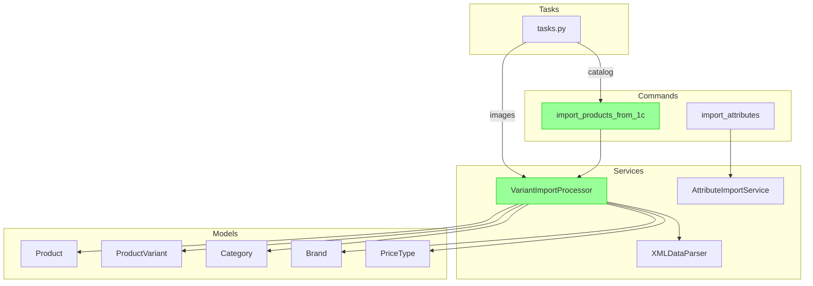

# 1C Import Architecture

## Overview

The import system is responsible for synchronizing the product catalog, prices, and stock levels from the ERP system (1С:Enterprise) to the FREESPORT platform. It uses a **Variant-Centric** approach, where products can have multiple variants (SKUs) with different characteristics (size, color).

## Architecture Diagram

## Key Components

### 1. Management Commands

- **`import_products_from_1c`**: The primary entry point for catalog import. It orchestrates the parsing and processing of XML files.
  - Supports selective import via `--file-type` (all, goods, prices, rests).
  - Handles dataset directories via `--data-dir`.

### 2. Services

- **`VariantImportProcessor`** (`apps/products/services/variant_import.py`):
  - The core logic for processing imported data.
  - Implements the "Hybrid" image import strategy (Base images in Product, Variant images in ProductVariant).
  - Handles the creation and update of `Product`, `ProductVariant`, `Category`, and `Brand`.
  - During `goods.xml` processing, stores VAT on `Product.vat_rate` and synchronizes it to existing variants.
  - During `offers.xml` processing, copies VAT from the `goods.xml` cache or `Product.vat_rate` into `ProductVariant.vat_rate`.
  - During stock processing (`rests_*.xml`), determines the primary warehouse and VAT rate per variant:
    - `_select_primary_warehouse_id` — returns the warehouse GUID with the highest cumulative stock (current warehouse is preferred on tie).
    - `_resolve_warehouse_name` — maps GUID → human-readable name via `settings.ONEC_EXCHANGE["WAREHOUSE_NAME_BY_ID"]`.
    - `_get_vat_rate_by_warehouse_name` — looks up `vat_rate` in `settings.ONEC_EXCHANGE["WAREHOUSE_RULES"]` by warehouse name.

- **`XMLDataParser`** (`apps/products/services/parser.py`):
  - Responsibile for parsing raw XML files (CommerceML format) into Python dictionaries.
  - Decoupled from database logic.

### 3. Data Flow

1. **Categories & Brands**: Loaded from `groups.xml` and `propertiesGoods.xml`.
2. **Products**: Created from `goods.xml`. Base images and `Product.vat_rate` are imported here.
3. **Variants**: Created from `offers.xml`. SKU, characteristics (Size, Color), variant-specific images, and `ProductVariant.vat_rate` are processed. If VAT was received only in `goods.xml`, the variant inherits it from `Product.vat_rate`.
4. **Prices**: Updated from `prices.xml`. Linked to specific variants.
5. **Stock**: Updated from `rests_*.xml`. Linked to specific variants. In addition to `stock_quantity`, the processor determines the **primary warehouse** (highest total stock) and updates `warehouse_id`, `warehouse_name`, and `vat_rate` on each `ProductVariant` via `ONEC_EXCHANGE` settings.

Order creation and CommerceML export use the VAT and warehouse data imported here. The current split rule is documented in [VAT-split и складской routing заказов для 1С](./order-vat-warehouse-routing.md): sub-orders are grouped by `(vat_rate, warehouse_name)`, not only by VAT.

## Concurrency contract (shared exchange directory)

Каталог обмена `ONEC_EXCHANGE["IMPORT_DIR"]` **общий для всех сессий** — он намеренно
не разбит по `sessid`, потому что парсер ждёт файлы в `<import_dir>/goods`,
`<import_dir>/rests` и т. д. Из этого следуют три обязательных правила, которые
нельзя ослаблять без замены раскладки каталога.

### 1. Один импорт на каталог одновременно

`process_1c_import_task` берёт распределённый лок на каталог обмена **до** начала
работы: `cache.add("onec:import:lock:<data_dir>", <task_id>, ONEC_IMPORT_LOCK_TTL)`
(атомарный `SETNX` в Redis). Если лок занят — задача уходит в `self.retry()` и
возвращается в брокер, а не ждёт блокирующе: воркер prefork держит `nproc`
процессов, и блокирующее ожидание съедало бы слот пула.

| Настройка | Умолчание | Смысл |
|---|---|---|
| `ONEC_IMPORT_LOCK_TTL` | 1800 с | Переживает полный импорт каталога; истекает сам, чтобы упавший воркер не заблокировал обмен навсегда |
| `ONEC_IMPORT_LOCK_RETRY_COUNTDOWN` | 10 с | Пауза между попытками (1С отдаёт сегмент каждые ~6,5 с) |
| `ONEC_IMPORT_LOCK_MAX_RETRIES` | 180 | 30 минут ожидания; исчерпание переводит сессию в `failed` с внятным текстом |

Лок снимается в `finally` и **только владельцем** (сверка значения с `task_id`).
Механизм не зависит от `--concurrency` воркера: рост числа процессов не возвращает гонку.

Если переотправить задачу не удалось — брокер недоступен и `self.retry()` падает
не `MaxRetriesExceededError`, а, например, `kombu.exceptions.OperationalError`, —
сессия переводится в `failed` с текстом ошибки. Оставлять её в `in_progress`
нельзя: до порога `cleanup_stale_import_sessions` (2 часа) она выглядела бы живой
и блокировала бы `cleanup_import_dir` соседям.

Отказ самого бэкенда лока трактуется так же. Если `cache.add` бросил исключение
(Redis недоступен), импорт **не** запускается — работа без лока вернула бы гонку, —
но сессия переводится в `failed` с текстом ошибки. Молчаливое падение задачи
оставляло бы сессию `in_progress` на те же 2 часа.

### 2. Cleanup удаляет только прочитанное

`import_products_from_1c._cleanup_files` удаляет **исключительно те XML, которые
этот прогон реально распарсил** (`self._processed_files`, путь добавляется после
успешного парсинга, а не после сбора списка). Удаление по маске `glob` запрещено:
`glob("rests/rests*.xml")` сносил файлы соседних задач раньше, чем те успевали их
прочитать — выгрузка 25.08.2026 потеряла 6 из 16 сегментов остатков (~18 000 строк),
причём две сессии отчитались `completed` с нулём записей.

Файлы, которых прогон не читал, — не его дело: их уберёт
`FileRoutingService.cleanup_import_dir`, когда активных сессий не останется
(guard по `IN_PROGRESS` в `tasks.py` и `views.handle_init`).

Больше того: чужой файл прогон не только не удаляет, но и **не читает**. При
переданном `source_filename` сбор списка сужается до обещанного файла на **всех**
шагах прогона (`_restrict_to_expected`). Без сужения лок лишь превращал гонку в
очередь: пока одна задача держит лок, 1С успевает положить в каталог следующие
файлы, и прогон забирал весь накопившийся backlog — данные доезжали, но
собственные задачи этих файлов затем падали `failed` («сегмент не найден»).

Сужение обязано действовать на все шаги, а не только на шаг своего типа: сегмент
`offers_….xml` запускает ещё и шаги цен и остатков
(`file_type in ["all", "prices", "offers"]`) и без сужения съедал бы уже
ожидающие `prices_*`/`rests_*`. Справочники (`groups.xml`, `propertiesGoods.xml`,
`priceLists.xml`) приходят своими файлами и обрабатываются своими сессиями.

Контракт — **один присланный файл обрабатывает ровно одна задача, та, которой его
обещали**. Ручной общий импорт и `mode=complete` имени не обещают и по-прежнему
забирают каталог целиком.

Перед удалением сверяется отпечаток файла — `(st_dev, st_ino, st_mtime_ns, st_size)`,
снятый в момент парсинга. Пути мало: 1С переиспользует имена, когда не сегментирует
выгрузку, и под тем же путём к моменту cleanup может лежать уже чужой файл. При
несовпадении отпечатка удаление пропускается с предупреждением.

Исчезнувший файл больше не валит импорт целиком: `FileNotFoundError` на конкретном
файле — предупреждение в лог и в `report`, цикл продолжается. Если исчезли **все**
файлы непустого списка, сессия завершается `failed` с их перечнем, а не `completed`
с нулём записей.

### 3. Тип сегмента доезжает до задачи

Оба места диспатча (`_dispatch_import` и `_dispatch_or_dryrun`) передают
`source_filename=self.filename` в `process_1c_import_task`. Задача определяет шаг
импорта через общий `apps/integrations/onec_exchange/file_type_detection.detect_file_type`
— единственную копию логики (раньше их было две, и они разошлись). Без этого каждый
сегмент остатков запускал полный импорт каталога, расширяя окно гонки на
`goods`/`offers`/`prices`.

### 4. Обещанный сегмент обязан быть прочитан

Когда `detect_file_type` дал конкретный тип, задача передаёт имя файла дальше в
команду — `call_command(..., source_filename="rests_1_12_….xml")`. Команда обязана
этот файл прочитать; если к моменту `_collect_xml_files` его в каталоге уже нет
(увёл сосед) или он исчез до парсинга — прогон завершается `CommandError`, сессия
получает `failed`. Тихий `completed` с нулём записей — это и есть потеря данных:
1С такой сегмент не повторит.

Тип по имени знают только те файлы, которые команда действительно читает:
`goods` / `import` / `groups` / `propertiesGoods`, `offers`, `prices` /
`priceLists`, `rests`, `contragents`. `units`, `storages`, `propertiesOffers` и
произвольные имена намеренно остаются `all`: команда их не собирает, и обещание
«этот файл обязан быть прочитан» утопило бы такие сессии в `failed`. Обратная
сторона — на них сужение не действует, `all` по определению сгребает каталог
целиком.

Обещанием считается только имя XML-файла. `detect_file_type("import_files.zip")`
даёт `goods`, но команда собирает XML и файла с таким именем не найдёт никогда —
поэтому имя архива в команду не передаётся, иначе штатная выгрузка изображений
уходила бы в `failed`.

Строгость включается **только** при переданном имени. `mode=complete` и ручной
общий импорт (`detect_file_type` → `all`, `source_filename=None`) конкретного файла
не обещают — там пустой каталог по-прежнему штатная ситуация с предупреждением
«Файлы … не найдены».

По имени файла выбирается и сам маршрут. `detect_file_type` знает тип
`contragents`, и наличие `contragents*.xml` в общем каталоге больше **не**
отменяет импорт обещанного товарного сегмента: файл контрагентов мог остаться от
соседней сессии, а раньше он молча уводил задачу в `import_customers_from_1c`,
после чего сессия сегмента помечалась успешной. По содержимому каталога маршрут
выбирается только там, где имени не обещали (`mode=complete`, ручной прогон).

## Usage

See `README.md` or `CLAUDE.md` for quick start commands.
