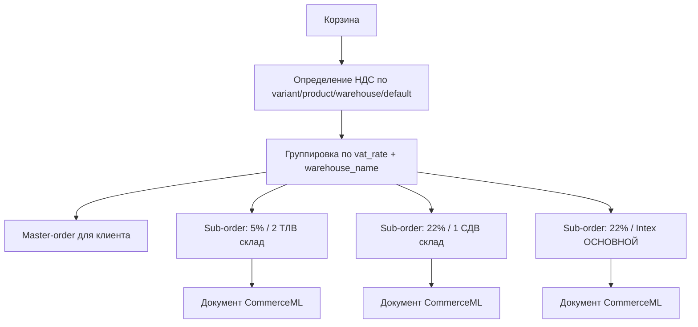

# VAT-split и складской routing заказов для 1С

Дата актуализации: 23.04.2026.

Этот документ фиксирует текущую бизнес-логику импорта НДС из 1С, создания `master-order`/`sub-order` и экспорта заказов в CommerceML. Он нужен для разбора ситуаций, когда в 1С пришел один документ вместо нескольких, и для проверки сценариев с разными ставками НДС и складами.

## Краткое правило

Заказ покупателя всегда создается как один клиентский `master-order` и набор технических `sub-orders` для 1С.

`sub-order` группируется по паре:

```python
group_key = (resolved_vat_rate, variant.warehouse_name)
```

Это означает:

- разные ставки НДС создают разные `sub-orders`;
- одинаковая ставка НДС, но разные склады создают разные `sub-orders`;
- одинаковая ставка НДС и один склад создают один `sub-order`.

Старые уже созданные заказы не пересчитываются автоматически после изменения кода. Новая логика применяется только к новым оформлениям заказа.

## Зачем нужен split

1С должна получить отдельные документы CommerceML, если в корзине есть товары:

- с разными ставками НДС;
- с одной ставкой НДС, но с разных складов;
- с разными организациями отгрузки.

`master-order` остается единой точкой клиентского UX: покупатель видит один заказ, одну сумму и один набор позиций. `sub-orders` являются техническими документами для экспорта в 1С и напрямую клиенту не показываются.



## Актуальные правила складов

Правила задаются в `settings.ONEC_EXCHANGE`.

| Склад            | Организация         | НДС | GUID склада                            |
| ---------------- | ------------------- | --- | -------------------------------------- |
| `1 СДВ склад`    | `ИП Семерюк Д. В.`  | 22% | `8f06f4f1-b3f0-11ea-81c3-00155d3cae02` |
| `Intex ОСНОВНОЙ` | `ИП Семерюк Д. В.`  | 22% | `37985d34-e784-11ef-9a90-fa163ea88911` |
| `2 ТЛВ склад`    | `ИП Терещенко Л.В.` | 5%  | `b41f7acc-58e5-11f0-90b3-fa163ea88911` |

`WAREHOUSE_NAME_BY_ID` переводит GUID из `rests.xml` в имя склада. `WAREHOUSE_RULES` задает организацию и ставку НДС для имени склада. `ORGANIZATION_BY_VAT` остается fallback для случаев, когда склад не удалось определить однозначно.

## Импорт ставок НДС из 1С

Ставка НДС может прийти не в том же XML-файле, где создается SKU. Поэтому ставка хранится на двух уровнях:

- `Product.vat_rate` — ставка базового товара из `goods.xml`;
- `ProductVariant.vat_rate` — ставка конкретного SKU, основной каталожный источник для создания заказа и экспорта.

Поток импорта:

1. `goods.xml` обновляет базовый `Product` и сохраняет ставку в `Product.vat_rate`.
2. Если у товара уже есть варианты, импорт `goods.xml` синхронизирует `Product.vat_rate` в существующие `ProductVariant.vat_rate`.
3. `offers.xml` создает или обновляет `ProductVariant` и берет ставку из кэша `goods.xml` или из `Product.vat_rate`.
4. `rests.xml` обновляет `warehouse_id`, `warehouse_name`, `stock_quantity` и может переопределить `ProductVariant.vat_rate` по `WAREHOUSE_RULES`, если основной склад варианта определен.

Такой порядок закрывает случай, когда НДС пришел в `goods.xml`, а варианты создаются или обновляются отдельно из `offers.xml`.

## Определение НДС при создании заказа

При оформлении заказа ставка для группировки позиции определяется по цепочке:

```text
ProductVariant.vat_rate
Product.vat_rate
WAREHOUSE_RULES[warehouse_name].vat_rate
DEFAULT_VAT_RATE
```

`ProductVariant.vat_rate` остается основным каталожным источником. `Product.vat_rate` нужен как fallback для раздельного импорта `goods.xml` и `offers.xml`. Ставка из `WAREHOUSE_RULES` используется, когда у варианта еще нет сохраненной ставки, но есть склад.

При создании `OrderItem` ставка сохраняется в `OrderItem.vat_rate` как snapshot на момент заказа. Последующие изменения каталога или повторный импорт из 1С не меняют ставку уже созданной позиции заказа.

## Пример split

В корзине:

| Товар | НДС | Склад            |
| ----- | --- | ---------------- |
| A     | 5%  | `2 ТЛВ склад`    |
| B     | 22% | `1 СДВ склад`    |
| C     | 22% | `Intex ОСНОВНОЙ` |

Результат:

1. `sub-order`: `vat_group=5`, склад `2 ТЛВ склад`.
2. `sub-order`: `vat_group=22`, склад `1 СДВ склад`.
3. `sub-order`: `vat_group=22`, склад `Intex ОСНОВНОЙ`.

В 1С уйдут три отдельных документа CommerceML.

## Экспорт CommerceML

`mode=query` экспортирует только технические `sub-orders`:

```text
is_master = False
parent_order IS NOT NULL
sent_to_1c = False
export_skipped = False
```

`master-order` в 1С не выгружается напрямую. После подтверждения экспорта `sub-orders` агрегируют состояние `sent_to_1c` на мастер.

### Ставка документа

`vat_group` субзаказа является авторитетным источником ставки документа. Организация и склад документа рассчитываются от `vat_group`, а не от случайной первой строки заказа.

Для legacy-заказов без `vat_group` используется fallback:

```text
OrderItem.vat_rate
Product.vat_rate
ProductVariant.vat_rate
WAREHOUSE_RULES[warehouse_name].vat_rate
DEFAULT_VAT_RATE
```

### Склад документа

Склад документа берется из товаров субзаказа только если он однозначный и соответствует `vat_group`:

1. у всех строк субзаказа один и тот же `variant.warehouse_name`;
2. `WAREHOUSE_RULES[warehouse_name].vat_rate == sub_order.vat_group`.

Если складов несколько или ставка склада не совпадает с `vat_group`, экспорт использует fallback по `ORGANIZATION_BY_VAT`. Для `vat_group=None` используются `DEFAULT_ORGANIZATION` и `DEFAULT_WAREHOUSE`.

### Ставка строки

Для строки товара в XML ставка НДС определяется так:

```text
OrderItem.vat_rate
ProductVariant.vat_rate
Product.vat_rate
vat_group sub-order
```

`OrderItem.vat_rate` защищает уже созданный заказ от последующих изменений каталога. `ProductVariant.vat_rate` остается основным источником для новых заказов и fallback для старых строк без snapshot.

### Что пишется в XML

В документе CommerceML сохраняются:

- `Организация`;
- `Склад`;
- `Соглашение`;
- блок `Документ/Налоги/Налог` со ставкой, суммой НДС и тегом `УчтеноВСумме=true`;
- товарные строки с `Ид`, `Наименование`, `ЦенаЗаЕдиницу`, `Количество`, `Сумма`;
- `ВидЦены/Ид` и `ВидЦены/Наименование`;
- блок `Товар/Налоги/Налог` со ставкой, суммой НДС и тегом `УчтеноВСумме=true`, то есть `ЦенаЗаЕдиницу` уже включает НДС и не должна пересчитываться в 1С как цена без налога;
- обязательные реквизиты УТ 11, включая `Организация`, `Склад`, `Соглашение`, `Операция`, `Статус заказа`.

Для конфигурации `1С-Битрикс. Управление сайтом` это критично: модуль `БУС_ЗагрузкаСервер` берет признак `Цена включает НДС` из `ДокументXML.НДСВСумме`, а он читается именно из `Документ/Налоги`, а не из строк `Товар`.

### Короткая заметка по инциденту 23.04.2026

- Симптом: в 1С `ЗаказКлиента` показывал цену строки `189,00`, НДС `41,58` и сумму с НДС `230,58`.
- Причина: одного исправления `УчтенВСумме -> УчтеноВСумме` в строке товара оказалось недостаточно. Модуль `БУС_ЗагрузкаСервер` читает флаг `Цена включает НДС` из `Документ/Налоги`, а при отсутствии этого блока оставляет `ДокументXML.НДСВСумме = Неопределено`.
- Решение: экспортировать `Налоги/Налог` с `УчтеноВСумме=true` и на уровне `Документ`, и на уровне `Товар`.
- Результат: после повторного экспорта и загрузки новый заказ в 1С открылся с корректной ценой, без доначисления НДС сверху.

## Проверочный сценарий 78 + 4441 + 4925

Тестовые варианты:

| variant_id | НДС | Склад            | SKU                       |
| ---------- | --- | ---------------- | ------------------------- |
| `78`       | 5%  | `2 ТЛВ склад`    | `SKU-b7e32f96`            |
| `4441`     | 22% | `1 СДВ склад`    | не фиксируется в сценарии |
| `4925`     | 22% | `Intex ОСНОВНОЙ` | `SKU-ae589067`            |

Ожидаемый результат при оформлении одной корзины с тремя вариантами:

- один `master-order`;
- три `sub-orders`;
- три документа CommerceML: `5% / 2 ТЛВ склад`, `22% / 1 СДВ склад`, `22% / Intex ОСНОВНОЙ`.

Последний проверенный заказ `master=44 / sub=45` содержал только два товара с НДС 22%:

- `variant_id=4441`, склад `1 СДВ склад`;
- `variant_id=4925`, склад `Intex ОСНОВНОЙ`.

`variant_id=78` с НДС 5% в этот заказ не попал. Поэтому документа `5% / 2 ТЛВ склад` для этого конкретного заказа быть не могло. Отдельно была исправлена ошибка, при которой два товара с НДС 22%, но разными складами, раньше объединялись в один `sub-order`.

## Troubleshooting: в 1С пришел один заказ вместо нескольких

Проверяйте по порядку.

1. Заказ создан после внедрения split по `(vat_rate, warehouse_name)`. Старые заказы не пересчитываются автоматически.
2. В корзине действительно были товары из разных групп. Для сценария `78 + 4441 + 4925` убедитесь, что `variant_id=78` попал в заказ.
3. У вариантов заполнены `ProductVariant.vat_rate` и `warehouse_name`. Если `ProductVariant.vat_rate` пустой, проверьте `Product.vat_rate` и правила `WAREHOUSE_RULES`.
4. У созданных `OrderItem` заполнен snapshot `OrderItem.vat_rate`.
5. У `sub-orders` заполнен `vat_group`; именно он определяет ставку документа.
6. В `mode=query` выгружаются только `sub-orders`, а не мастер. Если в выборке один `sub-order`, в 1С придет один документ.
7. Для одинаковой ставки НДС проверьте склады. После исправления товары `22% / 1 СДВ склад` и `22% / Intex ОСНОВНОЙ` должны быть в разных `sub-orders`.

Пример диагностики через Django shell:

```python
from apps.orders.models import Order

master = Order.objects.get(id=44)
for sub in master.sub_orders.prefetch_related("items__variant"):
    print(sub.id, sub.vat_group, sub.total_amount)
    for item in sub.items.all():
        print(" ", item.variant_id, item.vat_rate, item.variant.warehouse_name)
```

## Проверки после изменения

Пройденные проверки:

```bash
black --check apps/orders/services/order_create.py apps/orders/services/order_export.py freesport/settings/base.py tests/unit/test_order_export_service.py tests/unit/test_serializers/test_order_serializers.py
pytest tests/unit/test_serializers/test_order_serializers.py::TestOrderVATSplit -q
pytest tests/unit/test_order_export_service.py -q
python manage.py check
```

Результаты:

- `TestOrderVATSplit`: 23 passed;
- `test_order_export_service.py`: 62 passed;
- `manage.py check`: no issues.

Backend и Celery были перезапущены после исправления.
