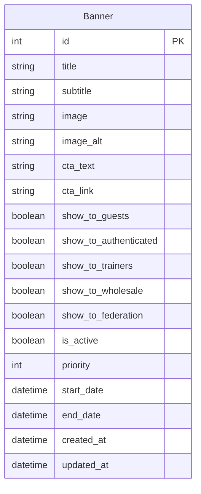

# Story 17.4: Обновление документации

## Status

**Draft**

---

## Story

**As a** разработчик или новый член команды,  
**I want** иметь актуальную документацию проекта, отражающую новый функционал Banner Management System,  
**so that** я могу быстро понять архитектуру системы и использовать API баннеров без необходимости изучать код.

---

## Acceptance Criteria

1. Обновлён `docs/api-spec.yaml` — добавлен endpoint `/api/banners/active/` с полной схемой
2. Обновлён `docs/architecture/source-tree.md` — добавлен `apps/banners/` в структуру
3. Обновлён `docs/architecture/02-data-models.md` — добавлена модель `Banner` и ER-диаграмма
4. Обновлён `docs/architecture/03-api-specification.md` — добавлен раздел Banners API
5. Обновлён `docs/architecture/09-database-schema.md` — добавлена таблица `banners`
6. Обновлён `GEMINI.md` — добавлено описание нового приложения `apps/banners/`
7. Все ссылки internal docs проверены и валидны

---

## Tasks / Subtasks

- [ ] **Task 1: Обновить OpenAPI спецификацию** (AC: 1)
  - [ ] 1.1. Открыть `docs/api-spec.yaml`
  - [ ] 1.2. Добавить тег `Banners` в секцию `tags`
  - [ ] 1.3. Добавить endpoint `/banners/active/` в секцию `paths`
  - [ ] 1.4. Добавить схемы `Banner` и `BannerList` в `components/schemas`
  - [ ] 1.5. Указать `security: []` (опциональная авторизация)
  - [ ] 1.6. Проверить валидность YAML через `redocly lint` или аналог

- [ ] **Task 2: Обновить source-tree.md** (AC: 2)
  - [ ] 2.1. Открыть `docs/architecture/source-tree.md`
  - [ ] 2.2. Добавить `banners/` в секцию `backend/apps/`
  - [ ] 2.3. Добавить описание директории в раздел "Ключевые каталоги → apps/"

- [ ] **Task 3: Обновить модели данных** (AC: 3)
  - [ ] 3.1. Открыть `docs/architecture/02-data-models.md`
  - [ ] 3.2. Добавить секцию `### Banner Model` с описанием полей
  - [ ] 3.3. Обновить ER-диаграмму, добавив сущность `Banner`
  - [ ] 3.4. Указать связи модели (нет связей с другими таблицами)

- [ ] **Task 4: Обновить API спецификацию** (AC: 4)
  - [ ] 4.1. Открыть `docs/architecture/03-api-specification.md`
  - [ ] 4.2. Добавить раздел `# Banners API` между существующими разделами
  - [ ] 4.3. Описать endpoint `GET /banners/active/`
  - [ ] 4.4. Добавить примеры запросов и ответов

- [ ] **Task 5: Обновить схему БД** (AC: 5)
  - [ ] 5.1. Открыть `docs/architecture/09-database-schema.md`
  - [ ] 5.2. Добавить SQL для таблицы `banners`
  - [ ] 5.3. Добавить индексы для `is_active`, `priority`, `start_date`, `end_date`

- [ ] **Task 6: Обновить GEMINI.md** (AC: 6)
  - [ ] 6.1. Открыть `GEMINI.md`
  - [ ] 6.2. Добавить `apps/banners/` в раздел "Django App Structure"
  - [ ] 6.3. Описать назначение: управление баннерами Hero-секции с таргетингом

- [ ] **Task 7: Проверить внутренние ссылки** (AC: 7)
  - [ ] 7.1. Запустить `python scripts/docs/docs_link_checker.py` (если есть)
  - [ ] 7.2. Исправить найденные битые ссылки
  - [ ] 7.3. Проверить пути к файлам в обновлённых документах

---

## Dev Notes

### Зависимости

Эта история завершает Epic 17 и должна выполняться ПОСЛЕ историй 17.1, 17.2, 17.3, так как она документирует уже созданный функционал.

[Source: docs/epics/epic-17/epic-17.banner-management.md]

### Референсные документы из Epic 17

| Документ | Что добавить | Приоритет |
|----------|-------------|-----------|
| [api-spec.yaml](file:///c:/Users/tkachenko/DEV/FREESPORT/docs/api-spec.yaml) | Endpoint `/api/banners/active/`, схема `Banner` | HIGH |
| [source-tree.md](file:///c:/Users/tkachenko/DEV/FREESPORT/docs/architecture/source-tree.md) | Директория `apps/banners/` в структуре backend | HIGH |
| [02-data-models.md](file:///c:/Users/tkachenko/DEV/FREESPORT/docs/architecture/02-data-models.md) | Модель `Banner` с ER-диаграммой | HIGH |
| [03-api-specification.md](file:///c:/Users/tkachenko/DEV/FREESPORT/docs/architecture/03-api-specification.md) | Раздел "Banners API" с описанием эндпоинтов | MEDIUM |
| [09-database-schema.md](file:///c:/Users/tkachenko/DEV/FREESPORT/docs/architecture/09-database-schema.md) | Таблица `banners` со всеми полями | MEDIUM |
| [GEMINI.md](file:///c:/Users/tkachenko/DEV/FREESPORT/GEMINI.md) | Описание `apps/banners/` в разделе "Django App Structure" | LOW |

[Source: docs/epics/epic-17/epic-17.banner-management.md#documentation-updates-required]

### Контент для api-spec.yaml

Добавить в `paths:`:

```yaml
/banners/active/:
  get:
    tags: [Banners]
    summary: Получить активные баннеры для текущего пользователя
    description: |
      Возвращает список активных баннеров, отфильтрованных по роли пользователя.
      Для неавторизованных пользователей возвращаются баннеры с show_to_guests=true.
    security: []  # Опциональная авторизация
    responses:
      '200':
        description: Список баннеров
        content:
          application/json:
            schema:
              type: array
              items:
                $ref: '#/components/schemas/Banner'
```

Добавить в `components/schemas:`:

```yaml
Banner:
  type: object
  properties:
    id:
      type: integer
    title:
      type: string
    subtitle:
      type: string
    image_url:
      type: string
      format: uri
    image_alt:
      type: string
      description: Alt-текст для accessibility
    cta_text:
      type: string
    cta_link:
      type: string
```

[Source: docs/epics/epic-17/epic-17.banner-management.md#api-design]

### Контент для source-tree.md

В секции `backend/apps/` добавить:

```text
│   │   ├── banners/            # Баннеры Hero-секции с таргетингом
```

В раздел "Ключевые каталоги → apps/" добавить:

```text
- `banners/` — управление баннерами Hero-секции с таргетингом по группам пользователей
```

[Source: docs/architecture/source-tree.md]

### Контент для 02-data-models.md

Добавить секцию после "Модели заказов и корзины":

```python
### Banner Model

class Banner(models.Model):
    """
    Модель баннера для Hero-секции главной страницы.
    Поддерживает таргетинг по группам пользователей.
    """
    # Контент
    title = models.CharField("Заголовок", max_length=200)
    subtitle = models.CharField("Подзаголовок", max_length=500, blank=True)
    image = models.ImageField("Изображение", upload_to="banners/%Y/%m/")
    image_alt = models.CharField("Alt-текст", max_length=255, blank=True)
    cta_text = models.CharField("Текст кнопки", max_length=50)
    cta_link = models.CharField("Ссылка кнопки", max_length=200)
    
    # Таргетинг по группам
    show_to_guests = models.BooleanField("Показывать гостям", default=False)
    show_to_authenticated = models.BooleanField("Показывать авторизованным", default=False)
    show_to_trainers = models.BooleanField("Показывать тренерам", default=False)
    show_to_wholesale = models.BooleanField("Показывать оптовикам", default=False)
    show_to_federation = models.BooleanField("Показывать федералам", default=False)
    
    # Управление
    is_active = models.BooleanField("Активен", default=True)
    priority = models.IntegerField("Приоритет", default=0)
    start_date = models.DateTimeField("Дата начала показа", null=True, blank=True)
    end_date = models.DateTimeField("Дата окончания показа", null=True, blank=True)
    
    # Метаданные
    created_at = models.DateTimeField("Дата создания", auto_now_add=True)
    updated_at = models.DateTimeField("Дата обновления", auto_now=True)
    
    class Meta:
        db_table = "banners"
        ordering = ["-priority", "-created_at"]
```

Обновить ER-диаграмму:



[Source: docs/epics/epic-17/epic-17.banner-management.md#banner-model]

### Контент для 09-database-schema.md

Добавить после таблицы `cart_cartitem`:

```sql
-- Banners for Hero Section
CREATE TABLE banners (
    id SERIAL PRIMARY KEY,
    title VARCHAR(200) NOT NULL,
    subtitle VARCHAR(500),
    image VARCHAR(255) NOT NULL,
    image_alt VARCHAR(255),
    cta_text VARCHAR(50) NOT NULL,
    cta_link VARCHAR(200) NOT NULL,
    
    -- Targeting flags
    show_to_guests BOOLEAN DEFAULT FALSE,
    show_to_authenticated BOOLEAN DEFAULT FALSE,
    show_to_trainers BOOLEAN DEFAULT FALSE,
    show_to_wholesale BOOLEAN DEFAULT FALSE,
    show_to_federation BOOLEAN DEFAULT FALSE,
    
    -- Management
    is_active BOOLEAN DEFAULT TRUE,
    priority INTEGER DEFAULT 0,
    start_date TIMESTAMP WITH TIME ZONE,
    end_date TIMESTAMP WITH TIME ZONE,
    
    -- Timestamps
    created_at TIMESTAMP WITH TIME ZONE DEFAULT NOW(),
    updated_at TIMESTAMP WITH TIME ZONE DEFAULT NOW()
);

-- Indexes for banners
CREATE INDEX idx_banners_active ON banners(is_active) WHERE is_active = TRUE;
CREATE INDEX idx_banners_priority ON banners(priority DESC);
CREATE INDEX idx_banners_dates ON banners(start_date, end_date);
```

[Source: docs/architecture/09-database-schema.md]

### Контент для GEMINI.md

В раздел "Django App Structure" добавить:

```text
- apps/banners/: Управление баннерами Hero-секции с таргетингом по группам пользователей (гости, авторизованные, тренеры, оптовики, федералы).
```

[Source: GEMINI.md]

---

## Testing

### Требования

- **Тип**: Документация (без кода)
- **Верификация**: Ручная проверка обновлённых документов
- **Инструменты**: Линтер YAML для `api-spec.yaml`, скрипт проверки ссылок

### Чеклист валидации

- [ ] `api-spec.yaml` валиден и проходит проверку OpenAPI 3.0.3
- [ ] Все mermaid-диаграммы рендерятся без ошибок
- [ ] Внутренние ссылки (`file:///...`) корректны
- [ ] SQL-синтаксис в `09-database-schema.md` валиден

---

## Change Log

| Date       | Version | Description                              | Author     |
|------------|---------|------------------------------------------|------------|
| 2025-12-19 | 0.1     | Initial story draft created              | Bob (SM)   |

---

## Dev Agent Record

### Agent Model Used

_TBD - populated by dev agent_

### Debug Log References

_TBD - populated by dev agent_

### Completion Notes List

_TBD - populated by dev agent_

### File List

_TBD - populated by dev agent_

---

## QA Results

_TBD - populated by QA agent_
