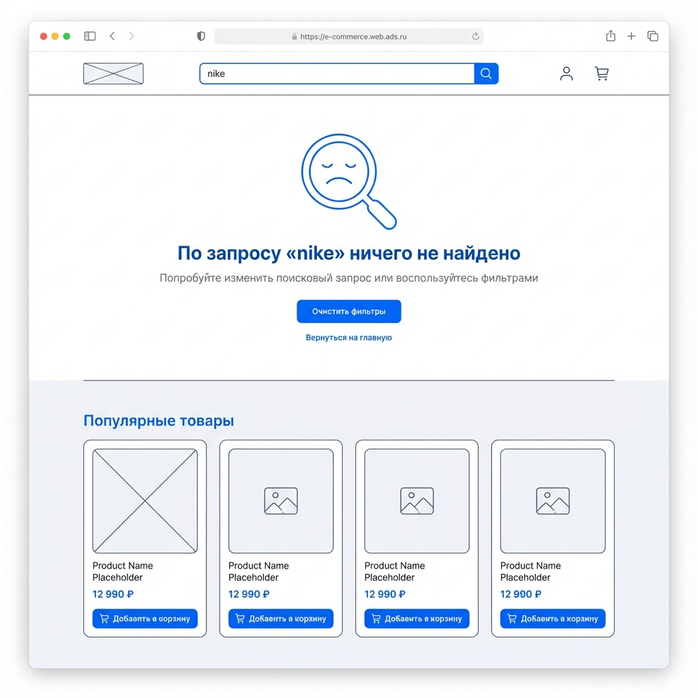

# Story 18.2: Страница результатов поиска

## Status

Available

## Story

**As a** пользователь,  
**I want** видеть страницу с результатами поиска,  
**so that** просматривать все найденные товары.

## Acceptance Criteria

1. - [ ] Страница `/search` отображает результаты по query param `q`
2. - [ ] Заголовок показывает: "Результаты поиска: «запрос»"
3. - [ ] Отображается количество найденных товаров
4. - [ ] Товары показаны в grid-формате (переиспользуем ProductCard)
5. - [ ] Пагинация результатов (24 товара на страницу)
6. - [ ] SSR/SSG для SEO (meta title: "Поиск: {query}")
7. - [ ] Состояние "Ничего не найдено" с рекомендациями

## Tasks / Subtasks

- [ ] **Task 1: Создание серверного компонента страницы поиска** (AC: 1, 6)
  - [ ] 1.1. Создать `src/app/search/page.tsx` — серверный компонент с SSR
  - [ ] 1.2. Реализовать чтение query параметра `q` из `searchParams`
  - [ ] 1.3. Настроить динамические метатеги для SEO (`generateMetadata`)
  - [ ] 1.4. Создать `src/app/search/layout.tsx` для общей структуры (опционально)

- [ ] **Task 2: Создание клиентского компонента SearchPageClient** (AC: 1, 2, 3, 4, 5, 7)
  - [ ] 2.1. Создать `src/components/business/SearchPageClient/SearchPageClient.tsx`
  - [ ] 2.2. Интегрировать `productsService.search()` для получения результатов
  - [ ] 2.3. Реализовать состояние загрузки (Loading skeleton)
  - [ ] 2.4. Реализовать отображение заголовка с запросом и количеством товаров
  - [ ] 2.5. Создать файл индекса `src/components/business/SearchPageClient/index.ts`

- [ ] **Task 3: Создание компонента SearchResults** (AC: 4)
  - [ ] 3.1. Создать `src/components/business/SearchResults/SearchResults.tsx`
  - [ ] 3.2. Переиспользовать `ProductGrid` и `ProductCard` для отображения товаров
  - [ ] 3.3. Настроить `layout='grid'` для карточек товаров
  - [ ] 3.4. Создать файл индекса `src/components/business/SearchResults/index.ts`

- [ ] **Task 4: Создание компонента EmptySearchResults** (AC: 7)
  - [ ] 4.1. Создать `src/components/business/EmptySearchResults/EmptySearchResults.tsx`
  - [ ] 4.2. Реализовать UI состояния "Ничего не найдено"
  - [ ] 4.3. Добавить рекомендации: "Попробуйте изменить запрос" или блок популярных товаров
  - [ ] 4.4. Создать файл индекса `src/components/business/EmptySearchResults/index.ts`

- [ ] **Task 5: Реализация пагинации** (AC: 5)
  - [ ] 5.1. **Переиспользовать существующий** компонент `Pagination` из `src/components/ui/Pagination/Pagination.tsx`
  - [ ] 5.2. Интегрировать пагинацию в SearchPageClient (24 товара на страницу)
  - [ ] 5.3. Обновлять URL при смене страницы (`/search?q=...&page=2`)
  - [ ] 5.4. Добавить обработку query параметра `page`

- [ ] **Task 6: Unit-тесты** (AC: 1-7)
  - [ ] 6.1. Создать `src/components/business/SearchPageClient/__tests__/SearchPageClient.test.tsx`
  - [ ] 6.2. Создать `src/components/business/SearchResults/__tests__/SearchResults.test.tsx`
  - [ ] 6.3. Создать `src/components/business/EmptySearchResults/__tests__/EmptySearchResults.test.tsx`
  - [ ] 6.4. Тест: отображение результатов поиска с товарами
  - [ ] 6.5. Тест: отображение заголовка с запросом и количеством
  - [ ] 6.6. Тест: отображение состояния "Ничего не найдено"
  - [ ] 6.7. Тест: пагинация (смена страницы)
  - [ ] 6.8. Тест: вызов `productsService.search()` с MSW

---

## Dev Notes

### Существующие компоненты для переиспользования

**ProductCard** — `src/components/business/ProductCard/ProductCard.tsx`
[Source: docs/architecture/04-component-structure.md, epic-18-search.md]

Готовый компонент карточки товара с поддержкой:

- `layout`: `'grid' | 'list' | 'compact'`
- `mode`: `'b2c' | 'b2b'`
- `product`: объект товара типа `Product`
- Адаптивные стили согласно Design System v2.0

**ProductGrid** — `src/components/business/ProductGrid/ProductGrid.tsx`
[Source: docs/architecture/04-component-structure.md]

Обёртка для отображения карточек товаров:

- `layout`: `'grid' | 'list'`
- Grid: 2 колонки на mobile, 3 на tablet, 4 на desktop
- `role="list"` для accessibility

**productsService.search()** — `src/services/productsService.ts`
[Source: epic-18-search.md]

```typescript
// Поиск товаров
ProductsService.search(query: string): Promise<{ results: Product[] }>
// GET /api/v1/products/search/?q={query}
```

**productsService.getAll()** — для пагинированного поиска
[Source: src/services/productsService.ts]

```typescript
// Получить товары с пагинацией и фильтрами
ProductsService.getAll(filters?: ProductFilters): Promise<PaginatedResponse<Product>>
// Поддерживает параметры: page, page_size, search (для текстового поиска)
```

### Backend API для поиска

[Source: epic-18-search.md, docs/architecture/03-api-specification.md]

Backend поддерживает полнотекстовый поиск через PostgreSQL FTS:

- Endpoint: `GET /api/v1/products/?search={query}&page={n}&page_size=24`
- Фильтрация через `ProductFilter` в `backend/apps/products/filters.py`
- Русская конфигурация FTS

### Структура страницы каталога (для референса)

[Source: src/app/catalog/page.tsx]

Существующая страница каталога использует:

- `PAGE_SIZE = 12` — товаров на страницу
- `ProductGrid` с `ProductCard` для grid-отображения
- Пагинация с `MAX_VISIBLE_PAGES = 5`
- Функция `formatCurrency` для форматирования цен

### Архитектура компонентов для страницы поиска

```text
frontend/src/
├── app/
│   └── search/
│       └── page.tsx                    # НОВЫЙ: Серверный компонент SSR
├── components/
│   └── business/
│       ├── SearchPageClient/           # НОВЫЙ
│       │   ├── SearchPageClient.tsx    # Клиентский компонент
│       │   └── index.ts
│       ├── SearchResults/              # НОВЫЙ
│       │   ├── SearchResults.tsx       # Grid с товарами
│       │   └── index.ts
│       └── EmptySearchResults/         # НОВЫЙ
│           ├── EmptySearchResults.tsx  # Состояние "Ничего не найдено"
│           └── index.ts
```

### SEO Metadata (generateMetadata)

[Source: docs/architecture/coding-standards.md, epic-18-search.md]

```typescript
// src/app/search/page.tsx
import type { Metadata } from 'next';

interface SearchPageProps {
  searchParams: Promise<{ q?: string; page?: string }>;
}

export async function generateMetadata(
  { searchParams }: SearchPageProps
): Promise<Metadata> {
  const params = await searchParams;
  const query = params.q || '';
  
  return {
    title: query ? `Поиск: ${query}` : 'Поиск товаров',
    description: `Результаты поиска по запросу "${query}" в магазине FREESPORT`,
    robots: {
      index: true,
      follow: true,
    },
  };
}
```

### Интерфейсы компонентов

```typescript
// SearchPageClient
interface SearchPageClientProps {
  initialQuery: string;
  initialPage?: number;
}

// SearchResults
interface SearchResultsProps {
  products: Product[];
  isLoading?: boolean;
}

// EmptySearchResults
interface EmptySearchResultsProps {
  query: string;
  recommendedProducts?: Product[];
  onRecommendationClick?: (product: Product) => void;
}
```

### URL структура

- `/search` — страница поиска без запроса (показать форму или популярные)
- `/search?q=nike` — результаты поиска по "nike"
- `/search?q=nike&page=2` — вторая страница результатов

### Требования к Performance

[Source: epic-18-search.md#requirements]

- SSR для первичной загрузки (SEO оптимизация)
- Пагинация: 24 товара на страницу
- Lazy loading изображений в ProductCard (уже реализовано)

### Требования к Accessibility

[Source: epic-18-search.md#requirements, coding-standards.md]

- WCAG 2.1 AA
- Семантическая разметка: `<main>`, `<h1>`, `<section>`
- **Обязательные aria-labels:**
  - `aria-label="Результаты поиска"` для main контейнера
  - `aria-label="Страница {n} из {total}"` для пагинации
  - `aria-live="polite"` для счётчика результатов
  - `role="status"` для сообщения "Ничего не найдено"
- `aria-label` для интерактивных элементов
- Skip-to-content link для accessibility

### Файловая структура проекта

[Source: docs/architecture/source-tree.md]

```
frontend/src/
├── app/
│   └── search/                     # НОВАЯ ДИРЕКТОРИЯ
│       └── page.tsx                # НОВЫЙ ФАЙЛ
├── components/
│   └── business/
│       ├── SearchPageClient/       # НОВАЯ ДИРЕКТОРИЯ
│       ├── SearchResults/          # НОВАЯ ДИРЕКТОРИЯ
│       └── EmptySearchResults/     # НОВАЯ ДИРЕКТОРИЯ
├── services/
│   └── productsService.ts          # СУЩЕСТВУЮЩИЙ (использовать search/getAll)
└── types/
    └── api.ts                      # СУЩЕСТВУЮЩИЙ (Product, PaginatedResponse)

### CSS / Design System Спецификации

[Source: docs/frontend/design-system.json, docs/frontend/css-variables-mapping.md]

#### SearchPageClient — Контейнер страницы

```css
/* Фон страницы */
background: var(--bg-canvas);        /* #F5F7FB */
padding: 48px 24px;                  /* section spacing */
max-width: 1280px;
margin: 0 auto;
```

#### Заголовок результатов

```css
/* H1 — title-l */
font-size: 24px;
line-height: 32px;
font-weight: 600;
color: var(--color-text-primary);    /* #1F2A44 */
margin-bottom: 16px;

/* Счётчик товаров — body-m */
font-size: 16px;
color: var(--color-text-secondary);  /* #4B5C7A */
```

```tsx
// Пример Tailwind классов
<h1 className="text-title-l font-semibold text-primary mb-4">
  Результаты поиска: «{query}»
</h1>
<p className="text-body-m text-secondary mb-6" aria-live="polite">
  Найдено {count} товаров
</p>
```

#### Loading Skeleton

```tsx
// Skeleton для карточек
<div className="grid grid-cols-2 md:grid-cols-3 lg:grid-cols-4 gap-4">
  {Array.from({ length: 8 }).map((_, i) => (
    <div
      key={i}
      className="h-64 rounded-default bg-neutral-200 animate-pulse"
    />
  ))}
</div>
```

#### EmptySearchResults — Стилизация

[Source: design-system.json#components.InfoPanel]

```tsx
// Контейнер пустого результата
<div className="flex flex-col items-center justify-center py-16 px-6 text-center">
  {/* Иконка поиска */}
  <div className="w-20 h-20 rounded-3xl bg-secondary-subtle flex items-center justify-center mb-6">
    <Search className="w-12 h-12 text-secondary" />
  </div>
  
  {/* Заголовок */}
  <h2 className="text-title-m font-semibold text-primary mb-2">
    По запросу «{query}» ничего не найдено
  </h2>
  
  {/* Подсказки */}
  <p className="text-body-m text-secondary max-w-md">
    Попробуйте изменить поисковый запрос или воспользуйтесь фильтрами
  </p>
</div>
```

**Цветовые токены Design System:**

| Элемент | CSS Variable | Tailwind Class |
|---------|--------------|----------------|
| Фон страницы | `var(--bg-canvas)` | `bg-canvas` |
| Панель результатов | `var(--bg-panel)` | `bg-panel` |
| Заголовок | `var(--color-text-primary)` | `text-primary` |
| Счётчик | `var(--color-text-secondary)` | `text-secondary` |
| Иконка empty | `var(--color-secondary)` | `text-secondary` |
| Skeleton фон | `var(--color-neutral-200)` | `bg-neutral-200` |
| Тень карточек | `var(--shadow-default)` | `shadow-default` |
| Тень hover | `var(--shadow-hover)` | `shadow-hover` |

### Wireframe EmptySearchResults



**Описание wireframe:**

- Центрированный блок с иконкой поиска
- Заголовок с query в кавычках
- Подсказка для пользователя
- Секция "Популярные товары" — 4 ProductCard в grid layout

```

---

## Testing

### Файлы тестов

- `src/components/business/SearchPageClient/__tests__/SearchPageClient.test.tsx` — **НОВЫЙ**
- `src/components/business/SearchResults/__tests__/SearchResults.test.tsx` — **НОВЫЙ**
- `src/components/business/EmptySearchResults/__tests__/EmptySearchResults.test.tsx` — **НОВЫЙ**

### Технологический стек тестирования

[Source: docs/architecture/10-testing-strategy.md, docs/architecture/tech-stack.md]

- **Framework:** Vitest 2.1.5
- **Testing Library:** @testing-library/react 16.3.0
- **User Events:** @testing-library/user-event 14.5.1
- **API Mocking:** MSW 2.12.2
- **DOM Environment:** happy-dom 15.11.3
- **Accessibility:** vitest-axe

### Паттерны тестирования

[Source: coding-standards.md#frontend-testing]

```typescript
import { describe, it, expect, vi, beforeEach } from 'vitest';
import { render, screen, waitFor } from '@testing-library/react';
import userEvent from '@testing-library/user-event';
import { http, HttpResponse } from 'msw';
import { setupServer } from 'msw/node';
```

### Тестовые сценарии

1. **SearchPageClient:**
   - Рендеринг с результатами поиска
   - Рендеринг состояния загрузки
   - Рендеринг пустых результатов
   - Смена страницы пагинации

2. **SearchResults:**
   - Рендеринг grid с ProductCard
   - Рендеринг состояния загрузки (skeleton)

3. **EmptySearchResults:**
   - Рендеринг сообщения с запросом
   - Рендеринг рекомендаций

### Команды для запуска тестов

```bash
# Запуск всех тестов frontend
cd frontend && npm run test

# Запуск конкретного теста
npm run test -- SearchPageClient

# Запуск тестов с покрытием
npm run test:coverage
```

### Требования к покрытию

[Source: docs/architecture/10-testing-strategy.md]

- Overall: >= 70%
- Новые компоненты: >= 80%

### Mock-данные для тестов

```typescript
// __mocks__/searchMocks.ts
import type { Product } from '@/types/api';

export const mockProducts: Product[] = [
  {
    id: 1,
    name: 'Nike Air Zoom Pegasus 40',
    slug: 'nike-air-zoom-pegasus-40',
    description: 'Беговые кроссовки',
    retail_price: 12990,
    is_in_stock: true,
    stock_quantity: 15,
    main_image: '/images/products/nike-pegasus.jpg',
    category: { id: 1, name: 'Обувь', slug: 'obuv' },
    brand: { id: 1, name: 'Nike', slug: 'nike' },
    is_hit: true,
    is_new: false,
    is_sale: false,
    is_promo: false,
    is_premium: false,
    discount_percent: null,
  },
  {
    id: 2,
    name: 'Adidas Ultraboost 22',
    slug: 'adidas-ultraboost-22',
    description: 'Беговые кроссовки с технологией Boost',
    retail_price: 14990,
    is_in_stock: true,
    stock_quantity: 8,
    main_image: '/images/products/adidas-ultraboost.jpg',
    category: { id: 1, name: 'Обувь', slug: 'obuv' },
    brand: { id: 2, name: 'Adidas', slug: 'adidas' },
    is_hit: false,
    is_new: true,
    is_sale: false,
    is_promo: false,
    is_premium: false,
    discount_percent: null,
  },
];

export const mockEmptySearchResponse = {
  count: 0,
  next: null,
  previous: null,
  results: [],
};

export const mockPaginatedSearchResponse = {
  count: 48,
  next: '/api/v1/products/?search=nike&page=2',
  previous: null,
  results: mockProducts,
};
```

```typescript
// MSW Handler пример
import { http, HttpResponse } from 'msw';
import { mockPaginatedSearchResponse, mockEmptySearchResponse } from './__mocks__/searchMocks';

export const searchHandlers = [
  http.get('*/api/v1/products/', ({ request }) => {
    const url = new URL(request.url);
    const search = url.searchParams.get('search');
    
    if (search === 'notfound') {
      return HttpResponse.json(mockEmptySearchResponse);
    }
    
    return HttpResponse.json(mockPaginatedSearchResponse);
  }),
];
```

---

## Change Log

| Date       | Version | Description           | Author        |
|------------|---------|-----------------------|---------------|
| 2025-12-21 | 1.0     | Initial story draft   | Scrum Master  |
| 2025-12-21 | 1.1     | Added CSS/Design System specs, mock data, aria-labels, wireframe | Sarah (PO) |

---

## Dev Agent Record

### Agent Model Used

_To be filled by Dev Agent_

### Debug Log References

_To be filled by Dev Agent_

### Completion Notes List

_To be filled by Dev Agent_

### File List

_To be filled by Dev Agent_

---

## QA Results

_To be filled by QA Agent_
