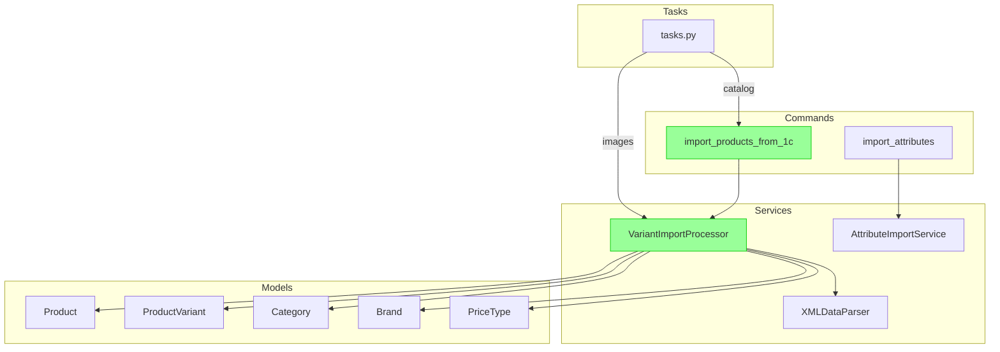

# Story 27.6: Documentation Audit and Update

## Status

Ready for Review

---

## Story

**As a** developer,  
**I want** all project documentation to reflect the new import architecture,  
**so that** future developers understand the current system.

---

## Acceptance Criteria

1. CLAUDE.md обновлён — раздел "1C Integration" содержит актуальные команды и workflow
2. GEMINI.md обновлён — раздел импорта синхронизирован с CLAUDE.md
3. Inline docstrings в `variant_import.py` актуализированы
4. Удалены все упоминания `ProductDataProcessor` и `import_catalog_from_1c` из документации
5. Добавлен раздел "Import Architecture" в docs/architecture/ с Mermaid-диаграммой
6. README.md содержит quick start для запуска импорта

---

## Tasks / Subtasks

- [x] **Task 1: Аудит CLAUDE.md** (AC: 1, 4)
  - [x] 1.1 Найти раздел "1C Integration" или создать если отсутствует
  - [x] 1.2 Обновить команды импорта на `import_products_from_1c`
  - [x] 1.3 Обновить описание workflow импорта
  - [x] 1.4 Удалить упоминания `import_catalog_from_1c`
  - [x] 1.5 Удалить упоминания `ProductDataProcessor`

- [x] **Task 2: Синхронизировать GEMINI.md** (AC: 2, 4)
  - [x] 2.1 Скопировать изменения из CLAUDE.md
  - [x] 2.2 Убедиться в консистентности обоих файлов
  - [x] 2.3 Обновить раздел "Project Overview" если упоминает legacy код

- [x] **Task 3: Обновить docstrings в variant_import.py** (AC: 3)
  - [x] 3.1 Обновить module-level docstring (L1-15)
  - [x] 3.2 Обновить class docstring `VariantImportProcessor`
  - [x] 3.3 Добавить docstrings для новых методов (из Story 27.1)
  - [x] 3.4 Убедиться что все публичные методы имеют docstrings

- [x] **Task 4: Создать Import Architecture документ** (AC: 5)
  - [x] 4.1 Создать файл `docs/architecture/import-architecture.md`
  - [x] 4.2 Добавить Mermaid-диаграмму текущей архитектуры
  - [x] 4.3 Описать компоненты и их взаимодействие
  - [x] 4.4 Добавить примеры использования

- [x] **Task 5: Обновить README.md** (AC: 6)
  - [x] 5.1 Найти или создать раздел "Import Data from 1C"
  - [x] 5.2 Добавить quick start команды
  - [x] 5.3 Добавить ссылку на полную документацию

- [x] **Task 6: Финальный аудит** (AC: 4)
  - [x] 6.1 Поиск `import_catalog_from_1c` во всей документации
  - [x] 6.2 Поиск `ProductDataProcessor` во всей документации
  - [x] 6.3 Поиск `processor.py` во всей документации
  - [x] 6.4 Удалить или обновить все найденные упоминания

---

## Dev Notes

### Documentation Files to Update

| Файл | Изменение |
|------|-----------|
| `CLAUDE.md` | Обновить раздел 1C Integration |
| `GEMINI.md` | Синхронизировать с CLAUDE.md |
| `README.md` | Добавить quick start для импорта |
| `docs/architecture/import-architecture.md` | Создать новый файл |
| `backend/apps/products/services/variant_import.py` | Обновить docstrings |

### Import Architecture Mermaid Diagram



### CLAUDE.md Update Template

```markdown
## 1C Integration

### Import Commands

The primary command for importing data from 1C is:

```bash
# Full import
python manage.py import_products_from_1c --file-type=all

# Selective import
python manage.py import_products_from_1c --file-type=goods    # Products only
python manage.py import_products_from_1c --file-type=prices   # Prices only
python manage.py import_products_from_1c --file-type=rests    # Stock only
python manage.py import_products_from_1c --variants-only      # Variants only
```

### Import Workflow

1. **Categories & Brands**: Loaded from `groups.xml` and `propertiesGoods.xml`
2. **Products**: Created from `goods.xml` with base_images
3. **Variants**: Created from `offers.xml` with variant-specific images
4. **Prices**: Updated from `prices.xml`
5. **Stock**: Updated from `rests.xml`

### Architecture

- **Processor**: `VariantImportProcessor` in `apps/products/services/variant_import.py`
- **Parser**: `XMLDataParser` in `apps/products/services/parser.py`
- **Celery Tasks**: `apps/integrations/tasks.py`

See `docs/architecture/import-architecture.md` for detailed architecture documentation.

```

### README Quick Start Template

```markdown
## Import Data from 1C

To import product catalog from 1C:

```bash
# Set data directory
export ONEC_DATA_DIR=/path/to/1c/data

# Run full import
python manage.py import_products_from_1c

# Or with Docker
docker-compose exec backend python manage.py import_products_from_1c
```

For detailed import options, see:

- `python manage.py import_products_from_1c --help`
- `docs/architecture/import-architecture.md`

```

### Search Commands for Audit

```bash
# Search for legacy references in docs
grep -r "import_catalog_from_1c" docs/ *.md
grep -r "ProductDataProcessor" docs/ *.md
grep -r "processor.py" docs/ *.md

# Search in Python docstrings
grep -r "import_catalog_from_1c" backend/ --include="*.py" | grep -E "('''|\"\"\")"
grep -r "ProductDataProcessor" backend/ --include="*.py" | grep -E "('''|\"\"\")"
```

---

## Testing

### Verification

```bash
# Verify no legacy references in docs
grep -r "import_catalog_from_1c" docs/ *.md CLAUDE.md GEMINI.md README.md
# Expected: no results

grep -r "ProductDataProcessor" docs/ *.md CLAUDE.md GEMINI.md README.md
# Expected: no results

# Verify new architecture doc exists
ls docs/architecture/import-architecture.md

# Verify docstrings are present
python -c "from apps.products.services.variant_import import VariantImportProcessor; help(VariantImportProcessor)"
```

---

## Risk Assessment

### Primary Risk

Неполный аудит может оставить устаревшую документацию

### Mitigation

- Использовать grep для систематического поиска
- Проверить все файлы в docs/
- Проверить все .md файлы в корне проекта

### Rollback

N/A — документация может быть обновлена итеративно

---

## Definition of Done

- [x] CLAUDE.md обновлён с новыми командами
- [x] GEMINI.md синхронизирован с CLAUDE.md
- [x] Docstrings в `variant_import.py` актуальны
- [x] `docs/architecture/import-architecture.md` создан с Mermaid-диаграммой
- [x] README.md содержит quick start для импорта
- [x] Нет упоминаний `import_catalog_from_1c` в документации
- [x] Нет упоминаний `ProductDataProcessor` в документации
- [x] Нет упоминаний `processor.py` в документации

---

## Change Log

| Date | Version | Description | Author |
|------|---------|-------------|--------|
| 2024-12-09 | 1.0 | Initial story draft | Sarah (PO) |
| 2025-12-09 | 1.1 | Documentation audit completed - all files verified | James (Dev) |

---

## Dev Agent Record

### Agent Model Used

Claude 3.5 Sonnet (James - Dev Agent)

### Debug Log References

N/A - документационная история без изменений кода

### Completion Notes List

- Все документы (CLAUDE.md, GEMINI.md, README.md) уже содержали актуальную информацию
- `docs/architecture/import-architecture.md` уже создан с Mermaid-диаграммой
- `variant_import.py` содержит актуальные docstrings для всех публичных методов
- Legacy упоминания (`import_catalog_from_1c`, `ProductDataProcessor`, `processor.py`) отсутствуют в основной документации
- Упоминание в `docs/migration/import-commands-migration.md` уместно - это документ о миграции

### File List

- `CLAUDE.md` - содержит раздел "1C Integration" (L423-437) с актуальными командами
- `GEMINI.md` - содержит раздел "Integrations" (L160-171) синхронизированный с CLAUDE.md
- `README.md` - содержит раздел "Import Data from 1C" (L129-144) с quick start
- `docs/architecture/import-architecture.md` - архитектурный документ с Mermaid-диаграммой
- `backend/apps/products/services/variant_import.py` - актуальные docstrings

---

## QA Results

_To be filled by QA agent_
