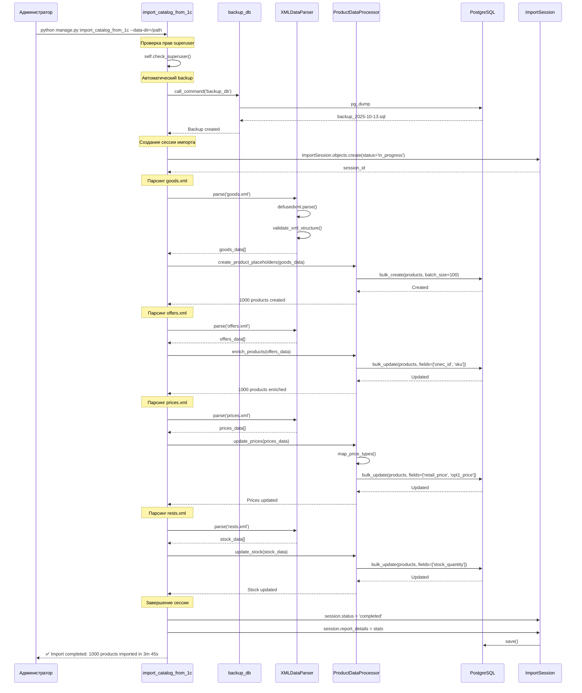

# Story 3.1.2: loading-scripts

## Status

Ready for Development

## Story

**As a** системный администратор,
**I want** иметь простые команды для загрузки данных,
**so that** я могу управлять процессом импорта из 1С.

## Prerequisites

**Из Story 3.1.1 (должны быть завершены):**

- [ ] Модели Brand, Category, Product обновлены с полями onec_id, parent_onec_id, sync_status
- [ ] Модель ImportSession создана
- [ ] Миграции применены
- [ ] XMLDataParser реализован в services/parser.py
- [ ] ProductDataProcessor реализован в services/processor.py
- [ ] Базовая команда import_catalog_from_1c создана с параметрами --data-dir, --dry-run

## Acceptance Criteria

1. **ДОПОЛНЕНА** существующая команда `import_catalog_from_1c` расширенными параметрами управления (--chunk-size, --skip-validation, --file-type, --clear-existing) и создана команда `load_test_catalog`.
2. Поддержана загрузка категорий с иерархией.
3. Созданы связи между товарами, категориями и брендами.
4. Реализована обработка дубликатов товаров.
5. Добавлен прогресс-бар для долгих операций.
6. Создан скрипт резервного копирования `backup_db`.

### Детальные задачи

- [ ] **Создать команду-заглушку `load_test_catalog` (AC: 1)**
  - [ ] Создать каркас команды с базовыми help-параметрами.
  - [ ] **Для генерации тестовых данных (AC: 1):**
    - [ ] Реализовать параметр `--count` для указания количества товаров.
    - [ ] Реализовать флаг `--with-brands` для создания тестовых брендов.
    - [ ] Реализовать флаг `--with-categories` для создания тестовых категорий.
    - [ ] Для тестовой команды создавать тестовые категории с иерархией.
    - [ ] Реализовать флаг `--clear-existing` для очистки старых тестовых данных.
    - [ ] Реализовать флаг `--dry-run` для тестового запуска без записи в БД.

- [ ] **ДОПОЛНИТЬ существующую команду `import_catalog_from_1c` расширенными параметрами (AC: 1)**
  - [ ] Добавить параметр `--chunk-size` для управления размером пакетов при импорте
  - [ ] Добавить флаг `--skip-validation` для ускорения импорта
  - [ ] Добавить параметр `--file-type` для выборочного импорта (goods|offers|prices|rests|all)
  - [ ] Добавить флаг `--clear-existing` для очистки старых данных перед импортом
  - [ ] Интегрировать автоматический вызов `backup_db` перед полным импортом
  - [ ] Добавить прогресс-бар через `tqdm` для визуализации процесса
  
**Примечание:** Базовая команда с --data-dir и --dry-run уже создана в Story 3.1.1

- [ ] **Реализовать загрузку категорий с иерархией (AC: 2)**
  - [ ] Создать парсер для иерархии из `groups.xml`
  - [ ] Обеспечить поддержку многоуровневой вложенности
  - [ ] Реализовать валидацию циклических ссылок в категориях
  
**Примечание:** Модель Category с полем onec_id уже создана в Story 3.1.1

- [ ] **Настроить связи между сущностями (AC: 3)**
  - [ ] Реализовать логику автоматического создания `Brand` из файла свойств
  - [ ] Для тестовой команды создавать связи между тестовыми товарами, категориями и брендами
  - [ ] Реализовать логику обработки отсутствующих связанных объектов (логгирование)
  
**Примечание:** Product ↔ Category/Brand связи (FK) уже существуют в models.py

- [ ] **Обработать дубликаты товаров (AC: 4) - для реальных данных**
  - [ ] Реализовать поиск дубликатов по `onec_id` (`get_or_create` или `update_or_create`).
  - [ ] Определить и реализовать стратегию `merge vs replace` для дубликатов.
    - **Решение Architect (22.09.2025):** Использовать стратегию `merge` (обновление по `onec_id`).
  - [ ] Обеспечить валидацию целостности после обработки дубликатов.
  
**Проверочная точка после Задачи 4:** Все модели связаны и готовы к импорту данных

- [ ] **Добавить прогресс-бар (AC: 5)**
  - [ ] Использовать `tqdm` для визуального прогресса в обеих командах.
  - [ ] Логировать ключевые этапы обработки (начало/конец парсинга, записи в БД).
    - Формат логирования: structured JSON с полями timestamp, level, message, context
    - Уровни логирования: INFO для базовых операций, DEBUG для детальной информации, ERROR для проблем
    - Контекст: включать количество обработанных записей, время выполнения, ID сессии импорта
  - [ ] Показывать базовую статистику обработки (создано/обновлено/пропущено).

- [ ] **Создать backup скрипт (AC: 6)**
  - [ ] Создать команду `backup_db`.
    - **Решение Architect (22.09.2025):** Бэкапы сохраняются в `backend/backup_db/`. Директория добавлена в `.gitignore`.
  - [ ] Реализовать автоматический вызов бэкапа перед каждым полным импортом.
    - Примечание: вызывать `call_command('backup_db')` в начале команды `import_catalog_from_1c`
  - [ ] Настроить ротацию backup-файлов.
    - **Решение Architect (22.09.2025):** Хранить последние 3 копии.
  - [ ] Добавить опциональное шифрование бэкапов с использованием GPG/AES-256.
    - Добавить параметр `--encrypt` для команды `backup_db`
    - Хранить ключи шифрования в защищенном хранилище
  - [ ] Примечание: может реализовываться параллельно с задачами 1-5, рекомендуется для безопасного тестирования

## Definition of Done

- [ ] Команды работают без ошибок на тестовых данных
- [ ] Импорт 1000+ товаров завершается за <5 минут
- [ ] Сохраняется резервная копия перед каждым импортом
- [ ] Все edge cases обработаны корректно
- [ ] Создана документация по использованию команд
- [ ] Rollback процедуры документированы
- [ ] Security considerations реализованы

## Security Considerations

### Command Access Control

**Ограничение доступа к командам импорта:**

- **Admin-only Access**: Команды импорта должны выполняться только пользователями с правами superuser
- **Проверка прав**: Использовать `self.check_superuser()` в начале команды
- **Audit Logging**: Логировать все операции импорта с указанием пользователя и timestamp

```python
# backend/apps/products/management/commands/import_catalog_from_1c.py
from django.core.management.base import BaseCommand
from django.contrib.auth import get_user_model

class Command(BaseCommand):
    def handle(self, *args, **options):
        # Проверка прав superuser
        if not self.check_superuser():
            self.stderr.write(self.style.ERROR('This command requires superuser privileges'))
            return
        
        # Логирование операции
        import logging
        logger = logging.getLogger('import')
        logger.info(f'Import started by user: {os.environ.get("USER", "unknown")}')
```

### XML Security

**Защита от XML-атак (из Story 3.1.1):**

- **XML Injection/XXE Prevention**: Использовать `defusedxml` library вместо стандартного `xml.etree.ElementTree`
- **XML Schema Validation**: Валидировать структуру XML на соответствие XSD схеме перед обработкой
- **File Size Limits**: Ограничить максимальный размер импортируемых файлов (100MB)
- **Input Sanitization**: Валидировать все входные данные перед записью в БД

```python
# backend/apps/products/services/parser.py
import defusedxml.ElementTree as ET
from django.conf import settings

class XMLDataParser:
    MAX_FILE_SIZE = 100 * 1024 * 1024  # 100MB
    
    def parse(self, file_path: str) -> list[dict]:
        # Проверка размера файла
        file_size = os.path.getsize(file_path)
        if file_size > self.MAX_FILE_SIZE:
            raise ValueError(f"File size {file_size} exceeds limit {self.MAX_FILE_SIZE}")
        
        # Безопасный парсинг с defusedxml
        try:
            tree = ET.parse(file_path)
            root = tree.getroot()
        except ET.ParseError as e:
            raise ValueError(f"Invalid XML structure: {e}")
        
        return self._extract_data(root)
```

### Path Traversal Prevention

**Валидация путей файлов:**

- **Path Validation**: Проверять что пути не содержат `..` или абсолютные пути
- **Whitelist Directories**: Разрешать доступ только к определенным директориям
- **Sanitization**: Очищать пути от опасных символов

```python
import os
from pathlib import Path

def validate_data_dir(data_dir: str) -> Path:
    """Валидация директории с данными"""
    data_path = Path(data_dir).resolve()
    
    # Проверка на path traversal
    if '..' in str(data_path):
        raise ValueError("Path traversal detected")
    
    # Проверка что путь в разрешенной директории
    allowed_base = Path(settings.ONEC_DATA_DIR).resolve()
    if not str(data_path).startswith(str(allowed_base)):
        raise ValueError(f"Access denied: {data_path} is outside allowed directory")
    
    return data_path
```

### Backup Security

**Защита резервных копий:**

- **Encryption**: Опциональное шифрование бэкапов с использованием GPG/AES-256
- **Access Control**: Ограничить доступ к директории с бэкапами (chmod 700)
- **Secure Storage**: Хранить ключи шифрования в защищенном хранилище (не в Git)
- **Rotation**: Автоматическое удаление старых бэкапов (хранить последние 3 копии)

```python
# backend/apps/products/management/commands/backup_db.py
import gnupg

class Command(BaseCommand):
    def add_arguments(self, parser):
        parser.add_argument('--encrypt', action='store_true',
                          help='Encrypt backup with GPG')
    
    def handle(self, *args, **options):
        backup_file = self.create_backup()
        
        if options['encrypt']:
            gpg = gnupg.GPG()
            with open(backup_file, 'rb') as f:
                encrypted = gpg.encrypt_file(
                    f,
                    recipients=['backup@freesport.com'],
                    output=f'{backup_file}.gpg'
                )
            os.remove(backup_file)  # Удалить незашифрованную копию
```

### Data Validation

**Валидация импортируемых данных:**

- **Уникальность onec_id**: Проверка перед сохранением
- **Обязательные поля**: Валидация наличия критичных полей (name, sku, category)
- **Типы данных**: Валидация типов (цены — Decimal, количество — Integer)
- **SQL Injection Prevention**: Использование Django ORM (автоматическая защита)
- **XSS Prevention**: Экранирование HTML в текстовых полях

## Rollback Procedures

### Откат расширенных параметров команды import_catalog_from_1c

**Если новые параметры вызывают проблемы:**

```bash
# 1. Откатить изменения через Git
git checkout HEAD~1 -- backend/apps/products/management/commands/import_catalog_from_1c.py

# 2. Перезапустить приложение
python manage.py collectstatic --noinput
sudo systemctl restart freesport-backend

# 3. Проверить работоспособность
python manage.py check
```

### Восстановление из backup

**Если импорт повредил данные:**

```bash
# 1. Остановить приложение
sudo systemctl stop freesport-backend

# 2. Создать backup текущего состояния (на всякий случай)
python manage.py backup_db --output=/tmp/emergency_backup.sql

# 3. Восстановить из последнего backup
python manage.py restore_db --backup-file=/path/to/backup/backup_2025-10-13_120000.sql

# 4. Проверить целостность данных
python manage.py check_data_integrity

# 5. Запустить приложение
sudo systemctl start freesport-backend

# 6. Проверить логи
tail -f /var/log/freesport/backend.log
```

**Команда restore_db (создать в Story 3.1.2):**

```python
# backend/apps/products/management/commands/restore_db.py
from django.core.management.base import BaseCommand
import subprocess

class Command(BaseCommand):
    help = 'Restore database from backup'
    
    def add_arguments(self, parser):
        parser.add_argument('--backup-file', required=True,
                          help='Path to backup file')
        parser.add_argument('--confirm', action='store_true',
                          help='Skip confirmation prompt')
    
    def handle(self, *args, **options):
        backup_file = options['backup_file']
        
        if not options['confirm']:
            confirm = input('This will OVERWRITE the current database. Continue? (yes/no): ')
            if confirm.lower() != 'yes':
                self.stdout.write('Restore cancelled')
                return
        
        # Восстановление из backup
        result = subprocess.run([
            'psql',
            '-U', settings.DATABASES['default']['USER'],
            '-d', settings.DATABASES['default']['NAME'],
            '-f', backup_file
        ], capture_output=True, text=True)
        
        if result.returncode == 0:
            self.stdout.write(self.style.SUCCESS('Database restored successfully'))
        else:
            self.stderr.write(self.style.ERROR(f'Restore failed: {result.stderr}'))
```

### Удаление тестовых данных

**Если load_test_catalog создал некорректные данные:**

```bash
# 1. Удалить все тестовые данные
python manage.py load_test_catalog --clear-existing

# 2. Или удалить выборочно через Django shell
python manage.py shell
>>> from apps.products.models import Product, Category, Brand
>>> Product.objects.filter(sku__startswith='TEST-').delete()
>>> Category.objects.filter(name__startswith='Test ').delete()
>>> Brand.objects.filter(name__startswith='Test ').delete()
```

### Откат команды load_test_catalog

**Если нужно полностью удалить команду:**

```bash
# 1. Удалить файл команды
rm backend/apps/products/management/commands/load_test_catalog.py

# 2. Удалить тесты
rm backend/tests/integration/test_management_commands/test_load_test_catalog.py

# 3. Откатить изменения через Git (если нужно)
git checkout HEAD -- backend/apps/products/management/commands/load_test_catalog.py
```

### Rollback Triggers

**Когда необходим откат:**

- ❌ Критические ошибки в production после деплоя новых параметров
- ❌ Потеря данных или corruption существующих записей
- ❌ Performance degradation (время импорта > 2x baseline)
- ❌ Ошибки при использовании --chunk-size или --skip-validation
- ⚠️ > 15% failed imports в ImportSession за последние 24 часа
- ⚠️ Backup файлы не создаются или повреждены

### Мониторинг после деплоя

**Метрики для отслеживания:**

```python
# Проверка работы новых параметров
from apps.products.models import ImportSession
from django.utils import timezone
from datetime import timedelta

# Импорты с новыми параметрами за последние 24 часа
recent_imports = ImportSession.objects.filter(
    started_at__gte=timezone.now() - timedelta(hours=24)
)

total = recent_imports.count()
completed = recent_imports.filter(status='completed').count()
failed = recent_imports.filter(status='failed').count()

failure_rate = (failed / total * 100) if total > 0 else 0

if failure_rate > 15:
    # ALERT: Рассмотреть rollback
    print(f"⚠️ High failure rate: {failure_rate:.2f}%")

# Проверка создания backup файлов
import os
backup_dir = settings.ONEC_BACKUP_DIR
backups = sorted(os.listdir(backup_dir), reverse=True)
if len(backups) < 3:
    print(f"⚠️ Warning: Only {len(backups)} backups found, expected at least 3")
```

## Dev Notes

### Story Context

- **Existing System Integration:**

- Интегрируется с: [`docs/stories/epic-3/3.1.1.import-products-structure.md`](../../stories/epic-3/3.1.1.import-products-structure.md)
- Технология: Django Management Commands + bulk operations
- Следует паттерну: FREESPORT data management
- Точки касания: Product, Category, Brand models
- Архитектурные принципы:
  - Использование "Сессий импорта" (см. [`docs/architecture/20-1c-integration.md`](../../architecture/20-1c-integration.md), строки 103-109)
  - Абстрагирование сервисного слоя (см. [`docs/architecture/20-1c-integration.md`](../../architecture/20-1c-integration.md), строки 111-117)
- Формат данных: CommerceML 3.1 (см. [`docs/architecture/20-1c-integration.md`](../../architecture/20-1c-integration.md), Приложение А)

### Environment Variables

Для работы команд импорта потребуются следующие переменные окружения:

```bash
# Пути к директориям с файлами 1С
ONEC_DATA_DIR=/path/to/1c/export/directory/
ONEC_BACKUP_DIR=/path/to/backup/directory/

# Настройки импорта
IMPORT_CHUNK_SIZE=1000
IMPORT_TIMEOUT=300
IMPORT_MAX_RETRIES=3

# Настройки бэкапов
BACKUP_RETENTION_DAYS=30
BACKUP_COMPRESSION=true

# Логирование
IMPORT_LOG_LEVEL=INFO
IMPORT_LOG_FILE=/var/log/import.log
```

Эти переменные должны быть добавлены в [`backend/.env.example`](backend/.env.example) для удобства настройки окружения.

Для работы команд импорта потребуются следующие зависимости:

```bash
# Добавить в backend/requirements.txt
tqdm>=4.64.0          # Прогресс-бары
lxml>=4.9.0           # Парсинг XML с валидацией
defusedxml>=0.7.1     # XML security (защита от XXE атак)
python-gnupg>=0.5.0   # GPG encryption для backup файлов (опционально)

# Добавить в backend/requirements-dev.txt
factory-boy>=3.3.0    # Test data generation для load_test_catalog
```

### Security Requirements (см. секцию Security Considerations)

Основные требования безопасности вынесены в отдельную секцию "Security Considerations" выше. Краткий список:

- ✅ Admin-only access с проверкой через `self.check_superuser()`
- ✅ XML security с использованием `defusedxml`
- ✅ Path traversal prevention
- ✅ Backup encryption (опционально)
- ✅ Audit logging всех операций

### Performance Requirements

```python
# Bulk operations для производительности
Product.objects.bulk_create(products_batch, batch_size=100)
Product.objects.bulk_update(products_batch, fields=['name', 'price'])

# Progress tracking
from tqdm import tqdm
for batch in tqdm(product_batches, desc="Loading products"):
    process_batch(batch)
```

### Import Sequence Diagram

**Диаграмма последовательности полного цикла импорта:**



**Ключевые этапы:**

1. **Проверка прав** - только superuser может запускать импорт
2. **Автоматический backup** - создается перед каждым импортом
3. **Создание ImportSession** - трекинг всего процесса
4. **Последовательный парсинг** - goods → offers → prices → rests
5. **Bulk operations** - batch_size=100 для производительности
6. **Обновление сессии** - статистика и статус в конце

### Troubleshooting

**Частые проблемы и их решения:**

#### 1. Ошибка "Permission denied" при запуске команды

**Проблема:**
```bash
$ python manage.py import_catalog_from_1c --data-dir=/path
Error: This command requires superuser privileges
```

**Решение:**
```bash
# Проверить права пользователя
python manage.py shell
>>> from django.contrib.auth import get_user_model
>>> User = get_user_model()
>>> user = User.objects.get(username='admin')
>>> user.is_superuser
False  # ❌ Проблема

# Дать права superuser
>>> user.is_superuser = True
>>> user.save()
```

#### 2. Ошибка "File size exceeds limit"

**Проблема:**
```bash
ValueError: File size 150000000 exceeds limit 104857600
```

**Решение:**
```python
# Увеличить лимит в settings.py
IMPORT_MAX_FILE_SIZE = 200  # MB

# Или разбить файл на части
split -b 50M large_file.xml part_
```

#### 3. Ошибка "Path traversal detected"

**Проблема:**
```bash
ValueError: Path traversal detected
```

**Решение:**
```bash
# Использовать абсолютный путь без ../
python manage.py import_catalog_from_1c --data-dir=/var/data/1c/export/

# Проверить что путь в разрешенной директории
echo $ONEC_DATA_DIR
```

#### 4. Импорт зависает на больших файлах

**Проблема:**
Импорт не завершается более 10 минут.

**Решение:**
```bash
# Использовать chunk-size для обработки батчами
python manage.py import_catalog_from_1c --data-dir=/path --chunk-size=500

# Проверить логи
tail -f /var/log/freesport/import.log

# Проверить процессы
ps aux | grep import_catalog
```

#### 5. Ошибка "Backup failed"

**Проблема:**
```bash
ERROR: Backup failed: pg_dump: error: connection to database failed
```

**Решение:**
```bash
# Проверить подключение к БД
python manage.py dbshell

# Проверить права на запись в backup директорию
ls -la /path/to/backup/
chmod 700 /path/to/backup/

# Проверить переменные окружения
echo $ONEC_BACKUP_DIR
```

#### 6. Дубликаты товаров после импорта

**Проблема:**
После импорта появились дубликаты товаров с одинаковым onec_id.

**Решение:**
```python
# Найти дубликаты
from django.db.models import Count
from apps.products.models import Product

duplicates = Product.objects.values('onec_id').annotate(
    count=Count('id')
).filter(count__gt=1)

print(f"Found {duplicates.count()} duplicates")

# Удалить дубликаты (оставить последний)
for dup in duplicates:
    products = Product.objects.filter(onec_id=dup['onec_id']).order_by('created_at')
    products.exclude(id=products.last().id).delete()
```

#### 7. Performance degradation

**Проблема:**
Импорт 1000 товаров занимает > 10 минут (ожидается < 5 минут).

**Решение:**
```bash
# Использовать --skip-validation для ускорения
python manage.py import_catalog_from_1c --data-dir=/path --skip-validation

# Увеличить chunk-size
python manage.py import_catalog_from_1c --data-dir=/path --chunk-size=1000

# Проверить индексы БД
python manage.py dbshell
\d products_product  -- Проверить индексы на onec_id, parent_onec_id

# Проверить EXPLAIN ANALYZE для медленных запросов
EXPLAIN ANALYZE SELECT * FROM products_product WHERE onec_id = 'test';
```

#### 8. Ошибка "XML parsing failed"

**Проблема:**
```bash
ValueError: Invalid XML structure: mismatched tag
```

**Решение:**
```bash
# Проверить валидность XML
xmllint --noout goods.xml

# Проверить кодировку
file goods.xml
# Ожидается: UTF-8 Unicode text

# Конвертировать если нужно
iconv -f WINDOWS-1251 -t UTF-8 goods.xml > goods_utf8.xml
```

#### 9. Тестовые данные не удаляются

**Проблема:**
```bash
python manage.py load_test_catalog --clear-existing
# Данные остаются в БД
```

**Решение:**
```python
# Проверить фильтры удаления
python manage.py shell
>>> from apps.products.models import Product
>>> Product.objects.filter(sku__startswith='TEST-').count()
0  # Нет данных с таким префиксом

# Удалить вручную
>>> Product.objects.all().delete()
>>> Category.objects.all().delete()
>>> Brand.objects.all().delete()
```

#### 10. Backup файлы не ротируются

**Проблема:**
В директории backup накопилось > 10 файлов (ожидается 3).

**Решение:**
```python
# Проверить настройки ротации
echo $BACKUP_RETENTION_DAYS

# Запустить ротацию вручную
python manage.py rotate_backups --keep=3

# Или через cron
# 0 2 * * * cd /app && python manage.py rotate_backups --keep=3
```

### Implementation Examples

Примечание: необходимо создать директорию `backend/apps/products/services/` и файл `__init__.py` (согласно Story 3.1.1)

#### Структура команды `load_test_catalog`

```python
# backend/apps/products/management/commands/load_test_catalog.py
import random
from django.core.management.base import BaseCommand
from django.db import transaction
from tqdm import tqdm
from apps.products.factories import ProductFactory, CategoryFactory, BrandFactory
from apps.products.models import Product, Category, Brand

class Command(BaseCommand):
    help = 'Генерирует тестовые данные для каталога товаров'
    
    def add_arguments(self, parser):
        parser.add_argument('--count', type=int, default=100,
                          help='Количество товаров для генерации')
        parser.add_argument('--with-brands', action='store_true',
                          help='Создавать тестовые бренды')
        parser.add_argument('--with-categories', action='store_true',
                          help='Создавать тестовые категории')
        parser.add_argument('--clear-existing', action='store_true',
                          help='Очистить существующие тестовые данные')
        parser.add_argument('--dry-run', action='store_true',
                          help='Показать что будет создано без реального создания')
    
    def handle(self, *args, **options):
        count = options['count']
        with_brands = options['with_brands']
        with_categories = options['with_categories']
        clear_existing = options['clear_existing']
        dry_run = options['dry_run']
        
        if dry_run:
            self.stdout.write(f'DRY RUN: Would create {count} test products')
            if with_brands:
                self.stdout.write('DRY RUN: Would create test brands')
            if with_categories:
                self.stdout.write('DRY RUN: Would create test categories')
            return
        
        if clear_existing:
            self.stdout.write('Clearing existing test data...')
            Product.objects.all().delete()
            if with_brands:
                Brand.objects.all().delete()
            if with_categories:
                Category.objects.all().delete()
        
        # Создаем категории если нужно
        categories = []
        if with_categories:
            self.stdout.write('Creating test categories...')
            for i in tqdm(range(10), desc="Creating categories"):
                categories.append(CategoryFactory())
        
        # Создаем бренды если нужно
        brands = []
        if with_brands:
            self.stdout.write('Creating test brands...')
            for i in tqdm(range(20), desc="Creating brands"):
                brands.append(BrandFactory())
        
        # Создаем товары
        self.stdout.write(f'Creating {count} test products...')
        for i in tqdm(range(count), desc="Creating products"):
            kwargs = {}
            if with_brands and brands:
                kwargs['brand'] = random.choice(brands)
            if with_categories and categories:
                kwargs['category'] = random.choice(categories)
            
            ProductFactory(**kwargs)
        
        self.stdout.write(self.style.SUCCESS(f'Successfully created {count} test products'))
```

#### Структура команды `import_catalog_from_1c`

```python
# backend/apps/products/management/commands/import_catalog_from_1c.py
import os
import time
from datetime import datetime
from django.core.management.base import BaseCommand, CommandError
from django.db import transaction
from tqdm import tqdm
from apps.products.services.parser import XMLDataParser
from apps.products.services.processor import ProductDataProcessor
from apps.products.models import ImportSession

class Command(BaseCommand):
    help = 'Импортирует данные каталога из XML файлов 1С'
    
    def add_arguments(self, parser):
        parser.add_argument('--file', type=str, required=True,
                          help='Путь к XML файлу для импорта')
        parser.add_argument('--chunk-size', type=int, default=1000,
                          help='Размер пакета для обработки')
        parser.add_argument('--skip-validation', action='store_true',
                          help='Пропустить валидацию данных для ускорения')
        parser.add_argument('--dry-run', action='store_true',
                          help='Тестовый запуск без записи в БД')
    
    def validate_file_path(self, file_path):
        """Валидация и санитизация пути файла"""
        import os
        # Нормализация пути
        normalized_path = os.path.normpath(file_path)
        # Проверка на попытку выхода за пределы разрешенной директории
        if '..' in normalized_path or normalized_path.startswith('/'):
            raise CommandError(f"Invalid file path: {file_path}")
        # Проверка расширения файла
        if not normalized_path.endswith('.xml'):
            raise CommandError(f"Invalid file extension: {file_path}")
        return normalized_path
    
    def handle(self, *args, **options):
        file_path = options['file']
        chunk_size = options['chunk_size']
        skip_validation = options['skip_validation']
        dry_run = options['dry_run']
        
        # Валидация и санитизация пути файла
        validated_path = self.validate_file_path(file_path)
        
        if not os.path.exists(validated_path):
            raise CommandError(f'File not found: {validated_path}')
        
        file_path = validated_path
        
        # Создаем сессию импорта
        session = ImportSession.objects.create(
            import_type=ImportSession.ImportType.CATALOG,
            status=ImportSession.ImportStatus.STARTED,
            started_at=datetime.now()
        )
        
        try:
            self.stdout.write(f'Processing file: {file_path}')
            
            # Парсим XML файл
            parser = XMLDataParser()
            start_time = time.time()
            self.stdout.write('Parsing XML file...')
            
            with open(file_path, 'r', encoding='utf-8') as f:
                raw_data = parser.parse(f)
            
            parse_time = time.time() - start_time
            self.stdout.write(f'Parsed {len(raw_data)} items in {parse_time:.2f} seconds')
            
            if dry_run:
                self.stdout.write(f'DRY RUN: Would process {len(raw_data)} items')
                for item in raw_data[:5]:  # Показываем первые 5 элементов
                    self.stdout.write(f'  - {item}')
                return
            
            # Обрабатываем данные
            processor = ProductDataProcessor(
                session_id=session.id,
                skip_validation=skip_validation,
                chunk_size=chunk_size
            )
            
            start_time = time.time()
            self.stdout.write('Processing data...')
            
            results = processor.process_data(raw_data)
            
            process_time = time.time() - start_time
            self.stdout.write(f'Processed data in {process_time:.2f} seconds')
            
            # Обновляем сессию импорта
            session.status = ImportSession.ImportStatus.COMPLETED
            session.finished_at = datetime.now()
            session.report_details = {
                'total_items': len(raw_data),
                'created': results.get('created', 0),
                'updated': results.get('updated', 0),
                'skipped': results.get('skipped', 0),
                'errors': results.get('errors', 0),
                'parse_time': parse_time,
                'process_time': process_time
            }
            session.save()
            
            self.stdout.write(self.style.SUCCESS(
                f'Import completed: {results.get("created", 0)} created, '
                f'{results.get("updated", 0)} updated, '
                f'{results.get("skipped", 0)} skipped'
            ))
            
        except Exception as e:
            session.status = ImportSession.ImportStatus.FAILED
            session.finished_at = datetime.now()
            session.error_message = str(e)
            session.save()
            
            self.stdout.write(self.style.ERROR(f'Import failed: {e}'))
            raise
```

#### Обработка ошибок парсинга XML

```python
# В команде import_catalog_from_1c добавить обработку конкретных ошибок:
try:
    with open(file_path, 'r', encoding='utf-8') as f:
        raw_data = parser.parse(f)
except XMLSyntaxError as e:
    # Ошибка синтаксиса XML
    session.status = ImportSession.ImportStatus.FAILED
    session.error_message = f"XML Syntax Error: {e}"
    session.save()
    raise CommandError(f"Invalid XML syntax: {e}")
except Exception as e:
    # Другие ошибки парсинга
    session.status = ImportSession.ImportStatus.FAILED
    session.error_message = f"Parsing Error: {e}"
    session.save()
    raise CommandError(f"Failed to parse XML: {e}")
```

#### XML Validation Criteria

- Проверка структуры XML на соответствие CommerceML 3.1
- Валидация обязательных полей: <Ид>, <Наименование>
- Проверка ссылок на справочники (категории, бренды)
- Валидация числовых полей (цены, остатки)

#### Структура команды `backup_db`

```python
# backend/apps/products/management/commands/backup_db.py
import os
import subprocess
import glob
from datetime import datetime
from django.core.management.base import BaseCommand
from django.conf import settings

class Command(BaseCommand):
    help = 'Создает резервную копию базы данных'
    
    def handle(self, *args, **options):
        # Проверяем права пользователя
        self.check_superuser()
        
        # Определяем директорию для бэкапов
        backup_dir = getattr(settings, 'BACKUP_DIR', 'backend/backup_db')
        os.makedirs(backup_dir, exist_ok=True)
        
        # Создаем имя файла бэкапа
        timestamp = datetime.now().strftime('%Y%m%d_%H%M%S')
        backup_file = os.path.join(backup_dir, f'backup_{timestamp}.sql')
        
        # Получаем настройки базы данных
        db_settings = settings.DATABASES['default']
        
        # Формируем команду для создания бэкапа
        if db_settings['ENGINE'] == 'django.db.backends.postgresql':
            cmd = [
                'pg_dump',
                '--host', db_settings['HOST'],
                '--port', str(db_settings['PORT']),
                '--username', db_settings['USER'],
                '--dbname', db_settings['NAME'],
                '--no-password',
                '--file', backup_file
            ]
            
            # Устанавливаем переменную окружения для пароля
            env = os.environ.copy()
            env['PGPASSWORD'] = db_settings['PASSWORD']
        else:
            raise Exception(f'Unsupported database engine: {db_settings["ENGINE"]}')
        
        try:
            self.stdout.write(f'Creating backup: {backup_file}')
            
            # Выполняем команду
            subprocess.run(cmd, env=env, check=True)
            
            self.stdout.write(self.style.SUCCESS(f'Backup created: {backup_file}'))
            
            # Ротация бэкапов (хранение последних 3)
            self._rotate_backups(backup_dir)
            
        except subprocess.CalledProcessError as e:
            self.stdout.write(self.style.ERROR(f'Backup failed: {e}'))
            raise
    
    def _rotate_backups(self, backup_dir):
        """Хранит только последние 3 бэкапа"""
        backup_files = glob.glob(os.path.join(backup_dir, 'backup_*.sql'))
        backup_files.sort(reverse=True)  # Сортируем по убыванию (новые первые)
        
        # Удаляем старые бэкапы, оставляя только 3 последних
        for backup_file in backup_files[3:]:
            os.remove(backup_file)
            self.stdout.write(f'Removed old backup: {backup_file}')
```

### Логирование ошибок в ImportSession

```python
# В ProductDataProcessor добавить детальное логирование ошибок:
def log_error(self, item, error_message, error_type="validation"):
    """Логирует ошибку в ImportSession"""
    session = ImportSession.objects.get(id=self.session_id)
    
    # Добавляем ошибку в отчет
    if 'errors' not in session.report_details:
        session.report_details['errors'] = []
    
    error_entry = {
        'item_id': item.get('id', 'unknown'),
        'item_name': item.get('name', 'unknown'),
        'error_type': error_type,
        'error_message': error_message,
        'timestamp': datetime.now().isoformat()
    }
    
    session.report_details['errors'].append(error_entry)
    session.save()
```

### ImportSession модель

Модель `ImportSession` определена в Story 3.1.1 со следующими полями:

```python
# apps/products/models.py (из Story 3.1.1)
class ImportSession(models.Model):
    class ImportType(models.TextChoices):
        CATALOG = 'catalog', 'Каталог товаров'
        STOCKS = 'stocks', 'Остатки товаров'
        PRICES = 'prices', 'Цены товаров'
    
    class ImportStatus(models.TextChoices):
        STARTED = 'started', 'Начато'
        COMPLETED = 'completed', 'Завершено'
        FAILED = 'failed', 'Ошибка'
    
    import_type = models.CharField(max_length=20, choices=ImportType.choices, default=ImportType.CATALOG)
    status = models.CharField(max_length=20, choices=ImportStatus.choices, default=ImportStatus.STARTED)
    started_at = models.DateTimeField(auto_now_add=True)
    finished_at = models.DateTimeField(null=True, blank=True)
    report_details = models.JSONField(default=dict, blank=True)
    error_message = models.TextField(blank=True)
    
    class Meta:
        ordering = ['-started_at']
```

### Command Usage Examples

```bash
# Генерация тестовых данных
python manage.py load_test_catalog --count=1000 --with-brands --with-categories

# Загрузка полного каталога из тестовых данных
python manage.py import_catalog_from_1c --data-dir="backend/tests/fixtures/1c-data"

# Загрузка с увеличенным размером пакета
python manage.py import_catalog_from_1c --data-dir="backend/tests/fixtures/1c-data" --chunk-size=500

# Тестовый запуск импорта без записи в БД
python manage.py import_catalog_from_1c --data-dir="backend/tests/fixtures/1c-data" --dry-run

# Выборочный импорт только цен
python manage.py import_catalog_from_1c --data-dir="backend/tests/fixtures/1c-data" --file-type=prices

# Импорт с пропуском валидации для ускорения
python manage.py import_catalog_from_1c --data-dir="backend/tests/fixtures/1c-data" --skip-validation

# Создание резервной копии базы данных
python manage.py backup_db
```

### Key Test Scenarios

Для обеспечения качества реализации команд импорта необходимо покрыть следующие тестовые сценарии:

#### Создание Factory классов

```python
# backend/apps/products/factories.py
import factory
from factory import fuzzy
from apps.products.models import Product, Category, Brand

class BrandFactory(factory.django.DjangoModelFactory):
    class Meta:
        model = Brand
    
    name = factory.Faker('company')
    slug = factory.LazyAttribute(lambda obj: obj.name.lower().replace(' ', '-'))
    is_active = True

class CategoryFactory(factory.django.DjangoModelFactory):
    class Meta:
        model = Category
    
    name = factory.Faker('word')
    slug = factory.LazyAttribute(lambda obj: obj.name.lower().replace(' ', '-'))
    parent = factory.SubFactory('apps.products.factories.CategoryFactory')
    level = 1
    is_active = True

class ProductFactory(factory.django.DjangoModelFactory):
    class Meta:
        model = Product
    
    name = factory.Faker('sentence', nb_words=3)
    slug = factory.LazyAttribute(lambda obj: obj.name.lower().replace(' ', '-'))
    description = factory.Faker('text', max_nb_chars=200)
    retail_price = fuzzy.FuzzyDecimal(100.0, 10000.0, 2)
    opt1_price = fuzzy.FuzzyDecimal(80.0, 8000.0, 2)
    opt2_price = fuzzy.FuzzyDecimal(60.0, 6000.0, 2)
    trainer_price = fuzzy.FuzzyDecimal(50.0, 5000.0, 2)
    recommended_retail_price = fuzzy.FuzzyDecimal(120.0, 12000.0, 2)
    max_suggested_retail_price = fuzzy.FuzzyDecimal(130.0, 13000.0, 2)
    stock_quantity = fuzzy.FuzzyInteger(0, 100)
    is_active = True
    
    # Связи
    category = factory.SubFactory(CategoryFactory)
    brand = factory.SubFactory(BrandFactory)
```

#### Интеграционные тесты для `load_test_catalog`

```python
# tests/integration/test_management_commands/test_load_test_catalog.py
import pytest
from io import StringIO
from django.core.management import call_command
from django.core.management.base import CommandError
from apps.products.factories import ProductFactory, CategoryFactory, BrandFactory

pytestmark = pytest.mark.django_db

@pytest.mark.integration
class TestLoadTestCatalogCommand:
    def test_command_with_count_parameter(self):
        """Тест параметра --count для указания количества товаров"""
        out = StringIO()
        call_command('load_test_catalog', '--count=5', stdout=out)
        assert 'Created 5 test products' in out.getvalue()
        assert Product.objects.count() == 5
    
    def test_command_with_brands_flag(self):
        """Тест флага --with-brands для создания тестовых брендов"""
        out = StringIO()
        call_command('load_test_catalog', '--count=1', '--with-brands', stdout=out)
        assert Brand.objects.exists()
    
    def test_command_with_categories_flag(self):
        """Тест флага --with-categories для создания тестовых категорий"""
        out = StringIO()
        call_command('load_test_catalog', '--count=1', '--with-categories', stdout=out)
        assert Category.objects.exists()
    
    def test_command_with_clear_existing_flag(self):
        """Тест флага --clear-existing для очистки старых тестовых данных"""
        # Создаем существующие данные
        ProductFactory.create_batch(3)
        assert Product.objects.count() == 3
        
        # Запускаем команду с флагом очистки
        out = StringIO()
        call_command('load_test_catalog', '--count=2', '--clear-existing', stdout=out)
        assert Product.objects.count() == 2
    
    def test_command_with_dry_run_flag(self):
        """Тест флага --dry-run для тестового запуска без записи в БД"""
        initial_count = Product.objects.count()
        out = StringIO()
        call_command('load_test_catalog', '--count=5', '--dry-run', stdout=out)
        assert 'Would create 5 test products' in out.getvalue()
        assert Product.objects.count() == initial_count
```

#### Интеграционные тесты для `import_catalog_from_1c`

```python
# tests/integration/test_management_commands/test_import_catalog_from_1c.py
import pytest
import tempfile
import os
from io import StringIO
from django.core.management import call_command, CommandError
from unittest.mock import patch, Mock

pytestmark = pytest.mark.django_db

@pytest.mark.integration
class TestLoadCatalogCommand:
    def test_command_with_file_parameter(self):
        """Тест параметра --file для указания пути к файлу"""
        # Создаем временный XML файл
        with tempfile.NamedTemporaryFile(suffix='.xml', delete=False) as tmp_file:
            tmp_file.write(b'<test><products></products></test>')
            tmp_file_path = tmp_file.name
        
        try:
            out = StringIO()
            call_command('import_catalog_from_1c', f'--file={tmp_file_path}', stdout=out)
            assert 'Processing file' in out.getvalue()
        finally:
            os.unlink(tmp_file_path)
    
    def test_command_with_chunk_size_parameter(self):
        """Тест параметра --chunk-size для управления размером пакетов"""
        with tempfile.NamedTemporaryFile(suffix='.xml', delete=False) as tmp_file:
            tmp_file.write(b'<test><products></products></test>')
            tmp_file_path = tmp_file.name
        
        try:
            out = StringIO()
            call_command('import_catalog_from_1c', f'--file={tmp_file_path}', '--chunk-size=100', stdout=out)
            assert 'Using chunk size: 100' in out.getvalue()
        finally:
            os.unlink(tmp_file_path)
    
    def test_command_with_skip_validation_flag(self):
        """Тест флага --skip-validation для ускорения импорта"""
        with tempfile.NamedTemporaryFile(suffix='.xml', delete=False) as tmp_file:
            tmp_file.write(b'<test><products></products></test>')
            tmp_file_path = tmp_file.name
        
        try:
            out = StringIO()
            call_command('import_catalog_from_1c', f'--file={tmp_file_path}', '--skip-validation', stdout=out)
            assert 'Skipping validation' in out.getvalue()
        finally:
            os.unlink(tmp_file_path)
    
    def test_command_creates_import_session(self):
        """Тест создания ImportSession в начале импорта"""
        with tempfile.NamedTemporaryFile(suffix='.xml', delete=False) as tmp_file:
            tmp_file.write(b'<test><products></products></test>')
            tmp_file_path = tmp_file.name
        
        try:
            from apps.products.models import ImportSession
            initial_count = ImportSession.objects.count()
            
            out = StringIO()
            call_command('import_catalog_from_1c', f'--file={tmp_file_path}', stdout=out)
            
            assert ImportSession.objects.count() == initial_count + 1
            session = ImportSession.objects.latest('started_at')
            assert session.import_type == 'catalog'
        finally:
            os.unlink(tmp_file_path)
    
    def test_command_handles_invalid_file(self):
        """Тест обработки некорректного файла"""
        with tempfile.NamedTemporaryFile(suffix='.xml', delete=False) as tmp_file:
            tmp_file.write(b'invalid xml content')
            tmp_file_path = tmp_file.name
        
        try:
            with pytest.raises(CommandError):
                call_command('import_catalog_from_1c', f'--file={tmp_file_path}')
        finally:
            os.unlink(tmp_file_path)
```

#### Интеграционные тесты для полного цикла импорта

```python
# tests/integration/test_management_commands/test_import_catalog_from_1c_integration.py
import pytest
import tempfile
import os
from io import StringIO
from django.core.management import call_command
from apps.products.factories import ProductFactory, CategoryFactory, BrandFactory
from apps.products.models import ImportSession

pytestmark = pytest.mark.django_db

@pytest.mark.integration
class TestLoadCatalogCommandIntegration:
    def test_full_import_workflow(self):
        """Тест полного цикла импорта товаров из XML"""
        # Создаем временный XML файл с тестовыми данными
        with tempfile.NamedTemporaryFile(suffix='.xml', delete=False) as tmp_file:
            tmp_file.write(generate_test_xml(10))
            tmp_file_path = tmp_file.name
        
        try:
            initial_count = Product.objects.count()
            out = StringIO()
            call_command('import_catalog_from_1c', f'--file={tmp_file_path}', stdout=out)
            
            # Проверяем что товары были созданы
            assert Product.objects.count() == initial_count + 10
            
            # Проверяем что сессия импорта была создана и завершена
            session = ImportSession.objects.latest('started_at')
            assert session.status == ImportSession.ImportStatus.COMPLETED
            assert session.report_details['created'] == 10
        finally:
            os.unlink(tmp_file_path)
    
    def test_import_with_existing_products_updates_them(self):
        """Тест импорта с обновлением существующих товаров"""
        # Создаем существующий товар
        existing_product = ProductFactory(onec_id='TEST_001', name='Old Name')
        
        # Создаем XML с тем же onec_id но другими данными
        with tempfile.NamedTemporaryFile(suffix='.xml', delete=False) as tmp_file:
            tmp_file.write(generate_test_xml_with_existing_id('TEST_001', 'New Name'))
            tmp_file_path = tmp_file.name
        
        try:
            out = StringIO()
            call_command('import_catalog_from_1c', f'--file={tmp_file_path}', stdout=out)
            
            # Проверяем что товар был обновлен
            existing_product.refresh_from_db()
            assert existing_product.name == 'New Name'
            
            # Проверяем статистику в сессии импорта
            session = ImportSession.objects.latest('started_at')
            assert session.report_details['updated'] >= 1
        finally:
            os.unlink(tmp_file_path)
```

#### Тесты изоляции и генерации уникальных данных

```python
# tests/integration/test_management_commands/test_isolation.py
import pytest
from io import StringIO
from django.core.management import call_command
from apps.products.factories import ProductFactory

pytestmark = pytest.mark.django_db

@pytest.mark.integration
class TestCommandIsolation:
    def test_commands_use_unique_data_generation(self):
        """Тест что команды используют уникальную генерацию данных"""
        # Запускаем команду дважды с одинаковыми параметрами
        out1 = StringIO()
        call_command('load_test_catalog', '--count=5', '--with-brands', stdout=out1)
        
        out2 = StringIO()
        call_command('load_test_catalog', '--count=5', '--with-brands', stdout=out2)
        
        # Проверяем что общее количество товаров удвоилось
        assert Product.objects.count() == 10
```

#### Тесты для backup команды

```python
# tests/integration/test_management_commands/test_backup_db.py
import pytest
import os
import tempfile
from io import StringIO
from django.core.management import call_command
from django.test import override_settings

pytestmark = pytest.mark.django_db

@pytest.mark.integration
class TestBackupDbCommand:
    @override_settings(BACKUP_DIR=tempfile.gettempdir())
    def test_backup_creates_file(self):
        """Тест создания файла бэкапа"""
        out = StringIO()
        call_command('backup_db', stdout=out)
        
        assert 'Backup created successfully' in out.getvalue()
        # Проверяем что файл бэкапа существует
        assert len(os.listdir(tempfile.gettempdir())) > 0
    
    @override_settings(BACKUP_DIR=tempfile.gettempdir())
    def test_backup_rotation(self):
        """Тест ротации бэкапов (хранение последних 3 копий)"""
        # Создаем 4 файла бэкапа
        for i in range(4):
            out = StringIO()
            call_command('backup_db', stdout=out)
        
        # Проверяем что хранится только 3 последних файла
        backup_files = [f for f in os.listdir(tempfile.gettempdir()) if f.startswith('backup_')]
        assert len(backup_files) == 3
```

#### Performance тесты

```python
# tests/performance/test_import_performance.py
import pytest
import time
from io import StringIO
from django.core.management import call_command
from django.test import override_settings

@pytest.mark.slow
class TestImportPerformance:
    @override_settings(BACKUP_DIR=tempfile.gettempdir())
    def test_import_1000_products_within_timeout(self):
        """Тест импорта 1000 товаров в допустимое время (<5 минут)"""
        # Создаем временный XML файл с тестовыми данными
        with tempfile.NamedTemporaryFile(suffix='.xml', delete=False) as tmp_file:
            # Генерируем XML с 1000 товарами
            tmp_file.write(generate_test_xml(1000))
            tmp_file_path = tmp_file.name
        
        try:
            start_time = time.time()
            out = StringIO()
            call_command('import_catalog_from_1c', f'--file={tmp_file_path}', stdout=out)
            end_time = time.time()
            
            # Проверяем что импорт завершился менее чем за 5 минут
            assert end_time - start_time < 300, f"Import took {end_time - start_time} seconds, expected < 300"
            assert 'Import completed successfully' in out.getvalue()
        finally:
            os.unlink(tmp_file_path)
```

### Testing

#### Test Standards

- Расположение тестовых файлов: `backend/tests/integration/test_management_commands/`
- Фреймворки: pytest + Django TestCase
- Маркировка: `@pytest.mark.integration` и `@pytest.mark.django_db`
- Покрытие кода: минимум 90%

#### Testing Requirements

- Unit тесты для всех параметров команд
- Интеграционные тесты для полного цикла импорта
- Performance тесты для импорта 1000+ товаров
- Тесты изоляции для проверки независимости команд

- ### Dependencies

- **Depends on:** [`docs/stories/epic-3/3.1.1.import-products-structure.md`](../../stories/epic-3/3.1.1.import-products-structure.md)
- **Blocks:** [`docs/stories/epic-3/3.1.3.test-catalog-loading.md`](../../stories/epic-3/3.1.3.test-catalog-loading.md)
- **Related:**
  - [`docs/architecture/source-tree.md`](../../architecture/source-tree.md) (структура проекта)
  - [`docs/architecture/coding-standards.md`](../../architecture/coding-standards.md) (стандарты кодирования Django)
  - [`docs/prd/requirements.md`](../../prd/requirements.md) (требования к интеграции с 1С)
  - [`docs/architecture/10-testing-strategy.md`](../../architecture/10-testing-strategy.md)

## Change Log

| Date | Version | Description | Author |
|------|---------|-------------|--------|
| 2025-10-09 | 1.0 | Initial story creation | Product Owner |
| 2025-10-13 | 1.1 | Fixed prerequisites checkboxes, corrected dependency links | Product Owner |
| 2025-10-13 | 1.2 | Added Security Considerations, Rollback Procedures, updated dependencies | Product Owner |
| 2025-10-13 | 1.3 | Added sequence diagram and troubleshooting section | Product Owner |

## Dev Agent Record

### Agent Model Used

_Заполняется Dev Agent_

### Debug Log References

_Заполняется Dev Agent_

### Completion Notes List

_Заполняется Dev Agent_

### File List

_Заполняется Dev Agent_

## QA Results

_Заполняется QA Agent_

## Story Points

**5** (Medium complexity, mostly configuration)

## Priority

**High** - Необходимо для тестовой загрузки данных

## Labels

`epic-3` `data-management` `django-commands` `performance`
